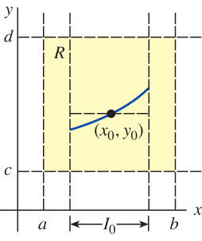
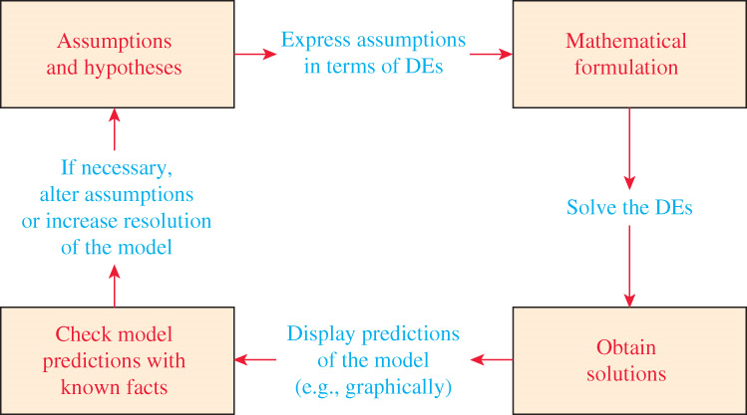
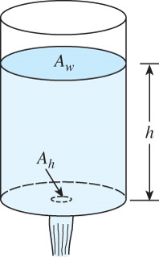
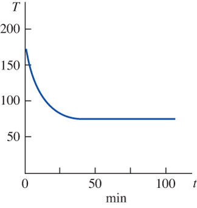
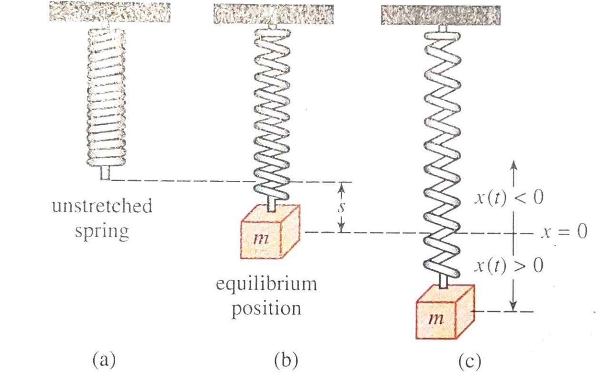

# Introduction to Differential Equations {#sec-1}

## Definitions and Terminology

* A **differential equation (DE)** is an equation containing the **derivatives** of **one or more dependent variables** with respect to **one or more independent variables**

* Notation
  * Leibniz notation $~\displaystyle\color{blue}{\frac{d^2y}{dx^2}}$
  * Prime notation $~\color{blue}{y''}$
  * Newton's dot notation $~\color{blue}{\ddot{y}}$
  * Subscript notation $~\color{blue}{u_{xx} + u_{yy} = 0}$

### Classification by Type

* **Ordinary differential equation (ODE):** $\,$ Derivatives are with respect to <font color="blue">a single independent variable</font>

  $$\frac{dx}{d\color{blue}{t}} + \frac{dy}{d\color{blue}{t}} = 3x + 2y$$

* **Partial differential equation (PDE):** $\,$ Derivatives are with respect to <font color="blue">two or more independent variables</font>

  $$\frac{\partial u}{\partial \color{blue}{y}} = -\frac{\partial u}{\partial \color{blue}{x}}$$

### Classification by Order

* The order of an ODE or PDE is the order of the <font color="blue">highest derivatives</font> in the equation

  $$\underbrace{\color{blue}{\frac{d^2y}{dx^2}}}_{\mathrm{highest\; order}} +5\left ( \frac{dy}{dx} \right )^3 - 4y = e^x$$

  $$\underbrace{2\color{blue}{\frac{\partial^4 u}{\partial x^4}}}_{\mathrm{highest\; order}} +\frac{\partial^2 u}{\partial t^2} = 0$$

### Classification by Linearity

* An $n$-th order ODE, $F\left( x, y, y', \cdots, y^{(n)} \right) = 0$, $\,$is **linear** in the variable $y\,$ <font color="blue">if $\,F$ is linear in $y, y',\cdots,y^{(n)}$</font>

* An ODE is **nonlinear** if:
  * The coefficients of $y, y',\cdots,y^{(n)}$ contain the dependent variable $y$ or its derivatives
  * Powers of $y, y',\cdots,y^{(n)}$ appear in the equation *or*
  * Nonlinear functions of the dependent variable or its derivatives (e.g., $\sin y$ or $e^{y'}$) appear in the equation

### Solution of an ODE

* Any function $\phi$, defined on an interval $I$ and possessing at least $n$ derivatives that are continuous on $I$, which when substituted into an   ODE reduces the equation to an identity, is **a solution**
* Interval $I$ can be an open interval $(a,b)$, a closed interval $[a,b]$, an infinite interval $(a,\infty)$, etc.
* A solution of a differential equation that is identically zero on an interval $I$ is a **trivial solution**
* The graph of a solution $\phi$ of an ODE is a **solution curve** and it is continuous on its interval $I$ while the domain of $\phi$ may differ from the interval $I$
* An **explicit solution** is one in which the dependent variable is expressed solely in terms of the independent variable and constants
* $G(x,y)=0\,$ is an **implicit solution**, if at least one function $\phi$ exists, that satisfies the relation $G$ and the ODE on $I$

### Families of Solutions

* Similar to integration, we obtain a solution to a first-order differential equation containing an arbitrary constant $c$
* A solution with a constant $c$ represents a set $G(x,y,c)=0$ of solutions, called a **one-parameter family of solutions**
* An $n$-parameter family of solutions 
  $$ G(x,y,c_1,c_2,\cdots,c_n)=0 $$ 
    
  solves an $n$-th order differential equation

### Systems of Differential Equations

* Two or more equations involving the derivatives of two or more unknown functions of a single independent variable are called the **system of differential equations**

  $$
  \begin{aligned}
    \frac{dx}{dt} &= f(t,x,y) \\
     \frac{dy}{dt} &= g(t,x,y)
  \end{aligned}$$
    
* A solution of a system is a set of functions defined on a common interval $I$ that satisfies each equation of the system on this interval

## Initial-Value Problems - IVP {#sec-1-2}

In an <font color="red">**IVP**</font>, we seek a solution $y(x)$ of a differential equation so that $y(x)$ satisfies **initial conditions** at $x_0$ 

* $n$-th order differential equation and Initial conditions
   
  $$
  \begin{aligned}
    \frac{d^ny}{dx^n} &= f \left ( x,y,y',\cdots,y^{(n-1)} \right ) \\ 
    y(x_0) &= y_0, \;y'(x_0) = y_1, \cdots, \;y^{(n-1)}(x_0) = y_{n-1} \\ \\
    &\Downarrow \\ \\
    \frac{d\mathbf{y}}{dx} &= \mathbf{f}(x, \mathbf{y}), 
       \;\;\mathbf{y}=\mathbf{y}_0
  \end{aligned}$$

When solving an IVP, consider whether a solution exists and whether the solution is unique

* **Existence:** $\,$ Does the differential equation possess solutions and do any of the solution curves pass through the initial point $(x_0, y_0)$?
* **Uniqueness:** $\,$ When can we be certain there is precisely one solution curve passing through the initial point $(x_0, y_0)$?

:::{#thm-existence-and-uniqueness} 
gives conditions that are sufficient to guarantee the existence and uniqueness of a solution $y(x)$ to a first-order IVP

{width="35%" fig-align="center"}

* <font color="blue">$f(x,y)$ and $\displaystyle\frac{\partial\, f}{\partial y}$ are continuous on the region $\,R\,$ for the interval $\,I_0$</font>
:::

**Example** $\,$ First-order IVP

* $y(x)=ce^x$ is a one-parameter family of solutions of the first-order DE $~y'=y$

* Find a solution of the first-order IVP with initial condition $y(0)=3$

**Solution**

* From the initial condition, we obtain $3=ce^0$

* Solving, we find $c=3$

* The solution of the IVP is $y=3e^x$

**Example** $\,$ Second-order IVP

* $x(t) = c_1 \cos 4t +c_2 \sin 4t$ $\,$is a two-parameter family of solutions of the second-order DE $~x''+16x=0$

* Find a solution of the second-order IVP with initial conditions
$~x\left( \frac{\pi}{2} \right) =-2, \;x'\left (\frac{\pi}{2} \right)=1$

**Solution**

* Substituting for initial conditions and solving for constants, we find $c_1=-2$ and $c_2=1/4$
* The solution of the IVP is $~x(t)=-2\cos 4t +\frac{1}{4}\sin 4t$

## Differential Equations as Mathematical Models {#sec-1-3}

* A **mathematical model** is a description of a system or a phenomenon
* Differential equation models are used to describe behavior in various fields
  * Biology
  * Chemistry
  * Physics
 
* Steps of the modeling process

{width="60%" fig-align="center"}

**Example** $\,$ Radioactive Decay

* In modeling the phenomenon, it is assumed that the rate $\displaystyle\frac{dA}{dt}$ at which the nuclei of a substance decays is proportional to the amount $A(t)$ remaining at time $t$ given an initial amount of radioactive substance on hand $A_0$
   
  $$\frac{dA}{dt} = -kA, \;A(0)=A_0$$
    
* This differential equation also describes a first-order chemical reaction

**Example** $\,$ Draining Tank

{width="20%" fig-align="center"}

* Toricelli's law states that the exit speed $v$ of water through a sharp-edged hole at the bottom of a tank filled to a depth $h$ is the same as the speed it would acquire falling from a height $h$, $\,$$v=\sqrt{2gh}$

* Volume $V$ leaving the tank per second is proportional to the area of the hole $A_h$
  $$\frac{dV}{dt}=-A_h\sqrt{2gh}$$    

* The volume in the tank at $t$ $\,$is$\,$ $V(t)=A_w h$, $\,$ in which  $\,$ $A_w$ is the *constant* area of the upper water surface

* Combining expressions gives the differential equation for the height of water at time $t$
  $$\frac{dh}{dt}=-\frac{A_h}{A_w}\sqrt{2gh}$$

## Worked Exercises {.unnumbered}

**[-@sec-1-2]: 1.** $~y=1/(1 +c_1 e^{-x})$ is a one-parameter family of solutions of the first-order DE $y'=y -y^2$. $\,$ Find a solution of the first-order IVP consisting of this differential equation and the given initial condition:

$$y(0)=-\frac{1}{3}$$

**Solution**

$$
\begin{aligned}
 y &= \frac{1}{1 +c_1 e^{-x}}\\ 
 &\Downarrow {\scriptstyle \text{at } x = 0}\\ 
 -\frac{1}{3} &= \frac{1}{1 +c_1} \\
 &\Downarrow \\
 c_1 &= -4 \\
 &\Downarrow \\ 
 y &= \frac{1}{1 -4 e^{-x}}
\end{aligned}$$

**[-@sec-1-2]: 3.** $~y=1/(x^2 +c)$ is a one-parameter family of solutions of the first-order DE $y' +2xy^2=0$. Find a solution of the first-order IVP consisting of this differential equation and the given initial condition. Give the largest interval $I$ over which the solution is defined

$$y(2)=\frac{1}{3}$$

**Solution**

$$
\begin{aligned}
  y &= \frac{1}{x^2 +c}\\ 
     &\Downarrow {\scriptstyle \text{at } x = 2}\\ 
  \frac{1}{3} &= \frac{1}{4 +c} \\
     &\Downarrow \\ 
  c = -1 \, &, \;\; I =(1,\infty) \\
   &\Downarrow \\ 
   y &= \frac{1}{x^2 -1} 
\end{aligned}$$

```{python}
# | echo: true
# | fig-cap: "Exercises 1.2: 3"
import numpy as np
import matplotlib.pyplot as plt

x = np.linspace(-5, 5, 200)
y = 1.0 /(x**2 -1)

threshold = 20
y[y > threshold] = np.inf
y[y <-threshold] = np.inf

plt.plot(x,y)
plt.scatter(2, 1/3, color='red')

plt.title(r'$y=\frac{1}{x^2 -1}$')
plt.xlabel('$x$')
plt.ylabel('$y$')
plt.grid()

plt.show()
```

**[-@sec-1-2]: 7.** $\,x(t)=c_1\cos t +c_2\sin t$ is a two-parameter family of solutions of the second-order DE $x''+x=0$. Find a solution of the second-order IVP consisting of this differential equation and the given initial conditions

$$x(0)=-1, \; x'(0)=8$$

**Solution**

$$
\begin{aligned}
  x(t) &= c_1\cos t +c_2\sin t \\ 
       &\Downarrow \;{\scriptstyle x(0)=-1, \; x'(0)=8}\\ 
    -1 &= c_1 \\
     8 &= c_2 \\
       &\Downarrow \\
  x(t) &= -\cos t +8\sin t
\end{aligned}$$

**[-@sec-1-2]: 17.** $\,$ Determine a region of the xy-plane for which the given differential equation would have a unique solution whose graph passes through a point $(x_0, y_0)$ in the region.

$$\frac{dy}{dx}=y^{2/3}$$

**Solution**

$~$

**[-@sec-1-2]: 29.** 

1. By inspection, find a one-parameter family of solutions of the differential equation $xy'=y$. Verify that each member of the family is a solution of the initial value problem $xy'=y, y(0)=0$
1. Explain part 1. by determining a region $R$ in the $xy$-plane for which the differential equation $xy'=y$ would have a unique solution through a point $(x_0, y_0)$ in  $R$
1. Verify that the piecewise-defined function

   $$y= \begin{cases}
     0, & x < 0 \\ 
     x, & x \ge 0 
   \end{cases}$$

   satisfies the condition $y(0)=0$. Determine whether this function is also a solution of the initial-value problem in part 1

**Solution**

$~$

**[-@sec-1-3]: 5.** $\,$ A cup of coffee cools according to Newton's law of cooling. Use data from the graph of the temperature $T(t)$ in figure to estimate the constants $T_m$, $T_0$, and $k$ in a model of the form of the first-order initial-value problem

$$ \frac{dT}{dt}=k(T -T_m), \;\;T(0)=T_0 $$

{width="30%" fig-align="center"}

**Solution**

$$
\begin{aligned}
 \frac{dT}{dt} &=k(T -T_m), \;\;T(0)=T_0 \\ 
    &\Downarrow \\ 
 T(0) &= T_0 \\
 T(\infty) &= T_m \\
 \ln \left( \frac{T -T_m}{T_0 -T_m} \right) &= k t \\
    &\Downarrow \\  
    k \text{ is the slope of the graph of }\, & t \text{ vs. } \ln \left( \frac{T -T_m}{T_0 -T_m}\right) 
\end{aligned}$$

**[-@sec-1-3]: 19.** After a mass $m$ is attached to a spring, it stretches $s$ units and then hangs at rest in the equilibrium position as shown in Figure (b). After the spring/mass system has been set in motion, let $x(t)$ denote the directed distance of the mass beyond the equilibrium position. As indicated in Figure (c), assume that the downward direction is positive, that the motion takes place in a vertical straight line through the center of gravitiy of the mass, and that the only forces acting on the system are the weight of the mass and the restoring force of the stretched spring. Use Hooke's law: The restoring force of a spring is proportional to its total elongation. Determine a differential equation for the displacement $x(t)$ a time $t$

{width="60%" fig-align="center"}

**Solution**

$~$