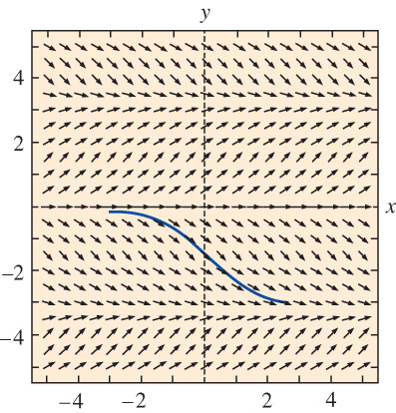
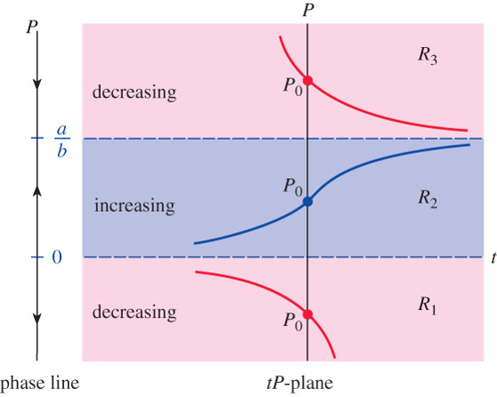

# First-Order Differential Equations {#sec-2}

## Solution Curves Without a Solution {#sec-2-1}

* <font color="blue">DEs can be analyzed qualitatively</font>, allowing us to approximate a solution curve without solving the problem
* Two approaches are:
  * Direction fields
  * Autonomous first-order DEs
* <font color="red">Direction fields:</font> 
  * Slope of the **lineal element** at $(x,y(x))$ on a solution curve is the value of $\,\frac{dy}{dx}\,$ at this point
  * **Direction/slope fields** of $\,\frac{dy}{dx}=f(x,y)\,$ are collections of lineal slope elements that visually suggest the shape of a family of solution curves

For example, $~\displaystyle\frac{dy}{dx}=\sin y$
    
{width="45%" fig-align="center"}

* Using the given computer-generated direction field, sketch, by hand, an approximate solution curve that passes through each of the indicated points:

  $$
   \begin{aligned} 
      \frac{df}{dx} &= x^2 -y^2 \\ \\
      (a) &\;\; y(-2)=1 \\ 
      (b) &\;\; y(-1)=-1 \\ 
      (c) &\;\; y(0)=2 \\ 
      (d) &\;\; y(0)=0 
   \end{aligned}$$

```{python}
#| fig-align: "center"
import numpy as np
from scipy import integrate

import matplotlib.pyplot as plt
plt.style.use('ggplot')

x = np.linspace(-2, 2, 20)
y = np.linspace(-2, 2, 20)
X, Y = np.meshgrid(x, y)

dy = (X*X -Y*Y)
dx = np.ones(dy.shape)

plt.figure(figsize=(5, 5))
plt.quiver(X, Y, dx, dy, color='red')
plt.plot([-2, -1, 0, 0], [1, -1, 2, 0], 'o', color="blue")
plt.xlim([-2.2, 2.2])
plt.ylim([-2.3, 2.2])
plt.xticks(np.arange(-2, 2.5, 0.5))
plt.yticks(np.arange(-2, 2.5, 0.5))
plt.xlabel('x')
plt.ylabel('y')

plt.show()
```

* **Autonomous** first-order DEs, $~\displaystyle\color{red}{\frac{dy}{dx}=f(y)}$

  An ODE in which the independent variable does not appear explicitly

  $$\begin{aligned}
      \frac{dy}{dx} &= 1+y^2 && \mathrm{autonomous} \\
      \frac{dy}{dx} &= 0.2\,xy && \mathrm{nonautonomous}
    \end{aligned}$$

* **Critical points**, $~f(c)=0$, $~$ are constant (or equilibrium) solutions of autonomous DEs

* A **phase portrait** is made by putting critical points on a vertical line with phase lines pointing up or down, depending on the sign of the function over intervals between the points

* Some conclusions can be drawn about nonconstant solution curves to autonomous DEs
  * If a solution $y(x)$ passes through $(x_0,y_0)$ in sub-region $R_i$, <font color="blue">$~$then $y(x)$ remains in $R_i$ </font>
  * By continuity, <font color="blue">$~f(y)$ cannot change signs in a sub-region $R_i$</font>
  * Since $f(y)$ is either positive or negative in $R_i$, $~$a solution is <font color="blue">either increasing or decreasing</font> and has no relative extremum

**Example:** $\,$ Phase portrait and solution curves

$$ \displaystyle \frac{dP}{dt} = P(a-bP) $$

{width="70%" fig-align="center"}

**Example:** $\,$ Consider the autonomous first-order differential equation 

$$\frac{dy}{dx}=y^2-y^4$$ 

and the initial condition $y(0)=y_0$. Sketch the graph of a typical solution $y(x)$ when $y_0$ has the given values

  $$
  \begin{aligned}
    &(a) && \phantom{-1 < }\; y_0 < {-1} \\
    &(b) && {-1} < y_0 < 0 \\ 
    &(c) && \phantom{-}0 < y_0 < 1 \\ 
    &(d) && \phantom{-}1 < y_0 \\ 
  \end{aligned}$$

## Separable Equations {#sec-2-2}

* Consider $~\displaystyle\frac{dy}{dx}=f(x)$

  * When $f$ does not depend on $y$, $~\displaystyle\frac{dy}{dx}=f(x)$, $~$which can be solved by integration
  * The solution $\displaystyle y=\int f(x) dx = F(x) +c$, $~$where $F(x)$ is an antiderivative (indefinite integral)
  * Some functions, termed **nonelementary**, $~$do not possess an antiderivative that is an elementary function

* A first-order DE of the form $\displaystyle\frac{dy}{dx}=g(x)h(y)$ is said to be <font color="red">**separable**</font>, or have **separable variables**
  * A separable equation can be rewritten in the form

    $$ \color{red}{\frac{1}{h(y)}dy=g(x)dx}$$

    which is solved by integrating both sides

**Example:** $\,$ Solve a separable equation $\displaystyle\frac{dy}{dx}=y^2-9$, $\;y(0)=0$

* Separating and using partial fractions

$$
  \begin{aligned}
    \frac{dy}{(y-3)(y+3)} &= dx \\
    &\Downarrow \\ 
    \frac{1}{6} \left [ \frac{1}{y-3} -\frac{1}{y+3} \right ] dy &= dx
  \end{aligned}$$

* Integrating and solving for $y\,$ yields

$$
  \begin{aligned}
    \frac{1}{6} \ln \left | \frac{y-3}{y+3} \right | &= x+c_1\\ 
    &\Downarrow c=e^{6c_1} \\
    y &= 3 \frac{1-ce^{6x}}{1+ce^{6x}}
  \end{aligned}$$

* Finally, $~$ applying $y(0)=0~$ gives $c=1$

**Example** $\,$ Solve the given differential equation by separation of variables

* $\displaystyle \frac{dy}{dx}=\sin 5 x$

* $\displaystyle dx +e^{3x} dy = 0$

* $\displaystyle \frac{dy}{dx} = x\sqrt{1 -y^2}$

  $~$

**Example** $\,$ Find an implicit and an explicit solution of the given initial-value problem

* $\displaystyle x^2 \frac{dy}{dx} = y -xy, \;\;y(-1)=-1$

* $\displaystyle \frac{dx}{dt}=4(x^2 + 1), \;\;x(\pi/4)=1$

## Linear Equations {#sec-2-3}

A first-order DE of the form $\displaystyle a_1(x) \frac{dy}{dx} +a_0(x)y = g(x)~$ is a **linear equation** in the dependent variable $y$

* The DE is <font color="blue">**homogeneous**</font> when $g(x)=0$ ; $~$otherwise, $~$it is <font color="blue">**nonhomogeneous**</font>

* The standard form of a linear DE is obtained by dividing both sides by the lead coefficient

  $$\color{red}{\frac{dy}{dx}+P(x)y=f(x)}$$

The **standard form** equation has the property that its solution $y$ is the sum of the solution of the associated homogeneous equation $y_h$ and the particular solution of the nonhomogeneous equation $y_p$ : 

$$\color{red}{y=y_h +y_p}$$

* The homogeneous equation $\displaystyle\frac{dy_h}{dx} +P(x)y_h= 0~$ is separable, allowing us to solve for $y_h$

$$
\begin{aligned}
  \frac{dy_h}{y_h} &= -P(x)dx \\
  &\Downarrow \\ 
  \ln |y_h| &= -\int P(x)\,dx +\bar{c} \,\Rightarrow\, y_h = c \exp\left( -\int P(x) \,dx \right)    
\end{aligned}$$

* **Variation of parameters** $\,\color{blue}{y_p=u(x)y_h}~$ can be used to solve the nonhomogeneous equation of $\,y_p$

$$
\begin{aligned}
    y_h \frac{du}{dx} +& \underbrace{\left (\frac{dy_h}{dx} +P(x) y_h  \right )}_{=\,0} u = f(x)\\
    du &= \frac{f(x)}{y_h} dx \;\Rightarrow\; u(x) = \displaystyle\int \frac{f(x)}{y_h(x)} dx \\
    &\Downarrow \\
    y_p &= y_p \displaystyle\int \frac{f(x)}{y_h(x)} dx 
\end{aligned}$$

**Example** $\,$ Find the general solution of the given differential equation:

* $~\displaystyle \frac{dy}{dx} + 2y=0$

* $~\displaystyle y' +2xy=x^3$

* $~\displaystyle x\frac{dy}{dx} +2y=3$

* $~\displaystyle xy' +(1+x)y=e^{-x} \sin 2x$

**Example** $\,$ Solve the given initial-value problem. Give the largest interval $~I$ over which the solution is defined

* $~\displaystyle y\frac{dx}{dy} -x=2y^2, \;\; y(1)=5$

* $~\displaystyle (x+1)\frac{dy}{dx}+y = \ln x, \;\;y(1)=10$

**Example** $\,$ The given differential equation is not linear in $y$. $~$Nevertheless, find a general solution of the equation

* $~dx=(x+y^2)dy$

* $~ydx + (2x + xy-3)dy=0$

**Example** $\,$ The sine integral function is defined as

   $$ \mathrm{Si}(x)=\int_0^x \frac{\sin t }{t} \,dt$$
  
   where the integrand is defined to be 1 at $x=0$. Express the solution of the initial value problem
   
   $$x^3 \frac{dy}{dx} + 2x^2 y = 10 \sin x, \;\; y(1)=0$$
  
   in terms of $\mathrm{Si}(x)$

## Exact Equations {#sec-2-4}

* A differential expression $~M(x,y)dx + N(x,y)dy~$ is an **exact differential** in a region $R$ of the $xy$-plane if it corresponds to the differential of some function $f(x,y)$:

  $$ \color{red}{df(x,y)=\frac{\partial f}{\partial x} dx +\frac{\partial f}{\partial y} dy}$$

* and a condition of exact differentials is:

  $$ \frac{\partial M}{\partial y}=\frac{\partial N}{\partial x}$$

* $M(x,y)\,dx + N(x,y)\, dy=0 ~$ is an **exact equation** if the left side is an exact differential

$~$

**Example:** $\,$ Solving an exact DE, $\;2xy\,dx+(x^2-1)\,dy=0$

$~$

* <font color="blue">**Integrating Factor**</font> of the first-order linear DE

  $$
  \begin{aligned} 
    \frac{dy}{dx} +P(x)y &= f(x)\\ 
    &\Downarrow \\
    \left ( P(x)y -f(x) \right )dx +dy &= 0\\ 
    &\Downarrow \times \; I(x): \text{ Integrating Factor}\\ 
       I(x)\left ( P(x)y -f(x) \right )dx +I(x)dy &= 0 \\ \\
      \text{To be an exact equation } &\big\Downarrow \\ 
    \frac{\partial}{\partial y} 
     \left\{I(x)\left( P(x)\color{blue}{y} -f(x) \right) \right \} &= I(x) 
       P(x) =\frac{d}{d x} I(x) \\
    &\big\Downarrow \;\; I(x) = \exp\left(\int P(x) dx\right) 
  \end{aligned}$$

  Then

  $$
  \begin{aligned} 
     I(x) \frac{dy}{dx} +I(x) P(x)y &= I(x)f(x) \; \Rightarrow \; \frac{d} {dx}\left\{ I(x)y \right \} = I(x)f(x) \\ 
     &\Downarrow \\ 
    \color{red}{y(x) = I(x)^{-1}y(x_0)I(x_0)}  &\color{red}{\,+\,I(x)^{-1} \int_{x_0}^x I(x) f(x) dx}  
  \end{aligned}$$

**Example:** $\,$ Solve $\displaystyle\frac{dy}{dx} -2xy = 2, \;y(0)=1$

$$
\begin{aligned} 
    \frac{dy}{dx} -2xy &= 2\\ 
    &\Downarrow \times \;e^{-x^2} \\ 
    \frac{d}{dx}[e^{-x^2}y] &= 2e^{-x^2}\\ 
    y &= c e^{x^2} +2e^{x^2} \int_0^x e^{-t^2} dt\\ 
    & \big\Downarrow \;y(0) = 1 \rightarrow c=1 \\
     y &= e^{x^2} \left[ 1 +\sqrt{\pi} \underbrace{\left(\frac{2}{\sqrt{\pi}} \int_0^x e^{-t^2} dt \right)}_{\mathrm{erf}(x)} \right ] \\
     &= e^{x^2} \left[1 +\sqrt{\pi} \,\mathrm{erf} (x) \right] 
\end{aligned}$$

**Example:** $\,$ Determine whether the given differential equation is exact. If it is exact, solve it

* $~(2x - 1)dx + (3y+7)dy=0$

* $~(5x + 4y)dx + (4x-8y^2)dy=0$

* $~(2xy^2-3)dx +(2x^2y+4)dy=0$

* $~(x^2 -y^2)dx+(x^2-2xy)dy=0$

$~$

**Example:** $\,$ Solve the given initial-value problem

* $~(x+y)^2 dx + (2xy +x^2-1)dy = 0, \;\;y(1)=1$

* $~(4y + 2t -5)dt + (6y +4t-1)dy=0, \;\;y(-1)=2$

$~$

**Example:** $\,$ Solve the given differential equation by finding an appropriate integrating factor

* $~y(x+y+1)dx + (x+2y)dy=0$

## Solutions by Substitutions {#sec-2-5}

**Substitution** is often used to get a DE in a form that a known procedure can be used to find a solution

* Reduction to separation of variables can be facilitated in the DE

  <font color="blue">$$\frac{dy}{dx}=f(Ax+By+C)~$$</font>

  by substituting <font color="blue">$\,u=Ax+By+C, \;B \neq 0$</font>

$~$

**Example:** $\,$ Solve the IVP $~\displaystyle\frac{dy}{dx} = (-2x +y)^2 -7, \;y(0)=0$

Let $\,u=-2x+y$,

then $~\displaystyle\frac{du}{dx}=-2 + \frac{dy}{dx}~$ giving $~\displaystyle\frac{du}{dx} = u^2 -9$

