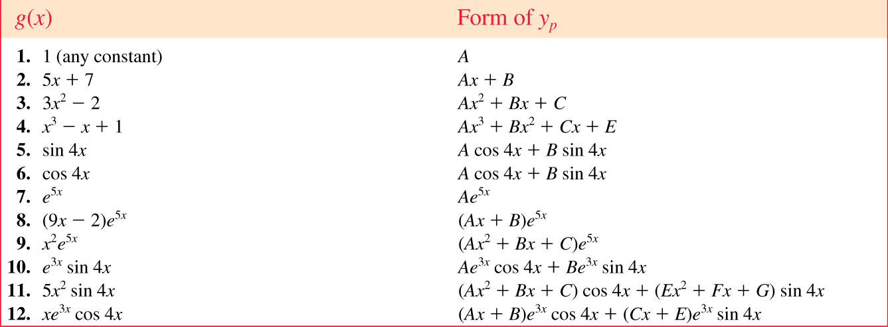
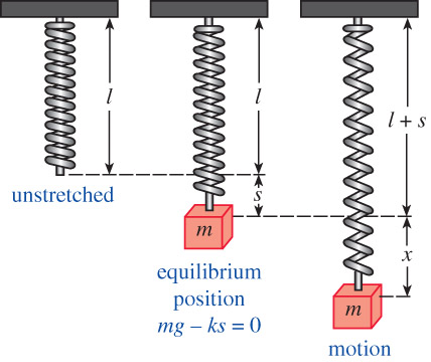
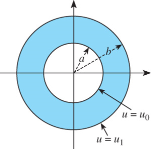
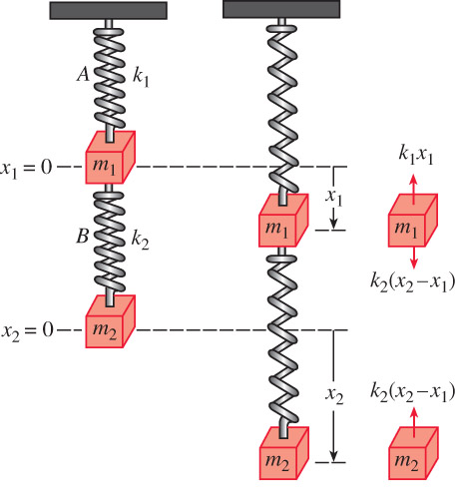

# Higher-Order Differential Equations {#sec-3}

## Theory of Linear Equations {#sec-3-1}

* In an **initial-value problem (IVP)**, $\,$ we seek a solution $y(x)$ of a $n$^th^ order linear DE 
so that $y(x)$ satisfies **initial conditions** at $x_0$
 
   * $n$^th^ order linear DE: $\;a_n(x) \neq 0$
   
     <font color='red'> 
      $$\underbrace{a_n(x) \frac{d^ny}{dx^n} +a_{n-1}(x) \frac{d^{n-1}y}{dx^{n-1}} +\cdots + a_1(x) \frac{dy}{dx} +a_0(x) y}_{L(y): ~\mathrm{Linear\;Operator}}= g(x) 
      $$
      </font>
 
   * Initial conditions
   
      <font color='red'> $$y(x_0) = y_0, \; y'(x_0) = y_1, \cdots, \; y^{(n-1)}(x_0) = y_{n-1}$$ </font>

* **Boundary-value problem (BVP)** consists of solving a linear DE of order 2 or greater, 
in which the dependent variable $y$ or its derivatives are specified at **different points** 

   * For example, 
    
     $$a_2(x) \frac{d^2y}{dx^2} +a_1(x) \frac{dy}{dx} +a_0(x)y=g(x)$$
 
   * Boundary conditions
     
     $$y(x_0)=y_0, \;y(x_1)=y_1$$

* The sum, or <font color='red'> **superposition** </font>, of two or more solutions of a homogeneous linear DE is also a solution

* Any set of $n$ linearly *independent* solutions $y_1, y_2, \cdots, y_n$ of the $n$^th^ order homogeneous linear DE on interval $~I$ is **a fundamental set of solutions**

* If two functions are linearly dependent, then one is a constant multiple of the other (otherwise, they are linearly independent)

* If $\{y_1, y_2, \cdots, y_n\}$ are a set of linearly independent functions, 
  the **Wronskian** function is not singular:

  $$ W(y_1, y_2, \cdots, y_n)= \begin{vmatrix}
       y_1 & y_2 & \cdots & y_n \\ 
       y_1' & y_2' & \cdots & y_n'\\ 
       \vdots & \vdots & \ddots & \vdots\\ 
       y_1^{(n-1)} & y_2^{(n-1)} & \cdots & y_n^{(n-1)}
    \end{vmatrix} \neq 0 $$

* General solution of $~n$^th^ order <font color="blue">*homogeneous*</font> linear DE is

  <font color="red">$$y(x)=c_1 y_1(x) +c_2 y_2(x) + \cdots + c_n y_n(x)$$</font>
 
  where $\,y_1, y_2, \cdots, y_n\,$ is a fundamental set of solutions and $c_i, \;i=1,2,\cdots,n\;$ are arbitrary constants

* General solution of $n$^th^ order <font color="blue">*nonhomogeneous*</font> linear DE is

  <font color='red'> $$y(x)=c_1 y_1(x) +c_2 y_2(x) + \cdots + c_n y_n(x) +y_p(x)$$ </font>
 
   where $\,y_1, y_2, \cdots, y_n\,$ is a fundamental set of solutions, $\,y_p$ is a particular solution, and $\,c_i, \;i=1,2,\cdots,n\;$ are arbitrary constants

$~$   

**Example** $\,$ Given that $\,x(t)=c_1\cos\omega t +c_2 \sin\omega t~$ is the general solution of $x''+\omega^2x=0~$ on the interval $(-\infty,\infty)$, $\,$ show that a solution satisfying the initial conditions $x(0)=x_0$, $x'(0)=x_1$, is given by

  $$x(t)=x_0\cos\omega t+\frac{x_1}{\omega} \sin\omega t$$

**Example** $\,$ Determine whether the given set of functions is linearly dependent or linearly independent on the interval $(-\infty,\infty)$

  $$f_1(x)=x, ~f_2(x)=x^2, ~f_3(x)=4x-3x^2$$
  
  $$f_1(x)=5, ~f_2(x)=\cos^2 x, ~f_3(x)=\sin^2 x$$

**Example** $\,$ Verify that the given functions form a fundamental set of solutions of the differential equation on the indicated interval. Form the general solution of the equation

  $$y''-y'-12y=0; \;\; e^{-3x}, \; e^{4x}, \;\;(-\infty,\infty)$$
  
  $$y''-2y'+5y=0; \;\;e^x \cos 2x, \;\; e^x\sin 2x, \;\;(-\infty,\infty)$$

**Example** $\,$ Verify that the given two-parameter family of functions is the general solution of the nonhomogeneous differential equation on the indicated interval

  $$y''-7y'+10y=24e^x; \;\;y=c_1 e^{2x} +c_2 e^{5x} +6e^x; \;\;(-\infty,\infty)$$

  $$y''-4y'+4y=2e^{2x} +4x-12; \;\;y=c_1 e^{2x} +c_2 xe^{2x} +x^2e^{2x} +x -2; \;\;(-\infty,\infty)$$


## Reduction of Order {#sec-3-2}

* **Reduction of order** can be used to reduce a linear *second-order* DE <font color="blue">with known solution $y_1$</font> into a linear *first-order* DE, which can be solved for a second solution $y_2$

* Applying reduction of order <font color="red">$y_2 = u(x) y_1$</font> to the standard form of a second-order linear homogeneous DE

  $$y''+P(x)y' +Q(x)y=0$$
 
  gives

  $$
  \begin{aligned}
     y_1 u'' & +\left(2y_1' +P(x)y_1\right) u' = 0\\ 
     &\Downarrow \;{\scriptsize\times\, y_1, \; u'=w}\\ 
     (y_1^2 w)' &= -(y_1^2 w) P(x) \\
     &\Downarrow \\
     \color{red}{y_2(x)} &\color{red}{= y_1(x) \int \frac{\exp\left(-\int P(x) \,dx \right)}{y_1^2(x)} \,dx} 
  \end{aligned}$$

**Example** $\,$ The indicated function $y_1(x)$ is a solution of the given equation. Use the reduction of order to find a second solution $y_2(x)$

* $y'' -4y' +4y=0; \;\;y_1=e^{2x}$
    
* $y''+16y=0; \;\; y_1=\cos 4x$
  
* $y''-y=0; \;\; y_1=\cosh x$

**Example** $\,$ The indicated function $y_1(x)$ is a solution of the associated homogeneous equation. Use the reduction of order to find a second solution $y_2(x)$ of homogeneous equation and a particular solution $y_p(x)$ of the given nonhomogeneous equation

$$y''-4y=2; \;\;y_1=e^{-2x}$$


## Homogeneous Linear Equations with Constant Coefficients {#sec-3-3}

The general solution of $ay''+by'+cy=0\,$ is found by substituting <font color="red">$\,y=e^{\,px}$</font> and solving the resulting **characteristic equation** <font color="red">$\,ap^2+bp+c=0\,$</font> for roots $\color{red}{p_1}$ and $\color{red}{p_2}$

* **Case I** $~$ $p_1$ and $\,p_2$ are <font color="blue">real and distinct</font>

  $$y = c_1 {\color{red}{e^{\,p_1 x}}} +c_2 {\color{red}{e^{\,p_2 x}}}$$

* **Case II** $~$ $p_1$ and $\,p_2$ are <font color="blue">real and equal</font>

  $$y=c_1 {\color{red}{e^{\,p_1x}}} +c_2 \color{red}{x e^{\,p_1 x}}$$

* **Case III** $~$ $p_1$ and $\,p_2$ are <font color="blue">complex conjugate</font>: $~p_1, p_2 = \color{red}{\alpha} \pm i\color{red}{\beta}$

  $$y={\color{red}{e^{\alpha x}}} \left(c_1 {\color{red}{\cos\beta x}} +c_2 {\color{red}{\sin\beta x}} \right)$$ 

$~$

**Example** $\,$ Solve $~y'' +\omega^2y=0\,$ and $\,y'' -\omega^2y=0$

$~$

**Example** $\,$ Solve $~3y'''+5y''+10y'-4y=0$

```{python}
import numpy as np
from scipy.integrate import solve_ivp

import matplotlib.pyplot as plt
```

```{python}
# | echo: true
# | output-location: fragment
from sympy import Symbol, init_printing
from sympy.solvers import solve
init_printing()

x = Symbol('x')
solve(3*x**3 +5*x**2 +10*x -4, x)
```

$~$

**Example** $\,$ Find the general solution of the given second-order differential equation

* $4y'' +y'=0$
  
* $y''-y'-6y=0$
  
* $y'' +8y' +16y=0$

$~$

**Example** $\,$ Find the general solution of the given higher-order differential equation

* $y''' -4y'' -5y'=0$
  
* $y''' -5y'' +3y' +9y=0$

$~$

**Example** $\,$ Solve the initial-value problem

$y''' +12y'' +36y'=0, \;\;y(0)=0, \;y'(0)=1, \; y''(0)=-7$

$~$

## Undetermined Coefficients {#sec-3-4}

<font color="red">**Method of undetermined coefficients**</font> can be used <font color="blue">to obtain a particular solution $y_p$</font>

* The underlying idea is <font color="blue">a conjecture about the form of $y_p$</font> based on the kinds of functions making up the input function $g(x)$

* Limited to nonhomogeneous linear DEs where
  * <font color="blue">Coefficients $a_i$</font>, $i=1,\cdots,n$, are <font color="blue">constants</font>
  * $g(x)$ is <font color="blue">a constant</font>, <font color="blue">a polynominal function</font>, <font color="blue">$e^{\alpha x}$</font>, <font color="blue">$\sin\beta x$ or $\cos\beta x$</font>, or <font color="blue">finite sums and products of these functions</font>

* There are models of $y_p$ for various functions
    
  {width="90%" fig-align="center"}
        
* Finally, the general solution is obtained from the **superposition** of $y_h$ and $y_p$

$~$

**Example** $\,$ Solve $~y'' +4y = x\cos x$

$~$

* If $g(x)$ consists of a sum of, say, $m$ terms of the kind listed in the table, $~$then the assumption for <font color="blue">a particular solution $y_p$ consists of the sum of the trial forms</font>
  
* <font color="blue">If $\,y_p$ contains terms that duplicate terms in $y_h$, $\,$then that $y_p$ must be multiplied by $x^n$</font>,
  $~$where $n$ is the smallest positive integer that eliminate that duplication

$~$

**Example** $\,$ Solve $~y'' -6y' +9y = 6x^2 +2 -12e^{3x}$

$~$

**Example** $\,$ Solve $~y^{(4)}+y'''= 1 -x^2e^{-x}$

$~$

**Example** $\,$ Solve the given differential equation by undetermined coefficients

* $y'' +2y' +y=\sin x +3 \cos 2x$
 
* $y'' +2y' -24y=16 - (x+2)e^{4x}$

* $y''' -6y''=3-\cos x$

$~$

**Example** $\,$ Solve the given initial-value problem

* $y'' +4y=-2, \;\;y(\pi/8)=1/2, \;\;y'(\pi/8) = 2$
  
* $5y'' +y'=-6x, \;\;y(0)=0, \; y'(0)=-10$
  
* $\displaystyle \frac{d^2 x}{dt^2} +\omega^2x=F_0 \sin\omega t, \;\; x(0)=0, \;x'(0)=0$

$~$

## Variation of Parameters {#sec-3-5}

The <font color="red">**method of variation of parameters**</font> can be used with linear higher-order DEs

* This method <font color="blue">*always* yields a $y_p$ provided the homogeneous equation can be solved</font>

* This method <font color="blue">is not limited to the types of input functions</font> constraining the method of undetermined coefficients

To adapt the method of variation of parameters to a linear second-order DE

$$a_2(x)y'' +a_1(x)y' +a_0(x)y = g(x),$$

we put the above equation <font color="blue">in the standard form</font>

$$y'' +P(x)y' +Q(x)y = f(x)$$
To solve,

* Find the homogeneous solutions <font color="blue">$y_1$</font>, <font color="blue">$y_2$</font>

* Seek a particular solution of the form 

  $$y_p = \color{red}{u_1(x)} \color{blue}{y_1} +\color{red}{u_2(x)} \color{blue}{y_2}$$

$$
\begin{aligned} 
     y_p''+P(x)y_p' &+Q(x)y_p = f(x)\\ 
     &\Downarrow \, y_p = u_1 y_1 +u_2 y_2 \\ 
     \frac{d}{dx}[\color{blue}{y_1 u_1' +y_2 u_2'}] +P(x) [\color{blue}{y_1 u_1' +y_2 u_2'}] +\color{red}{y_1' u_1'} &+\color{red}{y_2' u_2'}= f(x) \\
     &\Downarrow \,\text{let } y_1 u_1' +y_2 u_2' =0, \; \text{then }
     y_1' u_1' +y_2' u_2'= f(x) \\
     \color{red}{\begin{bmatrix}
        y_1 & y_2\\ 
        y_1' & y_2' 
     \end{bmatrix} 
     \begin{bmatrix}
        u_1' \\
        u_2' 
     \end{bmatrix}} &=
     \color{red}{\begin{bmatrix}
        0 \\ 
        f(x)
     \end{bmatrix}} \\
     &\Downarrow \\          
     \qquad\quad\color{blue}{u_1 = \displaystyle\int \frac{W_1}{W\;} \,dx =-\int \frac{y_2}{W}\,f(x)\,dx}&, 
        \;\; \color{blue}{u_2} \color{blue}{= \displaystyle\int \frac{W_2}{W\;} \,dx =\int \frac{y_1}{W}\,f(x)\,dx}\\ \\
     \mathrm{where} \;\; 
       W = \begin{vmatrix}
             y_1 & y_2\\ 
             y_1' & y_2' 
           \end{vmatrix}, \;
       W_1 =& \begin{vmatrix}
               0 & y_2\\ 
               f(x) & y_2' 
             \end{vmatrix}, \;
       W_2 = \begin{vmatrix}
               y_1 & 0\\ 
               y_1' & f(x) 
             \end{vmatrix}             
\end{aligned}$$

$~$

**Example** $\,$ Solve $~\displaystyle y'' -y = \frac{1}{x}$

$~$

The method can be generalized to the standard form of $n$^th^ order linear DE. $\,$ A particular solution is

<font color="blue">$$y_p = u_1(x) y_1 +u_2(x) y_2 +\cdots +u_n(x) y_n$$</font>

where

<font color="blue">$$u_k = \displaystyle\int \frac{W_k}{W\;}\, dx, \;k=1, 2, \cdots, n$$</font>

$~$

**Example** $\,$ Solve each differential equation by variation of parameters

* $y'' +y=\sec x$

* $y'' +y=\sin x$

* $y'' +y=\cos^2 x$

* $3y''-6y'+6y=e^x \sec x$

$~$

**Example** $\,$ Solve each differential equation by variation of parameters subject to the initial conditions $y(0)=1, \;y'(0)=0$

* $4y'' -y=xe^{x/2}$

* $y''-2y'+y=e^x \sec^2 x$

* $y'' +2y' -8y=2e^{-2x} -e^{-x}$

$~$

**Example** $\,$ Solve each differential equation by variation of parameters subject to the initial conditions $y(0)=1, \;y'(0)=0$

* $\displaystyle y''-4y=\frac{e^{2x}}{x}$
  
* $2y'' +2y' +y=4\sqrt{x}$

$~$

## Cauchy-Euler Equation {#sec-3-6}

The **Cauchy-Euler equation** is a linear DE of the form

$$ a_n {\color{red}{x^n}} \frac{d^n y}{dx^n} +a_{n-1} {\color{red}{x^{n-1}}} \frac{d^{n-1} y}{dx^{n-1}} +\cdots +a_1 {\color{red}{x}} \frac{dy}{dx} +a_0 y = g(x)$$

where $a_n, a_{n-1}, \cdots, a_0$ are constants and the exponent of the coefficient matches the order of differentiation

$\color{red}{y =x^{\,p}}$ is a solution of second order Cauchy-Euler equation whenever $p$ is a solution of the **auxiliary equation**

<font color="blue">$$a_2 p^2 +(a_1 -a_2)p +a_0 =0$$</font>

* **Case I:** $~$ Distinct Real Roots, $~p_1, \,p_2$ 

  $$ y = c_1 {\color{red}{x^{\,p_1}}} +c_2 {\color{red}{x^{\,p_2}}} $$

* **Case II:** $~$ Repeated Real Roots, $~p_1=p_2$
 
  $$y = c_1 {\color{red}{x^{\,p_1}}} +c_2 {\color{red}{x^{\,p_1}\ln x}}$$

* **Case III:** $~$ Complex Conjugate Roots, $~p_1, p_2 = \color{red}{\alpha \pm i\beta}$

  $$y = {\color{red}{x^{\alpha}}} \left[ c_1 {\color{red}{\cos(\beta\ln x)}} + c_2 {\color{red}{\sin(\beta\ln x)}} \right]$$

$~$

**Example** $\,$ Solve $~x^2y'' -3xy' +3y = 2x^4 e^x$

$~$

**Example** $\,$ Solve the given differential equation

* $x^2y''-2y=0$
  
* $xy''+y'=0$

* $x^2y''+xy'+4y=0$

$~$

**Example** $\,$ Solve the given differential equation by variation of parameters

* $xy''-4y'=x^4$

* $x^2y''+xy'-y=\ln x$

$~$

## Nonlinear Equations {#sec-3-7}

* <font color="blue">Nonlinear equations do not possess superposability</font>

$~$

**Example** $\,$ Verify that $y_1$ and $y_2$ are solutions of the given DE but that $c_1 y_1 +c_2 y_2$ is, in general, not a solution
  
   $$\left(y''\right)^2 = y^2,\; y_1=e^x,\; y_2=\cos x$$

$~$

* The major difference between linear and nonlinear DEs of order two or higher lies in the realm of solvability.
<font color="blue">Nonlinear higher-order DEs virtually defy solution</font>. This means that there are no analytical methods whereby either an explicit or implicit solution can be found

* There are still things that can be done; $~$we can always analyze a nonlinear DE <font color="blue">qualitatively and numerically</font>

* Nonlinear second-order DE $F(y, y', y'')=0\,$ can be reduced to two first-order equations by means of the substitution $u=y'$ and can sometimes be solved using first-order methods

$~$

**Example** $\,$ Solve $~y''=2x(y')^2$ and $yy''=(y')^2$

$~$

* In some instances, a solution of a nonlinear IVP can be approximated by a Taylor series centered at $x_0$

$~$

**Example** $\,$ Solve $~y''=x +y -y^2$, $\,y(0)=-1$, $\,y'(0)=1$ by using 
  
   $$y(x) = y(0) +\frac{y'(0)}{1!}x +\frac{y''(0)}{2!}x^2 +\frac{y'''(0)}{3!} x^3 + \cdots$$

$~$

**Example** $\,$ The dependent variable $y$ is missing in the given differential equation. Solve the equation by using the substitution $u=y'$

$$y''+(y')^2+1=0$$
   
$~$

**Example** $\,$ The independent variable $x$ is missing in the given differential equation. Solve the equation by using the substitution $u=y'$

$$yy''+(y')^2+1=0$$

$~$

**Example** $\,$ Consider the initial-value problem

  $$y''+yy'=0,\;\;y(0)=1,\;y'(0)=-1$$

| 1. Use the DE and a numerical solver to graph the solution curve
| 2. Find an explicit solution of the IVP. $~$Use a graphing utility to graph this solution
| 3. Find an interval of definition for the solution in part 2

$~$

**Example** $\,$ Show that the substitution $u=y'$ leads to a Bernoulli equation. Solve this equation

$$xy''=y'+(y')^3$$

$~$

## Linear Models: Initial-Value Problems {#sec-3-8}

Several dynamical systems are modeled with linear 2^nd^-order DEs with constant coefficients and initial conditions at $t_0$

* Spring/Mass Systems
  * Free Undamped Motion
  * Free Damped Motion
  * Driven Motion

$$
\begin{aligned}
  m\frac{d^2x}{dt^2} &= -kx -\beta\frac{dx}{dt} +f(t)\\ 
  x(0) &= x_0 \\
  \dot{x}(0) &= x_1
\end{aligned}$$

{width="40%" fig-align="center"}

$~$

**Example** $\,$ Show that the solution of the initial-value problem

$$\frac{d^2x}{dt^2}+\omega^2x=F_0\cos\gamma t, \;x(0)=0, \;x'(0)=0$$
  
is $~\displaystyle x(t)=\frac{F_0}{\omega^2-\gamma^2}(\cos\gamma t -\cos\omega t)$

$~$

**Example** $\,$ Evaluate $\,\displaystyle \lim_{\gamma \to \omega} \frac{F_0}{\omega^2-\gamma^2} (\cos\gamma t - \cos\omega t)$  

$~$

## Linear Models: Boundary-Value Problems {#sec-3-9}

$~$

**Example** $\,$ Temperature in a Ring

{height="20%" fig-align="center"}

The temperature $u(r)$ in circular ring is determined from the boundary-value problem

$$r\frac{d^2 u}{dr^2} +\frac{du}{dr}=0,\; u(a)=u_0,\; u(b)=u_1$$

## Green's Functions {#sec-GF}

### Influence Function
$~$

* We shall consider the <font color="blue">self-adjoint form</font>

  $$
   \color{red}{\frac{d}{dx} \left[ p(x)\frac{du}{dx} \right] +q(x)u = -f(x)} \tag{SA}\label{eq:SA}
  $$

  The function $p(x)$ is continuously differentiable and positive, and $q(x)$ and $f(x)$ are continuous for $\alpha < x < \beta$

* The homogeneous second-order differential equation

  $$
   \frac{d}{dx} \left[ p(x)\frac{dv}{dx} \right] +q(x)v = 0 \tag{SH}\label{eq:SH}
  $$ 

  has exactly two linearly independent solutions <font color="blue">$v_1(x)$</font> and <font color="blue">$v_2(x)$</font>: any solution of \eqref{eq:SH} can be written in the form

  <font color="blue">$$v(x) = c_1 v_1(x) +c_2 v_2(x)$$</font>

  where $c_1$ and $c_2$ are constants

* We now consider the function

  $$ w(x) = v_1(x) {\color{blue}{\int_\alpha^x v_2(\xi) f(\xi)\, d\xi}} -v_2(x) {\color{blue}{\int_\alpha^x v_1(\xi) f(\xi)\, d\xi}}$$

  Differentiating $w$, $~$we have

  $$\scriptsize
  \begin{aligned}
    \frac{dw}{dx} &=  v_1'(x) {\color{blue}{\int_\alpha^x v_2(\xi) f(\xi)\, d\xi}} -v_2'(x) {\color{blue}{\int_\alpha^x v_1(\xi) f(\xi)\, d\xi}}  
    + \underbrace{\left[ v_1(x) {\color{blue}{v_2(x)}} -v_2(x) {\color{blue}{v_1(x)}} \right]}_{=0} {\color{blue}{f(x)}}\\ 
    &= v_1'(x) {\color{blue}{\int_\alpha^x v_2(\xi) f(\xi)\, d\xi}} -v_2'(x) {\color{blue}{\int_\alpha^x v_1(\xi) f(\xi)\, d\xi}} 
  \end{aligned}$$

* Then

  $$ \scriptsize
  \begin{aligned}
    \frac{d}{dx}\left[ p(x)\frac{dw}{dx} \right] 
     &=\underbrace{\frac{d}{dx}\left[ p(x)v_1'(x) \right]}_{-q(x)v_1} \int_\alpha^x v_2(\xi) f(\xi)\, d\xi -\underbrace{\frac{d}{dx}\left[ p(x)v_2'(x) \right]}_{-q(x) v_2} \int_\alpha^x v_1(\xi) f(\xi)\, d\xi \\
     &\phantom{=}+\underbrace{p(x) \left[ v_1'(x) v_2(x) -v_2'(x) v_1(x) \right]}_{-K} f(x) \\
     &=-q(x) w -Kf(x)
  \end{aligned}$$

  where

  $$\scriptsize
   \begin{aligned}
     \frac{d}{dx} &\left\{p(x) \left[ v_1'(x) v_2(x) -v_2'(x) v_1(x) \right] \right\} \\ 
      &= \underbrace{\frac{d}{dx} \left[ p(x) v_1'(x) \right]}_{-q(x) v_1(x)} v_2(x) -\underbrace{\frac{d}{dx} \left[ p(x) v_2'(x) \right]}_{-q(x)v_2(x)} v_1(x) +p(x)v_1'(x)v_2'(x) -p(x)v_2'(x)v_1'(x) = 0 \\
      &\Downarrow \\ \\
    K & \text{ is constant}
    \end{aligned}$$

* We have shown that $w$ satisfies the equation:

  <font color="blue">$$\frac{d}{dx} \left[ p(x)\frac{dw}{dx} \right] +q(x)w = -Kf(x)$$</font>
   
  Moreover, $\,$ as $x \rightarrow \alpha$

  <font color="blue">$$w(\alpha)=w'(\alpha)=0$$</font>

* Dividing by the constant $K$, $\,$ we find that the function

  <font color="red">$$u(x) = \int_\alpha^x R(x,\xi)\,f(\xi)\,d\xi \tag{IN}\label{eq:IN}$$</font>

  where

  $$\scriptsize
   \color{blue}{R(x,\xi)=\frac{v_1(x)v_2(\xi) - v_2(x)v_1(\xi)}{K}} =-\frac{v_1(x)v_2(\xi) - v_2(x)v_1(\xi)}{p(x) \left[ v_1'(x) v_2(x) -v_2'(x) v_1(x) \right]}$$

  is the solution of the initial value problem

  <font color="red">
  $$
  \begin{aligned}
    \frac{d}{dx} \left[ p(x) \frac{du}{dx}\right] +qu 
      &= -f(x)\;\; \text{ for } x > \alpha \\ 
    u(\alpha) = u'(\alpha) &= 0 
  \end{aligned}$$</font>

* Since the denominator of $\,R(x,\xi)$ is a constant, $\,$the function $R(x,\xi)$ satisfies the homogeneous equation \eqref{eq:SH} as either a function of $x$ or $\xi$. In fact, 

  <font color="red">$$R(x,\xi)=-R(\xi,x)$$</font>

* For a fixed value of $\xi$, $~R(x,\xi)$ is completely characterized as the solution of the homogeneous initial value problem

  <font color="red">
  $$
  \begin{aligned}
      \frac{d}{dx} \left[ p(x) \frac{dR}{dx}\right] &+q(x)R = 0\;\; \text{ for } x > \xi \\ 
      \left. R \right|_{x=\xi} &= 0 \\ 
      \left. R' \right|_{x=\xi} &= -\frac{1}{p(\xi)} \\ 
  \end{aligned}$$</font>

* <font color="blue">The function $R(x,\xi)$ describes the influence on the value of $u$ at $x$ of a disturbance(impulse) concentrated at $\xi$. It is sometimes called the **influence function**, or the one-sided Green's function</font>

* If the values of $u(\alpha)$ and $u'(\alpha)$ are prescribed to be other than zero, $~$we must simply add a suitable solution $c_1 v_1(x) +c_2 v_2(x)$ to the expression \eqref{eq:IN}

$~$

**Example** $\,$ Consider the problem

$$
\begin{aligned}
 u'' +u &= -f(x)\;\; \text{ for } x > 0 \\ 
 u(0) &= 1 \\ 
 u'(0) &=-1 \\ 
\end{aligned}$$

**Solution** $~u(x) = w(x) +v(x)$

**(1)** $~w(x)$

$$
\begin{aligned}
 w'' +w &= -f(x)\;\; \text{ for } x > 0 \\ 
 w(0) &= 0 \\ 
 w'(0) &= 0 \\ 
\end{aligned}$$

For a fixed value of $\xi$, $~$the influence function $R(x,\xi)$ satisfies

$$
\begin{aligned}
 \frac{d^2R}{dx^2} +R &= 0\;\; \text{ for } x > \xi \\ 
 \left. R \right|_{x=\xi} &= 0 \\ 
 \left. R' \right|_{x=\xi} &= -1 
\end{aligned}$$

Thus $~R(x,\xi)=\sin(\xi -x)\,$ and the solution is 

$$w(x)=\int_0^x \sin(\xi -x)\,f(\xi)\,d\xi$$

**(2)** $~v(x)$

$$
\begin{aligned}
 v'' +v &= 0\;\; \text{ for }\, x > 0\;\; \\ 
 v(0) &= 1 \\ 
 v'(0) &=-1 \\ 
\end{aligned}$$

::: {.fragment}
$$
\begin{aligned}
    &\Downarrow \\
    v(x)&=\cos x -\sin x
\end{aligned}$$
:::

### Green's Function

* Here, we research a <font color="blue">two-point boundary value problem:</font>

  $$
  \begin{aligned}
    \frac{d}{dx} \left[ p(x)\frac{du}{dx} \right] +q(x)u 
     &= -f(x)\;\; \text{ for } \alpha < x < \beta \\ 
    {\color{blue}{u(\alpha)=u(\beta)}} 
     & {\color{blue}{=0}} 
   \end{aligned} \tag{P1}\label{eq:P1}$$

  Writing the general solution in the form

  <font color="blue">$$u(x) = \int_\alpha^x R(x,\xi)\,f(\xi)\,d\xi +c_1 v_1(x) +c_2 v_2(x)$$</font>


  we obtain the two equations

  $$
  \begin{aligned}
    c_1 v_1(\alpha) +c_2 v_2(\alpha) &= 0\\ 
    c_1 v_1(\beta) +c_2 v_2(\beta) &= -\int_\alpha^\beta R(\beta,\xi)\,f(\xi)\,d\xi
  \end{aligned}$$

  These two equations determine a unique pair of constants $c_1$ and $c_2$, provided the determinant of their coefficients is not zero; $~$that is, provided

  $$D \equiv v_1(\alpha)v_2(\beta)-v_2(\alpha)v_1(\beta) \neq 0$$

* We assume this for the moment. Then

  $$\scriptsize
  \begin{aligned}
    c_1 &= \frac{v_2(\alpha)}{D} \int_\alpha^\beta R(\beta,\xi)\,f(\xi)\,d\xi \\
        &=\frac{v_2(\alpha)}{D} \int_\alpha^x R(\beta,\xi)\,f(\xi)\,d\xi
    +\frac{v_2(\alpha)}{D} \int_x^\beta R(\beta,\xi)\,f(\xi)\,d\xi\\   
    c_2 &= -\frac{v_1(\alpha)}{D} \int_\alpha^\beta R(\beta,\xi)\,f(\xi)\,d\xi \\
        &= -\frac{v_1(\alpha)}{D} \int_\alpha^x R(\beta,\xi)\,f(\xi)\,d\xi
    -\frac{v_1(\alpha)}{D} \int_x^\beta R(\beta,\xi)\,f(\xi)\,d\xi  
   \end{aligned}$$

* The solution can then be written as

  $$
  \begin{aligned}
     u(x) &= \int_\alpha^x \left[ R(x,\xi) +\frac{v_2(\alpha)v_1(x) -v_1(\alpha)v_2(x)}{D} R(\beta,\xi) \right]\,f(\xi)\,d\xi\\ 
          &+\int_x^\beta \frac{v_2(\alpha)v_1(x) -v_1(\alpha)v_2(x)}{D}  R(\beta,\xi)\,f(\xi)\,d\xi
  \end{aligned}$$

* We find after some algebraic manipulation that

  $$\scriptsize
  \begin{aligned}
    G(x,\xi) &=R(x,\xi) +\frac{v_2(\alpha)v_1(x) -v_1(\alpha)v_2(x)}{D} R(\beta,\xi)  \\ 
     &= \frac{v_1(x)v_2(\xi) - v_2(x)v_1(\xi)}{K} \frac{D}{D}
      +\frac{v_2(\alpha)v_1(x) -v_1(\alpha)v_2(x)}{D} \frac{v_1(\beta)v_2(\xi) - v_2(\beta)v_1(\xi)}{K}\\ 
     &= \frac{\left[v_1(\alpha)v_2(\xi) -v_2(\alpha)v_1(\xi)\right] \left[v_1(x)v_2(\beta) -v_2(x)v_1(\beta) \right]}{KD}\;\;\text{ for } \xi \leq x \\ \\
    G(x,\xi) &=\frac{v_2(\alpha)v_1(x) -v_1(\alpha)v_2(x)}{D} R(\beta,\xi)  \\ 
      &= \frac{\left[v_1(x)v_2(\alpha) -v_2(x)v_1(\alpha)\right] \left[v_1(\beta)v_2(\xi) -v_2(\beta)v_1(\xi) \right]}{KD}\;\;\text{ for } \xi \geq x
  \end{aligned}$$

* Then the solution of the two-point boundary value problem \eqref{eq:P1} can be written in the form

  <font color="red">$$u(x)=\int_\alpha^\beta G(x,\xi)\,f(\xi)\,d\xi \tag{GR}\label{eq:GR}$$</font>

* The function $G(x,\xi)$ is called the **Green's function** of the problem \eqref{eq:P1}. It is symmetric. That is

  <font color="red">$$G(x,\xi)=G(\xi,x)$$</font>

* To determine the Green's function, we note that for each $\xi$ it satisfies the following boundary value problem

  <font color="red">
  $$\begin{aligned}
   \frac{d}{dx} \left[ p(x) \frac{dG}{dx}\right] &+q(x)G = 0\;\; \text{ for } x \neq \xi \\ 
   \left. G \right|_{x=\alpha} &= \left. G \right|_{x=\beta}=0 \\ 
   \left. G \right|_{x=\xi+0} &-\left. G \right|_{x=\xi -0}=0 \\  
   \left. G' \right|_{x=\xi+0} &-\left. G' 
    \right|_{x=\xi-0}=-\frac{1}{p(\xi)} \\ 
  \end{aligned}$$</font>

$~$

**Example** $\,$ Consider the problem

$$
\begin{aligned}
 u'' &= -f(x)\;\; \text{ for}\; 0 < x < 1\\ 
 u(0) &= 0 \\ 
 u(1) &= 0 \\ 
\end{aligned}$$

**Solution**

$$
\begin{aligned}
 G''= 0 \;&\Rightarrow \; G = ax+b\\
 &\Downarrow {\scriptstyle G|_{x=0} = G|_{x=1}=0} \\ 
 G(x,\xi) &= 
\begin{cases}
 a_1(\xi)\, x& \text{ for } x < \xi \\ 
 a_2(\xi)(1-x)& \text{ for } x > \xi 
\end{cases}\\
 &\Downarrow {\scriptstyle G(x,\xi)=G(\xi,x)}\\
 a_1(\xi)&= A(1 -\xi) \\
 a_2(\xi)&=A\xi \\
 &\Downarrow {\scriptstyle \left. G' \right|_{x=\xi+0} -\left. G' \right|_{x=\xi-0}=-1}\\
 -A\xi -A(1 -\xi) &=-1 \rightarrow A = 1 \\
 &\Downarrow \\
 G(x,\xi) &= 
\begin{cases}
 (1-\xi) x& \text{ for } x \leq \xi \\ 
 \xi(1-x)& \text{ for } x \geq \xi 
\end{cases}
\end{aligned}$$

The solution is 

$$u(x)= \int_0^x \xi(1-x)\,f(\xi)\,d\xi +\int_x^1 (1-\xi)x \,f(\xi)\,d\xi$$

$~$

* Two-point boundary value problems with more general boundary conditions can be treated in the same manner. We consider the problem

  $$
  \begin{aligned}
    \frac{d}{dx} &\left[ p(x)\frac{du}{dx} \right] +q(x)u = -f(x)\;\; \text{ for } \alpha < x < \beta \\ 
     -&\mu_1 u'(\alpha) +\sigma_1 u(\alpha)=0 \\
      &\mu_2 u'(\beta) +\sigma_2 u(\beta)=0 
   \end{aligned}\tag{P2}\label{eq:P2} $$ 

* The Green's function $G(x,\xi)$ is derived as before, provided the condition

  $$\scriptsize
   \begin{aligned} 
    D \equiv &\left[ -\mu_1 v_1'(\alpha) +\sigma_1v_1(\alpha)\right]\left[ \mu_2 v_2'(\beta) +\sigma_2v_2(\beta)\right] \\
  &-\left[ -\mu_1 v_2'(\alpha) +\sigma_1v_2(\alpha)\right]\left[ \mu_2 v_1'(\beta) +\sigma_2v_1(\beta)\right]\neq0
  \end{aligned}$$
  
  is satisfied

* The Green's function $G(x,\xi)$ is the solution of the problem

  $$
  \begin{aligned}
    \frac{d}{dx} \left[ p(x) \frac{dG}{dx}\right] &+q(x)G = 0\;\; \text{ for } x \neq \xi \\ 
    -\mu_1\left. G' \right|_{x=\alpha} &+\sigma_1 \left. G\right|_{x=\alpha}  = \mu_2\left. G' \right|_{x=\beta} +\sigma_2\left. G \right|_{x=\beta}=0 \\ 
    \left. G \right|_{x=\xi+0} &- \left. G \right|_{x=\xi -0}=0 \\  
    \left. G' \right|_{x=\xi+0} &-\left. G' \right|_{x=\xi-0}=-\frac{1}{p(\xi)} \\ 
  \end{aligned}$$

  It still satisfies the symmetry relation 
  
  $$G(x,\xi)=G(\xi,x)$$

$~$

**Example** $\,$ Consider the problem

$$
\begin{aligned}
 u'' &= -f(x)\;\; \text{ for }\, 0 < x < 1\\ 
 u(0) &= 0 \\ 
 u'(1) &+\sigma_2 u(1)= 1 \\ 
\end{aligned}$$

**Solution** $~u(x) = w(x) +v(x)$

**(1)** $~w(x)$

$$
\begin{aligned}
 w'' &= -f(x)\;\; \text{ for } 0 < x < 1\\ 
 w(0) &= 0 \\ 
 w'(1) &+\sigma_2 w(1)= 0 \\ 
\end{aligned}$$

$~$

$$
\begin{aligned}
 G''&= 0\\ 
 &\Downarrow \\
 G &= ax+b\\
 &\Downarrow {\scriptstyle G|_{x=0} \,=\, G'|_{x=1} \,+\,\sigma_2  G|_{x=1}\,=\,0} \\ 
 G(x,\xi) &= 
\begin{cases}
 a_1(\xi)\, x& \text{ for } x < \xi \\ 
 a_2(\xi)\left[1+\sigma_2(1 -x)\right]& \text{ for } x > \xi 
\end{cases}\\
 &\Downarrow {\scriptstyle G(x,\xi)\,=\,G(\xi,x)}\\
 a_1(\xi)&= A\left[1 +\sigma_2(1 -\xi)\right] \\
 a_2(\xi)&=A\xi \\
 &\Downarrow {\scriptstyle \left. G' \right|_{x=\xi+0} \,-\,\left. G' \right|_{x=\xi-0}\,=\,-1}\\
 A\xi\cdot-\sigma_2 -A\left[1 +\sigma_2(1 -\xi)\right] &=-1 \rightarrow A = \frac{1}{1+\sigma_2} \\
 &\Downarrow \\
 G(x,\xi) &= 
\begin{cases}
 \frac{\left[ 1+\sigma_2(1 -\xi)\right]\,x}{1+\sigma_2} & \text{ for } x \leq \xi \\ 
 \frac{\xi \,\left[ 1+\sigma_2(1 -x)\right]}{1+\sigma_2} & \text{ for } x \geq \xi 
\end{cases}
\end{aligned}$$

The solution is

$$ w(x)= \int_0^x \frac{\xi \,\left[ 1+\sigma_2(1 -x)\right]}{1+\sigma_2}\,f(\xi)\,d\xi 
  +\int_x^1 \frac{\left[ 1+\sigma_2(1 -\xi)\right]\,x}{1+\sigma_2} \,f(\xi)\,d\xi$$

**(2)** $~v(x)$

$$
\begin{aligned}
 v'' &= 0\;\; \text{ for }\, 0 < x < 1\\ 
 v(0) &= 0 \\ 
 v'(1) +\sigma_2 v(1)&= 1 \\ 
\end{aligned}$$

$$
\begin{aligned}
  &\Downarrow \\
  v(x)&=\frac{x}{1+\sigma_2}
\end{aligned}$$

$~$

**Example** $\,$ Consider the problem

$$\begin{aligned}
 r^2 &u'' +2r u' -n(n +1) u = -r^2 F(r), \;\; 0 < r < R \\ 
 &u(R)= 0, \;\left| u \right| < \infty 
\end{aligned}$$

**Solution**

$$\scriptsize
\begin{aligned}
  \frac{d}{dr}\left[r^2\frac{dG}{dr} \right] &-n(n+1) G = 0\\ 
  &\Downarrow \\ 
  G &= c_1r^n +c_2r^{-(n+1)} \\ 
  &\Downarrow {\tiny G|_{r=0} \;= \text{ bounded },\; 
   G|_{r=R} \;= 0} \\ 
  G(r,\rho) &= 
  \begin{cases}
    a_1(\rho) r^n\, & \text{ for } r < \rho \\ 
    a_2(\rho)\left[\left(\frac{r}{R} \right)^{-(n+1)} -\left(\frac{r}{R} \right)^{n} \right]& \text{ for } r > \rho 
  \end{cases}\\ 
  &\Downarrow {\tiny G(r,\rho)=G(\rho,r)}\\
  a_1(\rho)&= A\left[\left(\frac{\rho}{R} \right)^{-(n+1)} -\left(\frac{\rho}{R} \right)^{n} \right] \\
  a_2(\rho)&=A\rho^n \\
  &\Downarrow {\tiny \left. G' \right|_{r=\rho+0} \;\;-\;\left. G' \right|_{r=\rho-0} \;=-1/\rho^2}\\
   {\tiny \frac{A\rho^n}{R} \left[-(n +1)\left(\frac{\rho}{R} \right)^{-(n+2)} -n \left(\frac{\rho}{R} \right)^{n-1}\right]
 -An\rho^{n-1}}
 &{\tiny \left[\left(\frac{\rho}{R} \right)^{-(n+1)} -\left(\frac{\rho}{R} \right)^{n}\right] =-\frac{1}{\rho^2} \;\;\rightarrow\;\; A=\frac{1}{(2n +1)R^{n+1}}}\\
  &\Downarrow \\
  G(r,\rho) &= 
 \begin{cases}
   \frac{1}{(2n +1)R}\left(\frac{r}{R} \right)^n\left[\left(\frac{\rho}{R} \right)^{-(n+1)} -\left(\frac{\rho}{R} \right)^{n} \right] & \text{ for } r \leq \rho \\ 
   \frac{1}{(2n +1)R}\left(\frac{\rho}{R} \right)^n\left[\left(\frac{r}{R} \right)^{-(n+1)} -\left(\frac{r}{R} \right)^{n} \right]& \text{ for } r \geq \rho 
 \end{cases}\\ 
\end{aligned}$$

The solution is

$$ u(x)= \int_0^R G(r,\rho)\,F(\rho) \rho^2 d\rho$$

$~$

## Solving Nonlinear Model {#sec-3-11}

* In order to analyze an $n$^th^ order IVP numerically, $~$we express the $n$^th^ order ODE as a system of $n$ first-order equations

* For example,
  $$
  \begin{aligned}
      \frac{d^2y}{dx^2} = f(x,y,y')&, \;\;y(x_0)=y_0, \;y'(x_0) = y_1\\[5pt]
      &\big\Downarrow \;{y'=u}\\[5pt]
      \mathrm{Solve:} &\; 
      \begin{cases} \;y' = u \\ \;u' = f(x,y,u) \end{cases}\\[8pt] 
      \mathrm{subject \;to:} & \;y(x_0)=y_0, \;u(x_0)=y_1
  \end{aligned}$$

$~$

**Example** $\,$ Use a numerical solver to obtain the solution curves satisfying the given initial conditions:

$$\frac{d^2 x}{dt^2} +\frac{dx}{dt} +x +x^3 = 0$$

$$x(0)=-3,\; \dot{x}(0)=4,\; \text{ or }\; x(0)=0,\; \dot{x}(0)=-8$$

**Solution**

$$
\begin{aligned}
  \frac{d^2 x}{dt^2} +\frac{dx}{dt}&= -x -x^3 \\ 
  &\Downarrow \\
  \dot{x} &= u\\ 
  \dot{u} &= -x -x^3 -u
\end{aligned}$$

```{python}
# | echo: true
import numpy as np
from scipy.integrate import solve_ivp

def func(t, y):
    return [y[1], -y[0] -y[0]**3 -y[1]]

tf = 14
t_eval = np.linspace(0, tf, 200)

sol1 = solve_ivp(func, [0, tf], [-3, 4], t_eval=t_eval)
sol2 = solve_ivp(func, [0, tf], [0, -8], t_eval=t_eval)
```

---

```{python}
# | label: fig-ch03-nonlinear
# | fig-cap: $\displaystyle\frac{d^2x}{dt^2} +\frac{dx}{dt} +x +x^3=0$
import matplotlib.pyplot as plt
plt.style.use('ggplot')

plt.figure(figsize=(6, 4))

plt.plot(sol1.t, sol1.y[0], 'b-', label=r'$x_0=-3,\; \dot{x}_0=4$')
plt.plot(sol2.t, sol2.y[0], 'r-', label=r'$x_0=0,\; \dot{x}_0=-8$')
plt.axis((0, tf, -3, 3))
plt.xlabel('t')
plt.ylabel('x')
plt.legend()

plt.show()
```

## Solving System of Linear Equations {#sec-3-12}

When physical systems are coupled, the mathematical model of the system usually consists of a set of coupled DEs

{width="40%" fig-align="center"}

$$
\begin{aligned}
    m_1 \ddot{x}_1 &=-k_1 x_1 +k_2 (x_2 -x_1) \\ 
    m_2 \ddot{x}_2 &=-k_2 (x_2 -x_1) 
\end{aligned}$$

Linear systems with constant coefficients can be solved by uncoupling the system into distinct linear ODEs in each dependent variable

$~$

**Example** $\,$ Solve the above equation under the assumption that $k_1=6$, $k_2=4$, $m_1=1$, and $m_2=1$ subject to 

$$x_1(0)=0,\; x'_1(0)=1,\; x_2(0)=0,\; x'_2(0)=-1$$

```{python}
# | echo: true
k1, k2, m1, m2 = 6, 4, 1, 1

def func(t, y):
    return [y[1], -(k1 + k2)/m1 * y[0] + k2/m1 * y[2], 
            y[3], k2/m2 * y[0] - k2/m2 * y[2]]

tf = 14
t_eval = np.linspace(0, tf, 200)

sol = solve_ivp(func, [0, tf], [0, 1, 0, -1], t_eval=t_eval)
```

```{python}
# | label: fig-ch03-linear-system
# | fig-cap: 'Coupled Spring/Mass System'

plt.figure(figsize=(6, 4))

plt.plot(sol.t, sol.y[0], 'b-', label='$x_1$')
plt.plot(sol.t, sol.y[2], 'r-', label='$x_2$')
plt.axis((0, tf, -0.6, 0.6))
plt.legend()
plt.xlabel('t')
plt.ylabel('x')

plt.show()
```

## Worked Exercises {.unnumbered}