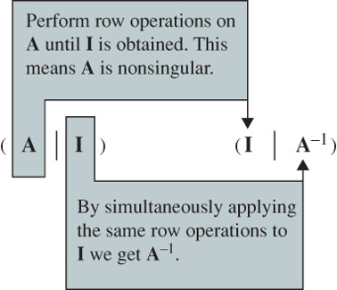

# Matrices {#sec-8}

## Matrix Algebra {#sec-8-1}

* A **matrix** is any rectangular array of numbers or functions

  $$\begin{pmatrix}
    a_{11} & a_{12} & \cdots & a_{1n}\\ 
    a_{21} & a_{22} & \ddots & a_{2n} \\ 
    \vdots & \ddots & \ddots & \vdots \\ 
    a_{m1} & a_{m2} & \cdots & a_{mn}
  \end{pmatrix}$$ 
   
  * The numbers or functions in the array are **entries** or **elements**
  * An $n \times n$ matrix  is a **square** matrix of **order $n$**

* **Column** and **row vectors** are $n \times 1$ and $1 \times n$ matrices

  $$
  \begin{pmatrix}
    a_1\\ 
    a_2\\ 
    \vdots\\ 
    a_n
  \end{pmatrix},\;
  \begin{pmatrix}
    a_1 & a_2 & \cdots & a_n
  \end{pmatrix}  
  $$

* **Equality of Matrices** 

  $$
  \begin{aligned}
   \mathbf{A} = \left(a_{ij}\right)_{m \times n} \; \text{ and } \;&\mathbf{B} = \left(b_{ij}\right)_{m \times n} \;\text{ are equal } \\[5pt]
   \text{ if } a_{ij}=b_{ij} \;&\text{ for each } i \text{ and } j
   \end{aligned}$$

* **Matrix Addition**

  $$\mathbf{A} +\mathbf{B} = \left(a_{ij} +b_{ij}\right)_{m \times n}$$

* **Scalar Multiplication**

  $$k\mathbf{A} = \left(ka_{ij}\right)_{m \times n}$$

* **Properties of Matrix Addition and Scalar Multiplication**

  Suppose $\mathbf{A}$, $\mathbf{B}$, and $\mathbf{C}$ are $m \times n$ matrices and $k_1$ and $k_2$ are scalars. Then

  $$
  \begin{aligned}
    \mathbf{A} +\mathbf{B} &= \mathbf{B} +\mathbf{A} \\ 
    \mathbf{A} +\left(\mathbf{B} +\mathbf{C}\right) &= \left(\mathbf{A} +\mathbf{B}\right) +\mathbf{C} \\
    \left(k_1 k_2\right)\mathbf{A} &= k_1 \left(k_2\mathbf{A}\right) \\
    k_1\left(\mathbf{A} +\mathbf{B}\right)&=k_1\mathbf{A} +k_1\mathbf{B} \\
    \left(k_1 +k_2\right)\mathbf{A} &= k_1 \mathbf{A} +k_2\mathbf{A}  
  \end{aligned}$$

* **Matrix multiplication** 
  
  $$\mathbf{A}\mathbf{B}=\left(\sum_{k=1}^p a_{ik} b_{kj}\right)_{m \times n}$$
  
  where $\mathbf{A}$ is an $m \times p$ matrix, $~\mathbf{B}$ is a $p \times n$ matrix, and
  $~\mathbf{A}\mathbf{B}$ is the $m \times n$ matrix
  
  * In general, $~\mathbf{A}\mathbf{B}\neq\mathbf{B}\mathbf{A}$
  
  * **Associative Law:** $~\mathbf{A}\left(\mathbf{B}\mathbf{C}\right)=\left(\mathbf{A}\mathbf{B}\right)\mathbf{C}$ 
  
  * **Distributive Law:** $~\mathbf{A}\left(\mathbf{B}+\mathbf{C}\right)=\mathbf{A}\mathbf{B} +\mathbf{A}\mathbf{C}$ 

* **Transpose of a Matrix**

$$\mathbf{A}^T =
   {\scriptsize\begin{pmatrix}
     a_{11} & a_{21} & \cdots & a_{m1}\\ 
     a_{12} & a_{22} & \ddots & a_{m2} \\ 
     \vdots & \ddots & \ddots & \vdots \\ 
     a_{1n} & a_{2n} & \cdots & a_{mn}
   \end{pmatrix}}$$

* **Properties of Transpose**

  $$
  \begin{aligned}
     \left(\mathbf{A}^T\right)^T &= \mathbf{A} \\ 
     \left(\mathbf{A} +\mathbf{B}\right)^T 
       &=\mathbf{A}^T +\mathbf{B}^T \\         
     \left(\mathbf{A}\mathbf{B}\right)^T
       &=\mathbf{B}^T\mathbf{A}^T \\ 
     \left(k\mathbf{A}\right)^T
      &=k\mathbf{A}^T
  \end{aligned}$$

* **Special Matrices**

  * In a **zero matrix**, $~$all entries are zeros
  
  * In a **triangular matrix**, $~$all entries above or below the main diagonal are zeros (lower triangular or upper triangular)
  
  * In a **diagonal matrix**, $~$all entries not on the main diagonal are zeros

  * A **scalar matrix** is a diagonal one where all entries on the main diagonal are equal.
    $~$If those entries are $1$'s, it is an **identity matrix**, $\mathbf{I}$ 
    (or $~\mathbf{I}_n$ when there is a need to emphasize the order of the matrix)
    
  * An $n \times n$ matrix $\mathbf{A}$ is **symmetric** $~$if $\mathbf{A}^T=\mathbf{A}$

$~$

**Example** $\,$ 
If $~\mathbf{A}=
   \begin{pmatrix}
     \phantom{-}2 & -3 \\ 
     -5 & \phantom{-}4 
   \end{pmatrix}$ and 
  $~\mathbf{B}=
    \begin{pmatrix}
       -1 & 6 \\ 
       \phantom{-}3 & 2 
    \end{pmatrix}$,
    
find $~$(a) $\mathbf{AB}$, $~$(b) $\mathbf{BA}$, $~$(c) $\mathbf{A}^2$, $~$(d) $\mathbf{B}^2$

$~$

**Example** $\,$ Show that if $\mathbf{A}$ is an $m\times n$ matrix, $~$then $\mathbf{AA}^T$ is symmetric

$~$

**Example** $\,$ In matrix theory, $~$many of the familiar properties of the real number system are not valid. $~$If $a$ and $b$ are real numbers, then $ab=0\;$ implies that $a=0$ or $b=0$. $~$Find two matrices such that $\mathbf{AB}=\mathbf{0}~$ but $\mathbf{A}\neq\mathbf{0}$ and $\mathbf{B}\neq \mathbf{0}$

$~$

**Example** $\,$ Let $\mathbf{A}$ and $\mathbf{B}$ be $n\times n$ matrices. Explain why, in general, the given formula is not valid

$$(\mathbf{A} + \mathbf{B})^2 = \mathbf{A}^2 + 2\mathbf{A}\mathbf{B} +\mathbf{B}^2$$

$~$

**Example** $\,$ Find the resulting vector $\mathbf{b}$ if the given vector $\mathbf{a} = \langle 1, 1 \rangle$ is rotated through the indicated angle
 $\theta=\pi/2$

$~$

**Example** $\,$ Verify that the quadratic form $ax^2 +bxy +cy^2$ is the same as

$$\begin{pmatrix}
      x & y 
    \end{pmatrix}
    \begin{pmatrix}
      a & \frac{1}{2}b \\ 
     \frac{1}{2}b & c 
    \end{pmatrix}
    \begin{pmatrix}
      x \\ y 
\end{pmatrix}$$

$~$

## Systems of Linear Algebraic Equations {#sec-8-2}

* **General Form**

  A system of <font color="red">$m$ linear equations</font> in <font color="red">$n$ unknowns</font> has the general form
  
  $$
  \begin{aligned}
    a_{11} x_1 +a_{12} x_2 + \cdots +a_{1n} x_n 
      & = b_1\\ 
    a_{21} x_1 +a_{22} x_2 + \cdots +a_{2n} x_n 
      & = b_2\\ 
     &\;\, \vdots \\ 
     a_{m1} x_1 +a_{m2} x_2 + \cdots +a_{mn} x_n 
      & = b_m
  \end{aligned}$$

* The **coefficients** of the unknowns can be abbreviated as $a_{ij}$. The numbers $b_1, b_2, \cdots, b_m$ are called the **constants** of the system. 
  If all the constants are zero, the system is said to be **homogeneous**, otherwise it is **nonhomogeneous**
  $$
  \begin{aligned}
    \mathbf{A} 
    &= 
    \begin{pmatrix}
      a_{11} & a_{12} & \cdots & a_{1n} \\ 
      a_{21} & a_{22} & \cdots & a_{2n} \\ 
      \vdots &   & \ddots & \\ 
      a_{m1} & a_{m2} & \cdots & a_{mn} \\ 
    \end{pmatrix}, \;\;
    \mathbf{x} = 
    \begin{pmatrix}
       x_1  \\ x_2 \\ \vdots \\ x_n
    \end{pmatrix}, \;\; 
    \mathbf{b} = 
    \begin{pmatrix}
       b_1 \\ b_2 \\ \vdots \\ b_m
    \end{pmatrix}
  \end{aligned}$$

 $$\mathbf{A} \mathbf{x} = \mathbf{b}$$ 

* A linear system of equations is said to be **consistent** if it has at least one solution and **inconsistent** if it has no solutions. If a linear system is consistent, $~$it has either

  * a unique solution (that is, precisely one solution), or
  * infinitely many solutions

$~$

{width="80%" fig-align="center"}

* **Augmented Matrix**

  $$
  \left(\begin{array}{cccc|c}
    a_{11} & a_{12} & \cdots & a_{1n} & b_1\\ 
    a_{21} & a_{22} & \ddots & a_{2n} & b_2\\ 
    \vdots & \ddots & \ddots & \vdots & \vdots\\ 
    a_{m1} & a_{m2} & \cdots & a_{mn} & b_m
  \end{array}\right)$$


* A system can be solved with **elementary operations** (**row reduction** for matrices)
  on an augmented matrix
  
| Elementary<br>Operations | Meaning |
|:--------|:----------------------------|
| $R_{ij}$        | Interchange rows $i$ and $j$                       |
| $cR_{i}$        | Multiply the row $i$ by the nonzero constant $c$   | 
| $cR_{i}+R_{j}$  | Multiply the row $i$ by $c$ and add to the row $j$ |

$~$

* In the **Gaussian elimination**, $~$ we row-reduce the augmented matrix until we arrive 
  at a row-equivalent augmented matrix in **row-echelon form**
  
  * <font color='green'>The first nonzero entry in a nonzero row is a $1$</font>

  * <font color='blue'>In consecutive nonzero rows, $~$the first entry $1$ in the lower row appears to the right of the $1$ in the higher row</font>
  
  * <font color='green'>Rows consisting of all zeros are at the bottom of the matrix</font>

$~$

**Example** $\,$ Solve
  
$$\begin{pmatrix}
    2 & 6 & \phantom{-}1\\ 
    1 & 2 & -1\\ 
    5 & 7 & -4
  \end{pmatrix}
  \begin{pmatrix}
    x_1\\ 
    x_2\\ 
    x_3
  \end{pmatrix}=
  \begin{pmatrix}
    \phantom{-}7\\ 
    -1\\ 
    \phantom{-}9
  \end{pmatrix}$$

$~$  

Using row operations on the augmented matrix, $~$ we obtain
  
$${\scriptsize
  \left(\begin{array}{rrr|r}
    2 & 6 &  1 & 7\\ 
    1 & 2 & -1 & -1\\ 
    5 & 7 & -4 & 9
  \end{array}\right) 
  \overset{ R_{12}}{\Longrightarrow}}
  {\scriptsize
  \left(\begin{array}{rrr|r}
    1 & 2 & -1 & -1\\   
    2 & 6 &  1 & 7\\ 
    5 & 7 & -4 & 9
  \end{array}\right)
  \overset{\begin{matrix} -2R_1 +R_2 \\ -5R_1 +R_3 \end{matrix}}{\Longrightarrow}
  \left(\begin{array}{rrr|r}
    1 & 2 & -1 & -1\\   
    0 & 2 &  3 & 9\\ 
    0 & -3 & 1 & 14
  \end{array}\right)}$$
  
$${\scriptsize
  \overset{\frac{1}{2}R_2}{\Longrightarrow}
  \left(\begin{array}{rrr|r}
    1 & 2 & -1 & -1\\   
    0 & 1 &  \frac{3}{2} & \frac{9}{2} \\
    0 & -3 & 1 & 14
  \end{array}\right)
  \overset{ 3R_2 +R_3}{\Longrightarrow}
  \left(\begin{array}{rrr|r}
    1 & 2 & -1 & -1\\   
    0 & 1 &  \frac{3}{2} & \frac{9}{2} \\
    0 & 0 & \;\frac{11}{2} & \;\frac{55}{2}
  \end{array}\right)}$$
$${\scriptsize\overset{\frac{2}{11}R_3}{\Longrightarrow}
  \left(\begin{array}{rrr|r}
    1 & 2 & -1 & -1\\   
    0 & 1 &  \frac{3}{2} & \frac{9}{2} \\
    0 & 0 & 1 & 5
  \end{array}\right)}$$

The last matrix is in row-echelon form. $~$We can make the last matrix above to be in reduced row-echelon form

$${\scriptsize
  \left(\begin{array}{rrr|r}
    1 & 2 & -1 & -1\\   
    0 & 1 &  \frac{3}{2} & \frac{9}{2} \\
    0 & 0 & 1 & 5
  \end{array}\right)  
  \overset{ -2R_2 +R_1}{\Longrightarrow}
  \left(\begin{array}{rrr|r}
    1 & 0 & -4 & -10\\   
    0 & 1 &  \frac{3}{2} & \frac{9}{2} \\
    0 & 0 & 1 & 5
  \end{array}\right)   
  \overset{\begin{matrix}
           -4R_3 +R_1 \\
          -\frac{3}{2}R_3 +R_2 
           \end{matrix}}{\Longrightarrow}
  \left(\begin{array}{rrr|r}
    1 & 0 & 0 & 10\\   
    0 & 1 & 0 & -3 \\
    0 & 0 & 1 & 5
  \end{array}\right)}$$
  
We see that the solution is $x_1=10$, $~x_2=-3$, $~x_3=5$

$~$

**Example** $\,$ Solve
  
$$
  \left(\begin{array}{rrr}
    1 & 3 & -2\\ 
    4 & 1 & 3\\ 
    2 & -5 & 7
  \end{array}\right) 
  \begin{pmatrix}
    x_1\\ 
    x_2\\ 
    x_3
  \end{pmatrix}=
 \left(\begin{array}{r}
    -7\\ 
     5\\ 
    19
  \end{array}\right)$$

$~$

Using row operations on the augmented matrix, we obtain
  
$${\scriptsize
  \left(\begin{array}{rrr|r}
    1 & 3 & -2 & -7\\ 
    4 & 1 &  3 & 5\\ 
    2 & -5 & 7 & 19
  \end{array}\right) 
  \overset{\begin{matrix}
           -4R_1 +R_2 \\
           -2R_1 +R_3 
           \end{matrix}}
  {\Longrightarrow}
  \left(\begin{array}{rrr|r}
    1 & 3 & -2 & -7\\ 
    0 & -11 & 11 & 33\\ 
    0 & -11 & 11 & 33
  \end{array}\right) 
  \overset{\begin{matrix}
           -R_2 +R_3 \\
           -\frac{1}{11}R_2 
           \end{matrix}}
  {\Longrightarrow}
  \left(\begin{array}{rr|r|r}
    1 & 3 & -2 & -7\\ 
    0 & 1 & -1 & -3\\ \hline
    0 & 0 & 0 & {\color{Red}0 }
  \end{array}\right)}$$

In this case, $~$the last matrix implies that the original system of three equations is really equivalent to two equations
  
$${
  \overset{-3R_2 +R_1}
  {\Longrightarrow}
  \left(\begin{array}{rr|r|r}
    1 & 0 & 1 & 2\\ 
    0 & 1 & -1 & -3\\ 
    \hline
    0 & 0 & 0 & 0
  \end{array}\right)}$$
  
If we let $x_3=t$, $x_1=-t +2$ and $x_2=t -3$, $~$then we see that the system has infinitely many solutions

$~$

**Example** $\,$ Solve
  
$$
  \left(\begin{array}{rr}
    1 & 1 \\ 
    4 & -1 \\ 
    2 & -3
  \end{array}\right) 
  \begin{pmatrix}
    x_1\\ 
    x_2
  \end{pmatrix}=
 \left(\begin{array}{r}
    1\\ 
   -6\\ 
    8
  \end{array}\right)$$

$~$

Using row operations on the augmented matrix, $~$we obtain
  
$${\scriptsize
  \left(\begin{array}{rr|r}
    1 & 1 & 1\\ 
    4 & -1 & -6\\ 
    2 & -3 & 8
  \end{array}\right) 
  \overset{\begin{matrix}
           -4R_1 +R_2 \\ 
           -2R_1 +R_3 
           \end{matrix}}
  {\Longrightarrow}
  \left(\begin{array}{rr|r}
    1 & 1 & 1\\ 
    0 & -5 & -10\\ 
    0 & -5 & 6
  \end{array}\right) 
  \overset{\begin{matrix}
           -R_2 +R_3 \\ 
           -\frac{1}{5}R_2 
           \end{matrix}}
  {\Longrightarrow}
  \left(\begin{array}{rr|r}
    1 & 1 & 1\\ 
    0 & 1 & 2\\ \hline
    0 & 0 & {\color{Red}{16}}
  \end{array}\right)}$$
  
The system has no solution

$~$

* A **homogeneous system** of linear equations is **always consistent**. The solution consisting of all zeros is called the **trivial solution**. A homogeneous system either possesses only the trivial solution or possesses the trivial solution along with infinitely many nontrivial solutions

* <font color='blue'>**A homogeneous system possesses nontrivial solutions if the number $m$ of equations is less than the number $n$ of unknowns $(m<n)$**</font>

$~$

**Example** $\,$ Find the positive integers $x_1$, $x_2$, $x_3$, and $x_4$ so that

$$x_1 \mathrm{C_2H_6} +x_2 \mathrm{O_2} \rightarrow x_3 \mathrm{CO_2} +x_4 \mathrm{H_2O}$$

Because the number of atoms of each element must be the same on each side of the last equation, $~$we have:

| Atom       |                      |
|   -------- | :------------------- |
|$\mathrm{C}$ |$2x_1=x_3$           |
|$\mathrm{H}$ |$6x_1=2x_4$          |
|$\mathrm{O}$ |$2x_2=2x_3 +x_4$     |

$${\scriptsize
  \left(\begin{array}{rrrr|r}
    2 & 0 & -1 &  0 & 0\\   
    6 & 0 &  0 & -2 & 0\\
    0 & 2 & -2 & -1 & 0
  \end{array}\right)
  \overset{\begin{matrix}
             R_{12} \\ 
             R_{23} 
           \end{matrix}}{\Longrightarrow}
  \left(\begin{array}{rrrr|r}
    6 & 0 &  0 & -2 & 0\\
    0 & 2 & -2 & -1 & 0\\
    2 & 0 & -1 &  0 & 0  
  \end{array}\right) 
  \overset{\;\,\text{ row } \\ \text{operations}}{\Longrightarrow}
  \left(\begin{array}{rrr|r|r} 
    1 & 0 & 0 & -\frac{1}{3} & 0\\   
    0 & 1 & 0 & -\frac{7}{6} & 0\\
    0 & 0 & 1 & -\frac{2}{3} & 0
  \end{array}\right)}$$

Then when we let  $x_4=t$, $~x_1=\frac{1}{3}t$, $x_2=\frac{7}{6}t$, $x_3=\frac{2}{3}t$. $\,$ If we pick $t=6$, $\,x_1=2$, $\,x_2=7$, $\,x_3=4$, $\,x_4=6$

$~$

**Example** $\,$ Use either Gaussian elimination or Gauss-Jordan elimination to solve the given system or show that no solution exists

$$
\begin{aligned}
   x_1 - x_2 &= 11\\ 
   4x_1 +3x_2 &=-5 
\end{aligned}$$

$$
\begin{aligned}
   9x_1 +3x_2 &= -5\\ 
   2x_1 +x_2 &= -1 
\end{aligned}$$

$$
\begin{aligned}
    x_1 -x_2 -x_3 &= -3\\ 
    2x_1 +3x_2 +5x_3 &= 7\\
    x_1 -2x_2 +3x_3 &=-11 
\end{aligned}$$

$$
\begin{aligned}
    x_1 +x_2 +x_3 &= 0\\ 
    x_1 +x_2 +3x_3 &=0 
\end{aligned}$$

$$
\begin{aligned}
    &x_1 -x_2 -x_3 = 8\\ 
    &x_1 -x_2 +x_3 = 3\\
    -&x_1 +x_2 +x_3 = 4 
\end{aligned}$$

$~$

**Example** $\,$ Balance the given chemical equation:
  
$$\mathrm{C}_5\mathrm{H}_8 +\mathrm{O}_2 \rightarrow \mathrm{CO}_2 + \mathrm{H}_2\mathrm{O}$$

$$\mathrm{Cu} + \mathrm{HNO}_3 \rightarrow \mathrm{Cu(NO}_3\mathrm{)}_2 + \mathrm{H}_2\mathrm{O} +\mathrm{NO}$$

$~$

**Example** $\,$ Compute the given product for an arbitrary $~3 \times 3$ matrix $\mathbf{A}$

$$\begin{pmatrix}
 0 & 1 & 0\\ 
 1 & 0 & 0\\ 
 0 & 0 & 1
\end{pmatrix}
\begin{pmatrix}
 1 & 0 & 0\\ 
 0 & 1 & 0\\ 
 0 & c & 1
\end{pmatrix} \mathbf{A}$$

$~$

## Rank of a Matrix {#sec-8-3}

* The **rank** of an $m \times n$ matrix $\mathbf{A}$, $~\mathrm{rank}(\mathbf{A})$, $\,$ is 
  **the maximum number of linearly independent row vectors**. If a matrix $\mathbf{A}$ is now equivalent to
  a row-echelon form $\mathbf{B}$, $~$then

  * the row space of $\mathbf{A}$ = the row space of $\mathbf{B}$
  * the nonezero rows of $\mathbf{B}$ form a basis for the row space of $\mathbf{A}$, $~$and
  * $\mathrm{rank}(\mathbf{A})$ = the number of nonzero rows in $\mathbf{B}$

* <font color='red'>**Consistency of** $~\mathbf{A}\mathbf{x}=\mathbf{b}$</font>

  * A linear system of equations $\mathbf{A}\mathbf{x}=\mathbf{b}$ is <font color='red'>consistent if and only if $~\mathrm{rank}(\mathbf{A})=\mathrm{rank}(\mathbf{A}|\mathbf{b})$</font>

  * Suppose a linear system $\mathbf{A}\mathbf{x}=\mathbf{b}$ with $m$ equations and $n$ unknowns is consistent.
  $~$If <font color='blue'>$\mathrm{rank}(\mathbf{A})=r\leq n$</font>, then the solution of the system contains <font color='blue'>$n -r$ parameters</font>. This means that we have the <font color='blue'>unique solution when $r=n$</font>

$${\scriptsize
  \left(\begin{array}{cccc|c}
    a_{11} & a_{12} & \cdots & a_{1n} & b_1\\ 
    a_{21} & a_{22} & \ddots & a_{2n} & b_2\\ 
    \vdots & \ddots & \ddots & \vdots & \vdots\\ 
    a_{m1} & a_{m2} & \cdots & a_{mn} & b_m
  \end{array}\right)
  \overset{\text{row operations}}{\Longrightarrow}} \\ 
  {\scriptsize
  \left(\begin{array}{cccc|ccc|c}
    1      & a_{12}' & \cdots & a_{1{\color{red}r}}'& a_{1r+1}' & \cdots   & a_{1n}' & b_1' \\ 
    0      & 1       & \ddots & \vdots & a_{2r+1}' & \ddots   & a_{2n}' & b_2' \\
    \vdots & \ddots  & \ddots & \vdots & \vdots    & \ddots   & \vdots  & \vdots \\    
    0      & \cdots  & 0      & 1      & a_{{\color{red}r}r+1}' & \cdots   & a_{rn}' & b_r' \\ \hline     
    0      & 0       & 0      & 0      & 0         & 0        & 0       & {\color{red} 0} \\
    \vdots & \vdots  & \vdots & \vdots & \vdots    & \vdots   & \vdots  & {\color{red} \vdots} \\    
    0      & 0       & 0      & 0      & 0         & 0        & 0       & {\color{red} 0}    
  \end{array}\right)}$$

{width="60%" fig-align="center"}

$~$

**Example** $\,$ Find the rank of the given matrix

$${\scriptsize\begin{pmatrix}
     \phantom{-}2 & \phantom{-}1 & \phantom{-}3 \\ 
     \phantom{-}6 & \phantom{-}3 & \phantom{-}9 \\ 
     -1 & -\frac{1}{2} & -\frac{3}{2} 
    \end{pmatrix}}$$

$${\scriptsize\begin{pmatrix}
     1 & 1 & 1\\ 
     1 & 0 & 4\\ 
     1 & 4 & 1
   \end{pmatrix}}$$

$${\scriptsize\begin{pmatrix}
    0 & 2 & 4 & 2 & 2\\ 
    4 & 1 & 0 & 5 & 1\\ 
    2 & 1 & \frac{2}{3} & 3 & \frac{1}{3} \\ 
    6 & 6 & 6 & 12 & 0 
   \end{pmatrix}}$$

$~$

**Example** $\,$ Determine whether the given set of vectors is linearly dependent or linearly independent

$$\mathbf{u}_1 = \langle 1, 2, 3 \rangle, \;\mathbf{u}_2 = \langle 1, 0, 1 \rangle, \; \mathbf{u}_3 = \langle 1, -1, 5 \rangle$$

$$\mathbf{u}_1 = \langle 1, -1, 3, -1 \rangle, \;\mathbf{u}_2 = \langle 1, -1, 4, 2 \rangle, \; \mathbf{u}_3 = \langle 1, -1, 5, 7 \rangle$$

$~$

**Example** $\,$ Suppose the system $\mathbf{Ax}=\mathbf{b}~$ is consistent and $~\mathbf{A}$ is a $5\times 8~$ matrix and $~\mathrm{rank}\,\mathbf{A}=3.$ $~$How many parameters does the solution of the system have?

$~$

**Example** $\,$ Let $\mathbf{A}$ be a nonzero $4 \times 6~$ matrix

| **1.** $~$ What is the maximum rank that $~\mathbf{A}$ can have?

$~$ 

| **2.** $~$ If $\mathrm{rank}(\mathbf{A}|\mathbf{b})=2$, $~$then for what value(s) of $\mathrm{rank}(\mathbf{A})$ is the system $~\mathbf{Ax}=\mathbf{b}$, $~\mathbf{b}\neq \mathbf{0}$, inconsistent? Consistent?

$~$

| **3.** $~$ If $\mathrm{rank}(\mathbf{A})=3$, $~$then how many parameters does the solution of the system $~\mathbf{Ax}=\mathbf{0}~$ have?

$~$

**Example** $\,$ Let $\mathbf{v}_1$, $\mathbf{v}_2$, and $~\mathbf{v}_3~$ be the first, second, and third column vectors, respectively, of the matrix

$$\mathbf{A} = 
\begin{pmatrix}
 \phantom{-}2 & 1 & 7\\ 
 \phantom{-}1 & 0 & 2\\ 
 -1 & 5 & 13 
\end{pmatrix}$$

  What can we conclude about $\mathrm{rank} (\mathbf{A})$ from the observation $2\mathbf{v}_1 +3\mathbf{v}_2 -\mathbf{v}_3=\mathbf{0}$?

$~$

## Determinants {#sec-8-4}

* **Determinant of a $2 \times 2$ Matrix**

$$\mathrm{det}(\mathbf{A})={\scriptsize
   \begin{vmatrix}
     a_{11} & a_{12}\\ 
     a_{21} & a_{22}
   \end{vmatrix}=a_{11}a_{22}-a_{12}a_{21}}$$

* **Determinant of a $3 \times 3$ Matrix**

$$
   \mathrm{det}(\mathbf{A})={\scriptsize
   \begin{vmatrix}
     a_{11} & a_{12} & a_{13}\\ 
     a_{21} & a_{22} & a_{23}\\
     a_{31} & a_{32} & a_{33}
   \end{vmatrix}}\\{\scriptsize=
   a_{11}(-1)^{1+1} 
   \begin{vmatrix}
     a_{22} & a_{23}\\ 
     a_{32} & a_{33}
   \end{vmatrix} +
   a_{12}(-1)^{1+2} 
   \begin{vmatrix}
     a_{21} & a_{23}\\ 
     a_{31} & a_{33}
   \end{vmatrix} +
   a_{13}(-1)^{1+3} 
   \begin{vmatrix}
     a_{21} & a_{22}\\ 
     a_{31} & a_{32}
   \end{vmatrix}}$$

* **Determinant of a $n\times n$ Matrix**

  $$\mathrm{det}\,\mathbf{A} = \sum (-1)^h a_{1l_1} a_{2l_2} \cdots a_{nl_n}$$

  where the summation is over all permutations $l_1,$ $l_2,$ $\cdots,$ $l_n$ of $1,$ $2,$ $\cdots,$ $n$ and the sign accords with the parity of the permutation

* **Cofactor and Minor**

  The **cofactor of $\,a_{ij}$** is the determinant
  
  $$C_{ij}=(-1)^{i +j} M_{ij}$$
  
  where $M_{ij}$ is the determinant of the submatrix obtained by deleting the $i$-th row and the $j$-th column of $\mathbf{A}$. The determinant $M_{ij}$ is called a **minor determinant**

* **Cofactor Expansion of a Determinant: Laplace Development**

   Let $\mathbf{A}=\left(a_{ij}\right)_{n \times n}$ be an $n \times n$ matrix. $~$For each $1 \leq i \leq n$, 
  $~$ **the cofactor expansion of $\mathrm{det}(\mathbf{A})$ along the $i$-th row** is
  
  $${\mathrm{det}(\mathbf{A})=\sum_{k=1}^na_{ik}C_{ik}}$$

   For each $1 \leq j \leq n$, $~$**the cofactor expansion of $\mathrm{det}(\mathbf{A})$ along the $j$-th column** is
  
   $${\mathrm{det}(\mathbf{A})=\sum_{k=1}^na_{kj}C_{kj}}$$

$~$

**Example** $\,$ Suppose

$$\mathbf{A} = \begin{pmatrix}
    \phantom{-}2 & \phantom{-}3 & 4\\ 
    \phantom{-}1 & -1 & 2\\ 
     -2 & \phantom{-}3 & 5 
   \end{pmatrix}$$
   
   Evaluate the indicated minor determinant or cofactor
   
| **1.** $~M_{12}~$ **2.** $~M_{32}~$ **3.** $~C_{13}~$ **4.** $~C_{22}$
   
$~$

**Example** $\,$ Evaluate the determinant of the matrix

$$\begin{pmatrix}
 \phantom{-}3 & 5 \\ 
 -1 & 4 
\end{pmatrix}$$

$$\begin{pmatrix}
 1 - \lambda & 3 \\ 
 2 & 2 - \lambda 
\end{pmatrix}$$

$~$

**Example** $\,$ Evaluate the determinant of the given matrix by cofactor expansion

$$\begin{pmatrix}
 -2 & -1 & 4\\ 
 -3 & \phantom{-}6 & 1\\ 
 -3 & \phantom{-}4 & 8
\end{pmatrix}$$

$$\begin{pmatrix}
 1 & 1 & 1\\ 
 x & y & z\\ 
 2 & 3 & 4
\end{pmatrix}$$

$~$

## Properties of Determinants {#sec-8-5}

* If $\mathbf{A}^T$ is the transpose of the $n \times n$ matrix $\mathbf{A}$, 
  $~$then <font color='blue'>$\mathrm{det}(\mathbf{A}^T)=\mathrm{det}(\mathbf{A})$</font>
  
  $${\scriptsize\begin{vmatrix}
   a_{11} & a_{12} & a_{13}\\ 
   a_{21} & a_{22} & a_{23}\\ 
   a_{31} & a_{32} & a_{33}
  \end{vmatrix} =
  \begin{vmatrix}
   a_{11} & a_{21} & a_{31}\\ 
   a_{12} & a_{22} & a_{32}\\ 
   a_{13} & a_{23} & a_{33}
  \end{vmatrix}}$$
 
* <font color='blue'>If any two rows (columns) of an $n \times n$ matrix $\mathbf{A}$ are the same, $~$then $\mathrm{det}(\mathbf{A})=0$</font>

  $${\scriptsize\begin{vmatrix}
   a_{11} & a_{12} & a_{13}\\ 
   a_{11} & a_{12} & a_{13}\\ 
   a_{31} & a_{32} & a_{33}
  \end{vmatrix} = 0}$$

* <font color='blue'>If all the entries in a row (column) of an $n \times n$ matrix $\mathbf{A}$ are zero, $~$then $\mathrm{det}(\mathbf{A})=0$</font>

  $${\scriptsize\begin{vmatrix}
   a_{11} & a_{12} & a_{13}\\ 
   0 & 0 & 0\\ 
   a_{31} & a_{32} & a_{33}
  \end{vmatrix} = 0}$$

* <font color='green'>If $\mathbf{B}$ is the matrix obtained by interchanging any two rows (columns) of an $n \times n$ matrix $\mathbf{A}$, $~$then $\mathrm{det}(\mathbf{B})=-\mathrm{det}(\mathbf{A})$</font>

  $${\scriptsize\begin{vmatrix}
   a_{21} & a_{22} & a_{23}\\ 
   a_{11} & a_{12} & a_{13}\\ 
   a_{31} & a_{32} & a_{33}
  \end{vmatrix} = -
  \begin{vmatrix}
   a_{11} & a_{12} & a_{13}\\ 
   a_{21} & a_{22} & a_{23}\\ 
   a_{31} & a_{32} & a_{33}
  \end{vmatrix}}$$

* <font color='green'>If $\mathbf{B}$ is the matrix obtained by multiplying a row (column) by a nonzero real number $k$,
  $~$ then $\mathrm{det}(\mathbf{B})=k\mathrm{det}(\mathbf{A})$</font>
  
  $${\scriptsize\begin{vmatrix}
   a_{11} & a_{12} & a_{13}\\ 
   ka_{21} & ka_{22} & ka_{23}\\ 
   a_{31} & a_{32} & a_{33}
  \end{vmatrix} = k
  \begin{vmatrix}
   a_{11} & a_{12} & a_{13}\\ 
   a_{21} & a_{22} & a_{23}\\ 
   a_{31} & a_{32} & a_{33}
  \end{vmatrix}}$$

* <font color='blue'>If $\mathbf{A}$ and $\mathbf{B}$ are both $n \times n$ matrices, $~$then $\mathrm{det}(\mathbf{AB})=\mathrm{det}(\mathbf{A})\cdot \mathrm{det}(\mathbf{B})$</font>
  
  $${\scriptsize\begin{vmatrix} 
  \begin{pmatrix}
   a_{11} & a_{12} & a_{13}\\ 
   a_{21} & a_{22} & a_{23}\\ 
   a_{31} & a_{32} & a_{33}
  \end{pmatrix}
  \begin{pmatrix}
   b_{11} & b_{12} & b_{13}\\ 
   b_{21} & b_{22} & b_{23}\\ 
   b_{31} & b_{32} & b_{33}
  \end{pmatrix}
  \end{vmatrix}
  =
  \begin{vmatrix}
   a_{11} & a_{12} & a_{13}\\ 
   a_{21} & a_{22} & a_{23}\\ 
   a_{31} & a_{32} & a_{33}
  \end{vmatrix}
  \begin{vmatrix}
   b_{11} & b_{12} & b_{13}\\ 
   b_{21} & b_{22} & b_{23}\\ 
   b_{31} & b_{32} & b_{33}
  \end{vmatrix}}$$

* <font color='blue'>Suppose $\mathbf{B}$ is the matrix obtained from an $n \times n$ matrix $\mathbf{A}$ by multiplying  a row(column) by a nonzero $k$ and adding the result to another row(column). $~$ Then $\mathrm{det}(\mathbf{B})=\mathrm{det}(\mathbf{A})$</font>
  
  $${\scriptsize\begin{vmatrix} 
   a_{11} & a_{12} & a_{13}\\ 
   a_{21} & a_{22} & a_{23}\\ 
   ka_{21} +a_{31} & ka_{22}+a_{32} & ka_{23} +a_{33}
  \end{vmatrix}
  =
  \begin{vmatrix}
   a_{11} & a_{12} & a_{13}\\ 
   a_{21} & a_{22} & a_{23}\\ 
   a_{31} & a_{32} & a_{33}
  \end{vmatrix}}$$

* If $\mathbf{A}$ is an $n \times n$ triangular matrix, $~$then $\mathrm{det}(\mathbf{A})=a_{11} a_{22}\cdots a_{nn}$

  $${\scriptsize\begin{vmatrix}
   a_{11} & 0 & 0\\ 
   a_{21} & a_{22} & 0\\ 
   a_{31} & a_{32} & a_{33}
  \end{vmatrix} = a_{11} a_{22} a_{33}}$$

**Alien Cofactors**

* Suppose $\mathbf{A}$ is an $n \times n$ matrix. If $a_{i1}, a_{i2}, \cdots, a_{in}$ are the entries
in the $i$-th row and $C_{p1}, C_{p2}, \cdots, C_{pn}\,$ are the cofactors of the entries in the $p$-th row, $~$then

  $$\sum_{k=1}^n a_{ik}C_{pk}=0\;\;\text{for}\; i \neq p$$

* If $a_{1j}, a_{2j}, \cdots, a_{nj}$ are the entries
in the $j$-th column and $C_{1p},$ $C_{2p},$ $\cdots,$ $C_{np}$ are the cofactors of the entries in the $p$-th column, $~$then

  $$\sum_{k=1}^n a_{kj}C_{kp}=0\;\;\text{for}\; j \neq p$$

$~$

**Example** $\,$ State the appropriate theorem(s) in this section that justifies the given equality
  
$$\begin{vmatrix}
 1 & 2\\ 
 3 & 4
\end{vmatrix} = -
\begin{vmatrix}
 3 & 4\\
 1 & 2 
\end{vmatrix}$$

$$\begin{vmatrix}
 -5 & \phantom{-}6\\ 
 \phantom{-}2 & -8
\end{vmatrix} =
\begin{vmatrix}
 \phantom{-}1 & \phantom{-}6\\
 -6 & -8 
\end{vmatrix}$$

$${\begin{vmatrix}
 1 & 2 & \phantom{--}3\\ 
 4 & 2 & \phantom{-}18\\
 5 & 9 & -12
\end{vmatrix} = 6
\begin{vmatrix}
 1 & 2 & \phantom{-}1\\ 
 2 & 1 & \phantom{-}3\\
 5 & 9 & -4
\end{vmatrix}}$$

$~$

**Example** $\,$ Evaluate the determinant of the given matrix using the result

$$\begin{vmatrix}
 a_1 & a_2 & a_3\\ 
 b_1 & b_2 & b_3\\
 c_1 & c_2 & c_3
\end{vmatrix} = 5$$

**1.** $~$ ${\scriptsize \mathbf{A} =
\begin{pmatrix}
 a_3 & a_2 & a_1\\ 
 b_3 & b_2 & b_1\\ 
 c_3 & c_2 & c_1
\end{pmatrix}}$
  
**2.** $~$ ${\scriptsize\mathbf{A} =
\begin{pmatrix}
 2a_1 & a_2 & a_3\\ 
 6b_1 & 3b_2 & 3b_3\\ 
 2c_1 & c_2 & c_3
\end{pmatrix}}$

**3.** $~$ ${\scriptsize\mathbf{A} =
\begin{pmatrix}
 4a_1 -2a_3 & a_2 & a_3\\ 
 4b_1 -2b_3 & b_2 & b_3\\ 
 2c_1 -c_3 & \frac{1}{2}c_2 & \frac{1}{2}c_3
\end{pmatrix}}$

$~$

**Example** $\,$ Consider the matrix

$${\mathbf{A} =
\begin{pmatrix}
 1 & 1 & 1\\ 
 x & y & z\\ 
 y+z & x+z & x+y
\end{pmatrix}}$$

Without expanding, $~$show that $\mathrm{det}\, \mathbf{A}=0$

$~$

**Example** $\,$ Evaluate 

$${\begin{vmatrix}
 1 & 1 & 1 & 1\\ 
 a & b & c & d\\ 
 a^2 & b^2 & c^2 & d^2\\ 
 a^3 & b^3 & c^3 & d^3
\end{vmatrix}}$$

$~$

## Inverse of a Matrix {#sec-8-6}

* If $\mathbf{A}$ is an $n \times n$ matrix and there exists an $n \times n$ matrix $\mathbf{B}$ such that

  $$\mathbf{A}\mathbf{B}=\mathbf{B}\mathbf{A}=\mathbf{I}$$
  
  then $\mathbf{A}$ is said to be **nonsingular** or **invertible** and $\mathbf{B}$ 
  is the **inverse** of $\mathbf{A}$

* An $n \times n$ matrix that has no inverse is called **singular**. If $\mathbf{A}$ is nonsingular, 
  $~$its inverse is denoted by $\mathbf{B}=\mathbf{A}^{-1}$

* **Properties of the Inverse**

  Let $\mathbf{A}$ and $\mathbf{B}~$ be nonsingular matrices. Then
  
  $$
  \begin{aligned}
    \left(\mathbf{A}^{-1}\right)^{-1}&=\mathbf{A} \\
    \left(\mathbf{A}\mathbf{B}\right)^{-1}&=\mathbf{B}^{-1}\mathbf{A}^{-1} \\
    \left(\mathbf{A}^T\right)^{-1}&=\left(\mathbf{A}^{-1}\right)^T
  \end{aligned}$$

* **Adjoint Matrix**

  $$\mathrm{adj}(\mathbf{A})=
   \begin{pmatrix}
     C_{11} & C_{12} & \cdots & C_{1n}\\ 
     C_{21} & C_{22} & \cdots & C_{2n}\\ 
     \vdots &        &        & \vdots\\ 
     C_{n1} & C_{n2} & \cdots & C_{nn}
   \end{pmatrix}^T$$

* **Finding the Inverse**
  
  Let $\mathbf{A}$ be an $n \times n$ matrix. $~$If $\mathrm{det}(\mathbf{A})\neq 0$ (**nonsingular**), then
  
  $$\mathbf{A}^{-1}=\frac{\mathrm{adj}(\mathbf{A})}{\mathrm{det}(\mathbf{A})}$$

  or

  {width="50%" fig-align="center"}

* **Using the Inverse to Solve Systems**

  The coefficient matrix $\mathbf{A}$ is $n \times n$. In particular, $~$if $\mathbf{A}$ is nonsingular,
  $~$the system $\mathbf{A}\mathbf{x}=\mathbf{b}$ can be solved by
  
  $$\mathbf{x}=\mathbf{A}^{-1}\mathbf{b}$$
  
  A homogeneous system of $n$ linear equations in $~n$ unknowns <font color='blue'>$\mathbf{A}\mathbf{x}=\mathbf{0}$</font> $~$has
  
  * only the trivial solution if and only if $\mathbf{A}$ is nonsingular
  
  * <font color='blue'>a nontrivial solution if and only if $\mathbf{A}$ is singular</font>

$~$

**Example** $\,$ Verify that the matrix $\mathbf{B}$ is the inverse of the matrix $\mathbf{A}$

$$\mathbf{A}=\begin{pmatrix}
 1 & \frac{1}{2} \\ 
 2 & \frac{3}{2}
\end{pmatrix}, \;\;
\mathbf{B}=\begin{pmatrix}
 \phantom{-}3 & -1 \\ 
 -4 & \phantom{-}2
\end{pmatrix}$$

$~$

**Example** $\,$ Determine whether the given matrix is singular or nonsingular. $\,$If it is nonsingular, find the inverse using $\mathbf{A}^{-1}=\frac{\mathrm{adj}\,\mathbf{A}}{\mathrm{det}\,\mathbf{A}}$

$$\begin{pmatrix}
 3&  0& \phantom{-}0\\ 
 0&  6& \phantom{-}0\\ 
 0&  0& -2 
\end{pmatrix}, \;\;\;
\begin{pmatrix}
 0 & -1 & \phantom{-}1 & 4\\ 
 3 & \phantom{-}2 & -2 & 1\\ 
 0 & \phantom{-}4 & \phantom{-}0 & 1\\ 
 1 & \phantom{-}0 & -1 & 1 
\end{pmatrix}, \;\;\;
\begin{pmatrix}
 1 & \phantom{-}0 & 0 & 0\\ 
 0 & \phantom{-}1 & 0 & 0\\ 
 0 & -2 & 1 & 0\\ 
 0 & -3 & 0 & 1
\end{pmatrix}$$

$~$

**Example** $\,$ Find the inverse of the given matrix or show that no inverse exists
  
$$\begin{pmatrix}
 1 & 2 & 3\\ 
 4 & 5 & 6\\ 
 7 & 8 & 9 
\end{pmatrix},\;\;
\begin{pmatrix}
 \phantom{-}4 & \phantom{-}2 & 3 \\ 
 \phantom{-}2 & \phantom{-}1 & 0\\ 
 -1 & -2 & 0
\end{pmatrix}$$

$~$

**Example** $\,$ If $\mathbf{A}$ is nonsingular, then $\left( \mathbf{A}^T\right)^{-1}=\left( \mathbf{A}^{-1}\right)^T$, $~$verify this for
  
$$\mathbf{A}=\begin{pmatrix}
 1 & 4\\ 
 2 & 10 
\end{pmatrix}$$

$~$

**Example** $\,$ Find the inverse of the rotation matrix 

$$\mathbf{M}=\begin{pmatrix}
 \cos\theta & -\sin\theta\\ 
 \sin\theta & \phantom{-}\cos\theta 
\end{pmatrix}$$
  
What does $\mathbf{A}=\mathbf{M}^{-1}\mathbf{B}$ represents?

$~$

**Example** $\,$ A nonsingular matrix $\mathbf{A}$ is said to be **orthogonal** if $\mathbf{A}^{-1}=\mathbf{A}^T$ 

**1.** $~$ Verify tha the rotation matrix is orthogonal
  
**2.** $~$ Verify that 
$${\scriptsize\mathbf{A}=\frac{1}{\sqrt{6}}\begin{pmatrix}
 \sqrt{2} & \phantom{-}0 & -2 \\ 
 \sqrt{2} & \phantom{-}\sqrt{3} & \phantom{-}1\\ 
 \sqrt{2} &  -\sqrt{3} & \phantom{-}1
\end{pmatrix}}~$$ is an orthogonal matrix

$~$

**Example** $\,$ Answer the questions based on the supposition

* Show that if $\mathbf{A}$ is an orthogonal matrix, $~$then $\mathrm{det}\,\mathbf{A}=\pm 1$

* Suppose $\mathbf{A}$ and $\mathbf{B}~$ are nonsingular $~n\times n$ matrices. Then show that $\mathbf{AB}~$ is nonsingular

* Suppose $\mathbf{A}$ and $\mathbf{B}~$ are $~n\times n$ matrices and that either $\mathbf{A}$ or $\mathbf{B}~$ is singular. $~$Then show that $\mathbf{AB}~$ is singular

* Suppose $\mathbf{A}~$ is a nonsingular matrix. $~$Then show that $\displaystyle\mathrm{det}\,\mathbf{A}^{-1}=\frac{1}{\mathrm{det}\,\mathbf{A}}$

* Suppose $\mathbf{A}^2=\mathbf{A}$. $~$Then show that either $\mathbf{A}=\mathbf{I}~$ or $~\mathbf{A}~$ is singular 

* Suppose $\mathbf{A}$ and $\mathbf{B}~$ are $~n\times n$ matrices. $~\mathbf{A}~$ is nonsingular, $~$ and 
$\mathbf{AB}=\mathbf{0}$. $~$Then show that $\mathbf{B}=\mathbf{0}$

* Suppose $\mathbf{A}$ and $\mathbf{B}~$ are $~n\times n$ matrices. $~\mathbf{A}~$ is nonsingular, $~$ and $\mathbf{AB}=\mathbf{AC}$. $~$Then show that $\mathbf{B}=\mathbf{C}$

* Suppose $\mathbf{A}$ and $\mathbf{B}~$ are nonsingular $~n\times n$ matrices. Is $~\mathbf{A} +\mathbf{B}~$ necessarily nonsingular?

* Suppose $\mathbf{A}~$ is a nonsingular matrix. $~$Then show that $\mathbf{A}^T~$ is nonsingular

* Suppose $\mathbf{A}$ and $\mathbf{B}~$ are $~n\times n~$ nonzero matrices and $\mathbf{AB}=\mathbf{0}$. $~$Then show that both $\mathbf{A}~$ and $~\mathbf{B~}$ are singular


## Cramer's Rule {#sec-8-7}

If $\mathrm{det}(\mathbf{A}) \neq 0$, $~$the solution of the system is given by

$$x_k=\frac{\mathrm{det}(\mathbf{A}_k)}{\mathrm{det}(\mathbf{A})}, \;\;{\scriptsize k=1, 2, \cdots, n}$$
  
where

$${\scriptsize\mathbf{A}_k=
  \begin{pmatrix}
    a_{11} & \cdots & a_{1k-1} & {\color{red} {b_1}}    & a_{1k+1} & \cdots & a_{1n}\\ 
    a_{21} & \cdots & a_{2k-1} & {\color{red} {b_2}}    & a_{2k+1} & \cdots & a_{2n} \\ 
    \vdots &        & \vdots   & {\color{red} {\vdots}} & \vdots   &        & \vdots\\ 
    a_{n1} & \cdots & a_{nk-1} & {\color{red} {b_n}}    & a_{nk+1} & \cdots & a_{nn}
  \end{pmatrix}}$$

$~$

**Example** $\,$ Solve the given system of equations by Cramer's rule

$$
  \begin{aligned}
   -3x_1 + x_2 &= 3 \\ 
    2x_1 -4x_2 &= -6 \\ \\
    0.1x_1 -0.4x_2 &= 0.13 \\ 
    x_1 -x_2 &= 0.4 \\ \\
    2x + y &=1\\
    3x +2y &=-2
  \end{aligned}$$

$~$

**Example** $\,$ Consider the system

$$
  \begin{aligned}
    x_1 + x_2 &= 1 \\ 
    x_1 +\epsilon x_2 &= 2 
  \end{aligned}$$

When $\epsilon$ is close to $1$, $~$the lines that make up the system are almost parallel
  
**1.** Use Cramer's rule to show that a solution of the system is
  
  $${\scriptsize x_1 = 1 -\frac{1}{\epsilon -1}, \;\;x_2 = \frac{1}{\epsilon - 1}}$$
  
**2.** The system is said to be ill-conditioned since small changes in the input data(for example, the coefficients) causes a significant or large change in the output or solution. $~$Verify this by finding the solution of the system for $\epsilon=1.01$ and then for $\epsilon=0.99$

$~$

## The Eigenvalue Problem {#sec-8-8}

* Let $\mathbf{A}$ be an $n \times n~$ matrix. $~$A number $\lambda$ is said to be an **eigenvalue** of 
  $\mathbf{A}$ if there exists a nonzero solution vector $\mathbf{k}$ of the linear system

  $$\mathbf{A}\mathbf{k}=\lambda\mathbf{k}$$

  and the solution vector $\mathbf{k}$ is said to be an **eigenvector** corresponding to the eigenvalue $\lambda$
  
* The problem of solving $~\mathbf{A}\mathbf{k}=\lambda\mathbf{k}~$ for nonzero vectors $\mathbf{k}$ is
  called to be the **eigenvalue problem** for $\mathbf{A}$

* We must solve the **characteristic equation** 
  $~\mathrm{det}(\mathbf{A} -\lambda\mathbf{I})=0~$ to find an eigenvalue $\lambda$
  
* To find an eigenvector $\mathbf{k}$ corresponding to an eigenvalue $\lambda$, $~$we solve $~(\mathbf{A} -\lambda\mathbf{I})\mathbf{k}=\mathbf{0}~$ by applying Gauss elimination 
  to $~(\mathbf{A} -\lambda\mathbf{I}|\mathbf{0})$

$~$

**Example** $\,$ Find the eigenvalues and eigenvectors of
 
$$\mathbf{A}=
  \left(\begin{array}{rrr}
    1 & 2 &  1\\ 
    6 &-1 &  0\\ 
   -1 &-2 & -1
  \end{array}\right)   
  $$

To find the eigenvalues, $~$ we solve
  
$${\scriptsize
  \mathrm{det} (\mathbf{A} -\lambda\mathbf{I}) =
  \begin{vmatrix}
    1 -\lambda & \;\;\,2 & \;\;\,1\\ 
    6 & -1 -\lambda & \;\;\,0\\ 
    -1\;\;\, & -2 & -1 -\lambda
  \end{vmatrix}=0}$$
  
It follows that the characteristic equation is 
  
$$~-\lambda^3 -\lambda^2 +12\lambda=-\lambda(\lambda+4)(\lambda-3)=0$$
  
Hence the eigenvalues are $~\lambda_1=-4$, $\,\lambda_2=0$, $\,\lambda_3=3$

For $\lambda_1=-4$, $~$we have
  
$$
  (\mathbf{A} +4\mathbf{I}|\mathbf{0}) = {\scriptsize
  \left(\begin{array}{rrr|r}
    5 & 2 &  1 & 0\\ 
    6 & 3 &  0 & 0\\ 
   -1 &-2 &  3 & 0
  \end{array}\right)
  \overset{\;\text{row operations}\;}{\Longrightarrow}
  \left(\begin{array}{rrr|r}
    1 & 0 & 1 & 0\\ 
    0 & 1 &-2 & 0\\ \hline
    0 & 0 & 0 & 0
  \end{array}\right)}$$

Thus $k_1=-k_3$, $\text{ }k_2=2k_3$. Choosing $\text{ }k_3=1$ gives the eigenvector
  
$$\mathbf{k}_1=
  \left(\begin{array}{r}
    -1\\ 
     2\\ 
     1
  \end{array}\right)$$

For $\lambda_2=0$, $~$we have
  
$$
  (\mathbf{A} -0\mathbf{I}|\mathbf{0}) = {\scriptsize
  \left(\begin{array}{rrr|r}
    1 & 2 &  1 & 0\\ 
    6 &-1 &  0 & 0\\ 
   -1 &-2 & -1 & 0
  \end{array}\right)
  \overset{\text{row operations}}{\Longrightarrow}
  \left(\begin{array}{rrr|r}
    1 & 0 & \frac{1}{13} & 0\\ 
    0 & 1 & \frac{6}{13} & 0\\ \hline
    0 & 0 & 0\; & 0
  \end{array}\right)}$$
  
Thus $k_1=-\frac{1}{13}k_3$, $\text{ }k_2=-\frac{6}{13}k_3$. $~$Choosing $~k_3=1$ gives the eigenvector
  
$$\mathbf{k}_2=
  \left(\begin{array}{r}
    -\frac{1}{13}\\ 
    -\frac{6}{13}\\ 
    1\;
  \end{array}\right)$$

For $\lambda_3=3$, $~$ we have
  
$$
  (\mathbf{A} -3\mathbf{I}|\mathbf{0}) = {\scriptsize
  \left(\begin{array}{rrr|r}
   -2 & 2 &  1 & 0\\ 
    6 &-4 &  0 & 0\\ 
   -1 &-2 & -4 & 0
  \end{array}\right)
  \overset{\text{row operations}}{\Longrightarrow}
  \left(\begin{array}{rrr|r}
    1 & 0 & 1 & 0\\ 
    0 & 1 & \frac{3}{2} & 0\\ \hline
    0 & 0 & 0 & 0
  \end{array}\right)}$$
  
Thus $k_1=-k_3$, $\text{ }k_2=-\frac{3}{2}k_3$. $~$Choosing $\text{ }k_3=1$ gives the eigenvector
  
$$\mathbf{k}_3=
  \left(\begin{array}{r}
   -1\\ 
   -\frac{3}{2}\\ 
    1
  \end{array}\right)$$

```{python}
# | echo: true
import pprint

import numpy as np
from scipy.linalg import lu

import sympy
from sympy import plot_implicit, symbols, Eq
sympy.init_printing()

A = sympy.Matrix([[1, 2, 1], [6, -1, 0], [-1, -2, -1]])

A.eigenvects()
```

$~$

**Example** $\,$ Find the eigenvalues and eigenvectors of
 
$$\mathbf{A}=
  \left(\begin{array}{rrr}
    9 & 1 & 1\\ 
    1 & 9 & 1\\ 
    1 & 1 & 9
  \end{array}\right)$$

The characteristic equation
  
$${\scriptsize
  \mathrm{det} (\mathbf{A} -\lambda\mathbf{I}) =
  \begin{vmatrix}
    9 -\lambda & 1 & 1\\ 
    1 & 9 -\lambda & 1\\ 
    1 & 1 & 9 -\lambda
  \end{vmatrix}=-(\lambda-11)(\lambda-8)^2=0}$$
  
shows that $\lambda_1=11$ and that $\lambda_2=\lambda_3=8$ is an eigenvalue of multiplicity 2

For $\lambda_1=11$, $~$we have
  
$${\scriptsize
  (\mathbf{A} -11\mathbf{I}|\mathbf{0}) =
  \left(\begin{array}{rrr|r}
   -2 & 1 &  1 & 0\\ 
    1 &-2 &  1 & 0\\ 
    1 & 1 & -2 & 0
  \end{array}\right)
  \overset{\text{row operations}}{\Longrightarrow}
  \left(\begin{array}{rrr|r}
    1 & 0 & -1 & 0\\ 
    0 & 1 & -1 & 0\\ \hline
    0 & 0 & 0 & 0
  \end{array}\right)}$$
  
Thus $k_1=k_3$, $k_2=k_3$. $~$Choosing $k_3=1$ gives the eigenvector
  
$$\mathbf{k}_1=
  \left(\begin{array}{r}
    1\\ 
    1\\ 
    1
  \end{array}\right)$$

For $\lambda_2=8$, $~$we have
  
$${\scriptsize
  (\mathbf{A} -8\mathbf{I}|\mathbf{0}) =
  \left(\begin{array}{rrr|r}
    1 & 1 &  1 & 0\\ 
    1 & 1 &  1 & 0\\ 
    1 & 1 &  1 & 0
  \end{array}\right)
  \overset{\text{row operations}}{\Longrightarrow}
  \left(\begin{array}{rrr|r}
    1 & 1 & 1 & 0\\ \hline
    0 & 0 & 0 & 0\\ 
    0 & 0 & 0 & 0
  \end{array}\right)}$$
  
Here $k_1 +k_2 +k_3=0$, $~$we are free to select two of the variables arbitrarily

Choosing, $\,$ on the one hand, $~k_2=1$, $\,k_3=0$, and on the other, $~k_2=0$, $\,k_3=1$, $\,$ we obtain two linearly independent eigenvectors
  
$$\mathbf{k}_2=
  \left(\begin{array}{r}
   -1\\ 
    1\\ 
    0
  \end{array}\right) \text{ and } 
  \mathbf{k}_3=
  \left(\begin{array}{r}
   -1\\ 
    0\\ 
    1
  \end{array}\right)$$
  
corresponding to a single eigenvalue

If instead we choose $k_2=1$, $k_3=1$ and then $k_2=1$, $k_3=-1$, $~$we obtain, respectively, two entirely different but orthogonal eigenvectors
  
$$\mathbf{k}_2=
  \left(\begin{array}{r}
   -2\\ 
    1\\ 
    1
  \end{array}\right) \text{ and }
  \mathbf{k}_3=
  \left(\begin{array}{r}
    0\\ 
    1\\ 
   -1
  \end{array}\right)$$

```{python}
# | echo: true
A = sympy.Matrix([[9, 1, 1], [1, 9, 1], [1, 1, 9]])
A.eigenvects()
```

$~$

**Example** $\,$ Find the eigenvalues and eigenvectors of 

$$\mathbf{A}=
   \left(\begin{array}{rr}
     3 & 4 \\ 
    -1 & 7 
   \end{array}\right)$$

From the characteristic equation
   
$$\scriptsize
   \mathrm{det}(\mathbf{A} -\lambda\mathbf{I})=
   \left|\begin{array}{cc}
     3-\lambda & 4 \\ 
    -1 & 7 -\lambda 
   \end{array}\right|
   =(\lambda -5)^2=0$$

we see $\lambda_1=\lambda_2=5$ is an eigenvalue of algebraic multiplicity 2

To find
   the eigenvector(s) corresponding to $\lambda_1=5$, $~$we resort to 
   the system $(\mathbf{A} -5\mathbf{I}|\mathbf{0})$
   
$${\scriptsize
  (\mathbf{A} -5\mathbf{I}|\mathbf{0}) =
  \left(\begin{array}{rr|r}
   -2 & 4 & 0\\ 
   -1 & 2 & 0
  \end{array}\right)
  \overset{\text{row operations}}{\Longrightarrow}
  \left(\begin{array}{rr|r}
    1 &-2 & 0\\ \hline
    0 & 0 & 0
  \end{array}\right)}$$
  
Thus $k_1=2k_2$. $~$If we choose $k_2=1$, $\,$ we find the single eigenvector 
  
$$\mathbf{k}_1=\begin{pmatrix}
     2 \\ 1
   \end{pmatrix}$$

We define the geometric multiplicity of an eigenvalue
  to be the number of linearly independent eigenvectors for the eigenvalue   

When the geometric multiplicity of an eigenvalue is less than the algebraic 
  multiplicity, $~$ we say the matrix is *defective*. $~$ In the case of defective matrices, $~$ we must search for additional system 

$${\scriptsize
  (\mathbf{A} -5\mathbf{I}|\mathbf{k}_1) =
  \left(\begin{array}{rr|r}
   -2 & 4 & 2\\ 
   -1 & 2 & 1
  \end{array}\right)
  \overset{\text{row operations}}{\Longrightarrow}
  \left(\begin{array}{rr|r}
    1 &-2 & -1\\ \hline
    0 & 0 & 0
  \end{array}\right) }$$
  
Thus $k_1-2k_2=-1$. $~$If we choose $k_2=0$, $~$we find the generalized eigenvector
  
$$\mathbf{k}_2=\begin{pmatrix}
     -1 \\ \;\;0
   \end{pmatrix}$$

```{python}
# | echo: true
A = sympy.Matrix([[3, 4], [-1, 7]])
A.eigenvects()
```

$~$

* Let $\mathbf{A}$ be a square matrix with real entries. If $\lambda=\alpha +i\beta$, $~\beta \neq 0$, $~$is a complex eigenvalue of $\mathbf{A}$,
  
  $$\mathbf{A}\bar{\mathbf{k}}=\bar{\lambda}\bar{\mathbf{k}}$$

* $\lambda=0~$ is an eigenvalue of $~\mathbf{A}$ if and only if $~\mathbf{A}$ is singular

* If $~\lambda~$ is an eigenvalue of nonsingular $~\mathbf{A}$ with eigenvector $~\mathbf{k}$, $~1/\lambda$ is an eigenvalue of $~\mathbf{A}^{-1}$ with the same eigenvector $~\mathbf{k}$

* The eigenvalues of an upper triangular, $~$lower triangular, $~$and diagonal matrix are the main diagonal entries

$~$

**Example** $\,$ Find the eigenvalues and eigenvectors of the given matrix. $~$State whether the matrix is singular or nonsingular

$$\begin{pmatrix}
 -1& 2\\ 
 -7& 8
\end{pmatrix}, \;\;
\begin{pmatrix}
 4 & \phantom{-}8 \\ 
 0 & -5 
\end{pmatrix}, \;\;
\begin{pmatrix}
 0 & 0 & -1 \\ 
 1 & 0 & \phantom{-}0 \\ 
 1 & 1 & -1 
\end{pmatrix}$$

$~$

**Example** $\,$ Find the eigenvalues and eigenvectors of the given nonsingular matrix $\mathbf{A}$. $~$Then without finding $\mathbf{A}^{-1}$, $~$find its eigenvalues and corresponding eigenvectors

$$\begin{pmatrix}
 5& 1\\ 
 1& 5
\end{pmatrix}, \;\;
\begin{pmatrix}
 4 & 2 & -1 \\ 
 0 & 3 & -2 \\ 
 0 & 0 & \phantom{-}5 
\end{pmatrix}$$

$~$

**Example** $\,$ True or False: $~$ If $\lambda$ is an eigenvalue of an $n \times n~$ matrix $\mathbf{A}$, $~$ then the matrix $\mathbf{A}-\lambda\mathbf{I}~$ is singular. Justify your answer

$~$

**Example** $\,$ Suppose $\lambda$ is an eigenvalue with corresponding eigenvector $~\mathbf{k}~$ of an $n\times n~$ matrix $\mathbf{A}$
  
**1.** If $\mathbf{A}^2=\mathbf{AA}$, $~$ then show that $\mathbf{A}^2\mathbf{k}=\lambda^2\mathbf{k}$. $~$ Explain the meaning of the last equation
  
**2.** Verify the result obtained in part 1 for the matrix 
  
$$\mathbf{A}=\begin{pmatrix}
 2 & 3\\ 
 5 & 4
\end{pmatrix}$$

**3.** Generalize the result in part 1

$~$

**Example** $\,$ Let $\mathbf{A}$ and $\mathbf{B}$ be $n \times n~$ matrices. The matrix $\mathbf{B}$ is said to be **similar** to the matrix $\mathbf{A}~$ if there exists a nonsingular matrix $\mathbf{S}$ such that $\mathbf{B}=\mathbf{S}^{-1}\mathbf{AS}$. $~$If $\mathbf{B}$ is similar to $\mathbf{A}$, $~$then show that $\mathbf{A}$ is similar to $\mathbf{B}$

$~$

**Example** $\,$ Suppose $\mathbf{A}$ and $\mathbf{B}$ are similar matrices. Show that $\mathbf{A}$ and $\mathbf{B}$ have the same eigenvalues

$~$

## Powers of Matrices {#sec-8-9}

* **Cayley-Hamilton Theorem**

  If $(-1)^n \lambda^n +c_{n-1}\lambda^{n-1} + \cdots +c_1 \lambda +c_0 = 0~$ is the characteristic equation
  of $n \times n$ matrix $\mathbf{A}$, $~$then
  
  $$(-1)^n \mathbf{A}^n +c_{n-1}\mathbf{A}^{n-1} + \cdots +c_1 \mathbf{A} +c_0 \mathbf{I} = \mathbf{0}$$

  And we can write
  
  $$\mathbf{A}^m = a_0 \mathbf{I} +a_1 \mathbf{A} +\cdots +a_{n-1}\mathbf{A}^{n-1}$$
    
  and the equation for the eigenvalues
    
  $$\lambda^m = a_0 +a_1 \lambda +\cdots +a_{n-1}\lambda^{n-1}$$
    
  hold for the same constants

$~$

**Example** $\,$ Verify that the given matrix satisfies its own characteristic equation
  
$$~\mathbf{A}=\begin{pmatrix}
 1 & -2\\ 
 4 & \phantom{-}5
\end{pmatrix}$$

$~$

**Example** $\,$ Compute $\mathbf{A}^m$

$$\mathbf{A}=\begin{pmatrix}
 8 & 5\\ 
 4 & 0
\end{pmatrix}; \;\;m=5,\;\;
\mathbf{A}=\begin{pmatrix}
 1 & 1 & 1\\ 
 0 & 1 & 2\\ 
 0 & 1 & 0
\end{pmatrix}; \;\;m=10$$

$~$

**Example** $\,$ Show that the given matrix has an eigenvalue $\lambda_1$ of multiplicity two. $~$ As a consequence, $~$the equation $\lambda^m=c_0+c_1\lambda$ does not yield enough independent equations to form a system for determining the coefficients $c_i$. $~$Use the derivative (with respect to $\lambda$) of this equation evaluated at $\lambda_1$ as the extra needed equation to form a system. $~$Compute $\mathbf{A}^m$ and use this result to compute the indicated power of the matrix $\mathbf{A}$

$$\mathbf{A}=\begin{pmatrix}
 \phantom{-}7 & 3\\ 
 -3 & 1
\end{pmatrix}; \;\;m=6$$

$~$

**Example** $\,$ $\lambda=0~$ is an eigenvalue of each matrix. $~$In this case, $~$ show that the coefficient $c_0$ in the characteristic equation

$$(-1)^n\mathbf{A}^n + c_{n-1}\mathbf{A}^{n-1}+\cdots+c_1\mathbf{A}+c_0\mathbf{I}=\mathbf{0}$$
  
  is $0$. $~$Compute $\mathbf{A}^m$ in each case. $~$In part (a), $~$explain why we do not have to solve any system for the coefficients $c_1$ in determining $\mathbf{A}^m$
  
$$(a)\;\;\mathbf{A}=\begin{pmatrix}
 1 & 1\\ 
 3 & 3
\end{pmatrix},\;\;(b)\;\;
\mathbf{A}=\begin{pmatrix}
 2 & 1 & \phantom{-}1\\ 
 1 & 0 & -2\\ 
 1 & 1 & \phantom{-}3
\end{pmatrix}$$

$~$

**Example** $\,$ A non-zero $n \times n$ matrix $\mathbf{A}~$ is said to be **nilpotent of index $m$** $~$if $m$ is the smallest positive integer for which $\mathbf{A}^m=\mathbf{0}$. 

**1.** $~$Explain why any nilpotent matrix $~\mathbf{A}$ is singular

**2.** $~$Show that all the eigenvalues of a nilpotent matrix $~\mathbf{A}$ are $0$ 


## Orthogonal Matrices {#sec-8-10}

* <font color='red'>Let $\mathbf{A}$ be a *symmetric* matrix ($\mathbf{A}=\mathbf{A}^T$) with *real* entries. Then the eigenvalues of $\mathbf{A}$ are *real*</font>

* <font color='blue'>Let $\mathbf{A}$ be a *symmetric* matrix. Then eigenvectors corresponding to distinct(different) eigenvalues are *orthogonal*</font>

* <font color='red'>An $n \times n$ matrix $\mathbf{A}$ is *orthogonal* ($\mathbf{A}^{-1}=\mathbf{A}^T$) $~$if and only if its columns $\mathbf{x}_1,$ $\mathbf{x}_2,$ $\cdots,$ $\mathbf{x}_n$ form an orthonormal set</font>
  
  $$\mathbf{x}_i \cdot \mathbf{x}_j=0, \;i \neq j \; \text{and} \;\mathbf{x}_i \cdot \mathbf{x}_i=1$$

* It may not be possible to find $n$ linearly independent eigenvectors for an $n \times n$ matrix $\mathbf{A}$
  when some of eigenvalues are repeated (defective matrix)
  
* <font color='red'>But a symmetric matrix is an exception. $~$It can be proved that a set of 
  $n$ linearly independent eigenvectors can always be found for an $n \times n$ symmetric matrix $\mathbf{A}$ even
  there is some repetition of the eigenvalues</font>

* However, $~$this does not mean that all eigenvectors are mutually orthogonal for an $n \times n$ symmetric matrix $\mathbf{A}$.
  The set of eigenvectors corresponding to distinct eigenvalues are orthogonal; $~$but different eigenvectors corresponding to 
  a repeated eigenvalue may not be orthogonal
  
* But it is always possible to *find* or *construct* a set of $n$ mutually orthogonal eigenvectors by using Gram-Schmidt orthogonalization

$~$

**Example** $\,$ Construct an orthogonal matrix from the eigenvectors of

$$\mathbf{A}=
  \left(\begin{array}{rrr}
    7 & 4 & -4\\ 
    4 &-8 & -1\\ 
   -4 &-1 & -8
  \end{array}\right)$$

```{python}
# | echo: true
A = sympy.Matrix([[7, 4, -4], [4, -8, -1], [-4, -1, -8]])
A.eigenvects()
```

```{python}
# | echo: true
v1 = A.eigenvects()[1][2][0].T
v2 = A.eigenvects()[0][2][0].T
v3 = A.eigenvects()[0][2][1].T

B = sympy.Matrix(sympy.GramSchmidt([v1, v2, v3], True)); B
```

```{python}
# | echo: true
B.T * B
```

$~$

**Example** $\,$ Determine whether the given matrix is orthogonal

$$\begin{pmatrix}
 0 & 1 & 0\\ 
 1 & 0 & 0\\ 
 0 & 0 & 1
\end{pmatrix}, \;\;
\begin{pmatrix}
 \phantom{-}0 & 0 & 1\\ 
 -\frac{12}{13}& \frac{5}{13} & 0\\ 
 \phantom{-}\frac{5}{13}&  \frac{12}{13}& 0
\end{pmatrix}$$

$~$

**Example** $\,$ (a)$~$ Verify that the indicated column vectors are eigenvectors of the given symmetric matrix and $~$(b)$~$ identify the corresponding eigenvalues. $~$(c)$~$ Use Gram-Schmidt process to construct an orthogonal matrix $\mathbf{P}$ from the eigenvectors

$$\mathbf{A}=
\begin{pmatrix}
 0 & 2 & 2\\ 
 2 & 0 & 2\\ 
 2 & 2 & 0
\end{pmatrix}; \;\; \mathbf{k}_1=\begin{pmatrix}
\phantom{-}1\\ -1\\ \phantom{-}0
\end{pmatrix}, \;\; \mathbf{k}_2=\begin{pmatrix}
\phantom{-}1\\ \phantom{-}0\\ -1
\end{pmatrix}, \;\; \mathbf{k}_3 = \begin{pmatrix}
1 \\ 1 \\ 1
\end{pmatrix}$$

$~$

**Example** $\,$ Answer the questions based on the supposition

* Suppose $\mathbf{A}$ and $\mathbf{B}~$ are $~n\times n$ orthogonal matrices. Then show that $\mathbf{AB}~$ is orthogonal

* Suppose $\mathbf{A}$ is an orthogonal matrix. $~$Is $\mathbf{A}^2~$ is orthogonal

* Suppose $\mathbf{A}~$ is an orthogonal matrix. $~$Then show that $\mathbf{A}^{-1}$ is orthogonal

* Suppose $\mathbf{A}~$ is an orthogonal matrix such that $~\mathbf{A}^2=\mathbf{I}~$. $~$Then show that $\mathbf{A}^T=\mathbf{A}$

* Show that the rotation matrix is orthogonal

$~$

## Approximation of Eigenvalues {#sec-8-11}

