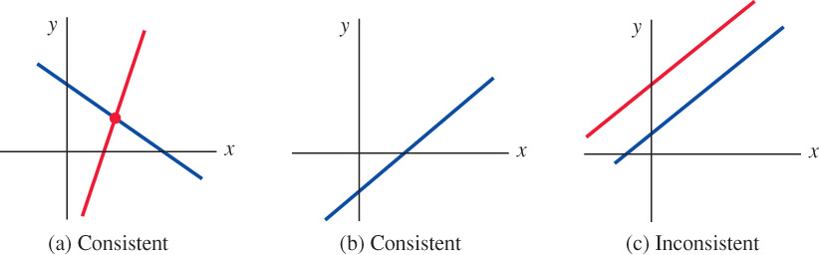
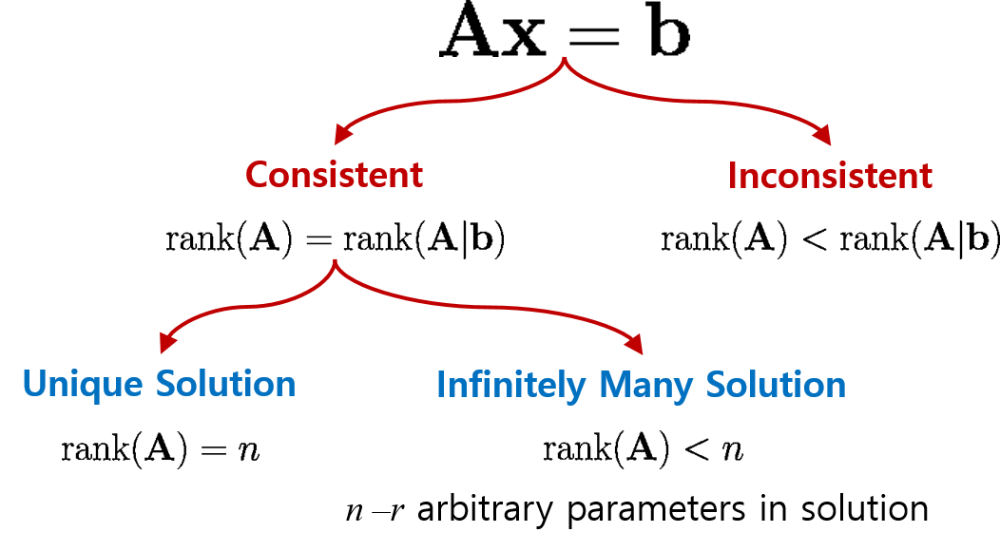

# Matrices {#sec-8}

## Matrix Algebra {#sec-8-1}

* A **matrix** is any rectangular array of numbers or functions

  $$\begin{pmatrix}
    a_{11} & a_{12} & \cdots & a_{1n}\\ 
    a_{21} & a_{22} & \ddots & a_{2n} \\ 
    \vdots & \ddots & \ddots & \vdots \\ 
    a_{m1} & a_{m2} & \cdots & a_{mn}
  \end{pmatrix}$$ 
   
  * The numbers or functions in the array are **entries** or **elements**
  * An $n \times n$ matrix  is a **square** matrix of **order $n$**

* **Column** and **row vectors** are $n \times 1$ and $1 \times n$ matrices

  $$
  \begin{pmatrix}
    a_1\\ 
    a_2\\ 
    \vdots\\ 
    a_n
  \end{pmatrix},\;
  \begin{pmatrix}
    a_1 & a_2 & \cdots & a_n
  \end{pmatrix}  
  $$

* **Equality of Matrices** 

  $$
  \begin{aligned}
   \mathbf{A} = \left(a_{ij}\right)_{m \times n} \; \text{ and } \;&\mathbf{B} = \left(b_{ij}\right)_{m \times n} \;\text{ are equal } \\[5pt]
   \text{ if } a_{ij}=b_{ij} \;&\text{ for each } i \text{ and } j
   \end{aligned}$$

* **Matrix Addition**

  $$\mathbf{A} +\mathbf{B} = \left(a_{ij} +b_{ij}\right)_{m \times n}$$

* **Scalar Multiplication**

  $$k\mathbf{A} = \left(ka_{ij}\right)_{m \times n}$$

* **Properties of Matrix Addition and Scalar Multiplication**

  Suppose $\mathbf{A}$, $\mathbf{B}$, and $\mathbf{C}$ are $m \times n$ matrices and $k_1$ and $k_2$ are scalars. Then

  $$
  \begin{aligned}
    \mathbf{A} +\mathbf{B} &= \mathbf{B} +\mathbf{A} \\ 
    \mathbf{A} +\left(\mathbf{B} +\mathbf{C}\right) &= \left(\mathbf{A} +\mathbf{B}\right) +\mathbf{C} \\
    \left(k_1 k_2\right)\mathbf{A} &= k_1 \left(k_2\mathbf{A}\right) \\
    k_1\left(\mathbf{A} +\mathbf{B}\right)&=k_1\mathbf{A} +k_1\mathbf{B} \\
    \left(k_1 +k_2\right)\mathbf{A} &= k_1 \mathbf{A} +k_2\mathbf{A}  
  \end{aligned}$$

* **Matrix multiplication** 
  
  $$\mathbf{A}\mathbf{B}=\left(\sum_{k=1}^p a_{ik} b_{kj}\right)_{m \times n}$$
  
  where $\mathbf{A}$ is an $m \times p$ matrix, $~\mathbf{B}$ is a $p \times n$ matrix, and
  $~\mathbf{A}\mathbf{B}$ is the $m \times n$ matrix
  
  * In general, $~\mathbf{A}\mathbf{B}\neq\mathbf{B}\mathbf{A}$
  
  * **Associative Law:** $~\mathbf{A}\left(\mathbf{B}\mathbf{C}\right)=\left(\mathbf{A}\mathbf{B}\right)\mathbf{C}$ 
  
  * **Distributive Law:** $~\mathbf{A}\left(\mathbf{B}+\mathbf{C}\right)=\mathbf{A}\mathbf{B} +\mathbf{A}\mathbf{C}$ 

* **Transpose of a Matrix**

$$\mathbf{A}^T =
   {\scriptsize\begin{pmatrix}
     a_{11} & a_{21} & \cdots & a_{m1}\\ 
     a_{12} & a_{22} & \ddots & a_{m2} \\ 
     \vdots & \ddots & \ddots & \vdots \\ 
     a_{1n} & a_{2n} & \cdots & a_{mn}
   \end{pmatrix}}$$

* **Properties of Transpose**

  $$
  \begin{aligned}
     \left(\mathbf{A}^T\right)^T &= \mathbf{A} \\ 
     \left(\mathbf{A} +\mathbf{B}\right)^T 
       &=\mathbf{A}^T +\mathbf{B}^T \\         
     \left(\mathbf{A}\mathbf{B}\right)^T
       &=\mathbf{B}^T\mathbf{A}^T \\ 
     \left(k\mathbf{A}\right)^T
      &=k\mathbf{A}^T
  \end{aligned}$$

* **Special Matrices**

  * In a **zero matrix**, $~$all entries are zeros
  
  * In a **triangular matrix**, $~$all entries above or below the main diagonal are zeros (lower triangular or upper triangular)
  
  * In a **diagonal matrix**, $~$all entries not on the main diagonal are zeros

  * A **scalar matrix** is a diagonal one where all entries on the main diagonal are equal.
    $~$If those entries are $1$'s, it is an **identity matrix**, $\mathbf{I}$ 
    (or $~\mathbf{I}_n$ when there is a need to emphasize the order of the matrix)
    
  * An $n \times n$ matrix $\mathbf{A}$ is **symmetric** $~$if $\mathbf{A}^T=\mathbf{A}$

$~$

**Example** $\,$ 
If $~\mathbf{A}=
   \begin{pmatrix}
     \phantom{-}2 & -3 \\ 
     -5 & \phantom{-}4 
   \end{pmatrix}$ and 
  $~\mathbf{B}=
    \begin{pmatrix}
       -1 & 6 \\ 
       \phantom{-}3 & 2 
    \end{pmatrix}$,
    
find $~$(a) $\mathbf{AB}$, $~$(b) $\mathbf{BA}$, $~$(c) $\mathbf{A}^2$, $~$(d) $\mathbf{B}^2$

$~$

**Example** $\,$ Show that if $\mathbf{A}$ is an $m\times n$ matrix, $~$then $\mathbf{AA}^T$ is symmetric

$~$

**Example** $\,$ In matrix theory, $~$many of the familiar properties of the real number system are not valid. $~$If $a$ and $b$ are real numbers, then $ab=0\;$ implies that $a=0$ or $b=0$. $~$Find two matrices such that $\mathbf{AB}=\mathbf{0}~$ but $\mathbf{A}\neq\mathbf{0}$ and $\mathbf{B}\neq \mathbf{0}$

$~$

**Example** $\,$ Let $\mathbf{A}$ and $\mathbf{B}$ be $n\times n$ matrices. Explain why, in general, the given formula is not valid

$$(\mathbf{A} + \mathbf{B})^2 = \mathbf{A}^2 + 2\mathbf{A}\mathbf{B} +\mathbf{B}^2$$

$~$

**Example** $\,$ Find the resulting vector $\mathbf{b}$ if the given vector $\mathbf{a} = \langle 1, 1 \rangle$ is rotated through the indicated angle
 $\theta=\pi/2$

$~$

**Example** $\,$ Verify that the quadratic form $ax^2 +bxy +cy^2$ is the same as

$$\begin{pmatrix}
      x & y 
    \end{pmatrix}
    \begin{pmatrix}
      a & \frac{1}{2}b \\ 
     \frac{1}{2}b & c 
    \end{pmatrix}
    \begin{pmatrix}
      x \\ y 
\end{pmatrix}$$

$~$

## Systems of Linear Algebraic Equations {#sec-8-2}

* **General Form**

  A system of $m$ linear equations in $n$ unknowns has the general form
  
  $$
  \begin{aligned}
    a_{11} x_1 +a_{12} x_2 + \cdots +a_{1n} x_n 
      & = b_1\\ 
    a_{21} x_1 +a_{22} x_2 + \cdots +a_{2n} x_n 
      & = b_2\\ 
     &\;\, \vdots \\ 
     a_{m1} x_1 +a_{m2} x_2 + \cdots +a_{mn} x_n 
      & = b_m
  \end{aligned}$$

* The **coefficients** of the unknowns can be abbreviated as $a_{ij}$. The numbers $b_1, b_2, \cdots, b_m$ are called the **constants** of the system. 
  If all the constants are zero, the system is said to be **homogeneous**, otherwise it is **nonhomogeneous**
  $$
  \begin{aligned}
    \mathbf{A} 
    &= 
    \begin{pmatrix}
      a_{11} & a_{12} & \cdots & a_{1n} \\ 
      a_{21} & a_{22} & \cdots & a_{2n} \\ 
      \vdots &   & \ddots & \\ 
      a_{m1} & a_{m2} & \cdots & a_{mn} \\ 
    \end{pmatrix}, \;\;
    \mathbf{x} = 
    \begin{pmatrix}
       x_1  \\ x_2 \\ \vdots \\ x_n
    \end{pmatrix}, \;\; 
    \mathbf{b} = 
    \begin{pmatrix}
       b_1 \\ b_2 \\ \vdots \\ b_m
    \end{pmatrix}
  \end{aligned}$$

 $$\mathbf{A} \mathbf{x} = \mathbf{b}$$ 

* A linear system of equations is said to be **consistent** if it has at least one solution and **inconsistent** if it has no solutions. If a linear system is consistent, $~$it has either

  * a unique solution (that is, precisely one solution), or
  * infinitely many solutions

$~$

{width="80%" fig-align="center"}

* **Augmented Matrix**

  $$
  \left(\begin{array}{cccc|c}
    a_{11} & a_{12} & \cdots & a_{1n} & b_1\\ 
    a_{21} & a_{22} & \ddots & a_{2n} & b_2\\ 
    \vdots & \ddots & \ddots & \vdots & \vdots\\ 
    a_{m1} & a_{m2} & \cdots & a_{mn} & b_m
  \end{array}\right)$$

* A system can be solved with **elementary operations** (**row reduction** for matrices)
  on an augmented matrix
  
| Elementary Operations | Meaning |
|:--------|:----------------------------|
| $R_{ij}$        | Interchange rows $i$ and $j$                       |
| $cR_{i}$        | Multiply the row $i$ by the nonzero constant $c$   | 
| $cR_{i}+R_{j}$  | Multiply the row $i$ by $c$ and add to the row $j$ |

$~$

* In the **Gaussian elimination**, $~$ we row-reduce the augmented matrix until we arrive 
  at a row-equivalent augmented matrix in **row-echelon form**
  
  * The first nonzero entry in a nonzero row is a $1$

  * In consecutive nonzero rows, $~$the first entry $1$ in the lower row appears to the right of the $1$ in the higher row
  
  * Rows consisting of all zeros are at the bottom of the matrix

$~$

**Example** $\,$ Solve
  
$$\begin{pmatrix}
    2 & 6 & \phantom{-}1\\ 
    1 & 2 & -1\\ 
    5 & 7 & -4
  \end{pmatrix}
  \begin{pmatrix}
    x_1\\ 
    x_2\\ 
    x_3
  \end{pmatrix}=
  \begin{pmatrix}
    \phantom{-}7\\ 
    -1\\ 
    \phantom{-}9
  \end{pmatrix}$$

$~$  

Using row operations on the augmented matrix, $~$ we obtain
  
$${\scriptsize
  \left(\begin{array}{rrr|r}
    2 & 6 &  1 & 7\\ 
    1 & 2 & -1 & -1\\ 
    5 & 7 & -4 & 9
  \end{array}\right) 
  \overset{ R_{12}}{\Longrightarrow}}
  {\scriptsize
  \left(\begin{array}{rrr|r}
    1 & 2 & -1 & -1\\   
    2 & 6 &  1 & 7\\ 
    5 & 7 & -4 & 9
  \end{array}\right)
  \overset{\begin{matrix} -2R_1 +R_2 \\ -5R_1 +R_3 \end{matrix}}{\Longrightarrow}
  \left(\begin{array}{rrr|r}
    1 & 2 & -1 & -1\\   
    0 & 2 &  3 & 9\\ 
    0 & -3 & 1 & 14
  \end{array}\right)}$$
  
$${\scriptsize
  \overset{\frac{1}{2}R_2}{\Longrightarrow}
  \left(\begin{array}{rrr|r}
    1 & 2 & -1 & -1\\   
    0 & 1 &  \frac{3}{2} & \frac{9}{2} \\
    0 & -3 & 1 & 14
  \end{array}\right)
  \overset{ 3R_2 +R_3}{\Longrightarrow}
  \left(\begin{array}{rrr|r}
    1 & 2 & -1 & -1\\   
    0 & 1 &  \frac{3}{2} & \frac{9}{2} \\
    0 & 0 & \;\frac{11}{2} & \;\frac{55}{2}
  \end{array}\right)}$$
$${\scriptsize\overset{\frac{2}{11}R_3}{\Longrightarrow}
  \left(\begin{array}{rrr|r}
    1 & 2 & -1 & -1\\   
    0 & 1 &  \frac{3}{2} & \frac{9}{2} \\
    0 & 0 & 1 & 5
  \end{array}\right)}$$

The last matrix is in row-echelon form. $~$We can make the last matrix above to be in reduced row-echelon form

$${\scriptsize
  \left(\begin{array}{rrr|r}
    1 & 2 & -1 & -1\\   
    0 & 1 &  \frac{3}{2} & \frac{9}{2} \\
    0 & 0 & 1 & 5
  \end{array}\right)  
  \overset{ -2R_2 +R_1}{\Longrightarrow}
  \left(\begin{array}{rrr|r}
    1 & 0 & -4 & -10\\   
    0 & 1 &  \frac{3}{2} & \frac{9}{2} \\
    0 & 0 & 1 & 5
  \end{array}\right)   
  \overset{\begin{matrix}
           -4R_3 +R_1 \\
          -\frac{3}{2}R_3 +R_2 
           \end{matrix}}{\Longrightarrow}
  \left(\begin{array}{rrr|r}
    1 & 0 & 0 & 10\\   
    0 & 1 & 0 & -3 \\
    0 & 0 & 1 & 5
  \end{array}\right)}$$
  
We see that the solution is $x_1=10$, $~x_2=-3$, $~x_3=5$

$~$

**Example** $\,$ Solve
  
$$
  \left(\begin{array}{rrr}
    1 & 3 & -2\\ 
    4 & 1 & 3\\ 
    2 & -5 & 7
  \end{array}\right) 
  \begin{pmatrix}
    x_1\\ 
    x_2\\ 
    x_3
  \end{pmatrix}=
 \left(\begin{array}{r}
    -7\\ 
     5\\ 
    19
  \end{array}\right)$$

$~$

Using row operations on the augmented matrix, we obtain
  
$${\scriptsize
  \left(\begin{array}{rrr|r}
    1 & 3 & -2 & -7\\ 
    4 & 1 &  3 & 5\\ 
    2 & -5 & 7 & 19
  \end{array}\right) 
  \overset{\begin{matrix}
           -4R_1 +R_2 \\
           -2R_1 +R_3 
           \end{matrix}}
  {\Longrightarrow}
  \left(\begin{array}{rrr|r}
    1 & 3 & -2 & -7\\ 
    0 & -11 & 11 & 33\\ 
    0 & -11 & 11 & 33
  \end{array}\right) 
  \overset{\begin{matrix}
           -R_2 +R_3 \\
           -\frac{1}{11}R_2 
           \end{matrix}}
  {\Longrightarrow}
  \left(\begin{array}{rr|r|r}
    1 & 3 & -2 & -7\\ 
    0 & 1 & -1 & -3\\ \hline
    0 & 0 & 0 & {\color{Red}0 }
  \end{array}\right)}$$

In this case, $~$the last matrix implies that the original system of three equations is really equivalent to two equations
  
$${
  \overset{-3R_2 +R_1}
  {\Longrightarrow}
  \left(\begin{array}{rr|r|r}
    1 & 0 & 1 & 2\\ 
    0 & 1 & -1 & -3\\ 
    \hline
    0 & 0 & 0 & 0
  \end{array}\right)}$$
  
If we let $x_3=t$, $x_1=-t +2$ and $x_2=t -3$, $~$then we see that the system has infinitely many solutions

$~$

**Example** $\,$ Solve
  
$$
  \left(\begin{array}{rr}
    1 & 1 \\ 
    4 & -1 \\ 
    2 & -3
  \end{array}\right) 
  \begin{pmatrix}
    x_1\\ 
    x_2
  \end{pmatrix}=
 \left(\begin{array}{r}
    1\\ 
   -6\\ 
    8
  \end{array}\right)$$

$~$

Using row operations on the augmented matrix, $~$we obtain
  
$${\scriptsize
  \left(\begin{array}{rr|r}
    1 & 1 & 1\\ 
    4 & -1 & -6\\ 
    2 & -3 & 8
  \end{array}\right) 
  \overset{\begin{matrix}
           -4R_1 +R_2 \\ 
           -2R_1 +R_3 
           \end{matrix}}
  {\Longrightarrow}
  \left(\begin{array}{rr|r}
    1 & 1 & 1\\ 
    0 & -5 & -10\\ 
    0 & -5 & 6
  \end{array}\right) 
  \overset{\begin{matrix}
           -R_2 +R_3 \\ 
           -\frac{1}{5}R_2 
           \end{matrix}}
  {\Longrightarrow}
  \left(\begin{array}{rr|r}
    1 & 1 & 1\\ 
    0 & 1 & 2\\ \hline
    0 & 0 & {\color{Red}{16}}
  \end{array}\right)}$$
  
The system has no solution

$~$

* A **homogeneous system** of linear equations is **always consistent**. The solution consisting of all zeros is called the **trivial solution**. A homogeneous system either possesses only the trivial solution or possesses the trivial solution along with infinitely many nontrivial solutions

* **A homogeneous system possesses nontrivial solutions if the number $m$ of equations is less than the number $n$ of unknowns $(m<n)$**

$~$

**Example** $\,$ Find the positive integers $x_1$, $x_2$, $x_3$, and $x_4$ so that

$$x_1 \mathrm{C_2H_6} +x_2 \mathrm{O_2} \rightarrow x_3 \mathrm{CO_2} +x_4 \mathrm{H_2O}$$

Because the number of atoms of each element must be the same on each side of the last equation, $~$we have:

| Atom       |                      |
|   -------- | :------------------- |
|$\mathrm{C}$ |$2x_1=x_3$           |
|$\mathrm{H}$ |$6x_1=2x_4$          |
|$\mathrm{O}$ |$2x_2=2x_3 +x_4$     |

$${\scriptsize
  \left(\begin{array}{rrrr|r}
    2 & 0 & -1 &  0 & 0\\   
    6 & 0 &  0 & -2 & 0\\
    0 & 2 & -2 & -1 & 0
  \end{array}\right)
  \overset{\begin{matrix}
             R_{12} \\ 
             R_{23} 
           \end{matrix}}{\Longrightarrow}
  \left(\begin{array}{rrrr|r}
    6 & 0 &  0 & -2 & 0\\
    0 & 2 & -2 & -1 & 0\\
    2 & 0 & -1 &  0 & 0  
  \end{array}\right) 
  \overset{\;\,\text{ row } \\ \text{operations}}{\Longrightarrow}
  \left(\begin{array}{rrr|r|r} 
    1 & 0 & 0 & -\frac{1}{3} & 0\\   
    0 & 1 & 0 & -\frac{7}{6} & 0\\
    0 & 0 & 1 & -\frac{2}{3} & 0
  \end{array}\right)}$$

Then when we let  $x_4=t$, $~x_1=\frac{1}{3}t$, $x_2=\frac{7}{6}t$, $x_3=\frac{2}{3}t$. $\,$ If we pick $t=6$, $\,x_1=2$, $\,x_2=7$, $\,x_3=4$, $\,x_4=6$

$~$

**Example** $\,$ Use either Gaussian elimination or Gauss-Jordan elimination to solve the given system or show that no solution exists

$$
\begin{aligned}
   x_1 - x_2 &= 11\\ 
   4x_1 +3x_2 &=-5 
\end{aligned}$$

$$
\begin{aligned}
   9x_1 +3x_2 &= -5\\ 
   2x_1 +x_2 &= -1 
\end{aligned}$$

$$
\begin{aligned}
    x_1 -x_2 -x_3 &= -3\\ 
    2x_1 +3x_2 +5x_3 &= 7\\
    x_1 -2x_2 +3x_3 &=-11 
\end{aligned}$$

$$
\begin{aligned}
    x_1 +x_2 +x_3 &= 0\\ 
    x_1 +x_2 +3x_3 &=0 
\end{aligned}$$

$$
\begin{aligned}
    &x_1 -x_2 -x_3 = 8\\ 
    &x_1 -x_2 +x_3 = 3\\
    -&x_1 +x_2 +x_3 = 4 
\end{aligned}$$

$~$

**Example** $\,$ Balance the given chemical equation:
  
$$\mathrm{C}_5\mathrm{H}_8 +\mathrm{O}_2 \rightarrow \mathrm{CO}_2 + \mathrm{H}_2\mathrm{O}$$

$$\mathrm{Cu} + \mathrm{HNO}_3 \rightarrow \mathrm{Cu(NO}_3\mathrm{)}_2 + \mathrm{H}_2\mathrm{O} +\mathrm{NO}$$

$~$

**Example** $\,$ Compute the given product for an arbitrary $~3 \times 3$ matrix $\mathbf{A}$

$$\begin{pmatrix}
 0 & 1 & 0\\ 
 1 & 0 & 0\\ 
 0 & 0 & 1
\end{pmatrix}
\begin{pmatrix}
 1 & 0 & 0\\ 
 0 & 1 & 0\\ 
 0 & c & 1
\end{pmatrix} \mathbf{A}$$

$~$

## Rank of a Matrix {#sec-8-3}

* The **rank** of an $m \times n$ matrix $\mathbf{A}$, $~\mathrm{rank}(\mathbf{A})$, $\,$ is 
  **the maximum number of linearly independent row vectors**. If a matrix $\mathbf{A}$ is now equivalent to
  a row-echelon form $\mathbf{B}$, $~$then

  * the row space of $\mathbf{A}$ = the row space of $\mathbf{B}$
  * the nonezero rows of $\mathbf{B}$ form a basis for the row space of $\mathbf{A}$, $~$and
  * $\mathrm{rank}(\mathbf{A})$ = the number of nonzero rows in $\mathbf{B}$

* **Consistency of** $~\mathbf{A}\mathbf{x}=\mathbf{b}$

  * A linear system of equations $\mathbf{A}\mathbf{x}=\mathbf{b}$ is consistent if and only if $~\mathrm{rank}(\mathbf{A})=\mathrm{rank}(\mathbf{A}|\mathbf{b})$

  * Suppose a linear system $\mathbf{A}\mathbf{x}=\mathbf{b}$ with $m$ equations and $n$ unknowns is consistent.
  $~$If $\mathrm{rank}(\mathbf{A})=r\leq n$, then the solution of the system contains $n -r$ parameters. This means that we have the unique solution when $r=n$

$${\scriptsize
  \left(\begin{array}{cccc|c}
    a_{11} & a_{12} & \cdots & a_{1n} & b_1\\ 
    a_{21} & a_{22} & \ddots & a_{2n} & b_2\\ 
    \vdots & \ddots & \ddots & \vdots & \vdots\\ 
    a_{m1} & a_{m2} & \cdots & a_{mn} & b_m
  \end{array}\right)
  \overset{\text{row operations}}{\Longrightarrow}} \\ 
  {\scriptsize
  \left(\begin{array}{cccc|ccc|c}
    1      & a_{12}' & \cdots & a_{1{\color{red}r}}'& a_{1r+1}' & \cdots   & a_{1n}' & b_1' \\ 
    0      & 1       & \ddots & \vdots & a_{2r+1}' & \ddots   & a_{2n}' & b_2' \\
    \vdots & \ddots  & \ddots & \vdots & \vdots    & \ddots   & \vdots  & \vdots \\    
    0      & \cdots  & 0      & 1      & a_{{\color{red}r}r+1}' & \cdots   & a_{rn}' & b_r' \\ \hline     
    0      & 0       & 0      & 0      & 0         & 0        & 0       & {\color{red} 0} \\
    \vdots & \vdots  & \vdots & \vdots & \vdots    & \vdots   & \vdots  & {\color{red} \vdots} \\    
    0      & 0       & 0      & 0      & 0         & 0        & 0       & {\color{red} 0}    
  \end{array}\right)}$$

{width="60%" fig-align="center"}
