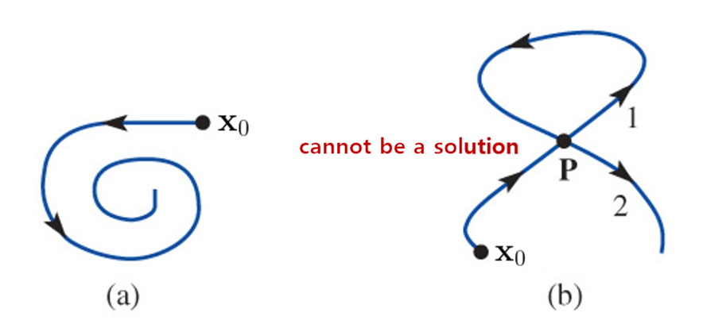
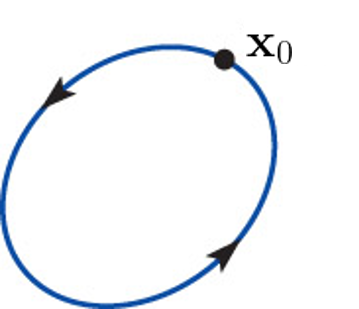
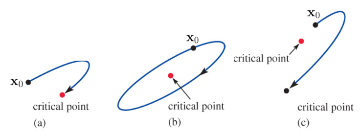
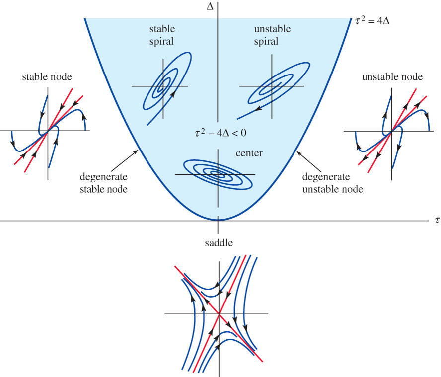

# Systems of Nonlinear Differential Equations  {#sec-11}
## Autonomous Systems  {#sec-11-1}

A system of first-order differential equations is called **autonomous** when the system can be written in the form

$$
    \begin{aligned}
    \frac{dx_1}{dt} &=g_1(x_1,x_2,\cdots,x_n) \\ 
    \frac{dx_2}{dt} &=g_2(x_1,x_2,\cdots,x_n) \\ 
        & \;\vdots \\ 
    \frac{dx_n}{dt} &=g_n(x_1,x_2,\cdots,x_n)
    \end{aligned}
$$

  Notice that the independent variable $t$ does not appear explicitly on the right-hand side of each differential equation

* **Second-Order DE as a System**

  Any second-order differential equation $x''=g(x,x')$ can be written as an autonomous system. 
  If we let $y=x'$, the second-order differential equation becomes the system of two first-order equations
  
    $$
    \begin{aligned}
        x' &= y\\ 
        y' &= g(x,y) 
    \end{aligned}
    $$

**Example** $~$ The displacement angle $\theta$ for a pendulum satisfies the nonlinear second-order
  differential equation
  
  $$\frac{d^2 \theta}{dt^2} +\frac{g}{l}\sin\theta=0$$
  
  If we let $x=\theta$ and $y=\dot{\theta}$, $~$ this second-order differential equation can be written as the autonomous system
  
  $$\dot{x} = y,\;\; \dot{y} = -\frac{g}{l}\sin x$$

* **Plane Autonomous System**
  
  When $n=2$, the system is called a <font color="blue">**plane autonomous system**</font>, and we write the system as
  
  $$
  \begin{aligned}
     \frac{dx}{dt} &= P(x,y)\\ 
     \frac{dy}{dt} &= Q(x,y)
  \end{aligned}
  $$
  
  If $P$, $Q$, and the first-order partial derivatives $\partial P/\partial x$,
  $\partial P/\partial y$, $\partial Q/\partial x$, and $\partial Q/\partial y$ are continuous in a
  region $R$ of the plane, then a solution to the plane autonomous system that satisfies 
  $\mathbf{x}(0)=\mathbf{x}_0$ is unique and one of three basic types:

  * A **constant solution**, $\mathbf{x}(t)=\mathbf{x}_0$ for all $t$. A constant solution is called a **critical** or **stationary point**
    
    $$\begin{aligned}
       P(x,y) &= 0 \\ 
       Q(x,y) &= 0
     \end{aligned}$$
    
     Note that since $\mathbf{x}'=\mathbf{0}$, a critical point is a solution of the system of algebraic equations
    
  * An **arc**, $\mathbf{x}(t)$ - a plane curve that does not cross itself
    
    {width="75%" fig-align="center"}
    
  * A **periodic solution** or **cycle**, $\mathbf{x}(t +p)=\mathbf{x}(t)$
    
    {width="25%" fig-align="center"}
    
 **Example** $~$Find all criticl points of the following plane autonomous system

$$
\begin{aligned}
 x'&= x^2 +y^2 -6\\ 
 y'&= x^2 -y 
\end{aligned}$$

## Stability of Linear Systems {#sec-11-2}

If $\mathbf{x}_1$ is a critical point of a plane autonomous system and $\mathbf{x}=\mathbf{x}(t)$ is a solution
satisfying $\mathbf{x}(0)=\mathbf{x}_0$, when $\mathbf{x}_0$ is placed near $\mathbf{x}_1$

{width="85%" fig-align="center"}

(@) It may return to the critical point 
(@) It may remain close to the critical point without returning
(@) It may move away from the critical point

* **Stability Analysis**

  * A careful geometric analysis of the solutions to the *linear* plane autonomous system
  
    $$
    \begin{aligned}
       x'&= ax +by\\ 
       y'&= cx +dy
    \end{aligned}
     $$
  
    in terms of the eigenvalues and eigenvectors of the coefficient matrix
  
    $$\mathbf{A}=
    \begin{pmatrix}
     a & b\\ 
     c & d
    \end{pmatrix}
     $$
   
    drives the stabilty analysis

  * To ensure that $\mathbf{x}_0=(0,\,0)$ is the only critical point, we will assume that the determinant $\Delta = ad -bc \neq 0$. If $\tau = a + d$ is the trace of matrix $\mathbf{A}$,
  then the characteristic equation, $\mathrm{det}(\mathbf{A} -\lambda\mathbf{I})=0,$ can be rewritten as
  
    $$\lambda^2 -\tau\lambda +\Delta =0$$
  
    Therefore the eigenvalues of $\mathbf{A}$ are 
  
    $$\lambda =\frac{\tau \pm \sqrt{\tau^2 -4\Delta}}{2}$$
  
    and the usual three cases for these roots occur according to whether $\tau^2 -4\Delta$ is positive, negative, or zero

**Example** $~$ Find the eigenvalues of the linear system

$$
    \begin{aligned}
       x'&= -x +y\\ 
       y'&= cx -y
    \end{aligned}
$$
 
in terms of $c$, and use a numerical solver to discover the shapes of solutions corresponding to the cases
$c=\frac{1}{4}$, $4$, $0$, and $-9$. $\mathbf{A}$ has trace $\tau=-2$ and determinant $\Delta=1 -c$, 
and so the eigenvalues are

$$ \lambda =-1 \pm \sqrt{c} $$
 
The nature of the eigenvalues is therefore determined by the value of $c$

```{python}
import numpy as np
import sympy as sp

c = sp.Symbol('c')
A = sp.Matrix([[-1, 1], [c, -1]])
A.eigenvects()
```

```{python}
import matplotlib.pyplot as plt
sp.init_printing(use_unicode=True)

w = 1
xp = np.linspace(-w, w, 50)
yp = np.linspace(-w, w, 50)
x, y = np.meshgrid(xp, yp)

c_ = np.array([1/4, 4, 0, -9])
c_title = [r'$c=\frac{1}{4}$', r'$c=4$', r'$c=0$', r'$c=-9$']

fig = plt.figure(figsize=(6, 6))

for i in range(4):
    
    ax = fig.add_subplot(2, 2, i +1)

    xdot = -x +y
    ydot = c_[i]*x -y
    
    if c_[i] >= 0.0:
        y_1 = -np.sqrt(c_[i]) *xp
        y_2 = np.sqrt(c_[i]) *xp
        ax.plot(xp, y_1, 'r:', xp, y_2, 'g:')    
    ax.streamplot(x, y, xdot, ydot, color='blue')

    ax.set_title(f'{c_title[i]}')

    ax.axis((-w, w, -w, w))
    ax.set_aspect(aspect='equal')
    ax.grid()
    
    ax.tick_params(axis='both', direction='in', 
        labelsize=8)     
    ax.xaxis.set_ticks(np.linspace(-w, w, 5))
    ax.yaxis.set_ticks(np.linspace(-w, w, 5))
    
    if i >= 2: 
        ax.set_xlabel(r'$x$')
    if i == 0 or i == 2: 
        ax.set_ylabel(r'$y$')
```

* <font color="red">Trajectory behaviors in phase portraits can be explained with eigenvalue-eigenvector of $\mathbf{A}$</font>

* **Real Distinct Eigenvalues**, $\tau^2 -4\Delta > 0$

  $$
    \begin{aligned}
        \mathbf{x}(t) &= c_1\mathbf{k}_1 e^{\lambda_1 t} +c_2\mathbf{k}_2 e^{\lambda_2 t}\\ 
        &\;\big\Downarrow \;{\scriptstyle \lambda_1 >\lambda_2}\\ 
        &= e^{\lambda_1 t} \left[c_1\mathbf{k}_1 +c_2\mathbf{k}_2 e^{(\lambda_2 -\lambda_1)t} \right ] \\
        &\;\big\Downarrow \;\,{\scriptstyle t \to \infty}\\
        &\simeq c_1\mathbf{k}_1 e^{\lambda_1 t}
    \end{aligned}
  $$

    * **Both eigenvalues negative**, $\tau^2 -4\Delta > 0$, $\tau<0$, $\Delta>0$
    
        **Stable Node:** Since both eigenvalues are negative, it follows that 
        $\lim_{t \to \infty} \mathbf{x}(t)=\mathbf{0}$ in the direction of $\mathbf{k}_1$ when $c_1 \neq 0$ or
        in the direction of $\mathbf{k}_2$ when $c_1=0$
        
    * **Both eigenvalues positive**, $\tau^2 -4\Delta > 0$, $\tau>0$, $\Delta>0$
    
        **Unstable Node:** $\mathbf{x}(t)$ becomes unbounded in the direction of 
        $\mathbf{k}_1$ when $c_1 \neq 0$ or in the direction of $\mathbf{k}_2$ when $c_1=0$ 
    
    * **Eigenvalues have opposite signs**, $\tau^2 -4\Delta > 0$, $\Delta<0$
    
        **Saddle Point:** When $c_1=0$, $\mathbf{x}(t)$ will approach $\mathbf{0}$ along the line determined by 
        $\mathbf{k}_2$. If $\mathbf{x}(0)$ does not lie on the line determined by $\mathbf{k}_2$, the direction
        determined by $\mathbf{k}_1$ serves as an asymtote for $\mathbf{x}(t)$ 

**Example** $~$ Classify the critical point $(0,0)$ of each of the following linear system 
$\mathbf{x}'=\mathbf{A}\mathbf{x}$ as either a stable node, an unstable node, or a saddle point

<center> 
 $(\text{a})$ $\begin{pmatrix} -2 & -2\\ -2 & -5 \end{pmatrix}$, $\;$
 $(\text{b})$ $\begin{pmatrix} -1 & -2\\ \;\;3 & \;\;4 \end{pmatrix}$, $\;$
 $(\text{c})$ $\begin{pmatrix} 2 & -1\\ 3 & -2 \end{pmatrix}$
 </center>

```{python}
import numpy as np

w = 1
xp = np.linspace(-w, w, 6)
yp = np.linspace(-w, w, 6)
x, y = np.meshgrid(xp, yp)

A = np.array([[[-2, -2], [-2, -5]], 
              [[-1, -2], [3, 4]], 
              [[2, -1], [3, -2]]])
A_title = ['Stable Node', 'Unstable Node', 'Saddle Point']

fig = plt.figure(figsize=(4, 12))

for i in range(3):
    xdot = A[i,0,0]*x +A[i,0,1]*y
    ydot = A[i,1,0]*x +A[i,1,1]*y

    lamda, v = np.linalg.eig(A[i])

    if lamda[0] >= lamda[1]:
        y_1 = v[1,0]/v[0,0]*xp
        y_2 = v[1,1]/v[0,1]*xp
    else:
        y_1 = v[1,1]/v[0,1]*xp
        y_2 = v[1,0]/v[0,0]*xp       

    ax = fig.add_subplot(3, 1, i +1)
    
    ax.plot(xp, y_1, 'r:', xp, y_2, 'g:')    
    ax.streamplot(x, y, xdot, ydot, color='blue')

    ax.set_title(A_title[i])

    ax.axis((-w, w, -w, w))
    ax.set_aspect(aspect='equal')
    ax.grid()
    
    ax.tick_params(axis='both', direction='in', pad=5)     
    ax.xaxis.set_ticks(np.linspace(-w, w, 5))
    ax.set_ylabel(r'$y$')
    
    ax.yaxis.set_ticks(np.linspace(-w, w, 5))
    if i == 2:
        ax.set_xlabel(r'$x$')
```

* **A Repeated Real Eigenvalue**, $\tau^2 -4\Delta = 0$

  The general solution takes on one of two different forms depending on whether **one** or **two** linearly independent eigenvectors can be found for the repeated eigenvalues $\lambda_1$

  * **Two linearly independent eigenvectors**

    If $\mathbf{k}_1$ and $\mathbf{k}_2$ are two linearly independent eigenvectors corresponding to $\lambda_1$,
  then the general solution is given by
  
    $$\mathbf{x}(t)=c_1\mathbf{k}_1 e^{\lambda_1 t} +c_2\mathbf{k}_2 e^{\lambda_1 t}=
    \left(c_1\mathbf{k}_1 + c_2\mathbf{k}_2 \right) e^{\lambda_1 t}$$
   
    If $\lambda_1<0$, the $\mathbf{x}(t)$ approaches $\mathbf{0}$ along the line determined by the vector
    $c_1\mathbf{k}_1 + c_2\mathbf{k}_2$ and the critical point is a **degenerate stable node**. The arrows are reversed when $\lambda_1>0$, and the critical point is a **degenerate unstable node**

  * **A single linearly independent eigenvectors**
  
    When only a single linearly independent eigenvector $\mathbf{k}_{11}$ exists, the general solution is   given by
  
    $$\begin{aligned}
     \mathbf{x}(t)&=c_1\mathbf{k}_{11} e^{\lambda_1 t} +c_2\left(\mathbf{k}_{11} te^{\lambda_1 t} 
            +\mathbf{k}_{12} e^{\lambda_1 t}\right)\\
         &=te^{\lambda_1 t}\left[c_2 \mathbf{k}_{11} +\frac{1}{t} \left(c_1\mathbf{k}_{11} 
            +c_2\mathbf{k}_{12}\right) \right]
    \end{aligned}$$
    
    where $(\mathbf{A} -\lambda_1\mathbf{I})\mathbf{k}_{12}=\mathbf{k}_{11}$. If $\lambda_1<0$, then $\lim_{t \to \infty} te^{\lambda_1 t}=0$ and it follows that $\mathbf{x}(t)$ approaches $\mathbf{0}$ in the line determined by $\mathbf{k}_{11}$. The critical point is again a **degenerate stable node**. When $\lambda_1>0$, $\mathbf{x}(t)$ becomes unbounded as $t$ increases, and the critical point is a **degenerate unstable node**

**Example** $~$ Classify the critical point $(0,0)$ of each of the following linear system $\mathbf{x}'=\mathbf{A}\mathbf{x}$ 

<center>
$(\text{a})$ $\begin{pmatrix} 1 & 0\\ 0 & 1 \end{pmatrix}$, $\;$
$(\text{b})$ $\begin{pmatrix} 3 & -18\\ 2 &\; -9 \end{pmatrix}$, $\;$
$(\text{c})$ $\begin{pmatrix} \;\;2 & 4\\ -1 & 6 \end{pmatrix}$
</center>

```{python}
w = 1
xp = np.linspace(-w, w, 6)
yp = np.linspace(-w, w, 6)
x, y = np.meshgrid(xp, yp)

A = np.array([[[1, 0], [0, 1]], 
              [[3, -18], [2, -9]], 
              [[2, 4], [-1, 6]]])
A_title = ['Degenerate Unstable', 
           'Degenerate Stable', 
           'Degenerate Unstable']

fig = plt.figure(figsize=(4, 12))

for i in range(3):
   
    xdot = A[i,0,0]*x +A[i,0,1]*y
    ydot = A[i,1,0]*x +A[i,1,1]*y

    lamda, v = np.linalg.eig(A[i])

    ax = fig.add_subplot(3, 1, i +1)

    if i != 0:
        y_1 = v[1,0] /v[0,0] *xp
        ax.plot(xp, y_1, 'r:')
            
    ax.streamplot(x, y, xdot, ydot, color='blue')

    ax.set_title(A_title[i])

    ax.axis((-w, w, -w, w))
    ax.set_aspect(aspect='equal')
    ax.grid()
    
    ax.tick_params(axis='both', direction='in', pad=5)     
    ax.xaxis.set_ticks(np.linspace(-w, w, 5))
    ax.set_ylabel(r'$y$')
    
    ax.yaxis.set_ticks(np.linspace(-w, w, 5))
    if i == 2: ax.set_xlabel(r'$x$')           
```

* **Complex Eigenvalues**, $\tau^2 -4\Delta < 0$

  If $\lambda_1=\alpha +i\beta$ and $\bar{\lambda}_1$ are the complex eigenvalues and $\mathbf{k}_1=\mathbf{b}_1 +i\mathbf{b}_2$ is a complex eigenvector corresponding to $\lambda_1$, the general solution can be written as $\mathbf{x}=c_1\mathbf{x}_1 +c_2\mathbf{x}_2$

  $$
  \begin{aligned}
    \mathbf{x}_1(t) &=e^{\alpha t}\left(\mathbf{b}_1\cos\beta t -\mathbf{b}_2\sin\beta t\right) \\ 
   \mathbf{x}_2(t) &=e^{\alpha t}\left(\mathbf{b}_2\cos\beta t +\mathbf{b}_1\sin\beta t\right)
   \end{aligned}$$
 
  * **Pure imaginary roots**, $\tau^2 -4\Delta < 0$, $~\tau=0$

    **Center:** When $\alpha=0$, all solutions are ellipses with center at the origin and are periodic   with period $p=2\pi/\beta$. The critical point is called a **center**
  
  * **Nonezero real part**, $\tau^2 -4\Delta < 0$, $~\tau\neq 0$

    **Spiral Point:** When $\alpha<0$, $e^{\alpha t}\to 0$, and the elliptical-like solution spirals closer
  and closer to the origin. The critical point is called a **stable spiral point**. When $\alpha>0$, the 
  effect is the opposite. An elliptical-like solution is driven farther and farther from the origin, and the critical point is now called an **unstable spiral point**

**Example** $~$ Classify the critical point $(0,0)$ of each of the following linear system 
$\mathbf{x}'=\mathbf{A}\mathbf{x}$ 

<center>
$(\text{a})$ $\begin{pmatrix} -1 & 2\\ -1 & 1 \end{pmatrix}$,$\;$
$(\text{b})$ $\begin{pmatrix} -1 & -4\\ \;\;1 & -1 \end{pmatrix}$
</center>

```{python}
w = 1
xp = np.linspace(-w, w, 6)
yp = np.linspace(-w, w, 6)
x, y = np.meshgrid(xp, yp)

A = np.array([[[-1, 2], [-1, 1]],
              [[-1, -4], [1, -1]]])
A_title = ['Center', 'Stable Spiral']

fig = plt.figure(figsize=(4, 8))

for i in range(2):

    ax = fig.add_subplot(2, 1, i +1)
    
    xdot = A[i,0,0]*x +A[i,0,1]*y
    ydot = A[i,1,0]*x +A[i,1,1]*y

    lamda, v = np.linalg.eig(A[i])
            
    ax.streamplot(x, y, xdot, ydot, color='blue')

    ax.set_title(A_title[i])

    ax.axis((-w, w, -w, w))
    ax.set_aspect(aspect='equal')
    ax.grid()
    
    ax.tick_params(axis='both', direction='in', pad=5)     
    ax.xaxis.set_ticks(np.linspace(-w, w, 5))
    ax.set_ylabel(r'$y$')
    
    ax.yaxis.set_ticks(np.linspace(-w, w, 5))
    if i == 1: ax.set_xlabel(r'$x$')
```

{width="75%" fig-align="center"}

For a linear plane autonomous system $\mathbf{x}'=\mathbf{A}\mathbf{x}$ with $\mathrm{det}\,\mathbf{A}\neq 0$,
let $\mathbf{x}$ denote the solution that satisfies the initial condition $\mathbf{x}(0)=\mathbf{x}_0$, where
$\mathbf{x}_0\neq\mathbf{0}$

1. $\lim_{t \to \infty}\mathbf{x}(t)=\mathbf{0}$ if and only if the eigenvalues of $\mathbf{A}$ have negative
   real parts. This will occur when $\Delta>0$ and $\tau<0$
1. $\mathbf{x}(t)$ is periodic if and only if the eigenvalues of $\mathbf{A}$ are pure imaginary. This will
   occur when $\Delta>0$ and $\tau=0$
1. In all other cases, given any neighborhood of the origin, there is at least one $\mathbf{x}_0$ in the neighborhood for which $\mathbf{x}(t)$ becomes unbounded as $t$ increases

## Linearization and Local Stability {#sec-11-3}

Here we will use linearization as a means of analyzing nonlinear DEs and nonlinear systems; the idea is to replace them by linear DEs and linear systems. Let $\mathbf{x}_1$ be a critical point of an autonomous system, and let $\mathbf{x}=\mathbf{x}(t)$ denote the solution that satisfies the initial condition $\mathbf{x}(0)=\mathbf{x}_0$, where $\mathbf{x}\neq\mathbf{x}_1$.

* $\mathbf{x}_1$ is a **stable critical point**
  
  when, given any $\rho > 0$, there is a $r>0$ such that if $\mathbf{x}_0$ satisfies $|\mathbf{x}_0 -\mathbf{x}_1|<r$, then $\mathbf{x}(t)$ satisfies $|\mathbf{x}(t) -\mathbf{x}_1|<\rho$ $\,$ for all $t>0$. If, in addition, 
  $\lim_{t \to \infty} \mathbf{x}(t)=\mathbf{x}_1$ whenever $|\mathbf{x}_0 -\mathbf{x}_1|<r$, we call
  $\mathbf{x}_1$ an **asymptotically stable critical point**
  
* $\mathbf{x}_1$ is a **unstable critical point**

  if there is $\rho>0$ with the property that, for any $r>0$, there is at least one $\mathbf{x}_0$ that
  satisfies $|\mathbf{x}_0 -\mathbf{x}_1|<r$, yet the corresponding solution $\mathbf{x}(t)$ satisfies 
  $|\mathbf{x}(t) -\mathbf{x}_1|\geq\rho$ $\,$ for at least one $t>0$