# Hyperbolic Partial Differential Equations {#sec-x2}

## The One-dimensional Wave Equation {#sec-x2-18}

We will now begin to study the second major class of PDEs, $\,$<font color="red">**hyperbolic equations**</font>

* **Vibrating-String Problem**

  We consider the small vibrations of a string that is fastened at each end

  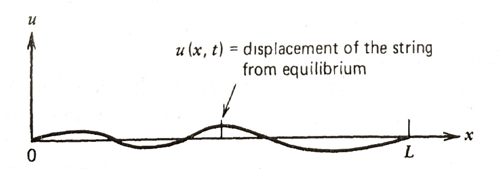{width="80%" fig-align="center"}

* To mathematically describe the vibrations of this string, $\,$we consider all the forces acting on a small section $\Delta x$ of the string 

  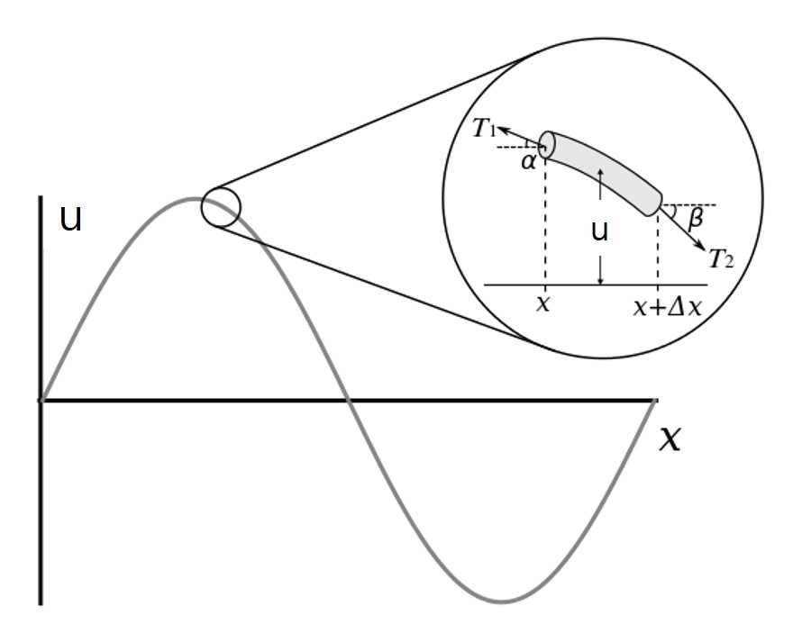{width="70%" fig-align="center"}

  If the horizontal component of tension is constant $T$, $\,$then the tension acting on each side of the string segment is given by

  $$
  \begin{aligned}
    T_1 \cos\alpha &\approx T \\ 
    T_2 \cos\beta &\approx T
  \end{aligned}$$

* In the vertical component of Newton's second law, $\,$the mass of this piece $\,\rho\Delta x\,$ times its acceleration $\,u_{tt}$ will be equal to the net force on the piece:

  $${\begin{aligned}
   \rho\Delta x u_{tt} &= T_2 \sin\beta +T_1 \sin\alpha \\ 
   &\Downarrow \\ 
   \frac{\rho\Delta x}{T} u_{tt} &= \frac{T_2 \sin\beta}{T_2 \cos\beta} 
     +\frac{T_1 \sin\alpha}{T_1 \cos\alpha} = \tan\beta +\tan\alpha \\ 
   &= u_x(x+\Delta x) -u_x(x) \\
   &\Downarrow \\
   u_{tt} &=\frac{T}{\rho} \frac{u_x(x+\Delta x) -u_x(x)}{\Delta x} \\
   &\Downarrow\; c^2 = T/\rho,\;\Delta x \to 0 \\
   u_{tt} &= c^2 u_{xx}
  \end{aligned}}$$

  This is the <font color="blue">wave equation</font> for $\,u(x,t)\,$ and <font color="green">$\,c$ is the speed of propagation of the wave</font> in the string

## $\,$D'Alembert Solution of the Wave Equation {#sec-x2-19}

* If the student recalls the parabolic case, $\,$we started  solving diffusion problems when the space variable was bounded (by separation of variables), $\,$and then went on to solve the unbounded case (where <font color="red">$-\infty < x <\infty$</font>) by the Fourier transform

* In the hyperbolic case (wave equation), $\,$we will do the opposite. $\,$We start by solving the one-dimensional wave equation in free space:

$$
\begin{aligned}
  u_{tt} &=c^2 u_{xx} && -\infty < x < \infty,\; 0 < t < \infty \\ 
  \begin{array}{r}
    u(x, 0) \\
    u_t(x, 0)
  \end{array} 
   &
  \begin{array}{c}
    = f(x) \\
    = g(x)
  \end{array} && -\infty < x <\infty 
\end{aligned} \tag{DA}\label{eq:DA}$$ 

* We could solve this problem by using the Fourier transform (transforming $x$) or the Laplace transform (transforming $t$), $\,$but we will introduce yet a new technique (<font color="red">canonical coordinate</font>), $\,$which will introduce the reader to several new and exciting ideas

**STEP 1** $\,$Replacing $\,(x,t)$ by new canonical coordinates $(\xi,\eta)$

$$\begin{aligned}
 u_{tt}&=c^2 u_{xx} \\ 
 &\Downarrow\;\color{red}{\xi=x+ct,\;\eta=x-ct} \\ 
 u_t&= u_\xi \xi_t+u_\eta \eta_t =c(u_\xi -u_\eta) \\
 u_{tt}&= c(u_{\xi\xi} -u_{\eta\xi})\xi_t +c(u_{\xi\eta} -u_{\eta\eta})\eta_t\\
 &=c^2(u_{\xi\xi}-2u_{\xi\eta}+u_{\eta\eta})\\
 u_x&=u_\xi \xi_x+u_\eta \eta_x=u_\xi+u_\eta \\ 
 u_{xx}&= u_{\xi\xi}\xi_x+u_{\eta\xi}\xi_x+u_{\xi\eta}\eta_x +u_{\eta\eta}\eta_x\\
 &=u_{\xi\xi}+2u_{\xi\eta}+u_{\eta\eta}\\
 &\Downarrow \\
 u_{\xi\eta}&=0
\end{aligned}$$

**STEP 2** $\,$Solving the Transformed Equations

$$\begin{aligned}
 u_{\xi\eta}&= 0 \\ 
 &\Downarrow \\
 \text{Integration } &\text{with respect to }\xi \\ 
 &\Downarrow \\
 u_{\eta}(\xi,\eta)&=\varphi(\eta) \\
 &\Downarrow \\
 \text{Integration } &\text{with respect to }\eta \\ 
 &\Downarrow \;\;\phi=\int\varphi\,d\eta \\
 u(\xi,\eta)=\phi&(\eta) +\psi(\xi) \\
\end{aligned}$$

**STEP 3** $\,$Transforming back to the Original Coordinates $\,x\,$ and $\,t$

$$\begin{aligned}
 u(\xi,\eta)&=\phi(\eta) +\psi(\xi) \\
 &\Downarrow\; \xi=x+ct, \;\eta=x-ct \\
 u(x,t)=\phi&(x-ct) +\psi(x+ct)
\end{aligned}$$

**NOTE** $\,$This is the general solution of the wave equation, $\,$and it is interesting in that it physically represents the sum of any two moving waves, $\,$each moving in opposite directions with velocity $\,c$

**STEP 4** $\,$Substituting the General Solution into the ICs

$$\begin{aligned}
 u(x,t)=\phi(x-&ct) +\psi(x+ct) \\
 &\Downarrow \;\scriptsize u(x,0)=f(x), \;u_t(x,0)=g(x) \\
 \scriptsize\phi(x) +\psi(x) \; & \scriptsize = f(x)\\
 \scriptsize-c\phi_x(x) +c\psi_x(x) \; &\scriptsize = g(x) \\
 \big\Downarrow \;&{\scriptstyle \text{integrating the 2}^{nd} \text{equation} \text{  from } x_0 \text{ to } x} \\
 \scriptsize\phi(x) +\psi(x) = &\scriptsize \, f(x)\\
 \scriptsize-c\phi(x) +c\psi(x) = &\scriptsize \, \int_{x_0}^x g(\alpha)\,d\alpha +C \\
 &\Downarrow \\
 \scriptsize\phi(x)=\frac{1}{2}f(x) -\,& \scriptsize\frac{1}{2c}\int_{x_0}^x g(\alpha)\,d\alpha -\frac{C}{2c} \\
 \scriptsize\psi(x)=\frac{1}{2}f(x) +\,& \scriptsize\frac{1}{2c}\int_{x_0}^x g(\alpha)\,d\alpha +\frac{C}{2c} \\
   &\Downarrow \\
\end{aligned}$$

$$\color{red}{\begin{aligned}
 u(x,t) =\frac{1}{2} \left[ f(x -ct)\right. &+ \left. f(x +ct) \right] 
   +\frac{1}{2c} \int_{x-ct}^{x+ct} g(\alpha)\,d\alpha
\end{aligned}}\tag{DAS}\label{eq:DAS}$$ 

This is what we were aiming for, $\,$and it is called the **D'Alembert solution** to \eqref{eq:DA}

* **Motion of a Simple Square Wave**

  $$
  \begin{aligned}
    u(x,0)&=
    \begin{cases}
      1 & \;-1 < x < 1 \\ 
      0 & \text{everywhere else}  
    \end{cases} \\ 
    u_t(x,0)&=0 
  \end{aligned}$$ 

  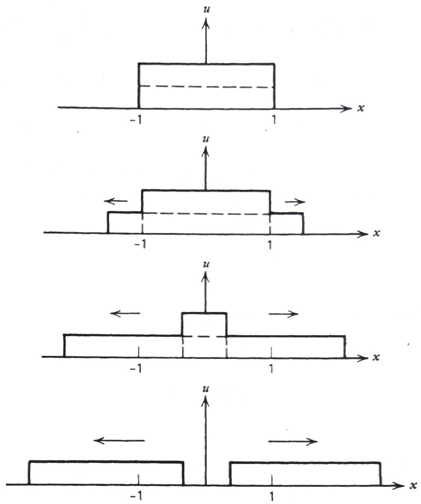{width="60%" fig-align="center"}

* **Initial Velocity Given**

  Suppose now the initial position of the string is at equilibrium and we impose an initial velocity (as in a piano string) of $\,\sin x$


  $$\begin{aligned}
   u(x,0)&= 0\\ 
   u_t(x,0)&=\sin x 
  \end{aligned}$$

  Here, $\,$the solution would be

  $$\begin{aligned}
   u(x,t) &= \frac{1}{2c} \int_{x-ct}^{x+ct} \sin\xi \, d\xi\\ 
    &=\frac{1}{2c} \left[ \cos(x -ct) -\cos(x +ct)\right] \\
    &=\frac{1}{c} \sin x \cdot \sin ct
  \end{aligned}$$

$~$

```{python}
import numpy as np
import matplotlib.pyplot as plt
from matplotlib import animation, rc
from IPython.display import HTML

plt.rcParams['font.size'] = 12
plt.rcParams['xtick.direction'] = 'in'
plt.rcParams['ytick.direction'] = 'in'
```

```{python}
fig = plt.figure(figsize=(6, 4))
ax = plt.axes(xlim=(-6.0*np.pi, 6.0*np.pi), ylim=(-1.5, 1.5))

ax.set_xticks([-6.0*np.pi,-3.0*np.pi, 0, 3.0*np.pi, 6.0*np.pi])
ax.set_xticklabels(['$-6\pi$','$-3\pi$','$0$','$3\pi$','$6\pi$'])
ax.set_yticks([-1.2, -0.6, 0, 0.6, 1.2])
ax.set_xlabel('$x$')
ax.set_ylabel('$u(x,t)$')

plt.close()
```

```{python}
# | fig-cap: '<center><font size="3px">Initial Velocity Given: $\;u_t(x,0)=\sin t$</font></center>'
time_text = ax.text(-1.5, 1.3, '')
line, = ax.plot([], [], lw=2)
def init():
    time_text.set_text('t = 0.0')
    line.set_data([], [])
    return (line,)

c = 1
def animate(t):
    time_text.set_text('t = %3.1f' % t)
    x = np.linspace(-6.0*np.pi, 6.0*np.pi, 300)
    u = 1.0/(2.0*c)*(np.cos(x -c*t) -np.cos(x +c*t))
    line.set_data(x, u)
    return (line,)

tt = list(np.linspace(0, 2.0*np.pi/c, 100))
anim = animation.FuncAnimation(fig, animate, 
        init_func=init, frames=tt, interval=200, blit=True) 
HTML('<center>' + anim.to_html5_video() + '</center>')
```

$~$

## $\,$More on the D'Alembert Solution {#sec-x2-20}

* We proved that in the last section the solution of the pure initial-value problem

  $$
  \begin{aligned}
    u_{tt} &=c^2 u_{xx} && -\infty < x < \infty,\; 0 < t < \infty \\ 
    \begin{array}{r}
      u(x, 0) \\
      u_t(x, 0)
    \end{array} 
    &
    \begin{array}{c}
      = f(x) \\
      = g(x)
    \end{array} && -\infty < x <\infty 
  \end{aligned}$$

  is given by

  $$ u(x,t) =\frac{1}{2} \left[\, f(x -ct) +f(x +ct) \right] +\frac{1}{2c} \int_{x-ct}^{x+ct} g(\xi)\,d\xi $$ 

  We now present an interpretation of this solution in the $\,xt$-plane at the two specific cases

**CASE 1** <font color="red">$\,$ Initial Position Given; $\,$ Initial Velocity Zero</font>

* Let's consider the following initial condition

  $$\begin{aligned}
    u(x,0) &=f(x) \\ 
    u_t(x,0) &=0 
  \end{aligned},\quad -\infty < x < \infty$$

  the D'Alembert solution is

  $$ u(x,t) =\frac{1}{2} \left[ f(x -ct) +f(x +ct) \right] $$

  and <font color="blue">the solution $u(x_0,t_0)$ can be interpreted as being the average of the initial displacement $\,f(x)$ at the points $(x_0-ct_0,0)$ and $(x_0 +ct_0,0)$ found by backtracking along the lines</font>

  $$\begin{aligned}
   x -ct&= x_0 -ct_0\\ 
   x +ct&= x_0 +ct_0 
  \end{aligned}\quad\color{red}{\text{characteristic curves}}$$

  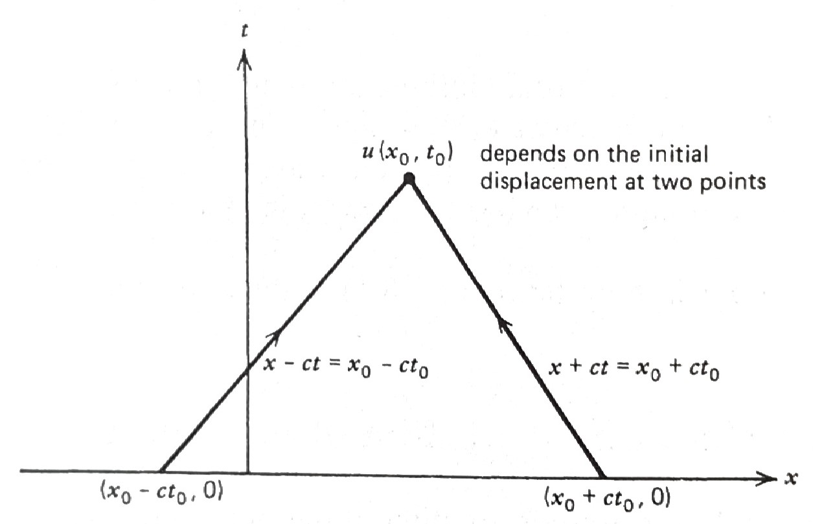{width="80%" fig-align="center"}

* For example, $\,$using this interpretation, $\,$the initial condition

  $$\begin{aligned}
   u(x,0) &= 
   \begin{cases}
     1 & \;-1 < x < 1 \\ 
     0 & \text{everywhere else} 
   \end{cases} \\ 
   u_t(x,0) &=0 
  \end{aligned}$$

  would give us the solution in the $\,xt$-plane shown in figure

  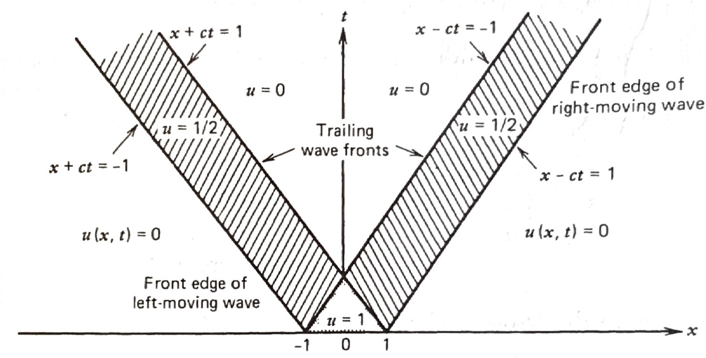{width="80%" fig-align="center"}

**CASE 2** <font color="red">$\,$Initial Displacement Zero; $\,$ Velocity Arbitrary</font>

* Consider now the IC

  $$\begin{aligned}
   u(x,0) &=0 \\ 
   u_t(x,0) &=g(x) 
  \end{aligned}, \quad -\infty < x < \infty$$

  the solution is

  $$ u(x,t) =\frac{1}{2c} \int_{x -ct}^{x +ct} g(\xi)\,d\xi $$

  and, $\,$hence, $\,$<font color="blue">the solution $\,u(x_0, t_0)\,$ can be interpreted as integrating the initial velocity between $x_0 -ct_0$ and $x_0 +ct_0$ on the initial line $t=0$</font>

* Again, $\,$using this interpretation, $\,$the solution to the initial-value problem

  $$\begin{aligned}
     u(x,0) &= 0 \quad -\infty<x<\infty \\ 
     u_t(x,0) &= \begin{cases} 1 & \;-1 < x < 1 \\ 0 & \text{everywhere else} 
    \end{cases}
  \end{aligned}$$

  has a solution in the $\,tx$-plane in figure

  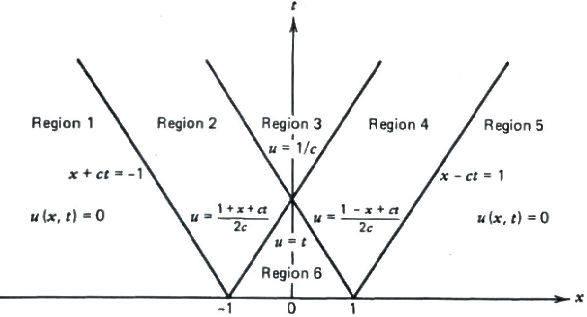{width="80%" fig-align="center"}

* To find the displacement, $\,$we compute the D'Alembert solution

$$\scriptsize \begin{aligned}
 u(x,t) &=\frac{1}{2c}\int_{x-ct}^{x+ct} g(\xi)\,d\xi & \\ 
 &= \frac{1}{2c} \int_{x-ct}^{x+ct} 0\, d\xi=0, & (x,t) \in \text{Region 1}\\ 
 &= \frac{1}{2c} \int_{-1}^{x+ct} 1\, d\xi=\frac{1+x+ct}{2c}, & (x,t) \in \text{Region 2}\\ 
 &= \frac{1}{2c} \int_{-1}^{1} 1\, d\xi=\frac{1}{c}, & (x,t) \in \text{Region 3}\\ 
 &= \frac{1}{2c} \int_{x-ct}^{1} 1\, d\xi=\frac{1-x+ct}{2c}, & (x,t) \in \text{Region 4}\\ 
 &= \frac{1}{2c} \int_{x-ct}^{x+ct} 0\, d\xi=0, & (x,t) \in \text{Region 5}\\ 
 &= \frac{1}{2c} \int_{x-ct}^{x+ct} 1\, d\xi=t, & (x,t) \in \text{Region 6}
\end{aligned}$$

$~$

```{python}
fig = plt.figure(figsize=(6, 4))
ax = plt.axes(xlim=(-15, 15), ylim=(-0.1, 1.5))

ax.set_xticks([-15, -10, -5, 0, 5, 10, 15])
ax.set_yticks([0, 0.5, 1.0, 1.5])
ax.set_xlabel('$x$')
ax.set_ylabel('$u(x,t)$')

plt.close()

time_text = ax.text(-2, 1.3, '')
line, = ax.plot([], [], lw=2)
def init():
    time_text.set_text('t = 0.0')
    line.set_data([], [])
    return (line,)
```

```{python}
c = 1
def animate(t):
    time_text.set_text('t = %3.1f' % t)    
    xx = np.linspace(-15, 15, 300)   
    uu = np.zeros_like(xx)
    
    for i, x in enumerate(xx):
        ch1 = x +c*t
        ch2 = x -c*t
        if ch1 <-1.0 or ch2 > 1.0:
            uu[i] = 0.0
        elif t < 1.0 /c:
            if ch2 <-1.0:
                uu[i] = (1.0 +ch1) /(2.0*c)
            elif ch1 < 1.0:
                uu[i] = t
            else:
                uu[i] = (1.0 -ch2) /(2.0*c)           
        else:
            if ch1 < 1.0:
                uu[i] = (1.0 +ch1) /(2.0*c)
            elif ch2 <-1.0:
                uu[i]=1.0 /c
            else:
                uu[i] = (1.0 -ch2) /(2.0*c) 
                       
    line.set_data(xx, uu)
    return (line,)
```

```{python}
# | fig-cap: '<center><font size="3px">Initial Velocity Given: $\;u_t(x,0)=\begin{cases} 1 & \;-1 < x < 1 \\ 0 & \text{everywhere else} \end{cases}$</font></center>'
tt = list(np.linspace(0, 20, 50))
anim = animation.FuncAnimation(fig, animate, init_func=init, 
    frames=tt, interval=300, blit=True)

HTML('<center>' + anim.to_html5_video() + '</center>')
```

$~$

* **Solution of the Semi-Infinite String via the D'Alembert Formula** 

  * In the remainder of the lesson, $~$we will solve the initial-boundary-value problem for the semi-infinite string

    $$
    \begin{aligned}
      u_{tt} 
       &=c^2 u_{xx} 
       && \color{red}{0 < x < \infty}, \; 0 < t < \infty \\
      u(0, t) &= 0 && 0 < t < \infty \\ 
     \begin{array}{r}
        u(x, 0) \\
        u_t(x, 0)
      \end{array} 
      &
      \begin{array}{c}
        = f(x) \\
        = g(x)
      \end{array} && 0 < x <\infty 
    \end{aligned}$$

  * We proceed in a manner similar to that used with the infinite string, $\,$which is to find the general solution to the PDE

    $$ u(x,t) = \phi(x -ct) +\psi(x +ct) \tag{GS}\label{eq:GS}$$ 

    If we now substitute this general solution into the initial conditions, $\,$we arrive at

    $${\begin{aligned}
       \phi(x - ct)=\frac{1}{2}f(x -ct) \,-\,&\frac{1}{2c}\int_{x_0}^{x -ct} 
          g(\xi)\,d\xi -\frac{C}{2c} \\
       \psi(x +ct)=\frac{1}{2}f(x +ct) \,+\,&\frac{1}{2c}\int_{x_0}^{x +ct} 
          g(\xi)\,d\xi +\frac{C}{2c} \\
      \end{aligned}} \tag{IM}\label{eq:IM}$$ 

  * We now have a problem we didn't encounter when dealing with the infinite string. $\,$Since we are looking for the solution $\,u(x,t)\,$ <font color="blue">everywhere in the first quadrant $(x>0,\;t>0)\,$ of the $\,tx$ plane</font>, $\,$it is obvious that we must find

    $$\begin{aligned}
      \phi(x -ct)
        &\;\;\; \color{red}{\text{for all } 
        -\infty < x -ct < \infty} \\ 
      \psi(x +ct)&\;\;\; \text{for all } 
       \phantom{xxx} 0 < x +ct < \infty 
    \end{aligned}$$

  * Unfortunately, $\,$the first equation only gives us $\,\phi(x -ct)\,$ for $\,x -ct \geq 0$, $\,$since our initial data $\,f(x)$ and $g(x)$ are only known for positive arguments

  * <font color="blue">As long as $x -ct \geq 0$, $\,$we have no problem</font>, $\,$since we can substitute \eqref{eq:IM} into the general solution \eqref{eq:GS} to get

    $$ {u(x,t) =\frac{1}{2} \left[ f(x -ct) +f(x +ct) \right] +\frac{1}{2c} \int_{x-ct}^{x+ct} g(\xi)\,d\xi,\;\;\; x \geq ct} $$

    The question is, $\,$<font color="blue">what to do when $x < ct$?</font>

  * <font color="blue">When $x < ct$</font>, $\,$substituting the general solution \eqref{eq:GS} into <font color="blue">the BC $\,u(0,t)=0\,$ </font>gives

    $$\color{blue}{\phi(-ct)=-\psi(ct)}$$

    and, $\,$hence, $\,$by functional substitution

    $$ {\phi(x -ct)={\color{red}{-}}\frac{1}{2}f({\color{red}{ct -x}}) {\color{red}{-}}\frac{1}{2c}\int_{x_0}^{{\color{red}{ct -x}}} g(\xi)\,d\xi {\color{red}{-}}\frac{C}{2c}} $$

  * Substituting this value of $\phi$ into the general solution \eqref{eq:GS} gives

    $$ {u(x,t) =\frac{1}{2} \left[ f(x +ct) -f(ct -x) \right] +\frac{1}{2c} \int_{ct -x}^{x+ct} g(\xi)\,d\xi,\;\;\;0<x<ct} $$

  * For $x \geq ct$, $\,$the solution is the same as the D'Alembert solution for the infinite wave, <font color="red">while for $x < ct$, $\,$the solution $u(x,t)$ is modified as a result of the wave reflecting from the boundary (The sign of the wave is changed when it's reflected)</font>

  * The straight lines

    $$\begin{aligned}
      x +ct &= \text{constant}\\ 
      x -ct &= \text{constant} 
    \end{aligned}$$

    are known as <font color="red">**characteristics**</font>, $\,$and it is along these lines that disturbances are propagated. $\,$<font color="red">Characteristics are generally associated with hyperbolic equations</font>

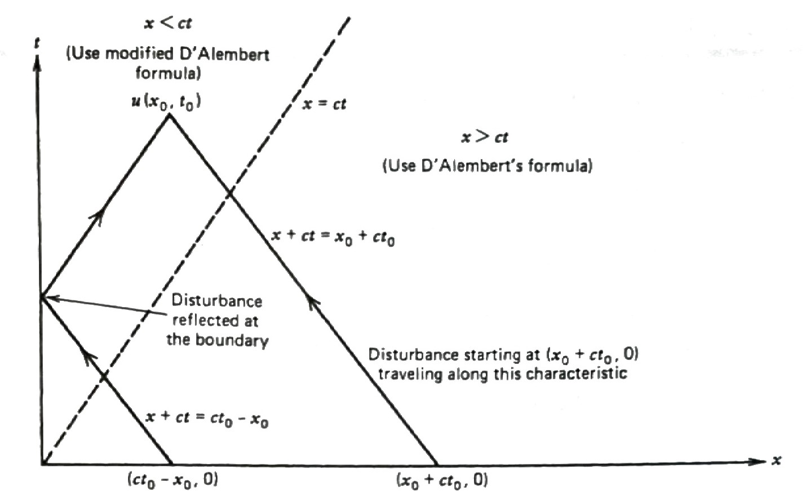{width="80%" fig-align="center"}

$~$

**Example** $\,$Solve the semi-infinite string problem

$~$

$$
  \begin{aligned}
    u_{tt} &=c^2 u_{xx} && 0 < x < \infty,\; 0 < t < \infty \\
    u(0,t) &=0 && 0 < t < \infty \\ 
    \begin{array}{r}
      u(x, 0) \\
      u_t(x, 0)
    \end{array} 
    &\,
    \begin{array}{l}
      = f(x) \\
      = 0
    \end{array} && 0 < x <\infty 
  \end{aligned}$$

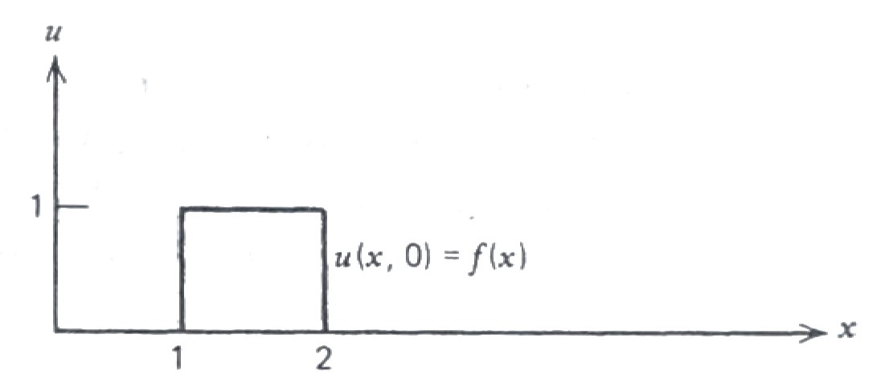{width="70%" fig-align="center"}

$~$

```{python}
fig = plt.figure(figsize=(6, 4))
ax = plt.axes(xlim=(0, 5), ylim=(-1.0, 1.5))

ax.set_xticks([0, 2.5, 5])
ax.set_yticks([-1.0, -0.5, 0.0, 0.5, 1.0, 1.5])
ax.set_xlabel('$x$')
ax.set_ylabel('$u(x,t)$')

plt.close()

time_text = ax.text(2.2, 1.3, '')
line, = ax.plot([], [], lw=2)
def init():
    time_text.set_text('t = 0.0')
    line.set_data([], [])
    return (line,)

```

```{python}
c = 1
def f_i(x):
    if x >= 1 and x <= 2:
        u = 1.0
    else:
        u = 0.0
    return u
    
def animate(t):
    time_text.set_text('t = %3.1f' % t)        
    xx = np.linspace(0, 5, 400)   
    uu = np.zeros_like(xx)
    
    for i, x in enumerate(xx):
        ch1 = x +c*t
        ch2 = x -c*t
        if ch2 >= 0:
            uu[i] = 0.5*(f_i(ch1) +f_i(ch2))
        else:
            uu[i] = 0.5*(f_i(ch1) -f_i(-ch2))
                       
    line.set_data(xx, uu)
    return (line,)
```

```{python}
# | fig-cap: '<center><font size="3px">Semi-infinite String</font></center>'
tt = list(np.linspace(0, 7, 100))
anim = animation.FuncAnimation(fig, animate, 
        init_func=init, frames=tt, interval=750, blit=True)
HTML('<center>' + anim.to_html5_video() + '</center>')
```

$~$

**Example** $\,$Solve the semi-infinite string problem

$$
  \begin{aligned}
    u_{tt} &=c^2 u_{xx} && 0 < x < \infty,\; 0 < t < \infty \\
    u_x(0,t) & =0 && 0 < t < \infty \\ 
    \begin{array}{r}
      u(x, 0) \\
      u_t(x, 0)
    \end{array} 
    &\;
    \begin{array}{l}
      = f(x) \\
      = 0
    \end{array} && 0 < x <\infty 
  \end{aligned}$$

in a manner analogous to the way the semi-infinite string problem was solved in the lesson

**Solution** $\,$For $x \geq ct$, $\,$the solution is the same as the D'Alembert solution for the infinite wave, <font color="red"> $\,$while for $x < ct$, $\,$the solution $u(x,t)$ is modified as a result of the wave reflecting from the boundary</font>

  $$ {u(x,t) =\frac{1}{2} \left[ f(x +ct) +f(ct -x) \right] +\frac{1}{2c} \left[ \int_0^{ct -x} g(\xi)\,d\xi + \int_0^{x +ct} g(\xi)\,d\xi \right] ,\;\; 0 < x < ct} $$

$~$

* **The Nonhomogeneous Wave Equation**

  * We consider now the pure nonhomogeneous wave equation:

    $$
    \begin{aligned}
    u_{tt} &\! =c^2 u_{xx} +\color{red}{F(x, t)} 
      && -\infty < x < \infty,\; 0 < t < \infty \\ 
    \begin{array}{r}
      u(x, 0) \\
      u_t(x, 0)
    \end{array} 
    &
    \begin{array}{c}
      = 0 \\
      = 0
    \end{array} && -\infty < x <\infty 
    \end{aligned}$$

    which includes the forcing term $F(x, t)$, $~$but zero initial conditions

  * We again make the change of variables $\,\xi=x +ct\,$ and $\,\eta=x -ct$.
$\,$The differential equation then becomes

    $$
    \begin{aligned}
      & u_{\xi\eta} = \color{red}{-\frac{1}{4c^2} F(\xi, \eta)} \\ \\
      &\color{blue}
      {\left.\begin{matrix}
        u = 0\\ 
        u_\xi = u_\eta
        \end{matrix} \;\;\right\} \;\text{ at } \xi=\eta \;\; \leftarrow 
       \left.\begin{matrix}
         u = 0 \\
         u_t = 0
       \end{matrix} \;\;\right\} \text{ at } t=0}
    \end{aligned}$$

  $$
  \begin{aligned}
   \\[5pt]
   &\Downarrow 
     {\scriptstyle\text{ integrating with respect to } 
      \xi \text{ and } \eta, \text{ respectively} }\\[5pt] 
   u_\eta \;&{\scriptsize= -\frac{1}{4c^2} 
    \int_\eta^\xi F\left(\bar{\xi}, \eta \right) 
     \,d\bar{\xi} +c_1}, \:\:
   u_\xi \;{\scriptsize= -\frac{1}{4c^2} 
     \int_\xi^\eta F\left(\xi, \bar{\eta} \right) 
      \,d\bar{\eta}  +c_1} \\[5pt] 
   &\Downarrow 
   {\scriptstyle\text{ integrating with respect to } 
    \eta \text{ and } \xi, \text{ respectively}}\\[5pt]
    u \;&{\scriptsize= -\frac{1}{4c^2} \int_\eta^\xi 
      \left[ \int_{\bar{\eta}}^\xi F\left( \bar{\xi}, 
       \bar{\eta} \right) \,d\bar{\xi} \right ] 
        \,d\bar{\eta} +c_1 \eta +c_2} \\ 
        \;&{\scriptsize= -\frac{1}{4c^2} \int_\xi^\eta 
         \left[ \int_{\bar{\xi}}^\eta F\left( 
          \bar{\xi}, \bar{\eta} \right) 
          \,d\bar{\eta} \right ] \,d\bar{\xi}
          +c_1 \xi +c_3}
   \end{aligned}$$

  * We let $\,\bar{\xi}=\beta +c\tau\;$ and $\,\bar{\eta}=\beta -c\tau$, $\,$($t \ge \tau$, $\,\beta=x$). $\,$The domain of integration $\,\eta \leq \bar{\eta} \leq \bar{\xi} \leq \xi\;$ becomes

    $$
    \begin{aligned}
      \eta \leq \beta -c\tau &\leq \beta +c\tau \leq \xi \\ 
      &\Downarrow \\ 
      \eta +c\tau \leq &\;\beta \leq\xi -c \tau \\ 
      0 \leq &\;\tau \leq \frac{1}{2c} (\xi -\eta) 
    \end{aligned}$$

  * The transformation from $\,(\bar{\xi}, \,\bar{\eta})\,$ to $\,(\beta, \,\tau)\,$ gives the solution formula

    $$
    \begin{aligned}
     u &= -\frac{1}{4c^2} \int_\eta^\xi 
     \left[ \int_{\bar{\eta}}^\xi F\left( \bar{\xi}, \bar{\eta} \right) 
     \,d\bar{\xi} \right ] \,d\bar{\eta} \\[5pt]
    &\big\Downarrow {\scriptstyle \;\;d\bar{\xi}\,d\bar{\eta} \,=\,  \begin{vmatrix}
    \frac{\partial \bar{\xi}}{\partial \beta}& \frac{\partial \bar{\xi}}{\partial \tau} \\ 
    \frac{\partial \bar{\eta}}{\partial \beta}& \frac{\partial \bar{\eta}}{\partial \tau} 
    \end{vmatrix}  \,d\beta\,d\tau \,=\, -2c \,d\beta\,d\tau}\\[5pt]
    &=\frac{1}{2c} \int_0^{(\xi -\eta)/2c} \left[ \int_{\eta +c\tau}^{\xi -c\tau} F\left( \beta,\tau \right) \,d\beta \right ] \,d\tau \\[5pt]
    &\Downarrow {\scriptstyle  \;\xi=x +ct, \;\eta=x -ct} \\
    {\color{red}{u}}\; &{\color{red}{= \frac{1}{2c} \int_0^t \left[ \int_{x -c(t -\tau)}^{x +c(t -\tau)} F\left( \beta,\tau \right) \,d\beta \right ] \,d\tau}}
    \end{aligned}
    $$

$~$

## The Wave Equation in Two and Three Dimensions (Free Space) {#sex-x2-21}

The problem of this section is to generalize the D'Alembert solution to two and three dimensions

* **Waves in Three Dimensions**

  We start by considering spherical waves in three dimensions that have given ICs; $\,$that is, $\,$we would like to solve the initial value problem

  $$\begin{aligned}
    u_{tt} &=c^2(u_{xx} +u_{yy} +u_{zz}),\quad 
    \begin{cases}
      -\infty < x <\infty \\ 
      -\infty < y <\infty \\ 
      -\infty < z <\infty
    \end{cases} \\ 
    u(&x,y,z,0)=\phi(x,y,z) \\ 
    u_t(&x,y,z,0)=\psi(x,y,z) 
  \end{aligned} \tag{3D}\label{eq:3D}$$

  * To solve this problem, $\,$we first solve the simpler one (set $\phi=0$)

    $$\color{red}{\begin{aligned}
      u_{tt}&=c^2(u_{xx} +u_{yy} +u_{zz}),\quad (x,y,z) \in \mathbb{R}^3\\
      u(&x,y,z,0)=0 \\ 
      u_t(&x,y,z,0)=\psi(x,y,z) 
    \end{aligned}} \tag{3Dv}\label{eq:3Dv}$$

    This problem can be solved by the Fourier transform

    $$\begin{aligned}
      \mathcal{F}(u)
        &=\frac{1}{(2\pi)^{3/2}}\iiint_{-\infty}^\infty 
          u(x,y,z,t) e^{-i(\omega_1 x+\omega_2 y+\omega_3 z)}\,dx\,dy\,dz 
          =U(\omega_1,\omega_2,\omega_3,t)\\ 
      \mathcal{F}(\psi)&=\frac{1}{(2\pi)^{3/2}}\iiint_{-\infty}^\infty 
        \psi(x,y,z) e^{-i(\omega_1 x+\omega_2 y+\omega_3 z)}\,dx\,dy\,dz 
        =\Psi(\omega_1,\omega_2,\omega_3)
    \end{aligned}$$

  $$\scriptsize \begin{aligned}
  &\Downarrow\;\; \mathcal{F}^{-1} \\ \\
  u(x,y,z,t)= \frac{1}{(2\pi)^{3/2}} 
    \lim_{L\to\infty} \underset{\omega_1^2 +\omega_2^2 +\omega_3^2 < L^2}{\iiint}
    \Psi(\omega_1,\omega_2,\omega_3) &
    \frac{\sin ct \sqrt{ \omega_1^2 +\omega_2^2 +\omega_3^2 }}{c\sqrt{\omega_1^2 
    +\omega_2^2 +\omega_3^2 }} \,e^{i(\omega_1 x +\omega_2 y +\omega_3 z)}\,d\omega_1 \,d\omega_2 \,d\omega_3 \\ 
  = \frac{1}{(2\pi)^{3/2}} 
  \iiint_{-\infty}^\infty \psi(\xi,\eta,\zeta)\;
    {\tiny \left[ \frac{1}{(2\pi)^{3/2}}  \lim_{L\to\infty} 
      \underset{\omega_1^2 +\omega_2^2 +\omega_3^2 < L^2}{\iiint} \right. } &
    {\tiny \left. e^{-i\left[\omega_1 (\xi-x) +\omega_2 (\eta-y) +\omega_3 (\zeta-z) \right]} \;
    \frac{\sin ct \sqrt{ \omega_1^2 +\omega_2^2 +\omega_3^2 }}{c\sqrt{\omega_1^2 +\omega_2^2 +\omega_3^2 }}\,
    \,d\omega_1 \,d\omega_2 \,d\omega_3 \,\right] } \,d\xi \,d\eta \,d\zeta 
  \end{aligned}$$

  * We introduce spherical coordinates $(\varrho,\varphi,\vartheta)$ in the $(\omega_1,\omega_2,\omega_3)$ space with the north pole $\varphi=0$ in the direction of the vector $\left \langle \xi-x,\eta-y,\zeta-z \right \rangle$. $\,$Then the integral in $(\omega_1,\omega_2,\omega_3)$ becomes

    $$\scriptsize\begin{aligned}
      \frac{1}{(2\pi)^{3/2}}  \lim_{L\to\infty} 
      \underset{\omega_1^2 +\omega_2^2 +\omega_3^2 < L^2}{\iiint} 
      &e^{-i\left[\omega_1 (\xi-x) +\omega_2 (\eta-y) 
      +\omega_3 (\zeta-z)\right]}\;
      \frac{\sin ct \sqrt{ \omega_1^2 +\omega_2^2 +\omega_3^2 }}{c\sqrt{\omega_1^2 +\omega_2^2 +\omega_3^2 }}\,
      \,d\omega_1 \,d\omega_2 \,d\omega_3 \\ 
      &\;\;\Downarrow \; 
        {\tiny r=|\mathbf{r}|=\sqrt{(\xi-x)^2 +(\eta -y)^2 +(\zeta -z)^2},\;\; 
          \varrho =|\boldsymbol{\varrho}| 
      = \sqrt{\omega_1^2 +\omega_2^2 +\omega_3^2} }\\ 
        &=\frac{1}{(2\pi)^{3/2}} \lim_{L\to\infty} 
        \int_0^L \int_0^{2\pi}  \int_0^\pi 
      \;e^{-ir \varrho\cos \varphi} \;\frac{\sin ct \varrho}{c\varrho}\; 
      \varrho^2 \sin\varphi \,d\varphi\,d\vartheta\,d\varrho \\
        &\;\;\Downarrow 
        \; {\tiny \alpha=\cos\varphi, \;d\alpha=-\sin\varphi d\varphi } \\ 
        &=\frac{1}{(2\pi)^{3/2}} 
        \lim_{L\to\infty} \frac{2\pi}{c} \int_0^L \; \varrho \sin ct\varrho 
      \underbrace{\left[ \frac{e^{-ir\varrho \alpha}}{-ir\varrho} 
        \right]_{-1}^1 }_{\frac{2}{r\varrho}\sin r\varrho} \,d\varrho \\ 
        &=\frac{1}{(2\pi)^{3/2}} \lim_{L\to\infty} \frac{4\pi}{cr} \int_0^L  
        \;\sin ct \varrho \cdot \sin r\varrho \,d\varrho
    \end{aligned}$$

  * To treat the integration with respect to $\xi$, $\,\eta$, and $\,\zeta$, $~$we introduce spherical coordinates $(r,\phi,\theta)$ in the $(\xi,\eta,\zeta)$ space with their origin at $(x,y,z)$, $\,$so that

    $$\begin{aligned}
    \xi-x &=r\sin\phi \cos\theta \\ 
    \eta-y&=r\sin\phi \sin\theta \\ 
    \zeta-z&=r\cos\phi 
    \end{aligned}$$

    Then the solution becomes

    $$\scriptsize\begin{aligned}
    {\normalsize\color{red}{u(x,y,z,t)}}
    &= {\tiny \frac{4\pi}{(2\pi)^3 c} \lim_{L\to \infty} \int_0^\infty \int_0^{2\pi} \int_0^\pi  
      \;\psi(x +r\sin\phi\cos\theta,y +r\sin\phi\sin\theta, z+r\cos\phi)\; \frac{1}{r}\;\left[ \int_0^L  
      \sin ct \varrho \sin r\varrho\, d\varrho \right] r^2\sin\phi \, d\phi \, d\theta \,dr }\\
      &= {\tiny \frac{1}{2\pi^2 c} \lim_{L\to \infty} \int_0^L \sin ct\varrho \left[\int_0^\infty \sin r\varrho 
      \underbrace{\left( \int_0^{2\pi} \int_0^\pi  \psi(x +r\sin\phi\cos\theta,y +r\sin\phi\sin\theta, z+r\cos\phi) 
      \,r\,\sin\phi \,d\phi\,d\theta  \right) }_{g(r)} dr \right] d\varrho } \\ 
      &= {\tiny \frac{1}{2\pi^2 c} \frac{\pi}{2} \int_0^\infty \sin ct \varrho \;\underbrace{\left[\frac{2}{\pi} \int_0^\infty 
      \sin r\varrho \,g(r)\,dr \right]}_{G(\varrho)} d\varrho  
      = \frac{1}{4\pi c} \underbrace{\int_0^\infty \sin ct \varrho \;G(\rho)\,d\varrho}_{g(ct)} } \\ 
      &= {\tiny \frac{t}{4\pi (ct)^2} \int_0^{2\pi}\int_0^\pi  \psi(x +ct\sin\phi\cos\theta,y +ct\sin\phi\sin\theta, z+ct\cos\phi) 
      \,(ct)^2\sin\phi \,d\phi \,d\theta  }
      = {\normalsize\color{red}{t\bar{\psi}}}
    \end{aligned}$$

    <font color="blue"> where $\bar{\psi}$ is the average of the initial disturbance $\psi$ over the surface of the sphere of radius $\,ct\,$ centered at $(x,y,z)$</font>

  * The interpretation of this solution is that the initial disturbance $\,\psi\,$ radiates outward spherically (velocity $c$) at each point, $\,$so that after so many seconds, $\,$the point $\,(x,y,z)$ will be influenced by those initial disturbances on a sphere (of radius $\,ct$) around that point

    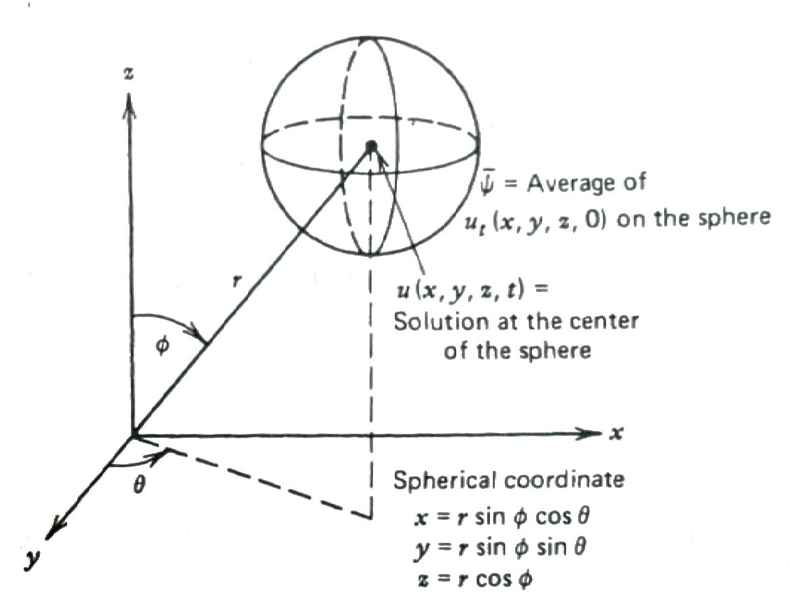{width="80%" fig-align="center"}

  * Now, $\,$to finish the problem, $\,$what about the other half; $\,$that is

    $$\color{red}{\begin{aligned}
    u_{tt}&=c^2(u_{xx} +u_{yy} +u_{zz}),\quad (x,y,z) \in \mathbb{R}^3 \\ 
    u(&x,y,z,0)=\phi(x,y,z) \\ 
    u_t(&x,y,z,0)=0 
    \end{aligned}} \tag{3Dp}\label{eq:3Dp}$$

    This is easy: $\,$A famous theorem developed by *Stokes* says all we have to do to solve this problem is to change the ICs to $\,v=0$, $\,v_t=\phi$, $\,$and then differentiate this solution with respect to time:

    $$ v=\int_0^t u\,dt,\;v_t=u, \;u_{tt}=\frac{\partial}{\partial t} v_{tt}, \;u_{xx}=\frac{\partial}{\partial t} v_{xx}$$

  * In other words, $\,$we solve

    $$\begin{aligned}
    v_{tt}&=c^2(v_{xx} +v_{yy} +v_{zz}),\quad (x,y,z) \in \mathbb{R}^3 \\ 
    v(&x,y,z,0)=0 \\ 
    v_t(&x,y,z,0)=\phi(x,y,z) 
    \end{aligned}$$

    to get $v=t\bar{\phi}\,$ and then differentiate with respect to time. $\,$This gives us the solution 
    
    $$\color{red}{u=\frac{\partial}{\partial t} \left[ t\bar{\phi} \right]}$$
    
    to problem \eqref{eq:3Dp}

  * We now have the solution to our general three-dimensional problem \eqref{eq:3D}. $\,$It's just

    $$ \color{red}{u(x,y,z,t)=\frac{\partial}{\partial t} \left[ t\bar{\phi} \right]+t\bar{\psi}}$$

    where $\,\bar{\phi}\,$ and $\,\bar{\psi}\,$ are the averages of the functions $\,\phi\,$ and $\,\psi\,$ over the sphere of radius $\,ct\,$ centered at $\,(x,y,z)$

    $~$

    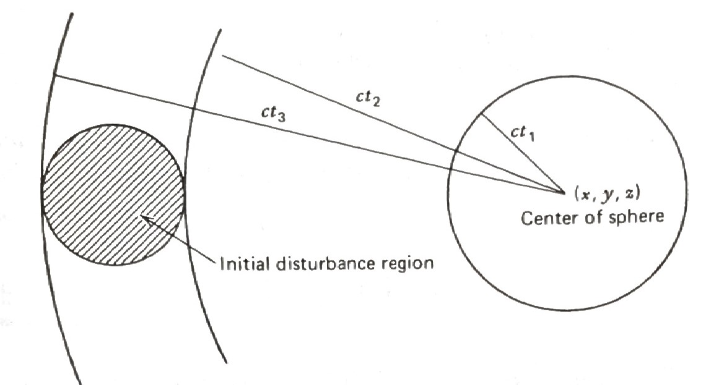{width="60%" fig-align="center"}

  * Suppose now the initial disturbances $\,\phi\,$ and $\,\psi\,$ are zero except for a small sphere. $\,$As time increases, $\,$the radius of the sphere around $(x,y,z)$ increases with velocity $\,c$

  * and so after $\,t_2$ seconds, $\,$it will finally intersect the initial disturbance region, $\,$and, $\,$hence, $\,u(x,y,z,t)\,$ becomes nonzero

  * For $\,t_2 < t < t_3$, $\,$the solution at $\,(x,y,z)\,$ will be nonzero, $\,$since the sphere intersects the disturbance region

  * but when $\,t=t_3$, $\,$the solution at $\,(x,y,z)\,$ abruptly becomes zero again. $\,$In other words, $\,$the wave disturbance originating from the initial-disturbance region has a sharp trailing edge. $\,$This general principle is known as **Huygen's principle** for the three dimensions, $\,$and $\,$it is the reason why sound waves in three dimensions stimulate our ears but die off instanteously when the wave has passed

$~$

**Example** $\,$Illustrate by picture and words the spherical wave solution of the three-dimensional problem

$$\begin{aligned}
 u_{tt}&=c^2(u_{xx} +u_{yy} +u_{zz}), \quad
\begin{cases}
 -\infty < x <\infty \\ 
 -\infty < y <\infty \\ 
 -\infty < z <\infty
\end{cases} \\ 
 u(&x,y,z,0)=0 \\ 
 u_t(&x,y,z,0)=
 \begin{cases}
 \;1 & x^2+y^2+z^2 \leq 1 \\ 
 \;0 & \text{elsewhere} 
\end{cases} 
\end{aligned}$$

$~$

* **Two-Dimensional Wave Equation**

  To solve the two-dimensional problem

  $$\begin{aligned}
    u_{tt}&=c^2(u_{xx} +u_{yy}),\quad
    \begin{cases}
    -\infty < x <\infty \\ 
    -\infty < y <\infty
    \end{cases} \\ 
    u(&x,y,0)=\phi(x,y) \\ 
    u_t(&x,y,0)=\psi(x,y) 
  \end{aligned} \tag{2D}\label{eq:2D}$$

  we merely let the initial disturbances $\,\phi\,$ and $\,\psi\,$ in the three-dimensional problem depend on only the two variables $\,x\,$ and $\,y$. $\,$Doing this, the three-dimensional formula

  $$ u = \frac{\partial}{\partial t} [t\bar{\phi}] +t\bar{\psi} $$

  for $\,u\,$ will describe <font color="red">cylindrical waves</font> and, $\,$hence, $\,$give us the solution for the two-dimensional problem

  * This technique is called the method of descent. $\,$Carrying out the computations, $\,$we get

    $$\scriptstyle\begin{aligned}
    \bar{\psi}(x,y,t) &= \frac{1}{4\pi (ct)^2} \color{red}{\int_0^{2\pi}  \int_{0}^\pi} 
      \psi(x +ct\sin\phi\cos\theta,y+ct\sin\phi\sin\theta)\, \color{red}{(ct)^2 \sin\phi \, d\phi \, d\theta} \;\;\leftarrow \text{spherical surface}\\
    &\Downarrow \;\; {\tiny r = ct \,\sin \phi, \; \,dr =ct \, \cos\phi \,d\phi\;\;\rightarrow\;\; \int_0^{\pi} ct \sin\phi\,d\phi = 2\int_0^{ct}\frac{r}{\sqrt{(ct)^2 -r^2}} dr } \\
    &= \frac{1}{2\pi ct} \, \color{red}{\int_0^{2\pi} \int_0^{ct}} \psi(x +r\cos\theta, y+r\sin\theta)\,\frac{1}{\sqrt{(ct)^2 -r^2}}\,\color{red}{r\,dr\,d\theta} \;\;\leftarrow \text{circle interior}\\
    \bar{\phi}(x,y,t) &= \frac{1}{2\pi ct} \, \color{red}{\int_0^{2\pi} \int_0^{ct}} 
    \phi(x +r\cos\theta, y+r\sin\theta)\,\frac{1}{\sqrt{(ct)^2 -r^2}}\,\color{red}{r\,dr\,d\theta}
    \end{aligned}$$

    Note that in this solution, $\,$the two integrals of the initial conditions $\,\phi\,$ and $\,\psi\,$ are integrated over the interior of a circle with center $\,(x,y)\,$ and radius $\,ct$. $\,$We see that initial disturbances give rise to sharp leading waves, $\,$but not to sharp trailing waves. $\,$Thus, Huygen's principle doesn't hold in two dimensions

* **One-Dimensional Wave Equation**

  Finally, $\,$if we assume the initial conditions $\,\phi\,$ and $\,\psi\,$ depend only on one variable, $\,$this gives rise to plane waves and, $\,$hence, $\,$the preceding equation descends one more dimension 

  $$\begin{aligned}
  \bar{\psi}(x,t) &= {\tiny \frac{1}{2\pi ct} \, \int_0^{2\pi} \int_0^{ct} 
    \frac{\psi(x +r\cos\theta)}{\sqrt{(ct)^2 -r^2}}\,r\,dr\,d\theta }\\
  &\Downarrow {\tiny r^2=x^2 + y^2, \; (ct)^2 -x^2 = \alpha^2 }\\
  &={\tiny \frac{1}{2\pi ct}\, \int_{x -ct}^{x +ct} \underbrace{\int_{-\alpha}^{\alpha} 
    \frac{1}{\sqrt{\alpha^2 -y^2}}\,dy}_{ \pi} \;\psi(x) \,dx }
  = \frac{1}{2ct} \int_{x-ct}^{x+ct} \psi(x)\,dx \\
  \bar{\phi}(x,t) &= \frac{1}{2ct} \int_{x-ct}^{x+ct} \phi(x)\,dx
  \end{aligned}$$

  to the well-known D'Alembert solution. $\,$Note in the D'Alembert solution, $\,$the initial position $\,\phi\,$ gives rise to sharp trailing edges, $\,$but the initial velocity $\,\psi\,$ does not. $\,$In other words, $\,$one dimension is a little unusual in that the initial position satisfies Huygen's principle, $\,$but the initial velocity does not

$~$

**Example** $\,$What is the two dimensional solution of the analogous cylindrical-wave problem

$$\begin{aligned}
 u_{tt}&=c^2(u_{xx} +u_{yy}),\quad
\begin{cases}
 -\infty < x <\infty \\ 
 -\infty < y <\infty
\end{cases} \\ 
 u(&x,y,0)=0 \\ 
 u_t(&x,y,0)=
 \begin{cases}
 \;1 & x^2+y^2 \leq 1 \\ 
 \;0 & \text{elsewhere} 
\end{cases} 
\end{aligned}$$

$~$

## Boundary Conditions Associated with the Wave Equation {#sec-x2-22}

The purpose of this section is to discuss some of the various types of BCs that are associated with physical problems of wave motions. $\,$Here, $\,$we will stick to one-dimensional problems where the BCs (linear ones) are generally groupded into one of three kinds

* **First Kind: $\,$Controlled End Points**

  We are now involved with problems like

  $$
  \begin{aligned}
    u_{tt} &=c^2 u_{xx} && \color{red}{0 < x < 1},\;\; 0 < t < \infty \\ \\
    \begin{array} {r}
      u(0, t) \\ u(1,t)
    \end{array}
    &
    \begin{array} {r}
      =g_1(t) \\ =g_2(t)
    \end{array}
    && 0 < t < \infty \\ \\
    \begin{array} {r}
      u(x, 0) \\ u_t(x, 0)
    \end{array}
    &
    \begin{array} {r}
      =f(x) \\ =g(x)
    \end{array}
    && 0 \leq x \leq L
  \end{aligned}$$

  where we control the end points so that they move in a given manner

  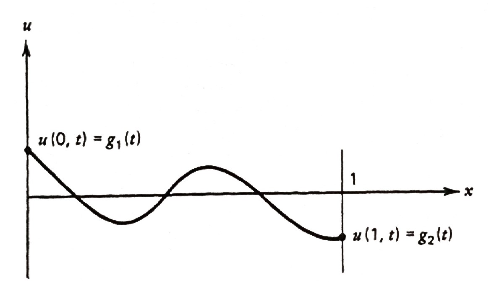{width="70%" fig-align="center"}

  A typical problem of this kind would involve suddenly twisting (at $t=1$) the right end of a fastened rod so many degrees and observing the resulting tortional vibration

  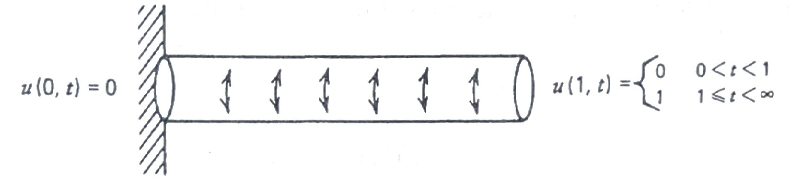{width="80%" fig-align="center"}

* **Second Kind: $\,$Force Given on the Boundaries** 

  In as much as the vertical forces on the string at the left and right ends are given by $\,Tu_x(0,t)\,$ and $\,Tu_x(1,t)$, $\,$respectively, $\,$by allowing the ends of the string to slide vertically on frictionless sleeves, $\,$the boundary conditions become

  $$\begin{aligned}
  u_x(0,t)&=0 \\ 
  u_x(1,t)&=0
  \end{aligned}, \quad 0 < t < \infty$$

  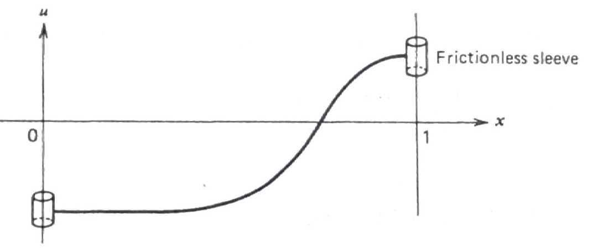{width="70%" fig-align="center"}

  If a vertical force $f(t)$ is applied at the end $x=1$, $\,$then the BC would be 

  $$u_x(1,t)=\frac{1}{T}\,f(t)$$

* **Third Kind: $\,$Elastic Attachment on the Boundaries**

  Consider finally a violin string whose ends are attached to an elastic arrangement like the one shown in figure

  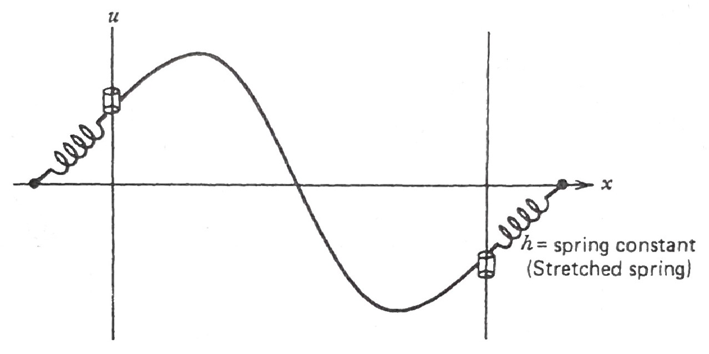{width="60%" fig-align="center"}

  Here, $\,$the spring attachments at each end give rise to vertical forces proportional to the displacements $\,-u(0,t)\,$ and $\,-u(1,t)$

  Setting the vertical tensions of the spring at the two ends $\,-Tu_x(0,t)\,$ and $\,Tu_x(1,t)\,$ equal to these displacements (multiplied by the spring constant $h$) gives us our desired BCs

  $$\begin{aligned}
  -T u_x(0,t) &= -hu(0,t)\\ 
  Tu_x(1,t) &= -hu(1,t) 
  \end{aligned}$$

  We can rewrite these two homogeneous BCs as

  $$\begin{aligned}
  u_x(0,t) -\frac{h}{T} u(0,t) &=0\\ 
  u_x(1,t) +\frac{h}{T} u(1,t) &=0 
  \end{aligned}$$

  If the two spring attachments are displaced according to the functions $\,\theta_1(t)\,$ and $\,\theta_2(t)$, $\,$we would have the nonhomogeneous BCs

  $$\begin{aligned}
  u_x(0,t) &=\frac{h}{T} \left[u(0,t) -\theta_1(t) \right]\\ 
  u_x(1,t) &=-\frac{h}{T} \left[u(1,t) -\theta_2(t) \right] 
  \end{aligned}$$

  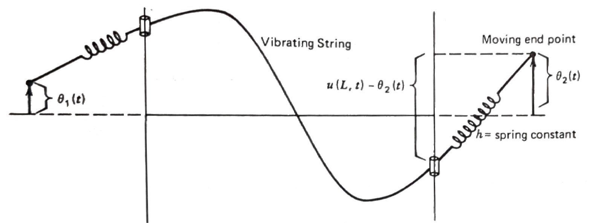{width="80%" fig-align="center"}

$~$

**NOTE** $\,$What is the general nature of BC

$$ u_x(0,t) =\frac{h}{T} \left[u(0,t) -\theta_1(t) \right]$$

when $~h \to \infty$ and $~h \to 0$

$~$

## The Finite Vibrating String (Standing Waves) {#sec-x2-23}

* So far, $\,$we have studied the wave equation $\,u_{tt}=c^2 u_{xx}\,$ <font color="red">for the unbounded domain</font> and have found D'Alembert solutions to be certain <font color="red">*traveling waves* (moving in opposite directions)</font>

* When we study the same wave equation <font color="red">in a bounded region of space $0 < x < L$</font>, $\,$we find that the waves no longer appear to be moving due to their repeated interaction with the boundaries and, in fact, often appear to be what are known as <font color="red">*standing waves*</font>
