# Elliptic Partial Differential Equations {#sec-x3}

## The Laplacian (an Intuitive Description) {#sec-x3-31}

* The  Laplacian operator 

  $$ \nabla^2 =\frac{\partial^2}{\partial x^2} +\frac{\partial^2}{\partial y^2} +\frac{\partial^2}{\partial z^2}$$

  is probably the most important operator in mathematical physics. $\,$The question is, $\,$what does it mean and why should the sum of three second derivatives have anything to do with the laws of nature? 

* The answer to this lies in the fact that the Laplacian of a function allows us to compare the function at a point with the function at neighboring points. $\,$It does what the second derivative did in one dimension and might be thought of as a second derivative generalized to higher dimensions

$~$

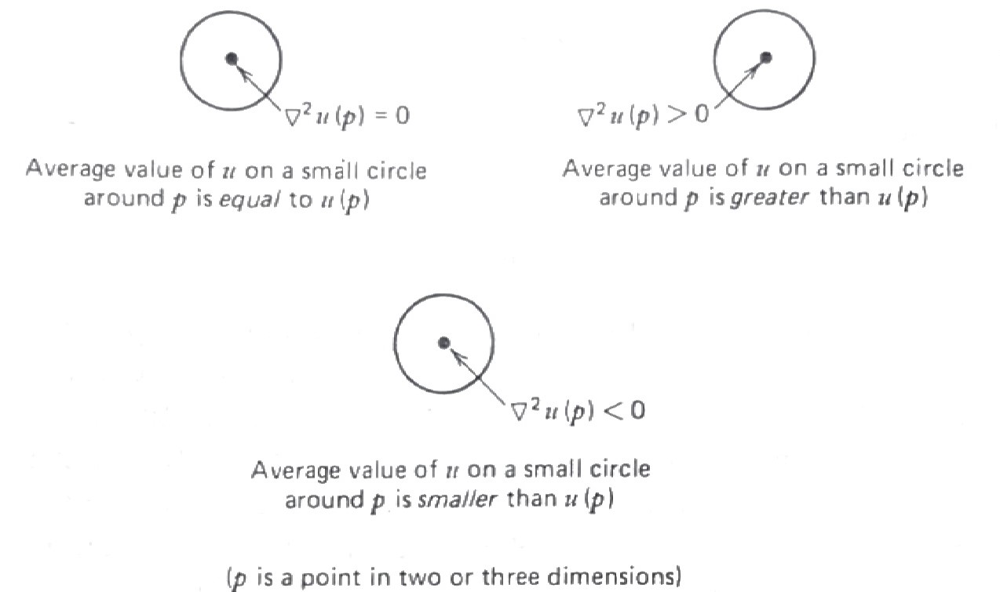{width="90%" fig-align="center"}

$~$

* The heat equation $\,u_t=\alpha\nabla^2 u\,$ measures temperature $\,u$, and the equation can be interpreted to mean that the change in temperature with respect to time $\,u_t$ is proportional to $\,\nabla^2 u$. $\,$That is, $\,$the temperature at a point is increasing if the temperature at that point is less than the average of the temperature on a circle around the point

* The wave equation $\,u_{tt}=c^2\nabla^2 u\,$ measures the displacement of a drumhead and can be interpreted to mean that the acceleration (or force) of a point on the drumhead $\,u_{tt}\,$ is proportional to $\,\nabla^2 u$. $\,$That is, $\,$the drumhead at a point is accelerating upward if the drumhead at that point is less than the average of its neighbors

* Laplace's equation $\,\nabla^2 u = 0\,$ says that the solution $\,u\,$ is always equal to the average of its neighbors. $\,$For example, $\,$a steady-state, stretched rubber membrane satisfies Laplace's equation, $\,$hence, $\,$the height of the membrane at any point is equal to the average height of the membrane on a circle around the point

* Poisson's equation $\,\nabla^2 u=f$, $\,$where $\,f\,$ is a function that depends only on the space variables

  * $\nabla^2 u=-\rho\,$ describes the potential of an electrostatic field where $\,\rho\,$ represents a constant charge density
  * $\nabla^2 u =-g(x,y)\,$ describes the steady-state temperature $\,u(x,y)\,$ due to a heat source $\,g(x,y)$ 

* $\nabla^2 u +\lambda u =0\,$ is known as the Helmholtz equation which describes the fundamental shapes of a stretched membrane

$~$

* **Changing Coordinates**

  Before we start, $\,$however, $\,$let's review briefly the three major coordinate systems in two or three dimensions except for Cartesian system:

  * Polar Coordinates

    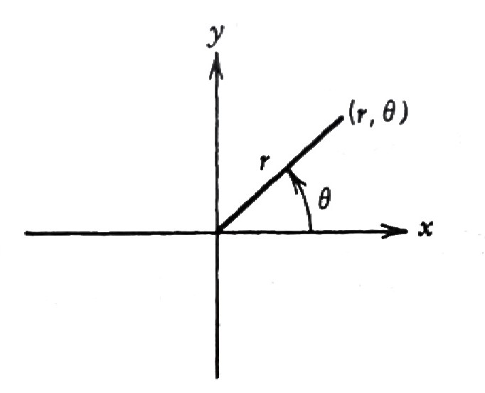{width="45%" fig-align="center"}

    $$\begin{matrix}
      x = r\cos\theta \\ 
      y = r\sin\theta \, \\ 
      \end{matrix} \;\; \Rightarrow \;\;
      \begin{matrix}
        r^2 = x^2 + y^2 \;\;\;\\ 
        \tan\theta = y/x \;\;\;\;\;
    \end{matrix}$$

    As an illustration, $\,$we see how the two-dimensional Laplacian is transformed into polar coordinates:

    $$\scriptsize 
    \begin{aligned}
    \nabla^2u &= u_{xx} +u_{yy}\\ 
    &\Updownarrow \\ 
    u_x = u_r r_x +u_\theta \theta_x &= u_r \cos\theta -u_\theta \frac{\sin\theta}{r}\\ 
    u_y = u_r r_y +u_\theta \theta_y &= u_r \sin\theta +u_\theta \frac{\cos\theta}{r}\\ 
    &\Downarrow \\
    u_{xx} = (u_x)_r r_x +(u_x)_\theta \theta_x =& 
        {\tiny\left( u_{rr} \cos\theta -u_{\theta r} \frac{\sin\theta}{r} +u_\theta\frac{\sin\theta}{r^2} \right) \cos\theta 
        -\left( u_{r\theta} \cos\theta -u_r\sin\theta -u_{\theta\theta} \frac{\sin\theta}{r} 
        -u_\theta \frac{\cos\theta}{r} \right) \frac{\sin\theta}{r} }\\
    u_{yy} = (u_y)_r r_y +(u_y)_\theta \theta_y =& 
    {\tiny  \left( u_{rr} \sin\theta +u_{\theta r} \frac{\cos\theta}{r} -u_\theta\frac{\cos\theta}{r^2} \right) \sin\theta 
        +\left( u_{r\theta} \sin\theta +u_r\cos\theta +u_{\theta\theta} \frac{\cos\theta}{r} 
        -u_\theta \frac{\sin\theta}{r} \right) \frac{\cos\theta}{r} } \\
        &\Updownarrow \\
        \color{red}{\nabla^2 u = u_{rr}} &\color{red}{+\frac{1}{r} u_r +\frac{1}{r^2} u_{\theta\theta}} 
    \end{aligned}$$

  * Cylindrical Coordinates

    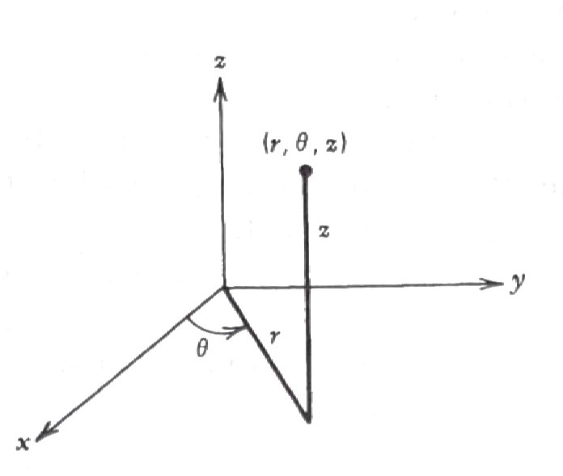{width="55%" fig-align="center"}

    $$\begin{matrix}
        x = r\cos \theta \\ 
        y = r\sin \theta \, \\
        z = z \quad\;\;\;
        \end{matrix} \;\; \Rightarrow \;\;
        \begin{matrix}
        r^2 = x^2 + y^2 \;\;\;\\ 
        \tan\theta = y/x  \quad\; \\
        z=z \qquad\;\;\;\;
    \end{matrix}$$

    Changing the Laplacian $\,\nabla^2 u = u_{xx} +u_{yy} +u_{zz}\,$ to cylindrical coordinates, $\,$we can show

    $$ \color{red}{\nabla^2 u = u_{rr} +\frac{1}{r} u_r +\frac{1}{r^2} u_{\theta\theta} +u_{zz}}$$

  * Spherical Coordinates

    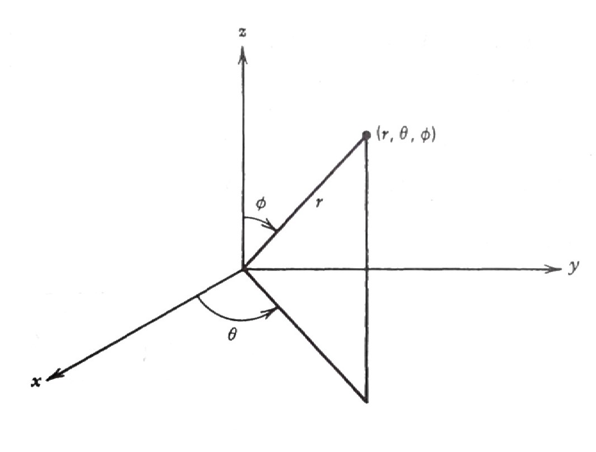{width="65%" fig-align="center"}

    $$\begin{matrix}
    x = r\sin\phi\cos \theta \\ 
    y = r\sin\phi\sin \theta \, \\
    z = r\cos\phi \quad\;\;\;
    \end{matrix} \;\; \Rightarrow \;\;
    \begin{matrix}
    r^2 = x^2 + y^2 +z^2 \;\;\;\\ 
    \cos\phi = z/r \qquad\;\;\;\;\\
    \tan\theta=y/x \qquad\;\;\;\;
    \end{matrix}$$

    Finally, $\,$if we write the Laplacian in spherical coordinates, $\,$we have

    $$\scriptsize \begin{aligned}
    \nabla^2u &= u_{xx} +u_{yy} +u_{zz}\\ 
    &\Updownarrow \\ 
    u_x = u_r r_x +u_\phi \phi_x+u_\theta \theta_x &= u_r \sin\phi\cos\theta +u_\phi \frac{\cos\phi\cos\theta}{r}
    -u_\theta \frac{\sin\theta}{r\sin\phi}\\ 
    u_y = u_r r_y +u_\phi \phi_y+u_\theta \theta_y &= u_r \sin\phi\sin\theta +u_\phi \frac{\cos\phi\sin\theta}{r}
    +u_\theta \frac{\cos\theta}{r \sin\phi}\\ 
    u_z = u_r r_z +u_\phi \phi_z+u_\theta \theta_z &= u_r \cos\phi -u_\phi\frac{\sin\phi}{r} \\ 
    &\Downarrow \\
        u_{xx} = (u_x)_r r_x +(u_x)_\phi \phi_x+(u_x)_\theta \theta_x &= 
    {\tiny \left( u_{rr} \sin\phi\cos\theta +u_{\phi r} \frac{\cos\phi\cos\theta}{r} -u_\phi\frac{\cos\phi\cos\theta}{r^2}
        -u_{\theta r} \frac{\sin\theta}{r\sin\phi} +u_\theta\frac{\sin\theta}{r^2\sin\phi} \right) 
        \sin\phi\cos\theta} \\
    { \tiny +\left( u_{r\phi}\sin\phi \cos\theta \right. }&{\tiny\, \left. +u_r\cos\phi\cos\theta +u_{\phi\phi} \frac{\cos\phi\cos\theta}{r} -u_{\phi} \frac{\sin\phi\cos\theta}{r} 
        -u_{\theta\phi} \frac{\sin\theta}{r\sin\phi} +u_\theta \frac{\sin\theta\cot\phi}{r\sin\phi}
    \right)\frac{\cos\phi \cos\theta}{r}} \\
    {\tiny -\left( u_{r\theta}\sin\phi\cos\theta \right. }&{\tiny \, \left. -u_r \sin\phi\sin\theta +u_{\phi\theta} \frac{\cos\phi\cos\theta}{r} 
    -u_\phi \frac{\cos\phi\sin\theta}{r} -u_{\theta\theta}\frac{\sin\theta}{r\sin\phi} -u_\theta \frac{\cos\theta}{r\sin\phi} \right) 
    \frac{\sin\theta}{r\sin\phi} }\qquad\qquad
    \end{aligned}$$

    $$\scriptsize \begin{aligned}
        u_{yy} = (u_y)_r r_y +(u_y)_\phi \phi_y+(u_y)_\theta \theta_y &= 
    {\tiny \left( u_{rr} \sin\phi\sin\theta +u_{\phi r} \frac{\cos\phi\sin\theta}{r}  -u_\phi\frac{\cos\phi\sin\theta}{r^2}
        +u_{\theta r} \frac{\cos\theta}{r\sin\phi} -u_\theta\frac{\cos\theta}{r^2\sin\phi} \right) 
        \sin\phi\sin\theta }\\
    {\tiny+\left( u_{r\phi}\sin\phi \sin\theta \right.} &{\tiny\, \left. +u_r\cos\phi\sin\theta +u_{\phi\phi} \frac{\cos\phi\sin\theta}{r} -u_{\phi} \frac{\sin\phi\sin\theta}{r} 
        +u_{\theta\phi} \frac{\cos\theta}{r\sin\phi} -u_\theta \frac{\cos\theta\cot\phi}{r\sin\phi}
    \right)\frac{\cos\phi \sin\theta}{r}} \\
    {\tiny+\left( u_{r\theta}\sin\phi\sin\theta \right.} &{\tiny \, \left.+u_r \sin\phi\cos\theta +u_{\phi\theta} \frac{\cos\phi\sin\theta}{r} 
    +u_\phi \frac{\cos\phi\cos\theta}{r} +u_{\theta\theta}\frac{\cos\theta}{r\sin\phi} -u_\theta \frac{\sin\theta}{r\sin\phi} \right) 
    \frac{\cos\theta}{r\sin\phi} }\\
        u_{zz} = (u_z)_r r_z +(u_z)_\phi \phi_z+(u_z)_\theta \theta_z 
        &={\tiny \left( u_{rr}\cos\phi -u_{\phi r}\frac{\sin\phi}{r} +u_\phi\frac{\sin\phi}{r^2} \right) \cos\phi} 
        {\tiny +\left( -u_{r\phi}\cos\phi \right. +}{\tiny\, \left. u_{r}\sin\phi +u_{\phi\phi}\frac{\sin\phi}{r} +u_\phi\frac{\cos\phi}{r} \right) \frac{\sin\phi}{r}}\\ 
        &\Downarrow \\
        \color{red}{\nabla^2 u =u_{rr} +\frac{2}{r} u_r }&\color{red}{+\frac{1}{r^2}u_{\phi\phi} +\frac{\cot\phi}{r^2} u_{\phi} +\frac{1}{r^2\sin^2\phi}u_{\theta\theta}} \\
        \color{red}{= \frac{1}{r^2}\left(  r^2 u_r \right)_r }& \color{red}{+\frac{1}{r^2 \sin\phi} \left( \sin\phi\, u_\phi \right)_\phi +\frac{1}{r^2\sin^2\phi}u_{\theta\theta}}
    \end{aligned}$$

$~$

**NOTES**

* The Laplacian in cartesian coordinates is the only one with constant coefficients. $\,$This is one reason why problems in other coordinate systems are harder to solve. $\,$It is still possible to use the separation of variables for these equations with variable coefficients; $\,$it's just that some of the resulting ordinary differential equations have variables coefficients

* We arrive at a lot of fairly complicated equations, $\,$such as Bessel's equation, $\,$Legendre equation, and other so-called classical equations of physics. $\,$To solve these equations, $\,$we must resort to infinite-series solutions and, $\,$in particular, $\,$the method of Frobenious

$~$

**Example** $\,$ What is the wave equation $\,u_{tt}=c^2\nabla^2 u\,$ in polar coordinates if you know that the solution $\,u\,$ depends only on $\,r\,$ and $\,t$

$~$

**Example** $\,$ What is Laplace's equation in spherical coordinates if the solution $\,u\,$ depends only on $\,r$? $\,$Can you find the solutions of this equation? These are the spherically symmetric potentials in three dimensions

$~$

## $~$General Nature of Boundary-Value Problems {#sec-x3-32}

* Many important problems whose outcomes do not change with time are described by elliptic boundary-value problems. $\,$There are two common situations in physical problems that give rise to PDEs that don't involve time; $\,$they are:

  1. $\;$Steady-state problems

  2. $\;$Problems where we factor out the time component in the solution

* When studying boundary-value problems (BVPs), $\,$there are three types of BCs that are most common; $\,$we discuss these three types now

* **Dirichlet Problems**

  Here, $\,$the PDE holds over a given region of space, $\,$and the solution is specified on the boundary of the region. $\,$An example would be to find the steady-state temperature inside a circle with the temperature given on the boundary

  $$ u_{rr} +\frac{1}{r}u_r + \frac{1}{r^2} u_{\theta\theta}=0, $$
  $$\;\; u(1,\theta) = \sin\theta, \;\;\;0 < r < 1,\;\;\; 0 \leq \theta < 2\pi$$

  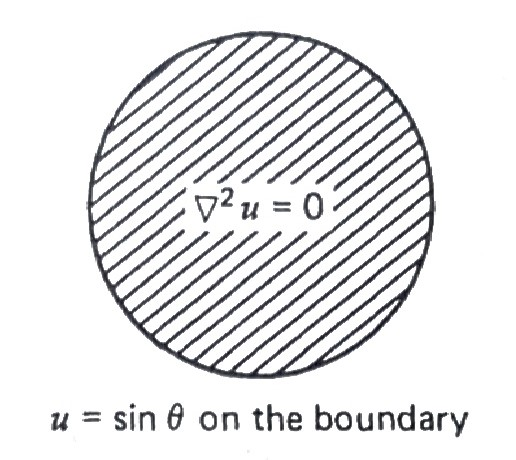{width="45%" fig-align="center"}

  Another example would be an exterior Dirichlet problem in which we are looking for the solution of Laplace's equation outside the unit circle, $\,$and the boudary condition is given on the circle

  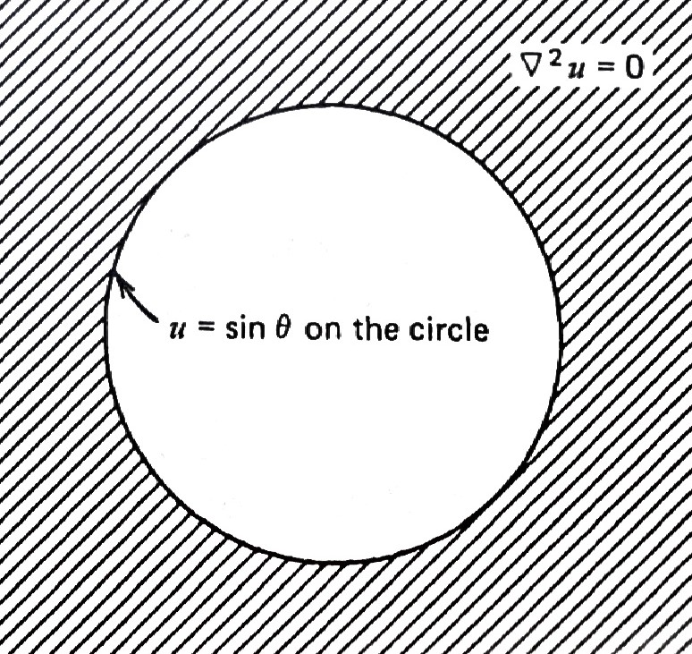{width="45%" fig-align="center"}

* **Neumann Problems**

  Here, $\,$the PDE holds in some region of space, $\,$but now the outward normal derivative 
  
  $$\frac{\partial u}{\partial n}$$ 
  
  (which is proportional to the inward flux) is specified on the boundary. $\,$For example, $\,$suppose the inward flow of heat varies around the circle according to

  $$ \frac{\partial u}{\partial r}=\sin\theta$$

  The steady-state temperature inside the circle would then be given by the solution of the BVP

  $$ \nabla^2 u = 0, \quad 0 < r < 1$$

  $$ \frac{\partial u}{\partial r} =\sin\theta, \quad r=1, \;\; 0 \leq \theta < 2\pi$$

  Here, $\,$we can see that the flux of heat across the boundary is inward for $\,0 \leq \theta \leq \pi\,$ and outward for $\,\pi \leq \theta < 2\pi$

  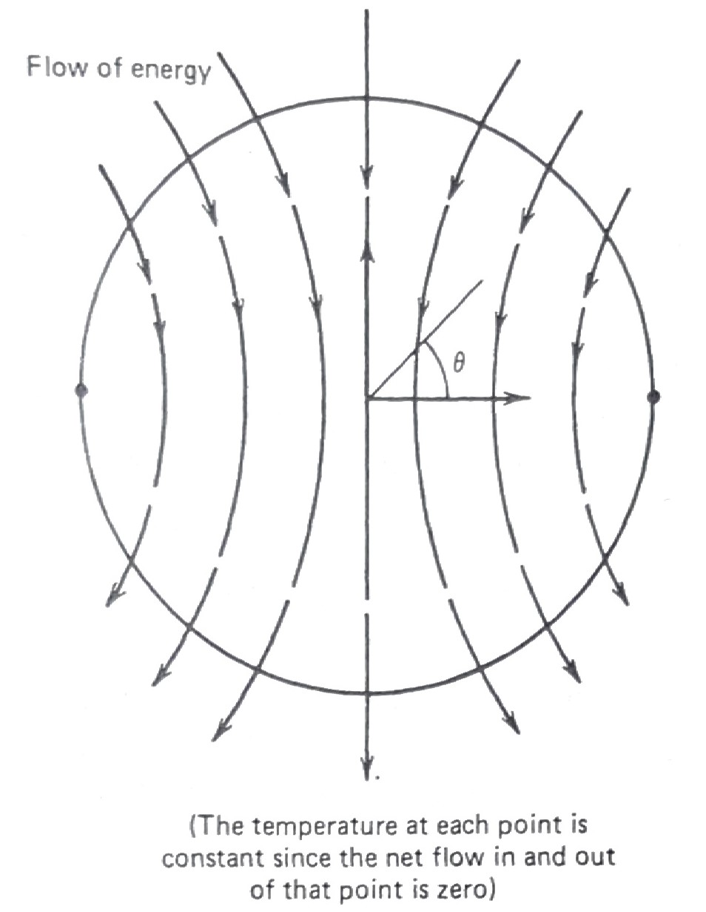{width="40%" fig-align="center"}  

  However, $\,$since the total flux

  $$ \int_0^{2\pi} \frac{\partial u}{\partial r}\, d\theta\;=\int_0^{2\pi} \sin\theta \,d\theta = 0$$

  (a condition that must be true for Neumann problems), $\,$we can say that the temperature at each point inside circle does not change with respect to time. $\,$In other words, $\,$Neumann problems make sense only if the net gain in heat across the boundary is zero

  The Neumann problem is somewhat different from other boundary conditions, $\,$in that solutions are not unique. $\,$In other words, $\,$the above Neumann problem has an infinite number of solutions $\,u(r,\theta)$. $\,$Once we have one solution, $\,$we can get the others just by adding a constant. $\,$For example, $\,$one solution to our Neumann problem is

  $$ u(r,\theta)=r\sin\theta$$

  and it is obvious that if we add a constant to this solution, $\,$another one is obtained. $\,$For this reason, $\,$if we want to find one solution to the Neumann problem, $\,$we must have some additional information (like knowing the solution at one point)

* **Robin Problems**

  These problems correspond to the PDEs being given in some region of space, $\,$but now the condition on the boundary is a mixture of the first two kinds

  $$ \frac{\partial u}{\partial n} = -h(u -g)$$

  where $\,h\,$ is a constant and $\,g\,$ is a given function that can vary over the boundary. $\,$This BC says the inward flux across the boundary is proportional to the difference between the boundary value of $\,u\,$ and specified environment value $\,g\,$ 

  In heat transfer, $\,$this, $\,$of course, $\,$is just Newton's law of cooling. $\,$The constant $\,h\,$ is a physical parameter that measures the amount of flux across the boundary per difference between $\,u\,$ and $\,g$. $\,$If $\,h\,$ is large, $\,$and so the solution looks very much like the solution of the Dirichlet problem $\,u=g$. $\,$On the order hand, $\,$if $\,h=0$, then the BC is reduced to the insulated BC

  $$ \color{blue}{\frac{\partial u}{\partial r}=0} $$

$~$

**Example** $\,$ Does the following Neumann have a solution inside the circle?

$$ \nabla^2 u = 0, \quad 0 < r < 1$$

$$ \frac{\partial u}{\partial r} =\sin^2\theta, \quad r=1, \;\; 0 \leq \theta < 2\pi$$

$~$

**Example** $\,$ For different values of $h$, $~$imagine the solution $u(r,\theta)\,$ to

$$ \nabla^2 u = 0, \quad 0 < r < 1$$

$$ \frac{\partial u}{\partial r} +h(u -\sin\theta)=0, \quad r=1, \;\; 0 \leq \theta < 2\pi$$

$~$

## Interior Dirichlet Problem for a Circle {#sec-x3-33}

* This section presents a number of new ideas to solve the interior Dirichlet problem for the circle

  $$ \color{red}{u_{rr} +\frac{1}{r}u_r + \frac{1}{r^2} u_{\theta\theta}=0, \;\;\;0 < r < 1}$$

  $$ \color{red}{u(1,\theta) = g(\theta), \;\;\; 0 \leq \theta < 2\pi}$$

  The method of separation of variables will be the usual procedure

  $$\scriptsize\begin{aligned}
    u_{rr} +\frac{1}{r}u_r 
    &+\frac{1}{r^2}u_{\theta\theta}= 0 \\ 
    u(1,\theta) &= g(\theta) \\ 
    &\Downarrow u(r,\theta)=R(r)\Theta(\theta)\\ 
  \end{aligned}$$

  $$\scriptsize\begin{aligned}
    -\frac{r^2R'' +rR'}{R} 
     &= \frac{\;\Theta''}{\Theta} =-\lambda \leq 0 \\ 
    &\Downarrow \\
    \Theta'' +\lambda \Theta =0 
     \;\; \xrightarrow[] 
      {\;\;\Theta(0)=\Theta(2\pi),\;\Theta'(0)
      =\Theta'(2\pi)\;\;} 
        &\;\;\Theta_n(\theta)=a_n \cos n\theta 
        +b_n \sin n\theta, \;\; \lambda_n =n^2, 
        \;\; n=0,1,2,\cdots \\
    &\Downarrow \\
    r^2R_0'' +rR_0'=0\; 
     &\xrightarrow[]{\;\;| R_0(0)| \,<\,\infty  \;\;} 
      \;\; R_0(r)=1 \\ 
    r^2R_n''+rR_n' -n^2 R_n=0,\;\;n =1,2,\cdots\; 
     &\xrightarrow[]{\;\; | R_n(0) | \,<\,\infty \;\;} 
      \;\;R_n(r)= r^n \\ 
    &\Downarrow \\
    \color{red}{u(r,\theta) =\frac{a_0}{2} 
     +\sum_{n=1}^\infty }
     &\color{red}{ r^n \left( a_n \cos n\theta 
      +b_n \sin n\theta \right)} \\
    a_n = \frac{1}{\pi} \int_0^{2\pi} &g(\theta) 
     \cos n\theta \,d\theta \\
    b_n = \frac{1}{\pi} \int_0^{2\pi} &g(\theta) 
     \sin n\theta \,d\theta
  \end{aligned}$$

  * The solution can be interpreted as expanding the boundary function $\,g(\theta)\,$ as a Fourier series

    $$ g(\theta)=\frac{a_0}{2} +\sum_{n=1}^\infty \left(a_n \cos n\theta +b_n \sin n\theta \right)$$

      and solve the problem for $\,\cos n\theta\,$ and $\,\sin n\theta\,$ in the series. $\,$Since each of these terms will give rise to solutions $\,r^n\cos n\theta\,$ and $\,r^n \sin n\theta$, $\,$we can then say (by superposition) that

    $$ u(r,\theta)=\frac{a_0}{2} +\sum_{n=1}^\infty {\color{red}{r^n}} \left(a_n \cos n\theta +b_n \sin n\theta \right)$$

  * Note that the constant term $\,\displaystyle\frac{a_0}{2}\,$ in the solution represents the average of $\,g(\theta)$

    $$ \frac{a_0}{2} = \frac{1}{2\pi} \int_0^{2\pi} g(\theta)\,d\theta$$

  * If the radius of the circle was arbitrary (say $R$), $\,$then the solution would be

    $$ u(r,\theta)=\frac{a_0}{2} +\sum_{n=1}^\infty \left(\frac{r}{R}\right)^n \left(a_n \cos n\theta +b_n \sin n\theta \right)$$

    This completes our discussion of the separation of variables solution. $\,$We now go to the interesting Poisson integral formula

$~$

**Example** $\,$The solution of

$$ \quad\;\;\;\nabla^2 u = 0, \quad 0 < r < 1$$

$$\begin{aligned}
 u(1, \theta)&=1 + \sin\theta +\frac{1}{2}\sin3\theta +\cos 4\theta \\ 
\end{aligned}$$

would be

$$\begin{aligned}
 u(r, \theta)&=1 + r\sin\theta +\frac{r^3}{2}\sin3\theta +r^4\cos 4\theta \\ 
\end{aligned}$$

$~$

* **Poisson Integral Formula**

  We start with the separation of varaiables solution

  $$ u(r,\theta)
   =\frac{a_0}{2} +\sum_{n=1}^\infty 
    \left(\frac{r}{R}\right)^n \left(a_n \cos n\theta 
     +b_n \sin n\theta \right)$$

  and substitute the coefficients $\,a_n\,$ and $\,b_n$. $\,$After a few manipulations, $\,$we have

  $$\scriptsize\begin{aligned}
  u(r,\theta) 
    &= \frac{1}{2\pi} \int_0^{2\pi} 
     g(\alpha)\,d\alpha +\frac{1}{\pi} 
    \sum_{n=1}^\infty \left(\frac{r}{R} \right)^n 
     \int_0^{2\pi} g(\alpha) 
      \left( \cos n\alpha\cos n\theta
      +\sin n\alpha \sin n\theta \right)\,d\alpha \\ 
    &= \frac{1}{2\pi} \int_0^{2\pi}  
     \left\{ 1 +2\sum_{n=1}^\infty 
     \left(\frac{r}{R} \right)^n 
      \cos n(\theta -\alpha) \right\} 
       \,g(\alpha)\,d\alpha \\ 
  \end{aligned}$$

  $$\scriptsize\begin{aligned}
 &= \frac{1}{2\pi} \int_0^{2\pi}  \left\{  1 +\sum_{n=1}^\infty \left(\frac{r}{R} \right)^n \left[e^{in(\theta -\alpha)} +e^{-in(\theta -\alpha)}  \right] \right\}\,g(\alpha)\,d\alpha \\ 
 &= \frac{1}{2\pi} \int_0^{2\pi}  \left\{  1 +\frac{re^{i(\theta -\alpha)}}{R -re^{i(\theta -\alpha)}} 
 +\frac{re^{-i(\theta -\alpha)}}{R -re^{-i(\theta -\alpha)}} \right\}\,g(\alpha)\,d\alpha \\ 
 &= \color{red}{\frac{1}{2\pi} \int_0^{2\pi}  \left\{ \frac{R^2 -r^2}{R^2 +r^2 -2rR\cos(\theta -\alpha)} \right\}\,g(\alpha)\,d\alpha} 
\end{aligned}$$

  This last equation is what we were looking for; $\,$it's the Poisson Integral Formula

  * We can interpret the Poisson integral solution as finding the potential $\,u\,$ at $\,(r,\theta)\,$ as a weighted average of the boundary potentials $\,g(\theta)\,$ weighted by the Poisson kernel

    $$\text{Poisson kernel}=\frac{R^2 -r^2}{R^2 +r^2 -2rR\cos(\theta -\alpha)}$$

    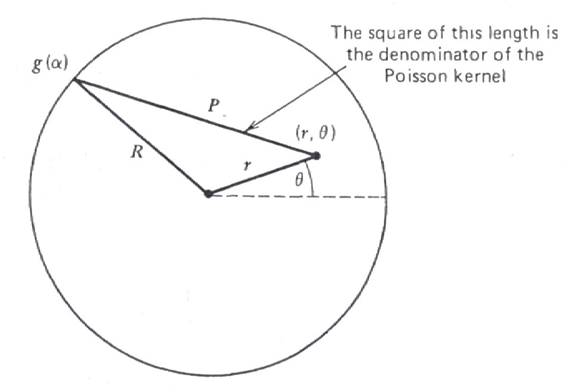{width="45%" fig-align="center"}

    For boundary values $\,g(\alpha)\,$ close to $\,(r,\theta)\,$, $\,$the Poisson kernel gets larger, $\,$since the denominator of the Poisson kernel is the square of the distance from $\,(r,\theta)\,$ to $\,(R,\alpha)$

  * If we evaluate the potential at the center of the circle by the Poisson integral, $\,$we find

    $$ u(0,0) = \frac{1}{2\pi} \int_0^{2\pi} g(\theta) \,d\theta$$

    In other words, $\,$the potential at the center of the circle is the average of the boundary potential

$~$

## The Dirichlet Problem in an Annulus and in an Exterior {#sec-x3-34}

* The Dirichlet problem between two circles (annulus) is

  $$ \color{red}{u_{rr} +\frac{1}{r}u_r + \frac{1}{r^2} u_{\theta\theta}=0, \;\;R_1 < r < R_2}$$
  $$\;\; \color{red}{\begin{aligned} u(R_1,\theta) &= g_1(\theta) \\ u(R_2,\theta) &= g_2(\theta) \end{aligned}, \;\;\; 0 \leq \theta < 2\pi}$$

  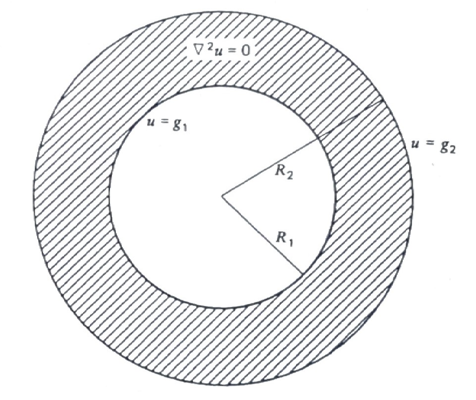{width="45%" fig-align="center"}

* We begin by looking for solutions of the form

  $$ u(r,\theta)=R(r)\Theta(\theta)$$

  Substituting this into Laplace's equation, $\,$we get the two following ODEs in $\,R(r)\,$ and $\,\Theta(\theta)$:

  $$\begin{aligned}
  &r^2 R'' +rR' -\lambda R = 0 \quad (\text{Euler's equation}) \\ 
  &\Theta'' +\lambda \Theta = 0 
  \end{aligned}$$

  Note that in the two equations, $\,$we required the separation constant $\,\lambda\,$ to be greater than, $\,$or equal to zero, $\,$or else the solution for $\,\Theta(\theta)\,$ would not be periodic

* Solving these two ODEs, $\,$we now have

  $$\begin{aligned}
  \lambda = 0 \;\; 
  &\begin{cases}
  \Theta(\theta)= \alpha + \beta\theta \\
  R(r) = \gamma + \delta\ln r 
  \end{cases} \\ 
  \lambda > 0 \;\;
  &\begin{cases}
  \Theta(\theta)=  a\cos\sqrt{\lambda}\theta +b\sin \sqrt{\lambda}\theta\\ 
  R(r) = cr^{\sqrt{\lambda}} +dr^{-\sqrt{\lambda}}   
  \end{cases} 
  \end{aligned}$$

  and using the requirement that $\,\Theta(\theta)\,$ must be periodic with period $\,2\pi$, $\,$we have that $\,\beta=0 \,\text{ at }\, \lambda=0\,$ and $\,\lambda (>0)\,$ must be $\,n^2$, $\,n= 0,1,2,\cdots$

* Hence, $\,$we arrive at the following solutions to Laplace's equation

  $$\begin{aligned}
    &1 \;\;\;(\text{constants}) \\ 
    &\ln r \\ 
    &r^n \cos n\theta \\ 
    &r^n \sin n\theta \\ 
    &r^{-n} \cos n\theta \\
    &r^{-n} \sin n\theta 
  \end{aligned}$$

* Since any sum of these solutions is also a solution, $\,$we arrive at our general solution

  $$ \color{red}{u(r,\theta) = 
   \frac{a_0}{2} +\frac{\tilde{a_0}}{2} \ln r 
    +\sum_{n=1}^\infty \left[ \left(a_n r^n 
     +\tilde{a_n} r^{-n}\right) \cos n\theta +
  \left(b_n r^n +\tilde{b_n} r^{-n}\right) 
  \sin n\theta \right]}$$

  The only task left is to determine the constants in the sum so that $\,u(r,\theta)\,$ satisfies the BCs

  $$ \begin{aligned} u(R_1,\theta) &= g_1(\theta) \\ u(R_2,\theta) &= g_2(\theta) \end{aligned}, \;\;\; 0 \leq \theta < 2\pi$$

* Substituting the general solution into these BCs and integrating gives the following equations

  $$\scriptsize\begin{aligned}
  &\begin{cases}
    a_0 +\tilde{a_0} \ln R_1 
     =\displaystyle \frac{1}{\pi} \int_0^{2\pi} 
      g_1(\alpha)\,d\alpha \\ 
    a_0 +\tilde{a_0} \ln R_2 
     =\displaystyle \frac{1}{\pi} \int_0^{2\pi} 
      g_2(\alpha)\,d\alpha
   \end{cases} &&\text{Solve for } a_0, \tilde{a_0} \\ 
  &\begin{cases}
    a_n R_1^n +\tilde{a_n} R_1^{-n} 
     =\displaystyle \frac{1}{\pi} \int_0^{2\pi} 
      g_1(\alpha) \cos n\alpha \,d\alpha \\ 
    a_n R_2^n +\tilde{a_n} R_2^{-n} 
     =\displaystyle \frac{1}{\pi} \int_0^{2\pi} 
      g_2(\alpha) \cos n\alpha \,d\alpha
  \end{cases} &&\text{Solve for } a_n, \tilde{a_n} \\ 
  &\begin{cases}
    b_n R_1^n +\tilde{b_n} R_1^{-n} 
     =\displaystyle \frac{1}{\pi} \int_0^{2\pi} 
      g_1(\alpha) \sin n\alpha \,d\alpha \\ 
    b_n R_2^n +\tilde{b_n} R_2^{-n} 
     =\displaystyle \frac{1}{\pi} \int_0^{2\pi} 
      g_2(\alpha) \sin n\alpha \,d\alpha
   \end{cases} &&\text{Solve for } b_n, \tilde{b_n}
  \end{aligned}$$

$~$

**Example** $\,$ Suppose the potential on the inside circle is zero, $\,$while the outside potential is $\,\sin \theta$

$$ u_{rr} +\frac{1}{r}u_r + \frac{1}{r^2} u_{\theta\theta}=0, \;\;\;1 < r < 2$$

$$ \begin{aligned} u(1,\theta) &= 0 \\ u(2,\theta) &= \sin\theta \end{aligned}, \;\;\; 0 \leq \theta < 2\pi$$

Solving the necessary equations for $\,a_0, \tilde{a_0}$, $a_n, \tilde{a_n}$, $b_n$, and $\tilde{b_n}\,$ yields

$$ u(r,\theta)=\frac{2}{3} \left(r -\frac{1}{r} \right) \sin \theta$$

$~$

**Example** $\,$ Consider the problem with constant potentials on the boundaries

$$ u_{rr} +\frac{1}{r}u_r + \frac{1}{r^2} u_{\theta\theta}=0, \;\;\;1 < r < 2 $$

$$ \begin{aligned} u(1,\theta) &= 3 \\ u(2,\theta) &= 5 \end{aligned}, \;\;\; 0 \leq \theta < 2\pi $$

In this case, $\,$since it's obvious that the solution is independent of $\,\theta$, $\,$we know our solution must be of the form $\,a_0 +\tilde{a_0} \ln r$. $\,$Using our two equations for $\,a_0\,$ and $\,\tilde{a_0}$, $\,$we obtain

$$ u(r,\theta)=3 +\frac{2}{\ln 2} \ln r$$

The only solutions of the two dimensional Laplace equation that depend only on $\,r\,$ are constant and $\,\ln r$. $\,$The potential $\,\ln r\,$ is very important and is called the logarithmic potential

$~$

**Example** $\,$ Another interesting problem is

$$ u_{rr} +\frac{1}{r}u_r + \frac{1}{r^2} u_{\theta\theta}=0, \;\;\;1 < r < 2$$

$$ \begin{aligned} u(1,\theta) &= \sin\theta \\ u(2,\theta) &= \sin\theta \end{aligned}, \;\;\; 0 \leq \theta < 2\pi$$

A quick check of the coefficients reveals that they are all zero except for $\,b_1\,$ and $\,\tilde{b}_1$. $\,$Solving for $\,b_1\,$ and $\,\tilde{b_1}\,$ gives the solution

$$ u(r,\theta)=\left(\frac{r}{3} +\frac{2}{3r}\right) \sin\theta$$

$~$

* **Exterior Dirichlet Problem**

  The exterior Dirichlet problem

  $$ u_{rr} +\frac{1}{r}u_r + \frac{1}{r^2} u_{\theta\theta}=0, \;\;\;\color{red}{R_1 < r < \infty}$$

  $$ u(R_1,\theta)=g(\theta), \;\;\; 0 \leq \theta < 2\pi$$

  is solved exactly like the interior Dirichlet problem except that now we throw out the solutions that are unbounded as $\,r\,$ goes to infinity

  Hence, $\,$we left with the solution

  $$ \color{red}{u(r,\theta)= \frac{a_0}{2} +\sum_{n=1}^{\infty} \left(\frac{r}{R_1}\right)^{-n}\left( \tilde{a_n} \cos n\theta +\tilde{b_n} \sin n \theta \right)}$$

  where $\,a_0$, $\,\tilde{a_n}\,$ and $\,\tilde{b_n}\,$ are exactly as Fourier series. $\,$In other words, $\,$we merely expand $\,u(R_1,\theta)=g(\theta)\,$ as a Fourier series

  $$ g(\theta)=\frac{a_0}{2} +\sum_{n=1}^\infty \left( \tilde{a_n} \cos n\theta +\tilde{b_n} \sin n\theta \right)$$

  and then insert the factor $\,\displaystyle\left(\frac{r}{R_1}\right)^{-n}\,$ in each term to get the solution

$~$

**Example** $\,$ The exterior problem 

$$ u_{rr} +\frac{1}{r}u_r + \frac{1}{r^2} u_{\theta\theta}=0, \;\;\;1 < r < \infty$$

$$ u(1,\theta)=1 +\sin\theta +\cos 3\theta, \;\;\; 0 \leq \theta < 2\pi$$

has the solution

$$ u(r,\theta)=1 +\frac{1}{r}\sin\theta +\frac{1}{r^3}\cos 3\theta, \;\;\; 0 \leq \theta < 2\pi$$

$~$

**Example** $\,$ The exterior Neumann problem

$$ u_{rr} +\frac{1}{r}u_r + \frac{1}{r^2} u_{\theta\theta}=0, \;\;\;1 < r < \infty$$

$$ \frac{\partial u}{\partial r}(1,\theta)=g(\theta), \;\;\; 0 \leq \theta < 2\pi$$

has a solution that is the same form as the Dirichlet problem

$$ u(r,\theta)= \frac{a_0}{2} +\sum_{n=1}^{\infty} r^{-n}\left( \tilde{a_n} \cos n\theta +\tilde{b_n} \sin n \theta \right)$$

but now the coefficients $\,a_0$, $\,\tilde{a_n}$ and $\,\tilde{b_n}\,$ must satisfy the new BC.
Of course, once you have this solution, $\,$any constant plus this solution is also a solution

$~$

## Laplace's Equation in Spherical Coordinates (Spherical Harmonics) {#sec-x3-35}

* An important problem in physics is to find the potential inside or outside a sphere when the potential is given on the boundary 

* For the interior problem, $\,$we must find the solution $\,u(r,\phi,\theta)\,$ that satisfies

  $$ \left( r^2 u_r \right)_r +\frac{1}{\sin\phi} \left( \sin\phi\, u_\phi \right)_\phi +\frac{1}{\sin^2\phi} u_{\theta\theta} = 0 $$

   $$ u(1,\phi,\theta)=g(\phi,\theta), \;0\leq \theta <2\pi,\;0 \leq \phi < \pi $$ 

  Note that this spherical Laplacian is written in a different form than those we've seen before. $\,$This form is slightly more compact and easier to use

* Quite often $\,g(\phi,\theta)\,$ has a specific form, $\,$so that it isn't necessary to solve the problem in its most general form. $\,$Two important special cases are considered in this Lesson. $\,$One is the case when $\,g(\phi,\theta)\,$ is constant, $\,$and the other is when it depends only on the angle $\,\phi\,$ (the angle from the north pole)

  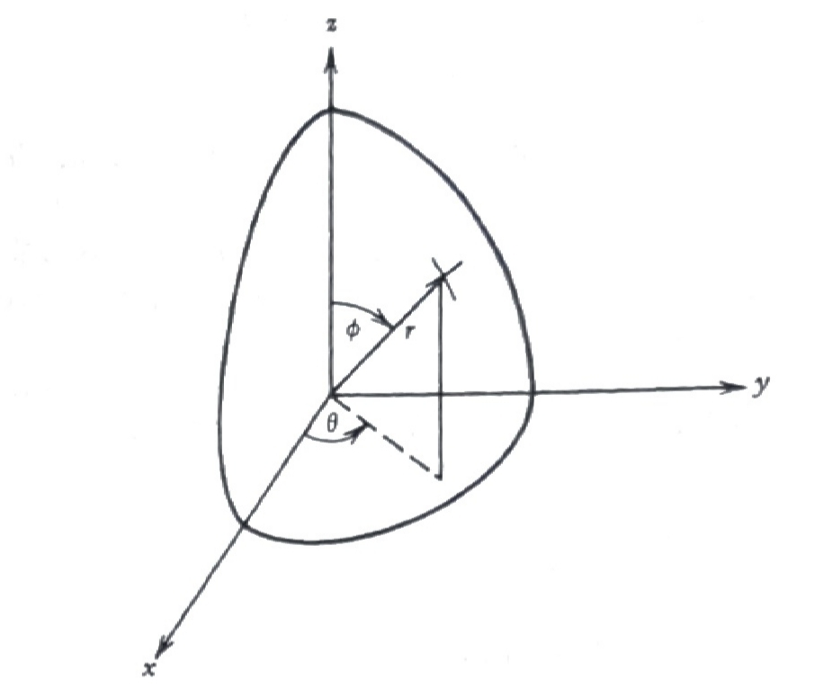{width="45%" fig-align="center"}

* **Special Case 1** $\,$ $-\;\;\color{red}{g(\phi,\theta) = \text{constant}}$

  In this case, $\,$it is clear that the solution is independent of $\,\phi\,$ and $\,\theta$, $\,$and so Laplace's equation reduces to the ODE

  $$ \left( r^2 u_r \right)_r = 0 $$

  This is a simple ODE that the student can easily solve; $\,$the general solution is 

  $$ u(r)=\frac{a}{r} +b $$

  In other words, $\,$constant and $\,\displaystyle\frac{a}{r}\,$ are the only potential that depend only on the radial distance from the origin. $\,$The potential $\,\displaystyle\frac{1}{r}\,$ is very important in physics and is called the Newtonian potential

$~$

**Example** $\,$ (Potential interior to a sphere)

$$ \nabla^2 u = 0, \;\;\; 0 < r < 1 $$

$$ u(1,\phi,\theta) = 3 $$

Here solution must be $\,u(r,\phi,\theta) = 3\,$ in order to be bounded

$~$

**Example** $\,$ (Potential between two spheres each at constant potential)

Suppose we want to find the steady-state temperature between two spheres held at different temperatures

$$ \nabla^2 u = 0, \;\;\; R_1 < r < R_2 $$

$$\begin{aligned}
 u(R_1,\phi,\theta) &= A \\ 
 u(R_2,\phi,\theta) &= B 
\end{aligned}$$

Since we know the potential has the general solution

$$ u(r)=\frac{a}{r} +b $$

we substitute it in the BCs and solve for $\,a\,$ and $\,b\,$; $\,$doing this gives

$$ u(r)= (A -B) \frac{R_1 R_2}{R_2 -R_1} \frac{1}{r} + \frac{R_2 B -R_1 A}{R_2 -R_1} $$

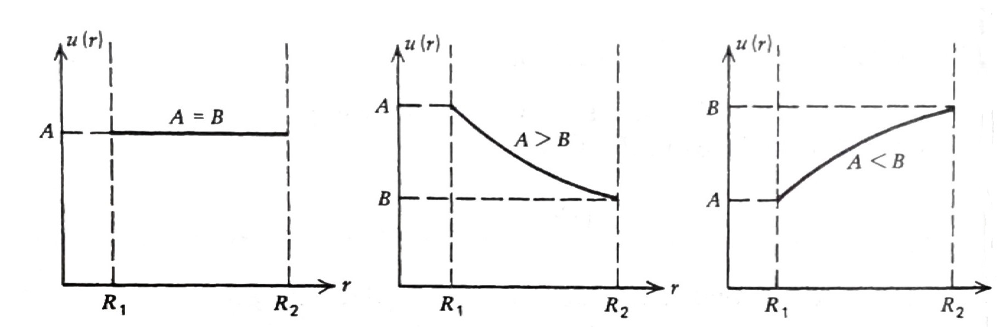{width="75%" fig-align="center"}

$~$

* **Special Case 2** $\,$ $-\;\;\color{red}{g(\phi,\theta) \text{ depends only on } \phi}$

  Here, the Dirichlet problem takes the form

  $$ \left( r^2 u_r \right)_r +\frac{1}{\sin\phi} 
   \left( \sin\phi\, u_\phi \right)_\phi = 0, 
   \;\;\; 0 < r < 1 $$

  $$ u(1,\phi)=g(\phi),\;\;\; 0 \leq \phi \leq \pi $$

  Using separation of variables, $\,$we look for solutions of the form

  $$ u(r,\phi)=R(r)\Phi(\phi) $$

  and arrive at the two ODEs

  $$ \begin{aligned}
    &\left(\sin\phi\, \Phi' \right)' +\lambda \sin\phi \Phi= 0 &&\text{Legendre's equation}\\ 
    &r^2R'' +2rR' -\lambda R = 0 && \text{Euler's equation}
    \end{aligned} $$

  Legendre's equation isn't easy; $\,$the general strategy in solving this equation is to make the substitution

  $$x=\cos\phi$$

  Making this change of variable gives rise to the new Legendre's equation

  $$\scriptsize 
  \begin{aligned}
    \left(\sin\phi\, \Phi' \right)' 
    &+\lambda \sin\phi \Phi= 0\\ 
    &\Downarrow 
    \;\; x=\cos\phi, 
      \;\; \Phi'=\frac{d\Phi}{dx} \frac{dx}{d\phi}
      =-\sin\phi\frac{d\Phi}{dx} \\
    \left(\sin\phi\, \Phi' \right)'
    &=-\frac{d}{dx}
      \left(\sin^2\phi \frac{d\Phi}{dx} \right) 
      \frac{dx}{d\phi}
    =\left(\sin^2\phi \frac{d^2\Phi}{dx^2} 
    +2\sin\phi\cos\phi 
    \frac{d\phi}{dx}\frac{d\Phi}{dx} \right)\sin\phi \\
    &=\left[ (1 -x^2) \frac{d^2\Phi}{dx^2} 
    -2x\frac{d\Phi}{dx} \right] \sin\phi \\
    &\Downarrow \\
      \color{red}{(1 -x^2) \frac{d^2\Phi}{dx^2}} 
    &\color{red}{-2x\frac{d\Phi}{dx} +\lambda \Phi = 0, 
    \;\;\; -1 \leq x \leq 1} \\
    &\Downarrow \\
    \frac{d}{dx} \left[ (1 -x^2) 
    \frac{d\Phi}{dx} \right] 
    &+\lambda \Phi = 0
  \end{aligned}$$

  * One of the difficulties in this equation is that 

    the coefficient $\,(1-x^2)$ of $\displaystyle \,\frac{d^2\Phi}{dx^2}$ is zero at the ends of the domain $-1 \leq x \leq 1$ 
  
    Equations like this are called singular differential equations. $\,$We arrive at a very interesting conclusion

  * The only bounded solutions of Legendre's equation occur when $\,\lambda=n(n +1)$, $\,n=0,1,2,\cdots\,$ and these solutions are Legendre polynomials $\,P_n(x)$

    $$\begin{aligned}
      &P_0(x) = 1 \\ 
      &P_1(x) = x \\ 
      &P_2(x) = \frac{1}{2}(3x^2 -1) \\ 
      &P_3(x) = \frac{1}{2}(5x^3 -3x) \\
      &\qquad \vdots \\
      &P_n(x) = \frac{1}{2^n n!} \frac{d^n}{dx^n} 
       \left[ (x^2 -1)^n \right]
    \end{aligned}$$

    The graphs of a few Legendre polynomials are shown in

    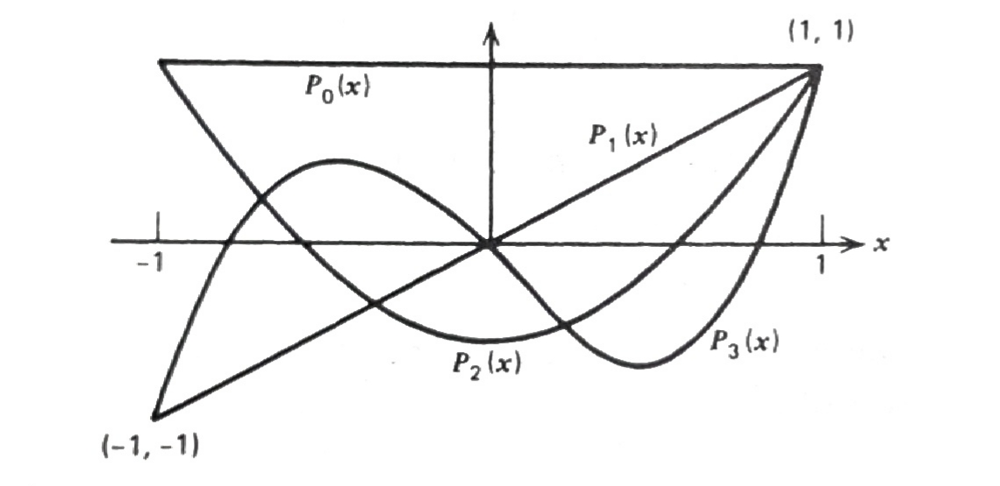{width="65%" fig-align="center"}

  * We now solve Euler's equation by substituting $\,\lambda = n(n+1)\,$ and $\,R(r)=r^\alpha\,$ in the equation and solving for $\,\alpha$. $\,$Doing this, $\,$we get two values

    $$\alpha = \begin{cases}
      \phantom{-(n \,} n \\ 
    -(n +1) 
    \end{cases}$$

    and, $\,$hence, $\,$Euler's equation has the general solution

    $$R_n(r)= a_n r^n + b_n r^{-(n +1)} \;\;\xrightarrow[]{\text{ bounded solution }}\;\;a_n r^n$$

  * The final step is to form the sum

    $$ \color{red}{u(r,\phi) = \sum_{n=0}^\infty a_n r^n P_n(\cos\phi)}\;\;\;$$

    in such a way that it agrees with the BC $\,u(1,\phi)=g(\phi)$. $\,$Substituting the above solution into the BC gives

    $$ g(\phi) = \sum_{n=0}^\infty a_n P_n(\cos\phi)$$

    If we multiply each side of this equation by $\,P_m(\cos\phi)\sin\phi\,$ and integrate $\,\phi\,$ from $\,0\,$ to $\,\pi$, $\,$we get

    $$\begin{aligned}
    \int_0^\pi g(\phi) P_m(\cos\phi)\,\sin\phi \,d\phi 
    &= \sum_{n=0}^\infty 
        a_n \int_0^{\pi} P_n(\cos\phi) 
        P_m(\cos\phi)\,\sin\phi \, d\phi \\
        &= \sum_{n=0}^\infty a_n 
        \int_{-1}^1 P_n(x) P_m(x) \,dx \\ 
        &=
    \begin{cases}
        \quad\: 0  & n \neq m \\ 
        \displaystyle \frac{2}{2m +1}\, a_m & n = m 
    \end{cases} \\ 
    &\Downarrow \\ 
    a_n &=\frac{2n +1}{2} \int_0^{\pi} g(\phi) 
        P_n(\cos\phi)\, \sin \phi \,d\phi
    \end{aligned}$$

$~$

**Example** $\,$ Suppose the temperature on the surface of the sphere is given by

$$ g(\phi) = 1 -\cos 2\phi, \quad 0 \leq \phi \leq \pi $$

and suppose we would like to find the temperature inside the sphere. $\,$In this problem, $\,$the temperature is constant on circles of constant latitude. $\,$To find $\,u$, $\,$we must solve

$$ \left( r^2 u_r \right)_r +\frac{1}{\sin\phi} \left( \sin\phi\, u_\phi \right)_\phi = 0, \;\;\; 0 < r < 1 $$

$$u(1,\phi)=1 -\cos 2\phi,\;\;\; 0 \leq \phi \leq \pi $$

Our goal now is to expand $\,g(\phi)\,$ as a series of Legendre polynomials;

$$\begin{aligned}
 1 -\cos 2\phi &= 1 - \left( 2\cos^2\phi -1 \right) \\ 
 &= \frac{4}{3} - \frac{4}{3}\left[ \frac{1}{2} (3\cos^2\phi -1) \right] \\ 
 &= \frac{4}{3} P_0(\cos\phi) -\frac{4}{3}P_2(\cos\phi)\\
 &\Downarrow \\
 a_0 = \frac{4}{3},\;\; a_2&=-\frac{4}{3},\;\;a_1=a_3=a_4=a_5=\cdots =0
\end{aligned}$$

Hence, $\,$the solution to the problem is

$$\begin{aligned}
 u(r,\phi) &= \frac{4}{3} P_0(\cos\phi) -\frac{4}{3} r^2 P_2(\cos\phi)
 = \frac{4}{3} - \frac{2}{3} r^2 (3\cos^2\phi -1) 
\end{aligned}$$

$~$

**NOTE** $\,$ The solution of the exterior Dirichlet problem

  $$\;\;\displaystyle \left( r^2 u_r \right)_r +\frac{1}{\sin\phi} \left( \sin\phi\, u_\phi \right)_\phi = 0, \;\; 1 < r < \infty, \;\;u(1,\phi)=g(\phi),\;\;\; 0 \leq \phi \leq \pi $$

is 
  
$$ u(r,\phi)=\sum_{n=0}^\infty \frac{b_n}{r^{n+1}} P_n(\cos\phi)$$

where $\;\displaystyle b_n = \frac{2n +1}{2} \int_0^\pi g(\phi) P_n(\cos\phi)\, \sin\phi \, d\phi$

For example, $\,$the BC $\,g(\phi)=3\,$ would yield the solution $\,u(r,\theta)=3/r$. $\,$Note that in this problem, $\,$the solution goes to zero, $\,$while in two dimensions, $\,$the exterior solution with constant BC was itself a constant

$~$

* **General Case**  $\,$ $-\;\;\color{red}{g(\phi,\theta)}$

  We consider the boundary value problem

  $$\color{red}{\begin{aligned}
  u_{rr} +\frac{2}{r} u_r &+\frac{1}{r^2}u_{\phi\phi} +\frac{\cot\phi}{r^2} u_{\phi} +\frac{1}{r^2\sin^2\phi}u_{\theta\theta} = 0, \;\; r < R \\ 
  u(R,\phi,\theta) &= g(\phi,\theta)\\ 
  \end{aligned}}$$

  in a sphere of radius $\,R$

  | 1. $~$ Solve this problem by separation of variables, 
  | 2. $~$ Derive $\,K(r,\phi,\theta; R,\varphi,\vartheta)\,$ in the equivalent integral formula:

  $$ u(r,\phi,\theta) = \int_0^{2\pi} \int_0^\pi K(r,\phi,\theta; R,\varphi,\vartheta)\, g(\varphi,\vartheta) \sin\varphi \,d\varphi \, d\vartheta$$

  **1.** $\,$Applying separation of variables, $\,$we find that the equation has the solution of the form $\,R(r) \,\Phi(\phi) \,\Theta(\theta)$, $\,$provided

  $$ -r^2 \sin^2\phi \, \frac{R'' +\frac{2}{r}R'}{R} -\sin\phi\frac{(\sin\phi\, \Phi')'}{\Phi} = \frac{\;\Theta''}{\Theta}= -\mu < 0$$

  Since $\Theta$ must be periodic of period $\,2\pi$, $\,$we have $\,\color{blue}{\Theta=\cos m\theta}\,$ or $\,\color{blue}{\sin m\theta}$, $\,$where $\,\color{blue}{\mu = m^2, \; m = 0, 1, 2,\cdots}$. $\,$Then

  $$\begin{aligned}
    -\frac{r^2 R'' +2rR'}{R} 
    = \frac{(\sin\phi\, \Phi')'}{\sin\phi\,\Phi} 
    &-\frac{m^2}{\sin^2\phi} = -\lambda < 0 \\ 
    &\Downarrow \\ 
    \color{blue}{(\sin\phi\, \Phi')' 
    +\left(\lambda \sin\phi \, 
    {\color{red}{-\frac{m^2}{\sin\phi}}} \right) 
    \Phi } \;& {\color{blue}{= 0}}\\ 
    \color{blue}{r^2 R'' +2r R' -\lambda R} 
     \;&\color{blue}{= 0} 
  \end{aligned}$$

  * The equation for $\,\Phi(\phi)\,$ is singular at its two endpoints $\,\phi=0\,$ and $\,\phi=\pi$. $\,$In lieu of boundary conditions, $\,$we impose the condition that $\,\Phi\,$ and $\,\Phi'\,$ remain bounded at both ends. $\,$This gives an eigenvalue problem with two singular endpoints. $\,$We introduce the new variable $\,x=\cos\phi\,$ and let $\,\Phi(\phi)=P(\cos\phi)$. $\,$Then the equation for $\,\Phi(\phi)\,$ becomes

    $$\color{red}{\frac{d}{dx} 
    \left[\left(1 -x^2\right) \frac{dP}{dx} \right] 
     +\left[\lambda -\frac{m^2}{1 -x^2 } \right] P = 0} 
    \tag{AL}\label{eq:AL}$$ 

  * In the case of $\,m=0$: 

    $$\frac{d}{dx} \left[\left(1 -x^2\right) 
    \frac{dP}{dx} \right] +\lambda P = 0
    \tag{LG}\label{eq:LG}$$ 

    we obtain a function which is bounded for $\,-1 \leq x \leq 1\,$ if and only if

    $$\lambda=n(n+1), \;\; n=0,1,2,\cdots$$

    These, $\,$then, $\,$are the eigenvalues. $\,$Setting $P_n(1)=1$, $\,$we obtain the eigenfunction $\,P_n(x)\,$ corresponding to the eigenvalue $\,\lambda_n=n(n+1)$:

    $$ P_n(x)= \sum_{k=0}^n \frac{(n +k)!}{2^k (k!)^2 (n -k)!}(x - 1)^k\;\;$$

    It is called a **Legendre polynomial**

