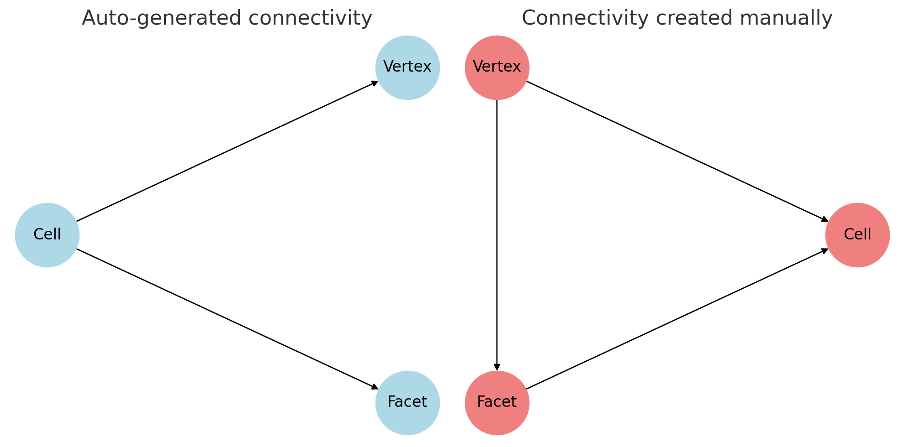

# The FEniCS computing platform {#sec-fenicsx}

**FEniCS** is a popular open-source computing platform for solving partial differential equations (PDEs) with the finite element method (FEM). FEniCS enables users to quickly translate scientific models into efficient finite element code. With the high-level Python and C++ interfaces to FEniCS, it is easy to get started, but FEniCS offers also powerful capabilities for more experienced programmers. FEniCS runs on a multitude of platforms ranging from laptops to high-performance computers

[{width="25%" fig-align="center"}](https://fenicsproject.org)

## Getting started {#sec-fenicsx-getting-started}

The latest stable release of FEniCSx is version 0.9, which was released in October 2024. The easiest way to start using `FEniCSx` on MacOS and other systems is to install it using `conda`:

``` bash
$ conda create -n fenicsx
$ conda activate fenicsx
$ conda install -c conda-forge fenics-dolfinx mpich pyvista 
$ conda install -c conda-forge petsc petsc4py
$ conda install ipykernel
$ python -m ipykernel install \
>       --user --name fenicsx --display-name "FEniCSx"
```
```{python}
import dolfinx
print(f'DOLFINx version: {dolfinx.__version__}')
```

## An Overview of the FEniCS Project {#sec-fenicsx-overview}

* The `FEniCS` Project is a research and software initiative focused on developing mathematical methods and software for solving partial differential equations (PDEs). Its goal is to provide intuitive, efficient, and flexible tools for scientific computing. Launched in 2003, the project is the result of collaboration among researchers from universities and research institutes worldwide. For the latest updates and more information, visit the [FEniCS Project](https://fenicsproject.org/)

* The latest version of the `FEniCS` project, `FEniCSx`, consists of several building blocks, namely `DOLFINx`, `UFL`, `FFCx`, and `Basix`. We will now go through the main objectives of each of these building blocks

  * `DOLFINx` is the high performance `C++` backend of `FEniCSx`, where structures such as meshes, function spaces and functions are implemented. Additionally, `DOLFINx` also contains compute intensive functions such as finite element assembly and mesh refinement algorithms. It also provides an interface to linear algebra solvers and data-structures, such as `PETSc`
  * `UFL` is a high-level form language for describing variational formulations with a high-level mathematical syntax
  * `FFCx` is the form compiler of `FEniCSx`; given variational formulations written with `UFL`, it generates efficient `C` code
  * `Basix` is the finite element backend of `FEniCSx`, responsible for generating finite element basis functions

## What you will learn

The goal of this tutorial is to demonstrate how to apply the finite element to solve PDEs using `FEniCS`. Through a series of examples, we will demonstrate how to:

* Solve linear PDEs (such as the Poisson equation)
* Solve time-dependent PDEs (such as the heat equation)
* Solve non-linear PDEs
* Solve systems of time-dependent non-linear PDEs

Important topics include: how to set boundary conditions of various types (Dirichlet, Neumann, Robin), how to create meshes, how to define variable coefficients, how to interact with linear and non-linear solvers, and how to post-process and visualize solutions

## Solving the Poisson equation {#sec-fenicsx-Poisson}

Authors: Hans Petter Langtangen, Anders Logg, Jørgen S. Dokken

The goal of this section is to solve one of the most basic PDEs, the Poisson equation, with a few lines of code in `FEniCSx`. We start by introducing some fundamental `FEniCSx` objects, such as `functionspace`,`Function`,  `TrialFunction` and `TestFunction`, and learn how to write a basic PDE solver. This will include:

* How to formulate a mathematical variational problem
* How to apply boundary conditions
* How to solve the discrete linear system
* How to visualize the solution

The Poisson equation is the following boundary-value problem:

$$\begin{aligned}
  -\nabla^2 u(\mathbf{x}) &= f(\mathbf{x})&&\mathbf{x} \in \Omega\\
  u(\mathbf{x}) &= u_D(\mathbf{x})&& \mathbf{x} \in \partial\Omega
\end{aligned}$$
 
Here, $u=u(\mathbf{x})$ is the unknown function, $f=f(\mathbf{x})$
is a prescribed function, 
$\nabla^2$ (often written as $\Delta$) is the Laplace operator, $\Omega$
is the spatial domain, and $\partial\Omega$ is its boundary. The Poisson problem  — consisting of the PDE $-\nabla^2 u = f$ together with the boundary condition $u=u_D$ on $\partial\Omega$ — is a boundary value problem that must be precisely defined before we can solve it numerically with `FEniCSx`

 * In the two-dimensional space with coordinates $x$ and $y$, we can expand the Poisson equation as

  $$-\frac{\partial^2 u}{\partial x^2} - \frac{\partial^2 u}{\partial y^2} = f(x,y)$$

  The unknown $u$ is now a function of two variables, $u=u(x,y)$, defined over the two-dimensional domain $\Omega$

  * The Poisson equation arises in numerous physical contexts, including heat conduction, electrostatics, diffusion of substances, twisting of elastic rods, inviscid fluid flow, and water waves. Moreover, the equation appears in numerical splitting strategies for more complicated systems of PDEs, in particular the Navier–Stokes equations

Solving a boundary value problem in `FEniCSx` consists of the following steps:

1. Identify the computational domain $\Omega$, the PDE, and its corresponding boundary conditions and source terms $f$
2. Reformulate the PDE as a finite element variational problem
3. Write a Python program defining the computational domain, the boundary conditions, the variational problem, and the source terms, using `FEniCSx`
4. Run the Python program to solve the boundary-value problem. Optionally, you can extend the program to derive quantities such as fluxes and averages,
   and visualize the results

As we have already covered step 1, we shall now cover steps 2-4

### Finite element variational formulation

`FEniCSx` is based on the finite element method, which is a general and
efficient mathematical technique for the numerical solution of
PDEs. The starting point for finite element methods is a PDE
expressed in _variational form_

The basic recipe for turning a PDE into a variational problem is:

- Multiply the PDE by a function $v$
- Integrate the resulting equation over the domain $\Omega$
- Perform integration by parts of those terms with second order derivatives

The function $v$ that multiplies the PDE is called a *test function*, while the unknown function $u$ to be approximated is referred to as a *trial function*.
The terms *trial function* and *test function* are also used in `FEniCSx`. Both test and trial functions belong to certain *specific function spaces* that define their properties

* In the present case, we multiply the Poisson equation by a test function $v$ and integrate over $\Omega$:

  $$\int_\Omega (-\nabla^2 u) v~\mathrm{d} x = \int_\Omega f v~\mathrm{d} x$$

  Here $\mathrm{d} x$ denotes the differential element for integration over the domain $\Omega$. We will later let $\mathrm{d} s$ denote the differential element for integration over $\partial\Omega$, the boundary of $\Omega$

* A rule of thumb when deriving variational formulations is that one tries to keep the order of derivatives of $u$ and $v$ as small as possible.
Here, we have a second-order differential of $u$, which can be transformed to a first derivative by employing the technique of
[integration by parts](https://en.wikipedia.org/wiki/Integration_by_parts).
The formula reads

  $$-\int_\Omega (\nabla^2 u)v~\mathrm{d}x
  = \int_\Omega\nabla u\cdot\nabla v~\mathrm{d}x - 
  \underbrace{\int_\Omega \nabla u \cdot v ~\mathrm{d}x}_{\displaystyle \scriptsize\int_{\partial\Omega}\frac{\partial u}{\partial n}v~\mathrm{d}s}$$

  where $\frac{\partial u}{\partial n}=\nabla u \cdot \mathbf{n}$ is the derivative of $u$ in the outward normal direction $\mathbf{n}$ on the boundary

* Another feature of variational formulations is that the test function $v$ must vanish on the parts of the boundary where the solution $u$ is prescribed

* In the present problem, this means that $v = 0$ on the entire boundary $\partial\Omega$. Consequently, the second term in the integration by parts formula vanishes, and we obtain

  $$\int_\Omega \nabla u \cdot \nabla v~\mathrm{d} x = \int_\Omega f v~\mathrm{d} x$$
  
* If we require that this equation holds for all test functions $v$ in some suitable space $\hat{V}$, the so-called _test space_, we obtain a well-defined mathematical problem that uniquely determines the solution $u$, which lies in some function space $V$. Note that $V$ does not necessarily coincide with $\hat{V}$. We call the space $V$ the _trial space_. The equation above is referred to as the _weak form_(or *variational form*) of the original boundary-value problem. We can now  state our variational problem more precisely: $~$
Find $u\in V$ such that

  $$\int_\Omega \nabla u \cdot \nabla v~\mathrm{d} x = \int_\Omega f v~\mathrm{d} x\qquad \forall v \in \hat{V}$$

* For the present problem, the trial and test spaces, $V$ and $\hat{V}$, are defined as follows

  $$\color{red}{\begin{aligned}
     V&=\{v\in H^1(\Omega) \,\vert\, v=u_D \;\text{on } \partial \Omega \}\\
     \hat{V}&=\{v\in H^1(\Omega) \,\vert\, v=0 \;\text{on } \partial \Omega \}
  \end{aligned}}$$

  In short, $H^1(\Omega)$ is the Sobolev space consisting of functions $v$ for which both $v^2$ and $\lvert \nabla v \rvert^2$ have finite integrals over $\Omega$. The solution of the underlying PDE must belong to a function space in which derivatives are continuous. However, the Sobolev space $H^1(\Omega)$ also admits functions with discontinuous derivatives

  This weaker continuity requirement in the weak formulation (arising from the integration by parts) is crucial for constructing finite element function spaces. In particular, it permits the use of piecewise polynomial function spaces. Such spaces are built by stitching together polynomial functions over simple domains, such as intervals, triangles, quadrilaterals, tetrahedra, and hexahedra

* The variational problem is a _continuous problem_: it defines the solution $u$ in the infinite-dimensional function space $V$.
The finite element method for the Poisson equation approximates this solution by replacing the infinite-dimensional function spaces $V$ and $\hat{V}$, with _discrete_ (finite-dimensional) spaces $V_h\subset V$ and $\hat{V}_h \subset \hat{V}$. The resulting discrete
variational problem is then stated as: $~$ <font color="red">Find $u_h\in V_h$ such that</font>

  $$\color{red}{
  \begin{aligned}
     \int_\Omega \nabla u_h \cdot \nabla v~\mathrm{d} x &= \int_\Omega fv~\mathrm{d} x && \forall v \in \hat{V}_h
  \end{aligned}}
  $$

* This variational problem, together with appropriate definitions of $V_h$ and $\hat{V}_h$, uniquely determines our approximate numerical solution to the Poisson equation.
Note that the boundary condition is incorporated into the trial and test spaces. While this may appear complicated at first,
it ensures that the finite element variational problem has the same form as the continuous variational problem

### Abstract finite element variational formulation

We will introduce the following notation for variational problems:
$\,$ Find $u\in V$ such that

$$\begin{aligned}
  a(u,v)&=L(v)&& \forall v \in \hat{V}
\end{aligned}$$

For the Poisson equation, we have:

$$\begin{aligned}
a(u,v) &= \int_{\Omega} \nabla u \cdot \nabla v~\mathrm{d} x\\
L(v) &= \int_{\Omega} fv~\mathrm{d} x
\end{aligned}$$

In the literature $a(u,v)$ is known as the _bilinear form_ and $L(v)$ as a _linear form_.
For every linear problem, we will identify all terms with the unknown $u$ and collect them in $a(u,v)$, and collect all terms with only known functions in $L(v)$.

To solve a linear PDE in `FEniCSx`, such as the Poisson equation, a user thus needs to perform two steps:

1. Choose the finite element spaces $V$ and $\hat{V}$ by specifying the domain (the mesh) and the type of function space (polynomial degree and type)
2. Express the PDE as a (discrete) variational problem: $\,$ Find $u\in V$ such that $a(u,v)=L(v)$ for all $v \in \hat{V}$

### Implementation

In this section, you will learn:

- How to use the *built-in meshes* in `DOLFINx`
- How to create *a spatially varying Dirichlet boundary conditions* on the whole domain boundary
- How to define a weak formulation of your PDE
- How *to solve the resulting system of linear equations*
- How *to visualize the solution using a variety of tools*
- How *to compute the $L^2(\Omega)$ error and the error at mesh vertices*

Up to this point, we’ve looked at the Poisson problem in very general terms: the domain $\Omega$, the boundary condition $u_D$, and the right-hand side $f$ were all left unspecified. To actually solve something, we now need to pick concrete choices for $\Omega$, $u_D$, and $f$

A good strategy is to set up the problem in a way that we already know the exact solution. That way, we can easily check whether our numerical solution is correct. Polynomials of low degree are usually the best choice here, because continuous Galerkin finite element spaces of degree $r$ can reproduce any polynomial of degree $r$ exactly

* To test our solver, we’ll construct a problem where we already know the exact solution. This approach is known as the method of manufactured solutions. The idea is simple:

	1.	Start by picking a function $u_e(x,y)$ that looks nice and simple
	2.	Plug $u_e$ into the PDE to figure out what the right-hand side $f(x,y)$ should be
	3.	Use $u_e$ as the boundary condition $u_D$
	4.	Finally, solve the problem numerically and compare the computed solution with $u_e$

**Step 1:** Choosing the exact solution

Let’s take a quadratic function in 2D:

$$ u_e(x,y) = 1 + x^2 + 2y^2 $$

**Step 2:** Computing the source term

If we insert $u_e$ into the Poisson equation, we obtain

$$f(x,y) = -6,
\;\;
u_D(x,y) = u_e(x,y) = 1 + x^2 + 2y^2$$

Notice that this holds regardless of the domain shape, as long as we prescribe $u_e$ on the boundary

**Step 3:** Choosing the domain

For simplicity, let’s use the unit square:

$$\Omega = [0,1] \times [0,1]$$

**Step 4:** Summary

This small example illustrates a very powerful strategy:

* Pick an exact solution
* Plug it into the PDE to generate the corresponding source term
* Solve the PDE with these inputs
* Verify that the numerical solution reproduces the exact solution

This workflow is at the heart of *the method of manufactured solutions*, and it provides a simple but rigorous way to validate our solver

**Generating simple meshes**

The next step is to define the discrete domain, called the mesh.
We do this using one of `FEniCSx`’s built-in mesh generators

Here, we create a unit square mesh spanning $[0,1]\times[0,1]$.
The cells of the mesh can be either triangles or quadrilaterals:

```{python}
import numpy as np

from mpi4py import MPI
from dolfinx import mesh

N = 8
domain = mesh.create_unit_square(
  MPI.COMM_WORLD, 
  nx=N, 
  ny=N, 
  cell_type=mesh.CellType.quadrilateral
)
```

Notice that we need to provide an MPI communicator.
This determines how the program behaves in parallel:

* If we pass `MPI.COMM_WORLD`, a single mesh is created and distributed across the number of processors we specify.
For example, to run the program on two processors, we can use:

``` bash
$ mpirun -n 2 python tutorial_poisson.py
```

* If instead we use `MPI.COMM_SELF`, each processor will create its own independent copy of the mesh.
This can be useful when running many small problems in parallel, for example when sweeping over different parameters

**Defining the finite element function space**

Once the mesh is created, the next step is to define the finite element function space $V$.
`DOLFINx` supports a wide variety of finite element spaces of arbitrary order.
For a full overview, see the list of
[Supported elements in DOLFINx](https://defelement.org/lists/implementations/basix.ufl.html)

When creating a function space, we need to specify:

1.	The mesh on which the space is defined
2.	The element family (e.g., Lagrange, Raviart–Thomas, etc.)
3.	The polynomial degree of the element

In `DOLFINx`, this can be done by passing a tuple of the form `("family", degree)`, as shown below:

```{python}
from dolfinx import fem

V = fem.functionspace(domain, ("Lagrange", 1))
```

See [Degree 1 Lagrange on a quadrilateral](https://defelement.org/elements/examples/quadrilateral-lagrange-equispaced-1.html)

The next step is to create a function that stores the Dirichlet boundary condition.
We then use interpolation to fill this function with the prescribed values

```{python}
uD = fem.Function(V)
uD.interpolate(lambda x: 1 +x[0]**2 +2 *x[1]**2)
```

With the boundary data defined (which, in this case, coincides with the exact solution of our finite element problem), we now need to enforce it along the boundary of the mesh

The first step is to identify which parts of the mesh correspond to the outer boundary. In `DOLFINx`, the boundary is represented by facets (that is, the line segments making up the outer edges in 2D or surfaces in 3D).

We can extract the indices of all exterior facets using:

```{python}
tdim = domain.topology.dim
fdim = tdim -1

domain.topology.create_connectivity(fdim, tdim)
boundary_facets = mesh.exterior_facet_indices(domain.topology)
```

This gives us the set of facets lying on the boundary of our discrete domain.
Once we know where the boundary is, we can proceed to apply the Dirichlet boundary conditions to all degrees of freedom (DoFs) located on these facets

For our current problem, we are using the "Lagrange" degree-1 function space.
In this case, the degrees of freedom (DoFs) are located at the vertices of each cell, so every boundary facet contains exactly two DoFs

To identify the local indices of these boundary DoFs, we use `dolfinx.fem.locate_dofs_topological`.
This function takes three arguments:

1.	the function space
2.	the dimension of the mesh entities we want to target, and
3.	the list of entities (in our case, the boundary facets)

Once we have the boundary DoFs, we can create the Dirichlet boundary condition as follows:

```{python}
boundary_dofs = fem.locate_dofs_topological(V, fdim, boundary_facets)
bc = fem.dirichletbc(uD, boundary_dofs)
```

**Defining the trial and test function**

In mathematics, we usually distinguish between the trial space $V$ and the test space $\hat{V}$.
For the present problem, the only difference between the two would be the treatment of boundary conditions

In `FEniCSx`, however, boundary conditions are not built directly into the function space.
This means we can simply use the same space for both the trial and test functions

To express the variational formulation, we make use of the [Unified Form Language](https://github.com/FEniCS/ufl/) (UFL)

```{python}
import ufl

u = ufl.TrialFunction(V)
v = ufl.TestFunction(V)
```

**Defining the source term**

Since the source term is constant throughout the domain, we can represent it using `dolfinx.fem.Constant`:

```{python}
from dolfinx import default_scalar_type

f = fem.Constant(domain, default_scalar_type(-6))
```

While we could simply define the source term as `f = -6`, this has a limitation: if we later want to change its value, we would need to redefine the entire variational problem.
By using `dolfinx.fem.Constant`, we can easily update the value during the simulation, for example with `f.value = 5`

Another advantage is performance: declaring `f` as a constant allows the compiler to optimize the variational formulation, leading to faster assembly of the resulting linear system

**Defining the variational problem**

Now that we have defined all the components of our variational problem, we can write down the weak formulation:

```{python}
a = ufl.dot(ufl.grad(u), ufl.grad(v)) *ufl.dx
L = f *v *ufl.dx
```

Notice how closely the Python syntax mirrors the mathematical expressions:

$$a(u,v) = \int_{\Omega} \nabla u \cdot \nabla v \,\mathrm{d}x,
\;\;
L(v) = \int_{\Omega} f v \,\mathrm{d}x$$

Here, `ufl.dx` represents integration over the domain $\Omega$, i.e. over all cells of the mesh.
This illustrates one of the major strengths of `FEniCSx`: $\,$ variational formulations can be written in Python in a way that almost directly matches their mathematical form, making it both natural and convenient to specify and solve complex PDE problems

**Expressing inner products**

The inner product

$$\int_\Omega \nabla u \cdot \nabla v \,\mathrm{d}x$$

can be expressed in different ways in `UFL`.
In our example, we wrote it as: `ufl.dot(ufl.grad(u), ufl.grad(v)) *ufl.dx`. In UFL, the dot operator performs a contraction: it sums over the last index of the first argument and the first index of the second argument.
Since both $\nabla u$ and $\nabla v$ are rank-1 tensors (vectors), this reduces to a simple dot product.

For higher-rank tensors, such as matrices (rank-2 tensors), the appropriate operator is `ufl.inner`, which computes the full Frobenius inner product.
For vectors, however, `ufl.dot` and `ufl.inner` are equivalent

**Forming and solving the linear system**

Having defined the finite element variational problem and boundary conditions, we can now create a `dolfinx.fem.petsc.LinearProblem`. This class provides a convenient interface for solving

  Find $u_h\in V$ such that $a(u_h, v)=L(v), \;\; \forall v \in \hat{V}$
  
In this example, we will use `PETSc` as the linear algebra backend, together with a direct solver (LU factorization)

For more details on Krylov subspace(KSP) solvers and preconditioners, see the [PETSc-documentation](https://petsc.org/main/docs/manual/ksp/?highlight=ksp#ksp-linear-system-solvers). Note that
`PETSc` is not a required dependency of `DOLFINx`, so we explicitly import the `DOLFINx` wrapper to interface with `PETSc`.
Finally, to ensure that the solver options passed to the `LinearProblem` apply only to this specific KSP solver, we assign a **unique** option prefix

```{python}
from dolfinx.fem.petsc import LinearProblem

problem = LinearProblem(
    a, L, bcs=[bc],
    petsc_options={
        # Direct solver using LU factorization
        "ksp_type": "preonly",
        "pc_type": "lu"
    }
)

# Solve the system
uh = problem.solve()

# Optionally, view solver information
#ksp = problem.solver
#ksp.view()
```

The `ksp_type` option in `PETSc` KSP solver specifies which algorithm to use for solving the linear system, while `pc_type` specifies the type of preconditioner. For most FEM problems, Symmetric Positive Definite(SPD) systems typically use `cg` with `ilu` or `amg`, and if a direct LU solver is desired, one can use `ksp_type="preonly"` with `pc_type="lu"`

Using `problem.solve()`,
we solve the linear system of equations and return a `dolfinx.fem.Function` containing the solution

**Computing the error**

Finally, we want to compute the error to check the accuracy of the solution. We do this by comparing the finite element solution `uh` with the exact solution.
We do this by interpolating the exact solution into the the $P_2$-function space

```{python}
V2 = fem.functionspace(domain, ("Lagrange", 2))
uex = fem.Function(V2)
uex.interpolate(lambda x: 1 +x[0]**2 +2 *x[1]**2)
```

We compute the error in two different ways. First, we compute the $L^2$ norm of the error, defined by 

$$E=\sqrt{\int_\Omega (u_D-u_h)^2 \,\mathrm{d} x}$$

We use `UFL` to express the $L^2$ error, and use `dolfinx.fem.assemble_scalar` to compute the scalar value.
In `DOLFINx`, `assemble_scalar` only assembles over the cells on the local process. This means that if we use 2 processes to solve our problem, we need to gather the solution to one.
We can do this with the `MPI.allreduce` function

```{python}
L2_error = fem.form(ufl.inner(uh -uex, uh -uex) *ufl.dx)
error_local = fem.assemble_scalar(L2_error)
error_L2 = np.sqrt(domain.comm.allreduce(error_local, op=MPI.SUM))
```

Secondly, we compute the maximum error at any degree of freedom (dof).
The finite element solution `uh` can be expressed as a linear combination of the basis functions $\phi_j$ spanning the space $V$:

$$u = \sum_{j=1}^N U_j \phi_j$$

When we call `problem.solve()`, we obtain all coefficients $U_1$, $\dots$, $U_N$. These coefficients are the degrees of freedom (dofs).
We can access the dofs by retrieving the underlying vector from `uh`

However, note that a second-order function space contains more dofs than a first-order space, so the corresponding arrays cannot be compared directly.
Fortunately, since we have already interpolated the exact solution into the first-order space when defining the boundary condition, we can compare the maximum values at the dofs of the approximation space

```{python}
error_max = np.max(np.abs(uD.x.array -uh.x.array))

# Only print the error on one process
if domain.comm.rank == 0:
    print(f"Error_L2 : {error_L2:.2e}")
    print(f"Error_max : {error_max:.2e}")
```

**Plotting the mesh using pyvista**

We will visualize the mesh using [pyvista](https://docs.pyvista.org/), a Python interface to the VTK toolkit.
To begin, We convert the mesh into a format compatible with `pyvista` using the function `dolfinx.plot.vtk_mesh`. The first step is to create an unstructured grid that `pyvista` can work with

You can check the current plotting backend with:

```{python}
import pyvista
from dolfinx import plot

topology, cell_types, geometry = plot.vtk_mesh(domain, tdim)
grid = pyvista.UnstructuredGrid(topology, cell_types, geometry)
```

`PyVista` supports several backends, each with its own advantages and limitations.
For more information and installation instructions, see the [pyvista documentation](https://docs.pyvista.org/user-guide/jupyter/index.html#state-of-3d-interactive-jupyterlab-plotting)

We can now use the `pyvista.Plotter` to visualize the mesh. We will show it both as a 2D and as a 3D warped representation.

In the jupyter notebook, we use the default setting `pyvista.OFF_SCREEN=False`, which will renders the plots directly within the notebook

```{python}
from pathlib import Path

results_folder = Path("fenicsx/fundamentals")
results_folder.mkdir(exist_ok=True, parents=True)

plotter = pyvista.Plotter(off_screen=True)
plotter.add_mesh(grid, show_edges=True)
plotter.add_axes()
plotter.view_xy()

# if not pyvista.OFF_SCREEN:
#     plotter.show()

# HTML 저장
plotter.export_html("fenicsx/fundamentals/unit_square_mesh.html")
```

```{=html}
<iframe src="fenicsx/fundamentals/unit_square_mesh.html"
        width="100%" height="400px"
        style="border:none;">
</iframe>
```

**Plotting a function using pyvista**

We want to plot the solution `uh`. Since the function space used to define `uh` is disconnected from the one used to define the mesh, we first create a mesh based on the DOF coordinates of the function space `V`. We then use `dolfinx.plot.vtk_mesh`, passing the function space as input, to generate a mesh whose geometry is based on these DOF coordinates

```{python}
u_topology, u_cell_types, u_geometry = plot.vtk_mesh(V)
```

Next, we create the `pyvista.UnstructuredGrid` and add the DOF-values to the mesh

```{python}
u_grid = pyvista.UnstructuredGrid(u_topology, u_cell_types, u_geometry)
u_grid.point_data["u"] = uh.x.array.real
u_grid.set_active_scalars("u")

u_plotter = pyvista.Plotter(off_screen=True)
u_plotter.add_mesh(
    u_grid, 
    show_edges=True,
    scalar_bar_args={
        "title": "u",
        "fmt": "%.1f",
        "color": "black",
        "label_font_size": 12,
        # "vertical": True,
        "n_labels": 7,
    },
)
u_plotter.add_axes()
u_plotter.view_xy()

# if not pyvista.OFF_SCREEN:
#     u_plotter.show()

# HTML 저장
u_plotter.export_html("fenicsx/fundamentals/poisson_solution_2D.html")
```

```{=html}
<iframe src="fenicsx/fundamentals/poisson_solution_2D.html"
        width="100%" height="400px"
        style="border:none;">
</iframe>
```

**External post-processing**

For post-processing outside Python, it is recommended to save the solution to a file using either `dolfinx.io.VTXWriter` or `dolfinx.io.XDMFFile`, and then visualize it in [ParaView](https://www.paraview.org/). This approach is especially useful for 3D visualization

```{python}
from dolfinx import io

filename = results_folder/"poisson"

with io.VTXWriter(domain.comm, filename.with_suffix(".bp"), [uh]) as vtx:
    vtx.write(0.0)
    
with io.XDMFFile(domain.comm, filename.with_suffix(".xdmf"), "w") as xdmf:
    xdmf.write_mesh(domain)
    xdmf.write_function(uh)
```

## Weak imposition of Dirichlet conditions for the Poisson problem

Author: Jørgen S. Dokken

This section shows how to solve the previous Poisson problem using Nitsche’s method.
Weak imposition works by adding terms to the variational formulation to enforce the boundary condition, instead of altering the matrix system via strong imposition (lifting).

First, we import the necessary modules and set up the mesh and function space for the solution

```{python}
import numpy as np
from mpi4py import MPI

from dolfinx import fem, mesh, plot, default_scalar_type
from dolfinx.fem.petsc import LinearProblem

from ufl import (Circumradius, FacetNormal, 
                 SpatialCoordinate, 
                 TrialFunction, TestFunction,
                 dx, ds, div, grad, inner)

N = 8
domain = mesh.create_unit_square(MPI.COMM_WORLD, N, N)
V = fem.functionspace(domain, ("Lagrange", 1))
```

Next, we create a function for the exact solution (also used in the Dirichlet boundary condition) and the corresponding source function for the right-hand side.
The exact solution is defined using `ufl.SpatialCoordinate`, then interpolated into `uD` and used to generate the source function `f`

```{python}
x = SpatialCoordinate(domain)
u_ex = 1 +x[0]**2 +2 *x[1]**2

uD = fem.Function(V)
uD.interpolate(fem.Expression(u_ex, V.element.interpolation_points()))
f = -div(grad(u_ex))
```

Unlike the first tutorial, we now need to revisit the variational form.
We begin by integrating the problem by parts to obtain

$$\begin{aligned}
    \int_{\Omega} \nabla u \cdot \nabla v~\mathrm{d}x - \int_{\partial\Omega}\nabla u \cdot n v~\mathrm{d}s = \int_{\Omega} f v~\mathrm{d}x
\end{aligned}$$

As we are not enforcing the boundary condition strongly, the trace of the test function is not set to zero on the boundary.
We instead add the following two terms to the variational formulation:

$$\begin{aligned}
    -\int_{\partial\Omega} \nabla  v \cdot n (u-u_D)~\mathrm{d}s + \frac{\alpha}{h} \int_{\partial\Omega} (u-u_D)v~\mathrm{d}s
\end{aligned}$$

The first term enforces symmetry in the bilinear form, and the second term ensures coercivity.
`u_D` denotes the known Dirichlet condition, and `h` is the diameter of the circumscribed sphere of the mesh element.
The bilinear and linear forms, `a` and `L`, are then defined as

$$\begin{aligned}
    a(u, v) &= \int_{\Omega} \nabla u \cdot \nabla v ~\mathrm{d}x + \int_{\partial\Omega} -(n \cdot\nabla u) v - (n \cdot \nabla v) u + \frac{\alpha}{h} uv ~\mathrm{d}s \\
    L(v) &= \int_{\Omega} fv ~\mathrm{d}x + \int_{\partial\Omega} -(n \cdot \nabla v) u_D + \frac{\alpha}{h} u_D v ~\mathrm{d}s
\end{aligned}$$

```{python}
u = TrialFunction(V)
v = TestFunction(V)

n = FacetNormal(domain)
h = 2 *Circumradius(domain)
alpha = fem.Constant(domain, default_scalar_type(10))

a = inner(grad(u), grad(v)) *dx -inner(n, grad(u)) *v *ds
a += -inner(n, grad(v)) *u *ds +alpha /h *inner(u, v) *ds
L = inner(f, v) *dx 
L += -inner(n, grad(v)) *uD *ds +alpha /h *inner(uD, v) *ds
```

With the variational form in place, we can solve the linear problem

```{python}
problem = LinearProblem(a, L)
uh = problem.solve()
```

We compute the error by comparing the numerical solution with the analytical solution

```{python}
error_form = fem.form(inner(uh -uD, uh -uD) *dx)
error_local = fem.assemble_scalar(error_form)
error_L2 = np.sqrt(domain.comm.allreduce(error_local, op=MPI.SUM))
if domain.comm.rank == 0:
    print(f"Error_L2: {error_L2:.2e}")
```

The $L^2$-error has the same order of magnitude as in the first tutorial, and we also compute the maximum error over all degrees of freedom

```{python}
error_max = domain.comm.allreduce(
  np.max(np.abs(uD.x.array -uh.x.array)), 
  op=MPI.MAX)
if domain.comm.rank == 0:
    print(f"Error_max : {error_max:.2e}")
```

We observe that, due to the weak imposition of the boundary condition, the equation is not satisfied to machine precision at the mesh vertices. The solution is subsequently visualized using `pyvista`

```{python}
import pyvista

u_grid = pyvista.UnstructuredGrid(*plot.vtk_mesh(V))
u_grid.point_data["u"] = uh.x.array.real
u_grid.set_active_scalars("u")

u_plotter = pyvista.Plotter(off_screen=True)
u_plotter.add_mesh(
  u_grid, 
  show_edges=True, 
  scalar_bar_args={
        "title": "u",
        "fmt": "%.1f",
        "color": "black",
        "label_font_size": 12,
        # "vertical": True,
        "n_labels": 7,
  },  
  show_scalar_bar=True
)

u_plotter.add_axes()
u_plotter.view_xy()

# if not pyvista.OFF_SCREEN:
#     u_plotter.show()

# HTML 저장
u_plotter.export_html(
  "fenicsx/fundamentals/poisson_nitsche_solution_2D.html"
)
```

```{=html}
<iframe src="fenicsx/fundamentals/poisson_nitsche_solution_2D.html"
        width="100%" height="400px"
        style="border:none;">
</iframe>
```

## Deflection of a membrane

Authors: Hans Petter Langtangen, Anders Logg, Jørgen S. Dokken

In the first `FEniCSx` example, we addressed a simple, easily verifiable problem.
In this section, we consider a more physically relevant case that produces solutions with richer structure.
In particular, we compute the deflection $D(x,y)$ of a two-dimensional circular membrane of radius $R$, under a load distribution $p(x,y)$. The governing PDE is:

$$
\begin{aligned}
     -T \nabla^2D&=p \quad\text{in }\; \Omega=\{(x,y)\,\vert\, x^2+y^2\leq R^2 \}
\end{aligned}
$$

Here, $T$ denotes the constant membrane tension, and $p$ represents the external pressure load.
The boundary of the membrane is fixed, implying the boundary condition $D=0$.
We model a localized load using a Gaussian function:

$$
\begin{aligned}
     p(x,y)&=\frac{A}{2\pi\sigma}\exp\left(-\frac{1}{2}\left[\left(\frac{x-x_0}{\sigma}\right)^2 +\left(\frac{y-y_0}{\sigma}\right)^2\right] \right)
\end{aligned}
$$

where $A$ is the load amplitude, $(x_0, y_0)$ is the location of the load maximum, and $\sigma$ characterizes the *width* of $p$.
We place the load center at $(x_0, y_0) = (0, R_0)$, with $0 < R_0 < R$.
The resulting expression becomes

$$
\begin{aligned}
     p(x,y)&=\frac{A}{2\pi\sigma}\exp\left(-\frac{1}{2}\left[\left(\frac{x}{\sigma}\right)^2
     +\left(\frac{y-R_0}{\sigma}\right)^2\right]\right)
\end{aligned}
$$

### Scaling the equation

This problem involves several physical parameters, and it is useful to simplify the formulation by introducing dimensionless variables.
We define the scaled coordinates $\bar{x} = \tfrac{x}{R}$, $\bar{y} = \tfrac{y}{R}$, and the dimensionless deflection $w = \tfrac{D}{D_e}$, where $D_e$ is a characteristic deflection.
Introducing $\bar{R}_0 = \tfrac{R_0}{R}$, we obtain

$$
\begin{aligned}
    -\frac{\partial^2 w}{\partial \bar{x}^2} -\frac{\partial^2 w}{\partial \bar{y}^2}
    &=\frac{R^2A}{2\pi\sigma TD_e} \exp\left(-\frac{R^2}{2\sigma^2}\left[\bar{x}^2+(\bar{y}-\bar{R}_0)^2\right]\right)\\
    &=\alpha \exp(-\beta^2 \left[\bar{x}^2+(\bar{y}-\bar{R}_0)^2\right])
\end{aligned}
$$

valid for $\bar{x}^2+\bar{y}^2<1$, where $\alpha = \frac{R^2A}{2\pi\sigma TD_e}$ and $\beta=\frac{R}{\sqrt{2}\sigma}$

With an appropriate scaling, both $w$ and its derivatives are of order unity. Consequently, the left-hand side of the scaled PDE is also of order unity, while the right-hand side is governed by the parameter $\alpha$. This motivates choosing $\alpha$ to be of order one; in this case, we set $\alpha = 4$.
(Alternatively, one can derive the analytical solution in scaled coordinates and verify that the maximum deflection equals $D_e$ when $\alpha = 4$, which provides the definition of $D_e$)

With $D_e = \tfrac{R^2 A}{8 \pi \sigma T}$ and omitting the overbars, the scaled problem becomes

$$-\nabla^2 w = 4 \exp\left(-\beta^2 \left[x^2 + (y-R_0)^2\right]\right)$$

to be solved over the unit disk, with $w=0$ on the boundary

In the nondimensional formulation, the problem depends only on two parameters: the dimensionless width of the pressure distribution $\beta$ and the location of the pressure maximum $R_0 \in [0,1]$.
In the limit $\beta \to 0$, the solution converges to the special case $w = 1 - x^2 - y^2$

Given a computed scaled solution $w$, the corresponding physical deflection is recovered as

$$
\begin{aligned}
    D=\frac{AR^2}{8\pi\sigma T}w
\end{aligned}
$$

### Implementation

Author: Jørgen S. Dokken

In this section, we will solve the membrane deflection problem.
By the end of this section, you should be able to:

* Construct a simple mesh using the `GMSH` Python API and import it into `DOLFINx`
* Specify constant boundary conditions via a geometrical identifier
* Employ `ufl.SpatialCoordinate` to define a spatially varying function
* Interpolate a `ufl.Expression` into an suitable function space
* Evaluate a `dolfinx.Function` at arbitrary points

**Creating the mesh**

To construct the computational geometry, we use the Python API of [GMSH](https://gmsh.info/).
We begin by importing the gmsh module and initializing it

```{python}
# $ conda install -c conda-forge python-gmsh
import gmsh

if not gmsh.isInitialized():
    gmsh.initialize()
```

Next, we define the membrane geometry and begin the setup using the `GMSH` CAD kernel, which automatically generates the required data structures in the background.
When calling `addDisk`, the first three arguments specify the $x,$ $y,$ and $z$ coordinates of the circle’s center, while the final two define the radii in the $x$- and $y$-directions

```{python}
# gmsh.model.occ.addDisk(xc, yc, zc, rx, ry)
#   xc, yc, zc : center coordinates
#   rx, ry     : radii in x- and y-directions
membrane = gmsh.model.occ.addDisk(0.0, 0.0, 0.0, 1, 1)

# Synchronize the CAD kernel with the gmsh model
gmsh.model.occ.synchronize()
```

Next, we define the membrane as a physical surface so that `GMSH` will recognize it during mesh generation.
Because a surface is a two-dimensional entity, we pass `2` as the first argument, the membrane’s entity tag as the second, and the physical tag as the last.
In a later example, we will explain in more detail when and why this physical tag becomes important

```{python}
gdim = 2
physical_tag = 1

# Remove any existing physical groups with the same (dim, tag)
for dim, tag in gmsh.model.getPhysicalGroups():
    if dim == gdim and tag == physical_tag:
        gmsh.model.removePhysicalGroups([(dim, tag)])

# Now safely add the new physical group
pg = gmsh.model.addPhysicalGroup(gdim, [membrane], physical_tag)
gmsh.model.setPhysicalName(gdim, pg, "Circular Membrane")
```

Finally, we generate the two-dimensional mesh, setting a uniform element size by adjusting the `GMSH` options

```{python}
gmsh.option.setNumber("Mesh.CharacteristicLengthMin", 0.05)
gmsh.option.setNumber("Mesh.CharacteristicLengthMax", 0.05)
gmsh.model.mesh.generate(gdim)
```

**Interfacing with GMSH in DOLFINx**

We import the `GMSH`-generated mesh directly into `DOLFINx` using the `dolfinx.io.gmshio` interface.
In this example, we did not specify which process created the `GMSH` model, so a copy of the model is created on each MPI process. However, our goal is to work with a single mesh distributed across all processes. To accomplish this, we take the model generated on rank `0` of `MPI.COMM_WORLD` and distribute it to all available ranks

The import also provides two sets of mesh tags: one for cells defined by physical groups and one for facets defined by physical groups. Since we did not add any physical groups of dimension `gdim -1`, the `facet_tags` object will be empty

```{python}
from mpi4py import MPI
from dolfinx.io import gmshio
from dolfinx.fem.petsc import LinearProblem

domain, cell_tags, facet_tags = gmshio.model_to_mesh(
  gmsh.model, 
  MPI.COMM_WORLD, 
  rank=0, 
  gdim=gdim
)
```
We define the function space as in the previous tutorial

```{python}
from dolfinx import fem, plot

V = fem.functionspace(domain, ("Lagrange", 1))
```

```{python}
import pyvista

# Extract topology from mesh and create pyvista mesh
topology, cell_types, x = plot.vtk_mesh(V)
grid = pyvista.UnstructuredGrid(topology, cell_types, x)

plotter = pyvista.Plotter(off_screen=True)
plotter.add_mesh(grid, show_edges=True)
plotter.add_axes()
plotter.view_xy()

# if not pyvista.OFF_SCREEN:
#     plotter.show()

# HTML 저장
plotter.export_html("fenicsx/fundamentals/membrane_mesh.html")
```

```{=html}
<iframe src="fenicsx/fundamentals/membrane_mesh.html"
        width="100%" height="450px"
        style="border:none;">
</iframe>
```

**Defining a spatially varying load**

The pressure function on the right-hand side is defined with `ufl.SpatialCoordinate` and two constants, $\beta$ and $R_0$

```{python}
from dolfinx import default_scalar_type
import ufl

x = ufl.SpatialCoordinate(domain)

beta = fem.Constant(domain, default_scalar_type(12))
R0 = fem.Constant(domain, default_scalar_type(0.3))

p = 4 *ufl.exp(-beta**2 *(x[0]**2 +(x[1] -R0)**2))
```

**Interpolation of a `ufl` expression**

Since the load `p` is defined as a spatially varying function, we interpolate it into an appropriate function space for visualization. To do this, we use `dolfinx.Expression`, which accepts any `ufl` expression together with a set of points on the reference element. In practice, we provide the interpolation points of the target space. Because `p` exhibits rapid spatial variation, we select a high-order function space to represent it

```{python}
Q = fem.functionspace(domain, ("Lagrange", 5))
expr = fem.Expression(p, Q.element.interpolation_points())

pressure = fem.Function(Q)
pressure.interpolate(expr)
```

We next plot the load on the domain

```{python}
p_grid = pyvista.UnstructuredGrid(*plot.vtk_mesh(Q))
p_grid.point_data["p"] = pressure.x.array.real

warped_p = p_grid.warp_by_scalar("p", factor=0.5)
warped_p.set_active_scalars("p")

load_plotter = pyvista.Plotter(off_screen=True)
load_plotter.add_mesh(
  warped_p,
  show_edges=True, 
  show_scalar_bar=True,
  cmap="jet"
)
load_plotter.add_axes() 

# if not pyvista.OFF_SCREEN:
#     load_plotter.show()

# HTML 저장
load_plotter.export_html("fenicsx/fundamentals/membrane_load.html")
```

```{=html}
<iframe src="fenicsx/fundamentals/membrane_load.html"
        width="100%" height="500px"
        style="border:none;">
</iframe>
```

**Create a Dirichlet boundary condition using geometrical conditions**

The next step is to define the homogeneous boundary condition. Unlike in the first tutorial,  we use `dolfinx.fem.locate_dofs_geometrical` to identify the degrees of freedom on the boundary. Since our domain is the unit circle, these degrees of freedom correspond to coordinates $(x, y)$ such that $\sqrt{x^2 + y^2} = 1$

```{python}
import numpy as np

def on_boundary(x):
    return np.isclose(np.sqrt(x[0]**2 +x[1]**2), 1)

boundary_dofs = fem.locate_dofs_geometrical(V, on_boundary)
```

Since our Dirichlet condition is homogeneous (`u=0` on the entire boundary), we can define it using `dolfinx.fem.dirichletbc` by specifying a constant value, the boundary degrees of freedom and the function space on which it should be applied

```{python}
bc = fem.dirichletbc(default_scalar_type(0), boundary_dofs, V)
```

**Defining and solving the variational problem**

The variational problem is identical to our first Poisson problem, with `p` replacing `f`

```{python}
u = ufl.TrialFunction(V)
v = ufl.TestFunction(V)

a = ufl.dot(ufl.grad(u), ufl.grad(v)) *ufl.dx
L = p *v *ufl.dx

problem = LinearProblem(
  a, 
  L, 
  bcs=[bc], 
  petsc_options={"ksp_type": "preonly", "pc_type": "lu"}
)
uh = problem.solve()
```

We plot the deflection `uh` over the domain $\Omega$

```{python}
# Set deflection values and add it to plotter
grid.point_data["u"] = uh.x.array
warped = grid.warp_by_scalar("u", factor=25)

u_plotter = pyvista.Plotter(off_screen=True)
u_plotter.add_mesh(
  warped, 
  show_edges=True, 
  show_scalar_bar=True, 
  scalars="u",
  cmap='jet'
)
u_plotter.add_axes() 

# if not pyvista.OFF_SCREEN:
#     u_plotter.show()

# HTML 저장
u_plotter.export_html("fenicsx/fundamentals/membrane_u.html")
```

```{=html}
<iframe src="fenicsx/fundamentals/membrane_u.html"
        width="100%" height="350px"
        style="border:none;">
</iframe>
```

**Plotting along a line in the domain**

A convenient way to compare the deflection and load is by plotting them along $x=0$, using a set of points along the $y$-axis to evaluate the finite element functions $u$ and $p$

```{python}
tol = 0.001  # Avoid hitting the outside of the domain
y = np.linspace(-1 +tol, 1 -tol, 101)

points = np.zeros((3, 101))
points[1] = y
u_values = []
p_values = []
```

A finite element function can be expressed as a linear combination of all its degrees of freedom:

$$u_h(x) = \sum_{i=1}^N c_i \, \phi_i(x)$$

where $c_i$ are the coefficients of $u_h$ and $\phi_i$ are the basis functions. In principle, this allows us to evaluate the solution at any point in $\Omega$

However, since a mesh typically contains a large number of degrees of freedom (i.e., $N$ is large), evaluating every basis function at each point would be inefficient.
Instead, we first identify which mesh cell contains the point $x$. This can be done efficiently using a *bounding box tree*, which enables a fast recursive search through the mesh cells

```{python}
from dolfinx import geometry

bb_tree = geometry.bb_tree(domain, domain.topology.dim)
```

We can now determine which cells each point intersects by using `dolfinx.geometry.compute_collisions_points`. This function returns, for every input point, a list of cells whose bounding boxes overlap with that point. Since different points may correspond to a varying number of cells, the results are stored in a `dolfinx.cpp.graph.AdjacencyList_int32`. The cells associated with the $i$-th point can be accessed with `links(i)`

Because a cell’s bounding box generally extends beyond the cell itself in $\mathbb{R}^n$, we must verify whether the point actually inside the cell. This is done with `dolfinx.geometry.compute_colliding_cells`, which computes the exact distance between the point and the cell (approximating higher-order cells as convex hulls). Like the previous function, it also  returns an adjacency list, since a point may lie on a facet, edge, or vertex shared by multiple cells

Finally, to ensure that the code runs correctly in parallel when the mesh is distributed across multiple processors, we create a subset, `points_on_proc`, that includes only the points located on the current processor

```{python}
cells = []
points_on_proc = []

# Find cells whose bounding-box collide with the the points
cell_candidates = geometry.compute_collisions_points(
  bb_tree, 
  points.T
)

# Choose one of the cells that contains the point
colliding_cells = geometry.compute_colliding_cells(
  domain, 
  cell_candidates, 
  points.T
)

for i, point in enumerate(points.T):
    if len(colliding_cells.links(i)) > 0:
        points_on_proc.append(point)
        cells.append(colliding_cells.links(i)[0])
```

We now have a list of points associated with the processor and the cell each point belongs to. This allows us to use `uh.eval` and `pressure.eval` to compute the function values at these points

```{python}
points_on_proc = np.array(points_on_proc, dtype=np.float64)

u_values = uh.eval(points_on_proc, cells)
p_values = pressure.eval(points_on_proc, cells)
```

With the coordinates and the corresponding function values, we can now plot the results using `matplotlib`

```{python}
import matplotlib.pyplot as plt

fig = plt.figure()

plt.plot(points_on_proc[:, 1], 50 *u_values, 
  "k", lw=2, label="Deflection ($\\times 50$)")
plt.plot(points_on_proc[:, 1], p_values, 
  "b--", lw=2, label="Load")

plt.grid(True)
plt.legend()
plt.xlabel("y")
plt.show()
```

**Saving functions to file**

To visualize the solution in [`ParaView`](https://www.paraview.org/), we can save it to a file as follows:

```{python}
from pathlib import Path
import dolfinx.io

results_folder = Path("fenicsx/fundamentals")
results_folder.mkdir(exist_ok=True, parents=True)

filename = results_folder/"membrane"

pressure.name = "Load"
uh.name = "Deflection"

with dolfinx.io.VTXWriter(
  MPI.COMM_WORLD, results_folder/"membrane_pressure.bp", 
  [pressure], engine="BP4") as vtx:
    vtx.write(0.0)

with dolfinx.io.VTXWriter(
  MPI.COMM_WORLD, results_folder/"membrane_deflection.bp", 
  [uh], engine="BP4") as vtx:
    vtx.write(0.0)
```

## A Gallery of finite element solvers

The aim of this chapter is to demonstrate how a variety of important PDEs from science and engineering can be solved using just a few lines of `DOLFINx` code. We start with the heat equation, then proceed to the nonlinear Poisson equation, the equations of linear elasticity, and the Navier–Stokes equations. Finally, we consider systems of nonlinear advection–diffusion–reaction equations. These examples illustrate how to handle time-dependent problems, nonlinear problems, vector-valued problems, and systems of PDEs. For each case, we derive the variational formulation and implement the problem in Python in a way that closely mirrors the underlying mathematics

### The heat equation

Authors: Hans Petter Langtangen, Anders Logg, Jørgen S. Dokken

As a first extension of the Poisson problem introduced in the previous chapter, we now turn to the time-dependent heat equation (also known as the time-dependent diffusion equation). This equation can be viewed as the natural generalization of the Poisson equation, which describes the stationary distribution of heat in a body, to the case where the distribution evolves over time. By discretizing time into small intervals and applying standard time-stepping methods, we can solve the heat equation as a sequence of variational problems, in much the same way as we solved the Poisson equation

**The PDE problem**

The model problem for the time-dependent PDE is given by

$$
\begin{aligned}
\frac{\partial u}{\partial t}&=\nabla^2 u + f && \text{in } \Omega \times (0, T] \\
u &= u_D && \text{on } \partial\Omega \times (0,T] \\
u &= u_0 && \text{at } t=0
\end{aligned}$$

Here, $u$ depends on both space and time; for example, $u = u(x,y,t)$ if the spatial domain $\Omega$ is two-dimensional. The source term $f$ and the boundary condition $u_D$ may also vary with space and time, while the initial condition $u_0$ is a function of space alone

**The variational formulation**

A simple approach to solving time-dependent PDEs with the finite element method is to first discretize the time derivative using a finite difference approximation. This reduces the problem to a sequence of stationary equations, each of which can then be written in variational form. We use the superscript $n$ to denote a quantity at time $t_n$, where $n$ indexes the discrete time levels. For example, $u^n$ represents the value of $u$ at time level $n$. The first step in a finite difference discretization of time is to evaluate the PDE at a chosen time level, such as $t_{n+1}$

$$
\begin{aligned}
    \left(\frac{\partial u }{\partial t}\right)^{n+1}= \nabla^2 u^{n+1}+ f^{n+1}
\end{aligned}$$

The time derivative can be approximated by a difference quotient. For reasons of both simplicity and stability, we adopt the backward difference scheme:

$$\begin{aligned}
\left(\frac{\partial u }{\partial t}\right)^{n+1}\approx \frac{u^{n+1}-u^n}{\Delta t}
\end{aligned}$$

where $\Delta t$ denotes the time-step size. Substituting this expression into the equation at time level $n +1$ gives

$$\begin{aligned}
\frac{u^{n+1}-u^n}{\Delta t}= \nabla^2 u^{n+1}+ f^{n+1}
\end{aligned}$$

This is the time-discrete form of the heat equation, known as the backward Euler or implicit Euler scheme

We rearrange the equation so that the left-hand side contains only the unknown $u^{n+1}$, while the right-hand side contains terms that are already known. This yields a sequence of stationary problems for $u^{n+1}$, given that $u^{n}$ is available from the previous time step:

$$\begin{aligned}
u^0 &= u_0\\
u^{n+1} - \Delta t \nabla^2 u^{n+1} &= u^{n} + \Delta t f^{n+1}, \quad n = 0,1,2,\dots
\end{aligned}$$

Starting from the initial condition $u_0$, we can then compute $u^0$, $u^1$, $u^2$, and so forth

Next, we apply the finite element method. To do this, we first derive the weak formulation of the equation: we multiply by a test function $v \in \hat{V}$ and integrate the second-order derivatives by parts. For simplicity, we now denote $u^{n+1}$ by $u$. The resulting weak formulation can be written as

$$\begin{aligned}
a(u,v) &= L_{n+1}(v)
\end{aligned}$$

where

$$\begin{aligned}
a(u,v) &= \int_{\Omega} \big( u v + \Delta t \nabla u \cdot \nabla v \big)\,\mathrm{d}x \\
L_{n+1}(v) &= \int_{\Omega} \big(u^n + \Delta t f^{n+1}\big)\, v \,\mathrm{d}x
\end{aligned}$$

**Projection or interpolation of the initial condition**

In addition to the variational problem solved at each time step, we also need to approximate the initial condition. This can likewise be expressed as a variational problem:

$$\begin{aligned}
a_0(u,v) &= L_0(v)
\end{aligned}$$

with

$$\begin{aligned}
a_0(u,v) &= \int_{\Omega} u v \,\mathrm{d}x\\
L_0(v) &= \int_{\Omega} u_0 v \,\mathrm{d}x
\end{aligned}$$

Solving this variational problem gives $u^0$, which is the $L^2$ projection of the prescribed initial condition $u_0$ onto the finite element space

An alternative way to construct $u^0$ is by directly interpolating the initial value $u_0$. We discussed the use of interpolation in `DOLFINx` in the membrane deflection

In `DOLFINx`, the initial condition can be obtained either by projection or by interpolation. The most common approach is projection, which provides an approximation of $u_0$. However, in applications where we want to verify the implementation against exact solutions, interpolation must be used. In this chapter, we will consider such a case

#### Diffusion of a Gaussian function

Author: Jørgen S. Dokken

Let us now consider a more interesting problem: the diffusion of a Gaussian hill. We take the initial condition to be

$$\begin{aligned}
u_0(x,y) &= e^{-a (x^2 +y^2)}
\end{aligned}$$

with $a = 5$ on the domain $[-2,2]\times[-2,2]$. For this problem, we impose homogeneous Dirichlet boundary conditions ($u_D = 0$)

The first difference from the previous problem is that the domain is no longer the unit square. We create the rectangular domain using `dolfinx.mesh.create_rectangle`

```{python}
import numpy as np
import matplotlib as mpl

from mpi4py import MPI
from petsc4py import PETSc
import pyvista

from dolfinx import fem, mesh, io, plot
from dolfinx.fem.petsc import (
  assemble_vector, assemble_matrix,
  create_vector, apply_lifting, set_bc
)
import ufl

# Define temporal parameters
t = 0.0            # Start time
T = 1.0            # Final time
num_steps = 50
dt = T /num_steps  # time step size

# Define mesh
nx, ny = 50, 50
domain = mesh.create_rectangle(
  MPI.COMM_WORLD, 
  [np.array([-2, -2]), np.array([2, 2])],
  [nx, ny], 
  mesh.CellType.triangle
)

V = fem.functionspace(domain, ("Lagrange", 1))
```

```{python}
results_folder = Path("fenicsx/heat")
results_folder.mkdir(exist_ok=True, parents=True)

tdim = domain.topology.dim
grid = pyvista.UnstructuredGrid(*plot.vtk_mesh(domain, tdim))

plotter = pyvista.Plotter(off_screen=True)
plotter.add_mesh(grid, show_edges=True)
plotter.add_axes()
plotter.view_xy()

# if not pyvista.OFF_SCREEN:
#     plotter.show()

# HTML 저장
plotter.export_html(results_folder/"heat_mesh.html")
```
```{=html}
<iframe src="fenicsx/heat/heat_mesh.html"
        width="100%" height="350px"
        style="border:none;">
</iframe>
```

Note that we have used a much higher resolution than before to better capture the features of the solution.
We can also easily update the initial and boundary conditions. Instead of defining the initial condition using a class, we simply use a function

```{python}
# Create initial condition
def initial_condition(x, a=5):
    return np.exp(-a *(x[0]**2 +x[1]**2))

u_n = fem.Function(V)
u_n.name = "u_n"
u_n.interpolate(initial_condition)

# Create boundary condition
fdim = tdim -1

# Select all boundary facets
boundary_facets = mesh.locate_entities_boundary(
  domain, 
  fdim, 
  lambda x: np.full(x.shape[1], True, dtype=bool)
)

# Extract boundary DOFs
boundary_dofs = fem.locate_dofs_topological(
  V, 
  fdim, 
  boundary_facets
)

# Define boundary condition (u = 0 on the entire boundary)
# For scalar constants, 
#   also pass V to specify the function space
bc = fem.dirichletbc(
  PETSc.ScalarType(0), 
  boundary_dofs, 
  V
)
```

**Variational formulation**

As in the previous example, we set up the necessary objects for the time-dependent problem so that we do not need to recreate the data structures

```{python}
u = ufl.TrialFunction(V)
v = ufl.TestFunction(V)

f = fem.Constant(domain, PETSc.ScalarType(0))

a = (u *v +dt *ufl.dot(ufl.grad(u), ufl.grad(v))) *ufl.dx
L = (u_n +dt *f) *v *ufl.dx
```

**Preparing linear algebra structures for time dependent problems**

Even though `u_n` depends on time, we use the same function for both `f` and `u_n` at each time step. We then call `dolfinx.fem.form` to create the assembly kernels for the matrix and vector

```{python}
bilinear_form = fem.form(a)
linear_form = fem.form(L)
```

The left-hand side of the system, the matrix `A`, does not change between time steps, so it only needs to be assembled once. The right-hand side, however, depends on the previous solution `u_n` and must be assembled at every time step. For this reason, we create the vector `b` from `L` and reuse it at each step

```{python}
A = assemble_matrix(bilinear_form, bcs=[bc])
A.assemble()
b = create_vector(linear_form)
```

**Using `petsc4py` to create a linear solver**

Since we have already assembled `a` into the matrix `A`, we cannot use the `dolfinx.fem.petsc.LinearProblem` class. Instead, we create a  `PETSc` linear solver, assign the matrix `A` to it, and select a solution strategy

```{python}
solver = PETSc.KSP().create(domain.comm)
solver.setOperators(A)
solver.setType(PETSc.KSP.Type.PREONLY)
solver.getPC().setType(PETSc.PC.Type.LU)
```

**Saving time-dependent solutions with XDMFFile**

To visualize the solution in an external program such as `Paraview`, we create an `XDMFFile`, which can store multiple solutions. The main advantage of using an XDMFFile is that the mesh only needs to be stored once, and multiple solutions can be appended to the same grid, thereby reducing the storage requirements

The first argument to `XDMFFile` specifies the communicator used to store the data. Since we want a single output file regardless of the number of processors, we use the `COMM_WORLD`. The second argument is the name of the output file, and the third argument specifies the file mode, which can be read (`"r"`), write (`"w"`) or append (`"a"`)

```{python}
xdmf = io.XDMFFile(
  domain.comm, 
  results_folder/"heat.xdmf", 
  "w"
)
xdmf.write_mesh(domain)

# Define solution variable, 
#  and interpolate initial solution for visualization
uh = fem.Function(V)
uh.name = "uh"
uh.interpolate(initial_condition)

xdmf.write_function(uh, t)
```

**Visualizing time-dependent solutions with PyVista**

We use the `DOLFINx` plotting tools, based on `PyVista`, to plot the solution at every time step. We also display a colorbar showing the initial maximum values of `u`. For this, we use the convenience function `renderer`:

```{python}
from functools import partial

viridis = mpl.colormaps.get_cmap("viridis").resampled(25)
sargs = dict(
  title_font_size=25, 
  label_font_size=20, 
  fmt="%.2f", 
  color="black",
  position_x=0.1, 
  position_y=0.8, 
  width=0.8, 
  height=0.1
)

plotter = pyvista.Plotter()
# conda install -c conda-forge imageio
plotter.open_gif(results_folder/"heat_animation.gif", fps=10) 

renderer = partial(
  plotter.add_mesh,
  show_edges=True, 
  lighting=False,
  cmap=viridis, 
  scalar_bar_args=sargs,
  clim=[0, max(uh.x.array)]
)
```

```{python}
grid.point_data["uh"] = uh.x.array
warped = grid.warp_by_scalar("uh", factor=3)

renderer(warped);
```

**Updating the right hand side and solution per time step**

To solve the variational problem at each time step, we must assemble the right-hand side and apply the boundary conditions before calling `solver.solve(b, uh.x.petsc_vec)`. We begin by resetting the values in `b`, since the vector is reused at every step. Next, we assemble the vector with `dolfinx.fem.petsc.assemble_vector(b, L)`, which inserts the linear form `L(v)` into `b`

Note that boundary conditions are not supplied during this assembly, unlike for the left-hand side. Instead, we apply them later using lifting, which preserves the symmetry of the matrix in the bilinear form without Dirichlet conditions. After applying the boundary conditions, we solve the linear system and update any values that may be shared across processors. Finally, before advancing to the next step, we update the previous solution with the current one

```{python}
for i in range(num_steps):
    t += dt

    # Update the right hand side reusing the initial vector
    with b.localForm() as loc_b:
        loc_b.set(0)
    assemble_vector(b, linear_form)

    # Apply Dirichlet boundary condition to the vector
    apply_lifting(b, [bilinear_form], [[bc]])
    b.ghostUpdate(
      addv=PETSc.InsertMode.ADD_VALUES, 
      mode=PETSc.ScatterMode.REVERSE
    )
    set_bc(b, [bc])

    # Solve linear problem
    solver.solve(b, uh.x.petsc_vec)
    uh.x.scatter_forward()

    # Update solution at previous time step (u_n)
    u_n.x.array[:] = uh.x.array

    # Write solution to file
    xdmf.write_function(uh, t)

    # Update plot
    new_warped = grid.warp_by_scalar("uh", factor=3)
    warped.points[:, :] = new_warped.points
    warped.point_data["uh"][:] = uh.x.array
    
    renderer(warped)
    plotter.write_frame()

plotter.close()
xdmf.close()
```


#### A known analytical solution

Author: Jørgen S. Dokken

Just as in the Poisson problem, we construct a test case that makes it straightforward to verify the correctness of the computations

Since our first-order time-stepping scheme is exact for linear functions in time, we design a problem with linear temporal variation combined with  quadratic spatial variation. Accordingly, we choose the analytical solution 

$$\begin{aligned}
u = 1 + x^2+\alpha y^2 + \beta t
\end{aligned}$$

which ensures that the computed values at the degrees of freedom are exact, regardless of the mesh size or time step $\Delta t$, provided that the mesh is uniformly partitioned

Substituting this expression into the original PDE yields the right hand side $f = \beta -2 -2\alpha$. The corresponding boundary condition is $u_D(x,y,t)= 1 +x^2 +\alpha y^2 +\beta t$ and the initial condition is $u_0(x,y)=1+x^2+\alpha y^2$

We start by defining the temporal discretization parameters, along with the parameters for $\alpha$ and $\beta$

```{python}
import numpy as np
from mpi4py import MPI
from petsc4py import PETSc

from dolfinx import mesh, fem
from dolfinx.fem.petsc import (
  assemble_matrix, assemble_vector, 
  apply_lifting, create_vector, set_bc
)

import ufl

t = 0  # Start time
T = 2  # End time

num_steps = 20          # Number of time steps
dt = (T -t) /num_steps  # Time step size

alpha = 3
beta = 1.2
```

As in the previous problem, we define the mesh and the appropriate function spaces

```{python}
nx, ny = 5, 5
domain = mesh.create_unit_square(
  MPI.COMM_WORLD, 
  nx, ny, 
  mesh.CellType.triangle
)

V = fem.functionspace(domain, ("Lagrange", 1))
```

**Defining the exact solution**

We implement a Python class to represent the exact solution

```{python}
class exact_solution():
    def __init__(self, alpha, beta, t):
        self.alpha = alpha
        self.beta = beta
        self.t = t

    def __call__(self, x):
        return 1 +x[0]**2 +self.alpha *x[1]**2 +self.beta *self.t

u_exact = exact_solution(alpha, beta, t)
```

**Defining the boundary condition**

As in the previous sections, we define a Dirichlet boundary condition over the whole boundary

```{python}
u_D = fem.Function(V)
u_D.interpolate(u_exact)

tdim = domain.topology.dim
fdim = tdim -1

domain.topology.create_connectivity(fdim, tdim)
boundary_facets = mesh.exterior_facet_indices(domain.topology)

bc = fem.dirichletbc(
  u_D, 
  fem.locate_dofs_topological(V, fdim, boundary_facets)
)
```

{width=70%}

**Defining the variational formualation**

Since we set $t=0$ in `u_exact`, we can reuse this variable to obtain $u_n$ for the first time step

```{python}
u_n = fem.Function(V)
u_n.interpolate(u_exact)
```

Because $f$ is time-independent, we can treat it as a constant

```{python}
f = fem.Constant(domain, beta -2 -2 *alpha)
```

We can now create our variational formulation, with the bilinear form `a` and  linear form `L`

```{python}
u = ufl.TrialFunction(V)
v = ufl.TestFunction(V)

F = u *v *ufl.dx +dt *ufl.dot(ufl.grad(u), ufl.grad(v)) *ufl.dx -(u_n +dt *f) *v *ufl.dx

a = fem.form(ufl.lhs(F))
L = fem.form(ufl.rhs(F))
```

**Create the matrix and vector for the linear problem**

To ensure that the variational problem is solved efficiently, we construct  several structures that allow data reuse, such as matrix sparisty patterns. In particular, since the bilinear form `a` is independent of time, the matrix only needs to be assembled once

```{python}
A = assemble_matrix(a, bcs=[bc])
A.assemble()
b = create_vector(L)

uh = fem.Function(V)
```

**Define a linear variational solver**

The resulting linear algebra problem is solved with [PETSc](https://www.mcs.anl.gov/petsc/), using the Python API `petsc4py` to define a linear solver

```{python}
solver = PETSc.KSP().create(domain.comm)
solver.setOperators(A)
solver.setType(PETSc.KSP.Type.PREONLY)
solver.getPC().setType(PETSc.PC.Type.LU)
```

**Solving the time-dependent problem**

With these structures in place, we construct our time-stepping loop.
Within this loop, we first update the Dirichlet boundary condition by interpolating the updated expression `u_exact` into `V`.
Next, we reassemble the vector `b` using the current solution `u_n`.
The boundary condition is then applied to this vector via a lifting operation, which preserves the symmetry of the matrix.
Finally, we solve the problem using `PETSc` and update `u_n` with the values from `uh`

```{python}
for n in range(num_steps):

    # Update Diriclet boundary condition
    u_exact.t += dt
    u_D.interpolate(u_exact)

    # Update the right hand side reusing the initial vector
    with b.localForm() as loc_b:
        loc_b.set(0)
    assemble_vector(b, L)

    # Apply Dirichlet boundary condition to the vector
    apply_lifting(b, [a], [[bc]])
    b.ghostUpdate(
      addv=PETSc.InsertMode.ADD_VALUES, 
      mode=PETSc.ScatterMode.REVERSE
    )
    set_bc(b, [bc])

    # Solve linear problem
    solver.solve(b, uh.x.petsc_vec)
    uh.x.scatter_forward()

    # Update solution at previous time step (u_n)
    u_n.x.array[:] = uh.x.array
```

**Verifying the numerical solution**

we compute the $L^2$-error and the maximum error at the mesh vertices for the final time step. This allows us to verify the correctness of our implementation

```{python}
# Compute L2 error and error at nodes
V_ex = fem.functionspace(domain, ("Lagrange", 2))
u_ex = fem.Function(V_ex)
u_ex.interpolate(u_exact)

error_L2 = np.sqrt(
  domain.comm.allreduce(
    fem.assemble_scalar(fem.form((uh -u_ex)**2 *ufl.dx)), 
      op=MPI.SUM)
)
if domain.comm.rank == 0:
    print(f"Error_L2: {error_L2:.2e}")

# Compute values at mesh vertices
error_max = domain.comm.allreduce(
  np.max(np.abs(uh.x.array -u_D.x.array)), op=MPI.MAX
)
if domain.comm.rank == 0:
    print(f"Error_max: {error_max:.2e}")
```

### Singular Poisson problem

Author: Jørgen S. Dokken

In this example, we solve the singular Poisson problem by incorporating information about the nullspace of the discretized system into the matrix formulation

The problem is defined as

$$\begin{aligned}
   -\Delta u &= f &&\text{in } \Omega\\
   -\nabla u \cdot \mathbf{n} &= g &&\text{on } \partial\Omega
\end{aligned}$$

This problem possesses a nullspace: if $\tilde u$ is a solution, then for any constant $c$, $u_c = \tilde u + c$ is also a solution

To investigate this problem, we consider a manufactured solution on the unit square, given by

$$\begin{aligned}
 u(x, y) &= \sin(2\pi x)\\
 f(x, y) &= -4\pi^2\sin(2\pi x)\\
 g(x, y) &=
 \begin{cases}
   -2\pi  & \text{if } x=0,\\
   \phantom{-}2\pi & \text{if } x=1,\\
   \phantom{-}0 & \text{otherwise}
 \end{cases}
\end{aligned}$$

Here we define a simple wrapper function to set up the variational problem for a given manufactured solution

```{python}
import typing
import numpy as np

from mpi4py import MPI

from dolfinx import fem, mesh
import dolfinx.fem.petsc
import ufl

def u_ex(mod, x):
  return mod.sin(2 *mod.pi *x[0])

def setup_problem(N: int) \
  -> typing.Tuple[fem.FunctionSpace, fem.Form, fem.Form]:
  """
  Set up bilinear and linear form of 
    the singular Poisson problem
  Args: 
    N, number of elements in each direction of the mesh   
  Returns:
    The function space, the bilinear form 
      and the linear form of the problem
  """

  domain = dolfinx.mesh.create_unit_square(
    MPI.COMM_WORLD, 
    N, N, 
    cell_type=mesh.CellType.quadrilateral
  )
  V = fem.functionspace(domain, ("Lagrange", 1))
    
  u = ufl.TrialFunction(V)
  v = ufl.TestFunction(V)

  x = ufl.SpatialCoordinate(domain)

  u_exact = u_ex(ufl, x)
    
  f = -ufl.div(ufl.grad(u_exact))
  n = ufl.FacetNormal(domain)
  g = -ufl.dot(ufl.grad(u_exact), n)

  F = ufl.dot(ufl.grad(u), ufl.grad(v)) *ufl.dx
  F += ufl.inner(g, v) *ufl.ds
  F -= f *v *ufl.dx

  return V, *fem.form(ufl.system(F))
```

Using the convenience function defined above, we can now handle the nullspace. To do this, we employ `PETSc`, attaching additional information to the assembled matrices. Here, we make use of `PETSc`’s built-in function for creating constant nullspaces

```{python}
from petsc4py import PETSc

nullspace = PETSc.NullSpace().create(
  constant=True, 
  comm=MPI.COMM_WORLD
)
```

**Direct solver**

We begin by solving the singular problem using a direct solver (`MUMPS`). `MUMPS` provides additional options to handle singular matrices, which we utilize here

```{python}
petsc_options = {
  "ksp_error_if_not_converged": True,
  "ksp_type": "preonly",
  "pc_type": "lu",
  "pc_factor_mat_solver_type": "mumps",
  "ksp_monitor": None,
}
```

Next, we configure the KSP solver

```{python}
ksp = PETSc.KSP().create(MPI.COMM_WORLD)
ksp.setOptionsPrefix("singular_direct")
opts = PETSc.Options()
opts.prefixPush(ksp.getOptionsPrefix())

for key, value in petsc_options.items():
  opts[key] = value
ksp.setFromOptions()

for key, value in petsc_options.items():
  del opts[key]
opts.prefixPop()
```

We then assemble the bilinear and linear forms and construct the matrix `A` and the right-hand side vector `b`

```{python}
V, a, L = setup_problem(40)

A = fem.petsc.assemble_matrix(a)
A.assemble()
b = fem.petsc.assemble_vector(L)
b.ghostUpdate(
  addv=PETSc.InsertMode.ADD_VALUES, 
  mode=PETSc.ScatterMode.REVERSE
)
ksp.setOperators(A)
```

We begin by verifying that this is indeed the nullspace of `A`, after which we attach it to the matrix

```{python}
assert nullspace.test(A)
A.setNullSpace(nullspace)
```

We can then solve the linear system of equations

```{python}
uh = fem.Function(V)
ksp.solve(b, uh.x.petsc_vec)
uh.x.scatter_forward()

ksp.destroy()
```

The $L^2$-error can now be evaluated against the analytical solution

```{python}
def compute_L2_error(uh: fem.Function) -> float:
  mesh = uh.function_space.mesh
  u_exact = u_ex(ufl, ufl.SpatialCoordinate(mesh))
    
  error_L2 = fem.form(
    ufl.inner(uh -u_exact, uh -u_exact) *ufl.dx
  )
  error_local = fem.assemble_scalar(error_L2)
  return np.sqrt(
    mesh.comm.allreduce(error_local, op=MPI.SUM)
  )

print("Direct solver L2 error: "
     f"{compute_L2_error(uh):.5e}")    
```

We additionally confirm that the solution’s mean value coincides with that of the manufactured solution

```{python}
u_exact = u_ex(ufl, ufl.SpatialCoordinate(V.mesh))
ex_mean = V.mesh.comm.allreduce(
  fem.assemble_scalar(fem.form(u_exact *ufl.dx)), 
  op=MPI.SUM
)
approx_mean = V.mesh.comm.allreduce(
  fem.assemble_scalar(fem.form(uh *ufl.dx)), 
  op=MPI.SUM
)

print("Mean value of manufactured solution: "
     f"{ex_mean:.5e}")
print("Mean value of computed solution (direct solver): "
     f"{approx_mean:.5e}")

assert np.isclose(ex_mean, approx_mean), "Mean values do not match!"
```

**Iterative solver**

We can also solve the problem using an iterative solver, such as `GMRES` with `AMG` preconditioning. To do this, we select a new set of `PETSc` options and create a new `KSP` solver

```{python}
ksp_iterative = PETSc.KSP().create(MPI.COMM_WORLD)
ksp_iterative.setOptionsPrefix("singular_iterative")

petsc_options_iterative = {
  "ksp_error_if_not_converged": True,
  "ksp_monitor": None,
  "ksp_type": "gmres",
  "pc_type": "hypre",
  "pc_hypre_type": "boomeramg",
  "pc_hypre_boomeramg_max_iter": 1,
  "pc_hypre_boomeramg_cycle_type": "v",
  "ksp_rtol": 1.0e-13,
}

opts.prefixPush(ksp_iterative.getOptionsPrefix())
for key, value in petsc_options_iterative.items():
  opts[key] = value
ksp_iterative.setFromOptions()

for key, value in petsc_options_iterative.items():
  del opts[key]
opts.prefixPop()
```

Rather than defining the nullspace explicitly, we provide it as a near-nullspace to the multigrid preconditioner

```{python}
A_iterative = fem.petsc.assemble_matrix(a)
A_iterative.assemble()
A_iterative.setNearNullSpace(nullspace)

ksp_iterative.setOperators(A_iterative)
```

```{python}
uh_iterative = fem.Function(V)
```

```{python}
ksp_iterative.solve(b, uh_iterative.x.petsc_vec)
uh_iterative.x.scatter_forward()
```

 When using the iterative solver, we correct the solution by subtracting its mean value and adding the mean value of the manufactured solution before evaluating the error

```{python}
approx_mean = V.mesh.comm.allreduce(
  fem.assemble_scalar(fem.form(uh_iterative *ufl.dx)), 
  op=MPI.SUM
)
print(
  "Mean value of computed solution (iterative solver):", 
  approx_mean
)

uh_iterative.x.array[:] += ex_mean -approx_mean

approx_mean = V.mesh.comm.allreduce(
  fem.assemble_scalar(fem.form(uh_iterative *ufl.dx)), 
  op=MPI.SUM
)
print(
  "Mean value of computed solution (iterative solver) post normalization:",
  approx_mean
)
print("Iterative solver L2 error: "
     f"{compute_L2_error(uh_iterative):.5e}")

np.testing.assert_allclose(
  uh.x.array, 
  uh_iterative.x.array, 
  rtol=1e-10, atol=1e-12
)
```

### A nonlinear Poisson equation

Authors: Anders Logg and Hans Petter Langtangen

We next address the solution of nonlinear PDEs. In contrast to linear problems, nonlinear equations lead to subtle but important differences in the definition of the variational form

**PDE problem**

To illustrate, we consider the nonlinear Poisson equation

$$\begin{aligned}
 -\nabla \cdot (q(u) \nabla u) &=f &&\text{in } \Omega \\
  u&=u_D  &&\text{on } \partial \Omega
  \end{aligned}$$

The nonlinearity arises from the coefficient $q(u)$, which depends on the solution $u$ itself (the problem reduces to the linear case when $q(u)$ is constant)

**Variational  formulation**

As usual, we multiply the PDE by a test function $v \in \hat{V}$, integrate over the domain, and apply integration by parts to reduce the order of derivatives. The boundary terms vanish under the Dirichlet conditions. The variational formulation of our model problem then takes the form

Find $u\in V$ such that

$$\begin{aligned}
    F(u; v)&=0 && \forall v \in \hat{V}
\end{aligned}$$
where
$$\begin{aligned}
    F(u; v)&=\int_{\Omega}(q(u)\nabla u \cdot \nabla v - fv)\,\mathrm{d}x
\end{aligned}$$
and 
$$\begin{aligned}
    V&=\left\{v\in H^1(\Omega)\,\vert\, v=u_D \text{ on } \partial \Omega \right\}\\
    \hat{V}&=\left\{v\in H^1(\Omega)\,\vert\, v=0 \text{ on } \partial \Omega \right\}
\end{aligned}$$

As usual, the discrete problem is obtained by restricting $V$ and $\hat{V}$ to corresponding finite-dimensional spaces. The resulting discrete nonlinear problem can then be written as:

Find $u_h \in V_h$ such that

$$F(u_h; v) = 0 \quad \forall v \in \hat{V}_h$$
with
$$u_h = \sum_{j=1}^N U_j \phi_j$$

Since $F$ is nonlinear in $u$, this variational formulation leads to a system of nonlinear algebraic equations for the unknown coefficients $U_1, \dots, U_N$

**Test problem**

To set up a test problem, it is necessary to prescribe the right-hand side $f$, the coefficient $q(u)$, and the boundary condition $u_D$. In earlier cases, we employed manufactured solutions that can be exactly reproduced, thereby avoiding approximation errors. For nonlinear problems this construction is more difficult, as the algebra becomes significantly more tedious. To address this, we employ the differentiation capabilities of `UFL` to derive a manufactured solution

Specifically, we select $q(u) = 1 + u^2$ and define a two-dimensional manufactured solution that is linear in both $x$ and $y$

```{python}
import numpy as np

from mpi4py import MPI
from petsc4py import PETSc

from dolfinx import mesh, fem, io, nls, log
from dolfinx.fem.petsc import NonlinearProblem
from dolfinx.nls.petsc import NewtonSolver
import ufl

log.set_log_level(log.LogLevel.WARNING)

def q(u):
  return 1 +u**2

domain = mesh.create_unit_square(MPI.COMM_WORLD, 10, 10)

x = ufl.SpatialCoordinate(domain)

# manufactured solution and the source term
u_ufl = 1 +x[0] +2 *x[1]
f = - ufl.div(q(u_ufl) *ufl.grad(u_ufl))
```

Note that since `x` is a 2D vector, the first component (index 0) represents the $x$-coordinate, while the second component (index 1) represents the $y$-coordinate. The resulting function `f` can be directly used in variational formulations in `DOLFINx`

Having defined both the source term and an exact solution, we can now construct the corresponding function space and boundary conditions. Since the exact solution is already specified, we only need to convert it into a Python function that can be evaluated for interpolation. This is accomplished using Python’s `eval` function

```{python}
V = fem.functionspace(domain, ("Lagrange", 1))
def u_exact(x): return eval(str(u_ufl))
```

```{python}
u_D = fem.Function(V)
u_D.interpolate(u_exact)

fdim = domain.topology.dim -1
boundary_facets = mesh.locate_entities_boundary(
  domain, 
  fdim, 
  lambda x: np.full(x.shape[1], True, dtype=bool)
)
bc = fem.dirichletbc(
  u_D, 
  fem.locate_dofs_topological(V, fdim, boundary_facets)
)
```

We are now ready to define the variational formulation. Since the problem is nonlinear, we replace the `TrialFunction` with a `Function`, which acts as the unknown of the problem

```{python}
uh = fem.Function(V)
v = ufl.TestFunction(V)
F = q(uh) *ufl.dot(ufl.grad(uh), ufl.grad(v)) *ufl.dx -f *v *ufl.dx
```

**Newton's method**

The next step is to define the nonlinear problem. Since the problem is nonlinear, we will use Newton’s method. Newton’s method requires routines for evaluating the residual `F` (including the enforcement of boundary conditions), as well as for computing the Jacobian matrix. `DOLFINx` provides the `NonlinearProblem` class, which implements these routines. In addition to the boundary conditions, you can specify the variational form of the Jacobian (automatically computed if not provided), along with form and JIT parameters

```{python}
problem = NonlinearProblem(F, uh, bcs=[bc])
```

Next, we use the `DOLFINx` Newton solver. The convergence criteria can be adjusted by setting the absolute tolerance (`atol`), the relative tolerance (`rtol`), or the convergence criterion type (`residual` or `incremental`)

```{python}
solver = NewtonSolver(MPI.COMM_WORLD, problem)
solver.convergence_criterion = "incremental"
solver.rtol = 1e-6
solver.report = True
```

We can adjust the linear solver used in each Newton iteration by accessing the underlying `PETSc` object

```{python}
ksp = solver.krylov_solver

opts = PETSc.Options()
option_prefix = ksp.getOptionsPrefix()

opts[f"{option_prefix}ksp_type"] = "gmres"
opts[f"{option_prefix}ksp_rtol"] = 1.0e-8
opts[f"{option_prefix}pc_type"] = "hypre"
opts[f"{option_prefix}pc_hypre_type"] = "boomeramg"
opts[f"{option_prefix}pc_hypre_boomeramg_max_iter"] = 1
opts[f"{option_prefix}pc_hypre_boomeramg_cycle_type"] = "v"

ksp.setFromOptions()
```

We are now ready to solve the nonlinear problem. After solving, we verify that the solver has converged and print the number of iterations

```{python}
log.set_log_level(log.LogLevel.INFO)

n, converged = solver.solve(uh)
assert (converged)
print(f"Number of interations: {n:d}")
```

We observe that the solver converges after $8$ iterations.
If we view the problem in terms of finite differences on a uniform mesh, $\mathcal{P}_1$ elements mimic standard second-order finite differences, which compute derivatives of linear or quadratic functions exactly. In this case, $\nabla u$ is a constant vector, multiplied by $1+u^2$, resulting in a second-order polynomial in $x$ and $y$. Such terms would also be computed exactly by the finite difference operator. Therefore, even with $\mathcal{P}_1$ elements, we can expect the manufactured solution to be reproduced by the numerical method. However, if we had chosen a different nonlinearity, such as $1+u^4$, this would no longer hold, and we would need to verify convergence rates

```{python}
log.set_log_level(log.LogLevel.WARNING)

# Compute L2 error and error at nodes
V_ex = fem.functionspace(domain, ("Lagrange", 2))
u_ex = fem.Function(V_ex)
u_ex.interpolate(u_exact)

error_local = fem.assemble_scalar(
  fem.form((uh -u_ex)**2 *ufl.dx)
)
error_L2 = np.sqrt(
  domain.comm.allreduce(error_local, op=MPI.SUM)
)
if domain.comm.rank == 0:
    print(f"L2-error: {error_L2:.2e}")

# Compute values at mesh vertices
error_max = domain.comm.allreduce(
  np.max(np.abs(uh.x.array -u_D.x.array)), 
  op=MPI.MAX
)
if domain.comm.rank == 0:
    print(f"Error_max: {error_max:.2e}")
```

### The equations of linear elasticity

Authors: Anders Logg and Hans Petter Langtangen

Analysis of structures is one of the central tasks in modern engineering, which likely makes the PDE governing the deformation of elastic bodies the most widely used PDE in practice. With `DOLFINx`, the equations of 2D or 3D elasticity can be solved in just a single page of code, as demonstrated in this section

**The PDE problem**

The equations governing small elastic deformations of a body $\Omega$ can be written as

$$\begin{aligned}
    -\nabla \cdot \sigma (u) &= f && \text{in } \Omega\\
    \sigma(u)&= \lambda \mathrm{tr}(\epsilon(u))I + 2 \mu \epsilon(u)\\
    \epsilon(u) &= \frac{1}{2}\left(\nabla u + (\nabla u )^T\right)
\end{aligned}$$

where $\sigma$ is the stress tensor, $f$ is the body force per unit volume, $\lambda$ and $\mu$ are Lamé’s elasticity parameters for the material in $\Omega$, $I$ is the identity tensor, $\mathrm{tr}$ denotes the trace operator on a tensor, $\epsilon$ is the symmetric strain tensor (the symmetric gradient of $u$), and $u$ is the displacement vector field. Here, we assume isotropic elastic conditions

Substituting $\epsilon(u)$ into the expression for $\sigma$, we obtain

$$\begin{aligned}
\sigma(u) &= \lambda(\nabla \cdot u)I + \mu\big(\nabla u + (\nabla u)^T\big)
\end{aligned}$$

Note that the PDE above could alternatively be written as a single vector equation for $u$, known as Navier’s equation, which governs the displacement field. However, it is often more convenient to keep the present representation when deriving the variational formulation

**The variational formulation**

The variational formulation is obtained by taking the inner product of the elasticity PDE with a *vector-valued* test function $v\in\hat{V}$, where $\hat{V}$ denotes the corresponding test function space, and integrating over the domain $\Omega$:

$$ -\int_{\Omega}(\nabla \cdot \sigma)\cdot v ~\mathrm{d} x = \int_{\Omega} f\cdot v \,\mathrm{d}x $$

Since $\nabla \cdot \sigma$ contains second-order derivatives of the unknown $u$, we integrate this term by parts:

$$-\int_{\Omega} (\nabla \cdot \sigma)\cdot v \,\mathrm{d}x
= \int_{\Omega} \sigma : \nabla v \,\mathrm{d}x
	-	\int_{\partial \Omega} (\sigma \cdot n)\cdot v \,\mathrm{d}s$$

where the colon operator denotes the inner product between tensors (the sum of pairwise products of all components), and $n$ is the outward unit normal to the boundary. The quantity $\sigma \cdot n$ is known as the traction or stress vector at the boundary, and it is often prescribed as a boundary condition. Here, we assume that the traction is prescribed on a portion $\partial \Omega_T$ of the boundary as $\sigma \cdot n = T$. On the remaining part of the boundary, we impose Dirichlet conditions on the displacement, which eliminates the corresponding boundary integral. Thus we obtain

$$\int_{\Omega} \sigma : \nabla v \,\mathrm{d}x
= \int_{\Omega} f \cdot v \,\mathrm{d}x
	+	\int_{\partial \Omega_T} T \cdot v \,\mathrm{d}s$$

If we now substitute the expression for $\sigma$ in terms of the unknown $u$, the variational formulation can be stated as:

Find $u \in V$ such that

$$a(u, v) = L(v) \qquad \forall v \in \hat{V}$$

where

$$\begin{aligned}
a(u, v) &= \int_{\Omega} \sigma(u) : \nabla v \,\mathrm{d}x \\
\sigma(u) &= \lambda (\nabla \cdot u) I + \mu \big(\nabla u + (\nabla u)^T\big)\\
L(v) &= \int_{\Omega} f \cdot v \,\mathrm{d}x
	+	\int_{\partial \Omega_T} T \cdot v \,\mathrm{d}s
\end{aligned}$$

It can be shown that the inner product of a symmetric tensor $A$ and an antisymmetric tensor $B$ vanishes. Decomposing $\nabla v$ into its symmetric and antisymmetric parts therefore implies that only the symmetric part contributes to the product $\sigma : \nabla v$, since $\sigma$ is symmetric. Replacing $\nabla v$ by the symmetric gradient $\epsilon(v)$ leads to a slightly different, but equivalent, variational formulation:

$$a(u, v) = \int_{\Omega} \sigma(u) : \epsilon(v) \,\mathrm{d}x$$

where the symmetric gradient of $v$ is defined as

$$\epsilon(v) = \tfrac{1}{2}\big(\nabla v + (\nabla v)^T\big)$$

This formulation naturally arises from the minimization of elastic potential energy and is more commonly used than the earlier form based on $\sigma : \nabla v$