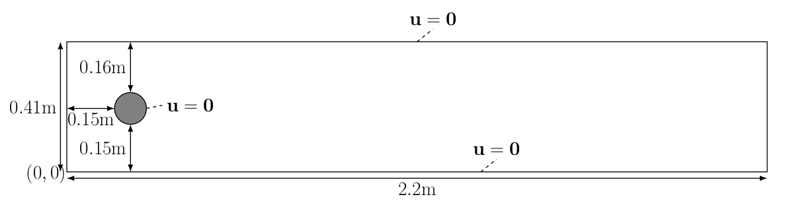

## Flow past a cylinder

Author: Jørgen S. Dokken — Modifications by Kee-Youn Yoo

In this section, we consider a slightly more challenging problem: flow past a cylinder. The geometry and parameters are taken from the [DFG 2D-3 benchmark](https://wwwold.mathematik.tu-dortmund.de/~featflow/en/benchmarks/cfdbenchmarking/flow/dfg_benchmark3_re100.html) in FeatFlow

To solve this problem efficiently and ensure numerical stability, we replace the first-order backward difference scheme with a Crank–Nicolson time discretization, combined with a semi-implicit Adams–Bashforth approximation of the nonlinear term

::: callout-note
This demo is computationally demanding, with a run time of up to 15 minutes, as it uses parameters from the DFG 2D-3 benchmark, which consists of 12,800 time steps.
It is advised to download this demo rather than running it in a browser.
The run time can be reduced by using 2 or 3 MPI processes
:::

The computational geometry chosen for this example is 


The kinematic viscosity is given by $\nu = 0.001 = \frac{\mu}{\rho}$, and the inflow velocity profile is specified as

$$
u(x,y,t) = \left( \frac{4U(t)y(0.41-y)}{0.41^2}, 0 \right)
$$

where
$$
U(t) = 1.5 \sin!\left(\tfrac{\pi t}{8}\right)
$$

This profile attains a maximum value of $1.5$ at $y = 0.41/2$. No scaling is applied in this problem, since all parameters are given explicitly

**Mesh generation**

As in the Deflection of a Membrane example, we use `GMSH` to generate the mesh. We first create the rectangle and the obstacle

```{python}
import os
import numpy as np
import matplotlib.pyplot as plt
from tqdm.notebook import tqdm

from mpi4py import MPI
from petsc4py import PETSc
import gmsh

from dolfinx.cpp.mesh import to_type, cell_entity_type
from dolfinx.fem import (Constant, Function, functionspace,
  assemble_scalar, dirichletbc, form, locate_dofs_topological, set_bc)
from dolfinx.fem.petsc import (apply_lifting, assemble_matrix, 
  assemble_vector, create_vector, create_matrix, set_bc)
from dolfinx.mesh import create_mesh, meshtags_from_entities
from dolfinx.graph import adjacencylist
from dolfinx.geometry import (bb_tree, compute_collisions_points, 
  compute_colliding_cells)
from dolfinx.io import VTXWriter, distribute_entity_data, gmshio

from basix.ufl import element
from ufl import (FacetNormal, Identity, Measure, 
  TestFunction, TrialFunction, as_vector, 
  div, dot, ds, dx, inner, lhs, grad, nabla_grad, rhs, sym, system)

mesh_comm = MPI.COMM_WORLD
model_rank = 0

gmsh.initialize()

gdim = 2
L = 2.2
H = 0.41
c_x = c_y = 0.2
r = 0.05

if mesh_comm.rank == model_rank:
  rectangle = gmsh.model.occ.addRectangle(0, 0, 0, L, H, tag=1)
  obstacle = gmsh.model.occ.addDisk(c_x, c_y, 0, r, r)
```

The next step is to subtract the obstacle from the channel, so that the interior of the circle is not meshed

```{python}
if mesh_comm.rank == model_rank:
  fluid = gmsh.model.occ.cut([(gdim, rectangle)], [(gdim, obstacle)])
  gmsh.model.occ.synchronize()
```

To make GMSH mesh the fluid domain, we add a physical volume marker

```{python}
fluid_marker = 1
if mesh_comm.rank == model_rank:
  volumes = gmsh.model.getEntities(dim=gdim)
  assert (len(volumes) == 1)
  gmsh.model.addPhysicalGroup(volumes[0][0], [volumes[0][1]], fluid_marker)
  gmsh.model.setPhysicalName(volumes[0][0], fluid_marker, "Fluid")
```

To label the different surfaces of the mesh, we proceed as follows:
	
1.	Assign marker 2 to the inflow (left-hand side)
2.	Assign marker 3 to the outflow (right-hand side)
3.	Assign marker 4 to the fluid walls
4.	Assign marker 5 to the obstacle

We determine the correct marker for each surface by computing the center of mass of each geometric entity. This way, we can automatically identify and label each boundary in the mesh

```{python}
inlet_marker, outlet_marker, wall_marker, obstacle_marker = 2, 3, 4, 5
inflow, outflow, walls, obstacle = [], [], [], []

if mesh_comm.rank == model_rank:
  boundaries = gmsh.model.getBoundary(volumes, oriented=False)
  for boundary in boundaries:
    center_of_mass = gmsh.model.occ.getCenterOfMass(boundary[0], boundary[1])
    if np.allclose(center_of_mass, [0, H /2, 0]):
      inflow.append(boundary[1])
    elif np.allclose(center_of_mass, [L, H /2, 0]):
      outflow.append(boundary[1])
    elif np.allclose(center_of_mass, [L /2, H, 0]) or np.allclose(center_of_mass, [L /2, 0, 0]):
      walls.append(boundary[1])
    else:
      obstacle.append(boundary[1])
  
  gmsh.model.addPhysicalGroup(1, walls, wall_marker)
  gmsh.model.setPhysicalName(1, wall_marker, "Walls")
  
  gmsh.model.addPhysicalGroup(1, inflow, inlet_marker)
  gmsh.model.setPhysicalName(1, inlet_marker, "Inlet")
  
  gmsh.model.addPhysicalGroup(1, outflow, outlet_marker)
  gmsh.model.setPhysicalName(1, outlet_marker, "Outlet")
    
  gmsh.model.addPhysicalGroup(1, obstacle, obstacle_marker)
  gmsh.model.setPhysicalName(1, obstacle_marker, "Obstacle")
```

In previous meshes, uniform element sizes were employed. In this example, variable mesh sizes are used to better capture the flow in the region of interest, particularly around the circular obstacle. This is accomplished using `GMSH` fields

```{python}
# Create distance field from obstacle
# Add threshold of mesh sizes based on the distance field
# LcMax -                  /--------
#                      /
# LcMin -o---------/
#        |         |       |
#       Point    DistMin DistMax
res_min = r /3
if mesh_comm.rank == model_rank:
  distance_field = gmsh.model.mesh.field.add("Distance")
  gmsh.model.mesh.field.setNumbers(distance_field, "EdgesList", obstacle)
  
  threshold_field = gmsh.model.mesh.field.add("Threshold")
  gmsh.model.mesh.field.setNumber(threshold_field, "IField", distance_field)
  gmsh.model.mesh.field.setNumber(threshold_field, "LcMin", res_min)
  gmsh.model.mesh.field.setNumber(threshold_field, "LcMax", 0.25 *H)
  gmsh.model.mesh.field.setNumber(threshold_field, "DistMin", r)
  gmsh.model.mesh.field.setNumber(threshold_field, "DistMax", 2 *H)
  
  min_field = gmsh.model.mesh.field.add("Min")
  gmsh.model.mesh.field.setNumbers(min_field, "FieldsList", [threshold_field])
  gmsh.model.mesh.field.setAsBackgroundMesh(min_field)
```

**Generating mesh**

We are now ready to generate the mesh. At this stage, we need to decide whether the mesh should consist of triangles or quadrilaterals. In this demo, to match the DFG 2D-3 benchmark, we use second-order quadrilateral elements

```{python}
if mesh_comm.rank == model_rank:
  gmsh.option.setNumber("Mesh.Algorithm", 8)
  gmsh.option.setNumber("Mesh.RecombinationAlgorithm", 2)
  gmsh.option.setNumber("Mesh.RecombineAll", 1)
  gmsh.option.setNumber("Mesh.SubdivisionAlgorithm", 1)
  gmsh.model.mesh.generate(gdim)
  gmsh.model.mesh.setOrder(2)
  gmsh.model.mesh.optimize("Netgen")
```

**Loading mesh and boundary markers**

Having generated the mesh, we now need to load it together with the corresponding facet markers into `DOLFINx`.
We follow the same structure as in Deflection of a membrane, with the difference that facet markers are also loaded.
For more details about the function used below, see [A GMSH tutorial for DOLFINx](https://jsdokken.com/src/tutorial_gmsh.html)

```{python}
mesh, _, ft = gmshio.model_to_mesh(gmsh.model, mesh_comm, model_rank, gdim=gdim)
ft.name = "Facet markers"
```