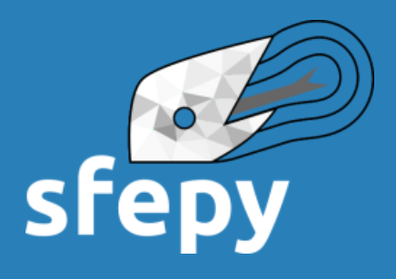

# Partial Differential Equations {#sec-fem}

$~$

## SfePy: Simple Finite Elements in Python

  **SfePy** is a software for solving systems of coupled partial differential equations (PDEs) by the finite element method in 1D, 2D and 3D. It can be viewed both as black-box PDE solver, and as a Python package which can be used for building custom applications. The word *simple* means that complex FEM problems can be coded very easily and rapidly

[{width="40%" fig-align="center"}](https://sfepy.org)

$~$

## The FEniCS computing platform

  **FEniCS** is a popular open-source computing platform for solving partial differential equations (PDEs) with the finite element method (FEM). FEniCS enables users to quickly translate scientific models into efficient finite element code. With the high-level Python and C++ interfaces to FEniCS, it is easy to get started, but FEniCS offers also powerful capabilities for more experienced programmers. FEniCS runs on a multitude of platforms ranging from laptops to high-performance computers

[{width="25%" fig-align="center"}](https://fenicsproject.org)
